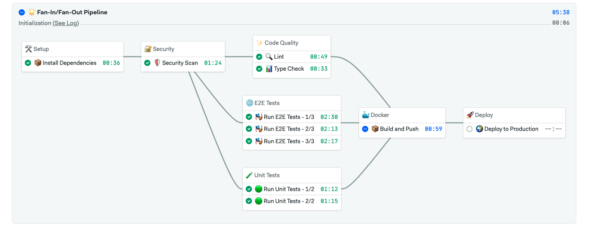

# Semaphore - Open Source CI/CD Platform

<!-- Badges -->

Semaphore CI/CD helps product teams ship software faster, with quality and security.

___

## 🚀 Features

- **Blazing-fast CI/CD** – Get your builds & deployments done in record time.
- **Simple yet powerful** – YAML-based config, parallel execution, and more!
- **Scales with you** – From solo developers to massive engineering teams.
- **Built for the modern cloud** – Works seamlessly with containers, Kubernetes, and multi-cloud environments.

___

## Installation

Installing and running Semaphore is easy and only takes **10-30 minutes** ⏱️

Choose your preferred installation method from our detailed guides:

___

## Semaphore Versions

Semaphore comes in three flavors to fit your needs:

### 🌱 Community Edition

Free and open source under [Apache 2.0 license](LICENSE). This is what you'll find in this repository (everything outside the `ee/` folder). Perfect for teams who want to run Semaphore on their own infrastructure with community support.

### 🏢 Enterprise Edition

Our enhanced version with extra features for larger organizations, available under a commercial license. You'll find this code in the `ee/` directory. Comes with professional support to keep your CI/CD running smoothly.

### ☁️ Semaphore Cloud

Don't want to manage your own infrastructure? Our hosted version at [semaphoreci.com](https://semaphoreci.com) gives you all the power of Semaphore without the setup. From free plans for small projects to enterprise-scale solutions.

___

## Important Links

- 📚 [Documentation](https://docs.semaphoreci.com/CE/getting-started/about-semaphore) - Learn how to use Semaphore
- 🗺️ [Roadmap](ROADMAP.md) - See what's planned for future releases
- 🏛️ [Governance](GOVERNANCE.md) - How the project is managed and decisions are made
- 📋 [Project Board](https://github.com/orgs/semaphoreio/projects/1) - Track development progress on our Kanban board
- 🔒 [Security](SECURITY.md) - Our security policies and reporting procedures

___

## Contributing

We're excited to welcome contributions to Semaphore! All contributors are expected to follow our [Code of Conduct](CODE_OF_CONDUCT.md).

There are many ways to contribute to Semaphore:

- Join the conversation in [GitHub Discussions](https://github.com/semaphoreio/semaphore/discussions)
- Submit and review [RFCs](rfcs/README.md)
- Participate in [Special Interest Groups (SIGs)](sigs/README.md)
- Report bugs or request features through [GitHub Issues]([https://github.com/semaphoreio/semaphore/issues](https://github.com/semaphoreio/semaphore/issues/new/choose))

🚧 As we open up the project, our documentation and processes are still evolving.
For now, please refer to:

- [Contributing Guide](CONTRIBUTING.md) - Development setup and workflow
- [Release Process](RELEASE.md) - How we version and release Semaphore
- [Developer Guidelines](DEVELOPMENT.md) - Coding standards and best practices
- [Local Development](LOCAL-DEVELOPMENT.md) - Running Semaphore locally with Minikube

---

## ❤️ Support & Stay Connected

💬 **Join our community on Discord** → [Semaphore Discord](https://discord.com/invite/FBuUrV24NH)

🐦 **Follow us on Twitter** → [@semaphoreci](https://twitter.com/semaphoreci)

▶️ **Watch our development meetings** → [Semaphore Backstage](https://www.youtube.com/@SemaphoreBackstage)
