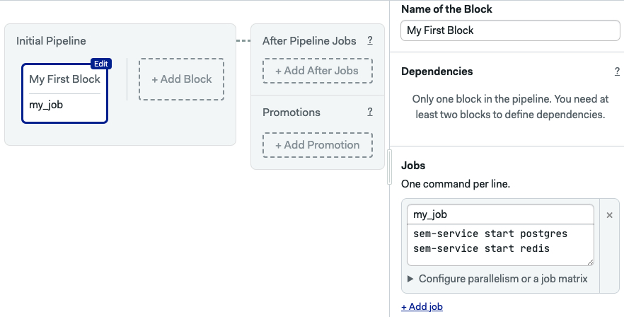
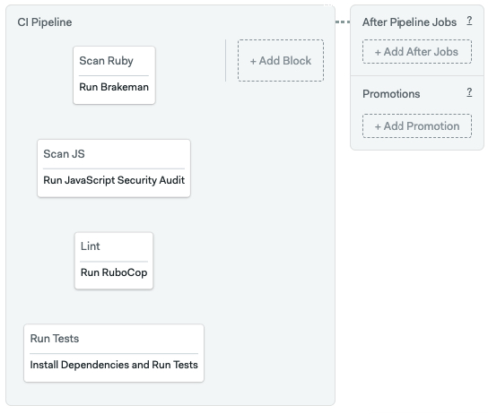

# GitHub Actions

<VideoTutorial title="Semaphore vs GitHub Actions" src="https://www.youtube.com/embed/GcTu9fmIGHQ" />

This page explains the core concepts and feature mapping you need to migrate from GitHub Actions to Semaphore.

## Overview

GitHub Actions uses a YAML-based syntax to define pipelines and actions. With Semaphore, in addition to this method, you can also use the [visual workflow editor](../../using-semaphore/workflows#workflow-editor) to easily configure and preview pipelines.

Semaphore provides [top-of-market machines](../../reference/machine-types) for faster build times, along with extra features like fully customizable [Role Based Access Control](../../using-semaphore/rbac), [parameterized promotions](../../using-semaphore/promotions#parameters), and [SSH debugging](../../using-semaphore/jobs#ssh-into-agent).

## GitHub Actions vs Semaphore

This section describes how to implement common GitHub Actions functionalities on Semaphore.

### Checkout

Checkout clones the repository in the CI environment.

<Tabs groupId="migration">
<TabItem value="ga" label="GitHub Actions">

GitHub Actions uses the Checkout action in every step and job that requires a copy of the repository.

```yaml
jobs:
  my_job:
    steps:
    # highlight-start
      - name: Checkout code
        uses: actions/checkout@v4
    # highlight-end
```

</TabItem>
<TabItem value="semaphore" label="Semaphore YAML">

To clone the repository on Semaphore, execute [`checkout`](../../reference/toolbox#checkout).

```yaml
jobs:
  - name: my_job
    commands:
      # highlight-next-line
      - checkout
```

In addition, by using [`prologue`](../../reference/pipeline-yaml#prologue-in-task) and [`global_job_config`](../../reference/pipeline-yaml#global-job-config) you can declare the `checkout` for all jobs.

```yaml
# highlight-start
global_job_config:
  prologue:
# highlight-end
    commands:
      - checkout
```

</TabItem>
<TabItem value="ui" label="Semaphore Editor">


</TabItem>
</Tabs>

### Language versions

Both Github Actions and Semaphore allow you to use specific language versions.

<Tabs groupId="migration">
<TabItem value="ga" label="GitHub Actions">

GitHub Actions uses a language-specific setup action.

The following example sets the Ruby version to `3.3.4`

```yaml
jobs:
  my_job:
    steps:
      - uses: ruby/setup-ruby@v1
        with:
          ruby-version: '3.3.4'
```

</TabItem>
<TabItem value="semaphore" label="Semaphore YAML">

Semaphore uses [sem-version](../../reference/toolbox#sem-version) to activate or switch language versions in the CI environment.

The following example activates Ruby v3.3.4, any commands after the example run on this Ruby version.

```yaml
jobs:
  - name: my_job
    commands:
      - sem-version ruby 3.3.4
```

</TabItem>
<TabItem value="ui" label="Semaphore Editor">


</TabItem>
</Tabs>

### Caching

Both GitHub Actions and Semaphore support manual file caching.

<Tabs groupId="migration">
<TabItem value="ga" label="GitHub Actions">

GitHub Actions has a cache action to cache files. The following example caches Gems in a Ruby project:

```yaml
- name: Cache gems
  uses: actions/cache@v2
  with:
    path: vendor/bundle
    key: bundle-gems-${{ hashFiles('**/Gemfile.lock') }}
    restore-keys: bundle-gems-${{ hashFiles('**/Gemfile.lock') }}
```

</TabItem>
<TabItem value="semaphore" label="Semaphore YAML">

Semaphore uses the [cache](../../reference/toolbox#cache) command to cache dependencies and files.

The following commands, when added to a job downloads, cache, and install Gems in a Ruby project:

```yaml
- name: Cache gems
  commands:
    - cache restore 
    - bundle install --deployment --path vendor/bundle
    - cache store 
```

See [caching](../../using-semaphore/cache) for more details.

</TabItem>
<TabItem value="ui" label="Semaphore Editor">


</TabItem>
</Tabs>

### Database and services

Both Github Actions and Semaphore support starting databases and services via Docker containers.

<Tabs groupId="migration">
<TabItem value="ga" label="GitHub Actions">

GitHub Actions uses service containers. The following example starts service containers for both Postgres and Redis.

```yaml
jobs:
  my_job:
    runs-on: ubuntu-20.04
    services:
      postgresql:
        image: postgres
        env:
          POSTGRES_PASSWORD: postgres
      redis:
        image: redis:5
        env:
          REDIS_URL: redis://redis:6379
```

</TabItem>
<TabItem value="semaphore" label="Semaphore YAML">

On Semaphore, we use [sem-service](../../reference/toolbox#sem-service) to start and stop services in the CI environment.

The following example starts Postgrest and Redis on the default port (6379).

```yaml
jobs:
  - name: my_job
    commands:
      - sem-service start postgres
      - sem-service start redis
```

</TabItem>
<TabItem value="ui" label="Semaphore Editor">



</TabItem>
</Tabs>

### Artifacts

Both Github Actions and Semaphore support persistent Artifacts storage.

<Tabs groupId="migration">
<TabItem value="ga" label="GitHub Actions">

GitHub Actions uses the actions `upload-artifact` and `download-artifact` to manage artifacts.

The following example uploads and downloads `test.log`

```yaml
- name: Upload test.log
  uses: actions/upload-artifact@v2
  with:
    name: Make
    path: test.log
- name: Download test.log
  uses: actions/download-artifact@v2
  with:
    name: Unit tests
```

</TabItem>
<TabItem value="semaphore" label="Semaphore YAML">

Semaphore uses the [artifact](../../reference/toolbox#artifact) command to download and upload files to the artifact store.

The following command stores `test.log` from any job:

```yaml
jobs:
  - name: my_job
    commands:
      - artifact push workflow test.log
```

To retrieve the file from any other job, use:

```yaml
jobs:
  - name: my_job
    commands:
      - artifact pull workflow test.log
```

See [artifacts](../../using-semaphore/artifacts) for more details.

</TabItem>
<TabItem value="ui" label="Semaphore Editor">


</TabItem>
</Tabs>

### Secrets

Secrets inject sensitive data and credentials into the workflow securely.

<Tabs groupId="migration">
<TabItem value="ga" label="GitHub Actions">

To use secrets in GitHub Actions, you must create the secret with its value in the repository or organization. Then, you can use it in your jobs using the `${{ secrets.SECRET_NAME }}` syntax.

```yaml
steps:
  - name: Hello world action
  # highlight-start
    env:
      super_secret: ${{ secrets.SuperSecret }}
  # highlight-end
```

</TabItem>
<TabItem value="semaphore" label="Semaphore YAML">

On Semaphore you can connect secrets to all jobs in a block.

```yaml
blocks:
  - name: Test
    task:
    # highlight-start
      secrets:
        - name: awskey
    # highlight-end
```

Additionally, it's possible to connect secrets to all jobs in the pipeline by using [`global_job_config`](../../reference/pipeline-yaml#global-job-config).

```yaml
global_job_config:
  # highlight-start
  secrets:
    - name: awskey
  # highlight-end
```

</TabItem>
<TabItem value="ui" label="Semaphore Editor">

On Semaphore, we create the [secret](../../using-semaphore/secrets) at the organization or project level and activate it on a block.

The secret's contents are automatically injected as environment variables in all jobs in that block.


</TabItem>
</Tabs>

### Complete example

The following comparison shows how to build and test a Ruby on Rails project on GitHub Actions and Semaphore.

<Tabs groupId="migration">
<TabItem value="ga" label="GitHub Actions">

On GitHub Actions, we need several actions to start services, manage Gems, and run the build and test commands.

```yaml
name: CI

on:
  pull_request:
  push:
    branches: [ main ]

jobs:
  scan_ruby:
    runs-on: ubuntu-latest

    steps:
      - name: Checkout code
        uses: actions/checkout@v4

      - name: Set up Ruby
        uses: ruby/setup-ruby@v1
        with:
          ruby-version: .ruby-version
          bundler-cache: true

      - name: Scan for common Rails security vulnerabilities using static analysis
        run: bin/brakeman --no-pager

  scan_js:
    runs-on: ubuntu-latest

    steps:
      - name: Checkout code
        uses: actions/checkout@v4

      - name: Set up Ruby
        uses: ruby/setup-ruby@v1
        with:
          ruby-version: .ruby-version
          bundler-cache: true

      - name: Scan for security vulnerabilities in JavaScript dependencies
        run: bin/importmap audit

  lint:
    runs-on: ubuntu-latest
    steps:
      - name: Checkout code
        uses: actions/checkout@v4

      - name: Set up Ruby
        uses: ruby/setup-ruby@v1
        with:
          ruby-version: .ruby-version
          bundler-cache: true

      - name: Lint code for consistent style
        run: bin/rubocop -f github

  test:
    runs-on: ubuntu-latest

    steps:
      - name: Install packages
        run: sudo apt-get update && sudo apt-get install --no-install-recommends -y curl libjemalloc2 libvips sqlite3

      - name: Checkout code
        uses: actions/checkout@v4

      - name: Set up Ruby
        uses: ruby/setup-ruby@v1
        with:
          ruby-version: .ruby-version
          bundler-cache: true

      - name: Run Rake
        env:
          RAILS_ENV: test 
        run: | 
          cp .sample.env .env
          bundle exec rake db:setup
          bundle exec rake

      - name: Run tests
        env:
          RAILS_ENV: test
        run: bin/rails db:test:prepare test test:system
```

</TabItem>
<TabItem value="semaphore" label="Semaphore YAML">

The following example runs the same CI procedure. You can optimize for speed by splitting the tests into different jobs.

```yaml
version: v1.0
name: CI Pipeline
agent:
  machine:
    type: f1-standard-2
    os_image: ubuntu2004
global_job_config:
  prologue:
    commands:
      - checkout
      - sem-version ruby $(cat .ruby-version)
      - cache restore
      - bundle install --jobs 4 --retry 3
      - cache store
blocks:
  - name: Scan Ruby
    task:
      jobs:
        - name: Run Brakeman
          commands:
            - bin/brakeman --no-pager
    dependencies: []
  - name: Scan JS
    task:
      jobs:
        - name: Run JavaScript Security Audit
          commands:
            - bin/importmap audit
    dependencies: []
  - name: Lint
    task:
      jobs:
        - name: Run RuboCop
          commands:
            - bundle exec rubocop -f github
    dependencies: []
  - name: Run Tests
    task:
      jobs:
        - name: Install Dependencies and Run Tests
          commands:
            - sudo apt-get update
            - sudo apt-get install --no-install-recommends -y curl libjemalloc2 libvips sqlite3
            - cp .sample.env .env
            - 'bundle exec rake db:setup'
            - bundle exec rake
            - 'bin/rails db:test:prepare test test:system'
    dependencies: []
```

</TabItem>
<TabItem value="ui" label="Semaphore Editor">



</TabItem>
</Tabs>

## See also

- [Migration guide for CircleCI](./circle)
- [Migration guide for Jenkins](./jenkins)
- [Migration guide for Travis CI](./travis)
- [Migration guide for BitBucket Pipelines](./bitbucket)
