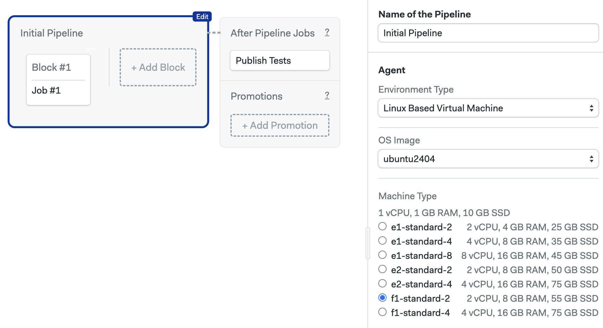

# Ubuntu 20.04 (x86_64)

:::warning

This Ubuntu image has been deprecated. 

:::


This is a customized x86_64 image based on [Ubuntu 20.04](https://wiki.ubuntu.com/FocalFossa/ReleaseNotes) (Focal Fossa LTS).

<Tabs groupId="editor-yaml">
<TabItem value="editor" label="Editor">

To use this operating system, choose `ubuntu2404` in the **OS Image** selector. This OS can be paired with any Intel-x86_64 [Linux Machine](../machine-types#linux).



</TabItem>
<TabItem value="yaml" label="YAML">

To use this operating system, use `ubuntu2404` as the `os_image`. This OS can be paired with any [Linux Machine](../machine-types#linux).

```yaml
version: v1.0
name: Initial Pipeline
agent:
  machine:
  # highlight-start
    type: e1-standard-1
    os_image: ubuntu2404
  # highlight-end
```

</TabItem>
</Tabs>

The following section describes the software pre-installed on the image.

## Toolbox

The image comes with the following [toolbox utilities](../toolbox) preinstalled:

- [sem-version](../toolbox#sem-version): manage language versions on Linux
- [sem-service](../toolbox#sem-service): manage databases and services on Linux

## Version control

Following version control tools are pre-installed:

- Git 2.49.0
- Git LFS (Git Large File Storage) 3.6.1
- GitHub CLI 2.69.0
- Mercurial 5.3.1
- Svn 1.13.0

### Browsers and Headless Browser Testing

- Firefox 68.9 (`68`, `esr-old`), 78.1 (`78`, `default`, `esr`), 102.11.0 (`102`, `esr-new`, `esr-latest`)
- Geckodriver 0.36.0
- Google Chrome 131.0.6778.139
- ChromeDriver 131.0.6778.139
- Xvfb (X Virtual Framebuffer)
- Phantomjs 2.1.1

Chrome and Firefox both support headless mode. You shouldn't need to do more than install and use the relevant Selenium library for your language. Refer to the documentation of associated libraries when configuring your project.

### Docker

Docker toolset is installed and the following versions are available:

- Docker 28.0.2
- Docker-compose 1.29.2 (used as `docker-compose --version`)
- Docker-compose 2.34.0 (used as `docker compose version`)
- Docker-buildx 0.22.0
- Docker-machine 0.16.2
- Dockerize 0.9.3
- Buildah 1.22.3
- Podman 3.4.2
- Skopeo 1.5.0

### Cloud CLIs 

- Aws-cli v1 (used as `aws`) 1.38.17
- Aws-cli v2 (used as `aws2`) 2.25.0
- Azure-cli 2.70.0
- Eb-cli 3.20.10
- Ecs-cli 1.21.0
- Doctl 1.123.0
- Gcloud 515.0.0
- Gke-gcloud-auth-plugin 515.0.0
- Kubectl 1.29.1
- Heroku 10.4.0
- Terraform 1.11.2
- Helm 3.17.2

### Network utilities

- Httpie 3.2.4
- Curl 7.68.0
- Rsync 3.1.3

## Compilers

- gcc: 9, 10 (default)

## Languages

### Erlang and Elixir

Erlang versions are installed and managed via [kerl](https://github.com/kerl/kerl).
Elixir versions are installed with [kiex](https://github.com/taylor/kiex).

- Erlang: 22.3, 23.3, 24.1, 24.2, 24.3, 25.0, 25.1, 25.2, 25.3 (default), 26.0, 26.1, 26.2, 27.0, 27.1, 27.2, 27.3
- Elixir: 1.9.x, 1.10.x, 1.11.x, 1.12.x, 1.13.x, 1.14.x (1.14.5 as default), 1.15.x, 1.16.x, 1.17.x, 1.18.x

Additional libraries:

- Rebar: 2.6.4 (requires Erlang below 24.3)
- Rebar3: 3.24.0

### Go

Versions:

- 1.10.x
- 1.11.x
- 1.12.x
- 1.13.x
- 1.14.x
- 1.15.x
- 1.16.x
- 1.17.x
- 1.18.x
- 1.19.x
- 1.20.x
- 1.21.x
- 1.22.x
- 1.23.x
- 1.24.x (1.24.1 as default)

### Java and JVM languages

- Java: 11.0.26 (default), 17.0.14
- Scala: 2.12.15, 3.1.3
- Leiningen: 2.11.2 (Clojure)
- Sbt 1.10.11

### Additional Java build tools

- Maven: 3.9.9
- Gradle: 8.13
- Bazel: 8.1.1

### JavaScript via Node.js

Node.js versions are managed by [nvm](https://github.com/nvm-sh/nvm).
You can install any version you need with `nvm install [version]`.
Installed version:

- 22.14.0 (set as default, with alias 22.14), includes npm 10.9.2

### Additional JS tools

- Yarn: 1.22.22

### PHP

PHP versions are managed by [phpbrew](https://github.com/phpbrew/phpbrew).
Available versions:

- 7.4.x
- 8.0.x
- 8.1.x
- 8.2.x
- 8.3.x

The default installed PHP version is 7.4.33.

### Additional PHP libraries

PHPUnit: 7.5.20

### Python

Python versions are installed and managed by
[virtualenv](https://virtualenv.pypa.io/en/stable/). Installed versions:

- 3.8.10 (default)
- 3.9.21
- 3.10.16
- 3.11.11
- 3.12.9

Supporting libraries:

- pypy: 7.3.9
- pypy3: 7.3.17
- pip: 25.0.1
- virtualenv: 20.29.3

### Ruby

Available versions:

- 2.6.x
- 2.7.x
- 3.0.x
- 3.1.x
- 3.2.x
- 3.3.x
- 3.4.x
- jruby-9.2.11.1
- jruby-9.3.9.0
- jruby-9.4.0.0

The default installed Ruby version is 2.7.8.

## See also

- [Installing packages on Ubuntu](../os-ubuntu)
- [Machine types](../machine-types)
- [Semaphore Toolbox](../toolbox)
- [Pipeline YAML refence](../pipeline-yaml)
