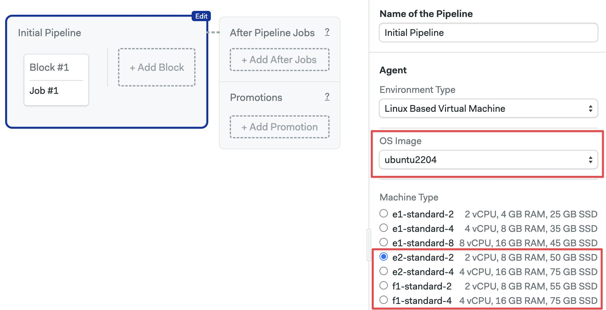

# Ubuntu 22.04 (x86_64)

This is a customized x86_64 image based on [Ubuntu 22.04](https://wiki.ubuntu.com/JammyJellyfish/ReleaseNotes) (Jammy Jellyfish LTS).

<Tabs groupId="editor-yaml">
<TabItem value="editor" label="Editor">

To use this operating system, and choose `ubuntu2204` in the **OS Image** selector. 



</TabItem>
<TabItem value="yaml" label="YAML">

To use this operating system, you must select a machine type and use `ubuntu2204` as the `os_image`:

```yaml
version: v1.0
name: Initial Pipeline
agent:
  machine:
  # highlight-start
    type: e2-standard-2
    os_image: ubuntu2204
  # highlight-end
```

</TabItem>
</Tabs>

The following section describes the software pre-installed on the image.

## Toolbox

The image comes with the following [toolbox utilities](../toolbox) preinstalled:

- [sem-version](../toolbox#sem-version): manage language versions on Linux
- [sem-service](../toolbox#sem-service): manage databases and services on Linux

## Version control

Following version control tools are pre-installed:

- Git 2.51.0
- Git LFS (Git Large File Storage) 3.7.0
- GitHub CLI 2.80.0
- Mercurial 6.1.1
- Svn 1.14.1

### Browsers and Headless Browser Testing

- Firefox 102.11.0 (`102`, `default`, `esr`)
- Geckodriver 0.36.0
- Google Chrome 140.0.7339.207
- ChromeDriver 140.0.7339.207
- Xvfb (X Virtual Framebuffer)
- Phantomjs 2.1.1

Chrome and Firefox both support headless mode. You shouldn't need to do more
than install and use the relevant Selenium library for your language.
Refer to the documentation of associated libraries when configuring your project.

### Docker

 Docker toolset is installed and the following versions are available:

- Docker 28.4.0
- Docker-compose 1.29.2 (used as `docker-compose --version`)
- Docker-compose 2.39.4 (used as `docker compose version`)
- Docker-buildx 0.28.0
- Docker-machine 0.16.2
- Dockerize 0.9.6
- Buildah 1.23.1
- Podman 3.4.4
- Skopeo 1.4.1

### Cloud CLIs

- Aws-cli v2 (used as `aws`) 2.31.1
- Azure-cli 2.77.0
- Eb-cli 3.25
- Ecs-cli 1.21.0
- Doctl 1.142.0
- Gcloud 540.0.0
- Gke-gcloud-auth-plugin 540.0.0
- Kubectl 1.29.1
- Heroku 10.13.2
- Terraform 1.13.3
- Helm 3.19.0
- Helmfile 1.1.7

### Network utilities

- Httpie 3.2.4
- Curl 8.5.0
- Rsync 3.2.7

## Compilers

- gcc: 11 (default), 12

## Languages

### Erlang and Elixir

Erlang versions are installed and managed via [kerl](https://github.com/kerl/kerl).
Elixir versions are installed with [kiex](https://github.com/taylor/kiex).

- Erlang: 24.3, 25.0, 25.1, 25.2, 25.3, 26.0, 26.1, 26.2, 27.0 (default), 27.1, 27.2, 27.3
- Elixir: 1.9.x, 1.10.x, 1.11.x, 1.12.x, 1.13.x, 1.14.x, 1.15.x, 1.16.x, 1.17.x (1.17.3 as default), 1.18.x

Additional libraries:

- Rebar3: 3.24.0

### Go

Versions:

- 1.10.x
- 1.11.x
- 1.12.x
- 1.13.x
- 1.14.x
- 1.15.x
- 1.16.x
- 1.17.x
- 1.18.x
- 1.19.x
- 1.20.x
- 1.21.x
- 1.22.x
- 1.24.x
- 1.25.x

The default installed Go version is 1.25.1.

### Java and JVM languages

- Java: 11.0.28, 17.0.16 (default)
- Scala: 3.2.2
- Leiningen: 2.12.0 (Clojure)
- Sbt 1.11.6

### Additional Java build tools

- Maven: 3.9.11
- Gradle: 9.1
- Bazel: 8.4.1

### JavaScript via Node.js

Node.js versions are managed by [nvm](https://github.com/nvm-sh/nvm).
You can install any version you need with `nvm install [version]`.
Installed version:

- 22.19.0 (set as default, with alias 22.19), includes npm 10.9.3

### Additional JS tools

- Yarn: 1.22.22

### PHP

PHP versions are managed by [phpbrew](https://github.com/phpbrew/phpbrew).
Available versions:

- 8.1.x
- 8.2.x
- 8.3.x

The default installed PHP version is 8.1.32.

### Additional PHP libraries

PHPUnit: 9.5.28

### Python

Python versions are installed and managed by
[virtualenv](https://virtualenv.pypa.io/en/stable/). Installed versions:

- 3.10.16 (default)
- 3.11.13
- 3.12.11

Supporting libraries:

- pypy: 7.3.9
- pypy3: 7.3.17
- pip: 25.2
- virtualenv: 20.34.0

### Ruby

Available versions:

- 3.0.x
- 3.1.x
- 3.2.x
- 3.3.x
- 3.4.x
- jruby-9.4.1.0

The default installed Ruby version is 3.4.5.

### Rust

- 1.90.0

### Swiftly

- 1.0.1

## See also

- [Installing packages on Ubuntu](../os-ubuntu)
- [Machine types](../machine-types)
- [Semaphore Toolbox](../toolbox)
- [Pipeline YAML refence](../pipeline-yaml)
