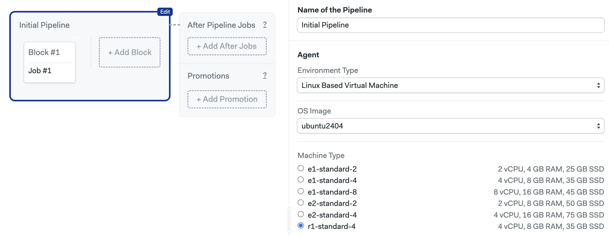

# Ubuntu 24.04 (ARM)


This is a customized ARM image based on [Ubuntu 24.04](https://wiki.ubuntu.com/NobleNumbat/ReleaseNotes) (Noble Numbat LTS).

This OS can only be paired with [R1 ARM machines](../machine-types#r1).

<Tabs groupId="editor-yaml">
<TabItem value="editor" label="Editor">

To use this operating system, and choose `ubuntu2404` in the **OS Image** selector. This OS can be paired with [R1 machines](../machine-types#r1).



</TabItem>
<TabItem value="yaml" label="YAML">

To use this operating system, you must select an `r1-standard-2`, `r1-standard-4` or `r1-standard-8`  machine and use `ubuntu2404` as the `os_image`:

```yaml
version: 1.0
name: Ubuntu2404 Based Pipeline
agent:
  machine:
  # highlight-start
    type: r1-standard-4
    os_image: ubuntu2404
  # highlight-end
```

</TabItem>
</Tabs>

The following section describes the software pre-installed on the image.

## Toolbox

The image comes with the following [toolbox utilities](../toolbox) preinstalled:

- [sem-version](../toolbox#sem-version): manage language versions on Linux

:::note

Please note that `sem-service` is not available on R1 images.

:::

## Version control

Following version control tools are pre-installed:

- Git 2.54.0
- Git LFS (Git Large File Storage) 3.7.1
- GitHub CLI 2.90.0
- Mercurial 6.7.2
- Svn 1.14.3

### Browsers and Headless Browser Testing

- Firefox 140.4.0esr
- Geckodriver 0.36.0
- Chromium 142
- Chromium Driver 142
- Xvfb (X Virtual Framebuffer)

Chrome and Firefox both support headless mode. You shouldn't need to do more
than install and use the relevant Selenium library for your language.
Refer to the documentation of associated libraries when configuring your project.

### Docker

Docker toolset is installed and the following versions are available:

- Docker 29.4.1
- Docker-compose 5.1.3 (used as `docker compose version`)
- Docker-buildx 0.33.0
- Docker-machine 0.16.2
- Dockerize 0.11.0
- Buildah 1.33.7
- Podman 4.9.3
- Skopeo 1.13.3

### Cloud CLIs

- Aws-cli v2 (used as `aws`) 2.34.34
- Azure-cli 2.85.0
- Eb-cli 3.25
- Ecs-cli 1.21.0
- Doctl 1.155.0
- Gcloud 565.0.0
- Gke-gcloud-auth-plugin 565.0.0
- Kubectl 1.29.1
- Terraform 1.14.9
- Helm 4.1.4
- Helmfile 1.4.4

### Network utilities

- Httpie 3.2.4
- Curl 8.5.0
- Rsync 3.2.7

## Compilers

- gcc: 11, 12, 13 (default)

## Languages

### Erlang and Elixir

Erlang versions are installed and managed via [kerl](https://github.com/kerl/kerl).
Elixir versions are installed with [kiex](https://github.com/taylor/kiex).

- Erlang: 24.3, 25.x, 26.x, 27.x (27.0 as default), 28.x
- Elixir: 1.14.x, 1.15.x, 1.16.x, 1.17.x (1.17.3 as default), 1.18.x, 1.19.x

Additional libraries:

- Rebar3: 3.24.0

### Go

Versions:

- 1.19.x
- 1.20.x
- 1.21.x
- 1.22.x
- 1.23.x
- 1.24.x
- 1.25.x
- 1.26.x

The default installed Go version is 1.26.2.

### Java and JVM languages

- Java: 11.0.30, 17.0.18 (default), 21.0.10
- Scala: 3.2.2
- Leiningen: 2.12.0 (Clojure)
- Sbt 1.12.9

### Additional Java build tools

- Maven: 3.9.15
- Gradle: 9.4.1

### JavaScript via Node.js

Node.js versions are managed by [nvm](https://github.com/nvm-sh/nvm).
You can install any version you need with `nvm install [version]`.
Installed version:

- 24.15.0 (set as default, with alias 24.15), includes npm 11.12.1

### Additional JS tools

- Bun: 1.3.13
- Yarn: 1.22.22

### PHP

PHP versions are managed by [phpbrew](https://github.com/phpbrew/phpbrew).
Available versions:

- 8.1.x
- 8.2.x
- 8.3.x
- 8.4.x
- 8.5.x

The default installed PHP version is 8.1.34.

### Additional PHP libraries

PHPUnit: 9.5.28

### Python

Python versions are installed and managed by
[virtualenv](https://virtualenv.pypa.io/en/stable/). Installed versions:

- 3.10.20
- 3.11.15
- 3.12.9 (default)

Supporting libraries:

- pypy3: 7.3.21
- pip: 26.0.1
- virtualenv: 21.2.4

### Ruby

Available versions:

- 3.2.x
- 3.3.x
- 3.4.x
- 4.0.x

The default installed Ruby version is 3.4.9.

### Rust

- 1.95.0

### Swiftly

- 1.1.1

## See also

- [Installing packages on Ubuntu](../os-ubuntu)
- [Machine types](../machine-types)
- [Semaphore Toolbox](../toolbox)
- [Pipeline YAML refence](../pipeline-yaml)
