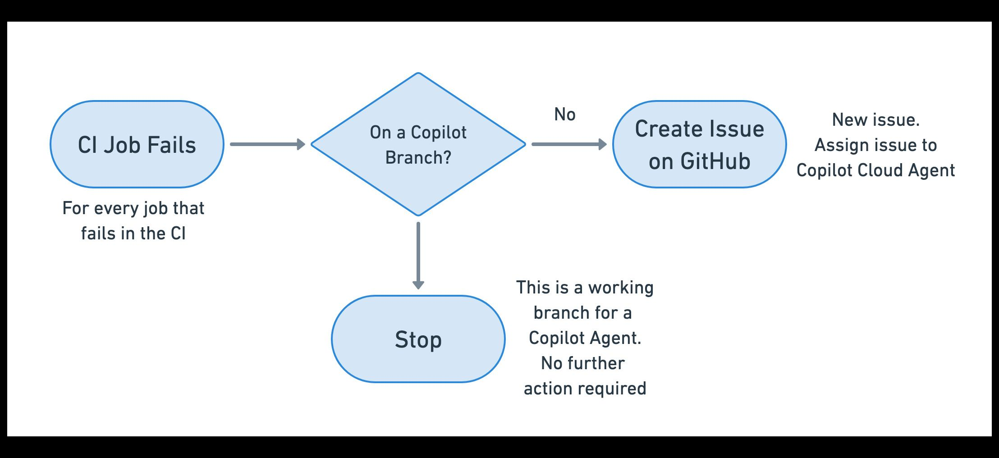
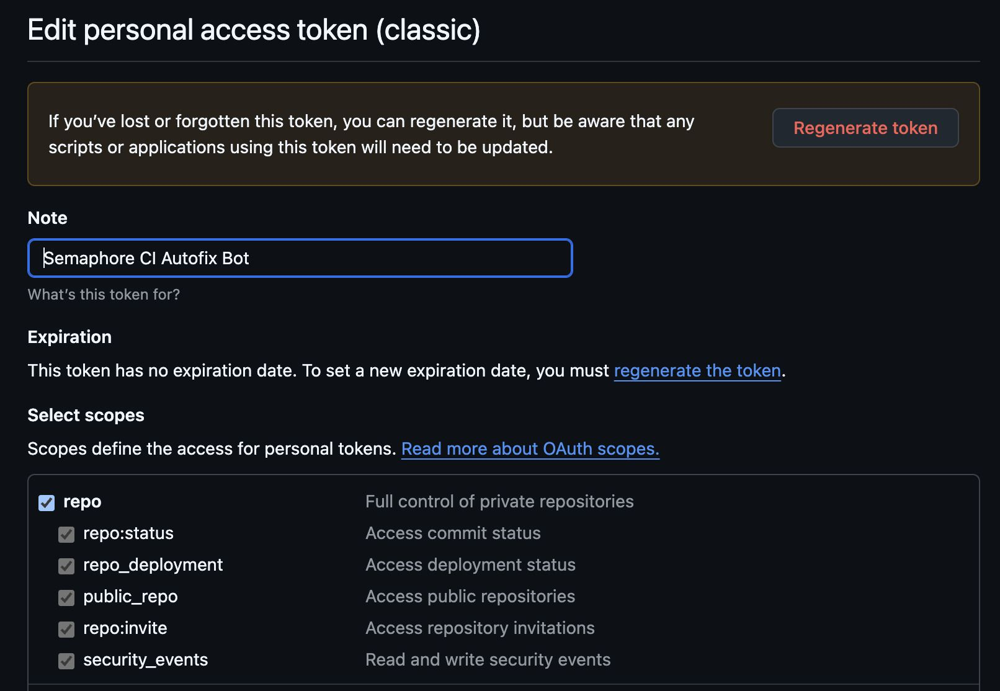
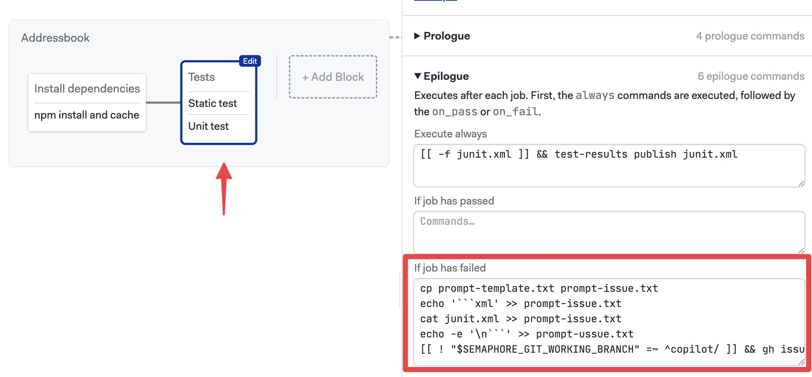

# Copilot Cloud Integration

This page explains how to integrate Semaphore CI pipelines with GitHub's Copilot Agent to automatically fix build errors.

:::note

In this scenario, we use GitHub's Cloud version of Copilot. The Copilot AI Agent runs inside GitHub and creates a draft Pull Request with fixes. If you prefer to run a different AI agent or run the agent inside the CI itself, see [Self-Healing CI](./self-healing-ci).

:::

## Overview

GitHub Copilot can run an AI Agent inside their infrastructure to take actions on the repository. On this page, we describe an integration method that automatically fixes build errors in the CI using Copilot Agents.

The process is as follows:

1. One or more of the jobs in your pipeline fails
2. For each failed job, we create an issue on the repository and assign Copilot
3. GitHub spins up an AI agent and creates a draft Pull Request with a fix
4. You review the Pull Request and mark it as ready if it seems valid
5. Marking the Pull Request valid for review starts a new CI workflow
6. If the build is fixed, you can merge the Pull Request

This process is repeated for every issue opened and assigned to Copilot.



## Prerequisites

- A [GitHub Personal Access Token](https://github.com/settings/tokens) with write permissions on the repository and read permissions in the GitHub organization
- Copilot Agents enabled in your GitHub organization (available in GitHub Copilot Pro, GitHub Copilot Pro+, GitHub Copilot Business, and GitHub Copilot Enterprise plans)

## Preventing build loops

To prevent WIP branches created by Copilot from creating a CI loop:
- We only create issues on branches that do not start with `copilot/`
- We do not run workflows on draft Pull Requests

## Preparation

Before you can set up the integration, we must set up a few things.

### Obtain a GitHub Access Token

1. Create a [Personal Access Token](https://github.com/settings/tokens) (classic) in GitHub with:

    - write permissions to the repository
    - permissions to create pull requests in the repository
    - read permissions in the organization

    

2. Create a [secret](../secrets) called `gh-cli` with the environment variable `GH_TOKEN` to store your GitHub token

### Enable Copilot Agents in your GitHub Organization

Copilot Agents are available on a set of paid plans. For this integration to work, this feature must be enabled. See [Managing Copilot coding agents](https://docs.github.com/en/copilot/how-tos/use-copilot-agents/manage-agents) to learn how to activate the agent for your project.

### Configure test reports

While not entirely mandatory, it's highly recommended to [configure AI test results](../tests/test-reports#ai) to obtain a standardized error report that the AI Agent can use to diagnose and fix build errors.

For the remainder of the tutorial, we'll assume that all tests in the CI create a file called `results.xml` containing the test results and that you are processing the reports using `--generate-mcp-summary`. 

For example:
- [Publish test results](../tests/test-reports#step2): `test-results publish --generate-mcp-summary results.xml`
- [Merge test results](../tests/test-reports#step3): `test-results gen-pipeline-report --generate-mcp-summary` 

## Set up Copilot Integration

To set up the integration, follow these steps.

<Steps>

1. Disable draft Pull Requests on Semaphore: open your [project settings] and ensure **Build drafts on Pull Requests** is set to "No"

    

2. Create a prompt template file called `prompt-template.txt`. Use this example as a starting point:

    ```text title="Prompt template for Copilot"
    Read the following error summary file to diagnose the failure, and create a Pull Request with the fix. Validat e the fix before creating the Pull Request.
    ```

3. Push the prompt template file to the repository on GitHub

4. Open the workflow editor for your project in Semaphore. Locate a block that contains tests that might fail.

5. Enable the `gh-cli` secret in the blog

6. Open the **Epilogue** and add the following commands in the **If job has failed** command box

    ```shell title="Commands to create a GitHub Issue for Copilot"
    artifact pull job test-results
    cp prompt-template.txt prompt-issue.txt
    echo '```json' >> prompt-issue.txt
    cat test-results/mcp-summary.xml >> prompt-issue.txt
    echo -e '\n```' >> prompt-issue.txt
    [[ ! "$SEMAPHORE_GIT_WORKING_BRANCH" =~ ^copilot/ ]] && gh issue create --assignee "@copilot" --title "Fix failed job: ${SEMAPHORE_JOB_NAME}" -F prompt-issue.txt
    ```

    

7. Repeat steps 4 to 6 for every block with jobs or tests in your pipeline that you wish for Copilot to diagnose and fix

8. Save your changes

</Steps>

## How to follow Copilot activity

With the integration set up, a new issue should be created every time a job or test fails in your pipeline.

You can follow the Copilot activity in the following places:

- [GitHub Copilot Agent dashboard](https://github.com/copilot/agents)
- Your GitHub issues page
- Your GitHub pull request page

While Copilot is working, you may see a draft Pull Request with the title containing "[WIP]". This means that Copilot is still working. 

Wait until "[WIP]" disappears from the Pull Request title before marking it as ready for review. Once you mark it ready for review, a new workflow should automatically start in Semaphore. If the build is fixed, you can merge the Pull Request.

## See also

- [MCP Server](./mcp-server)
- [MCP Usage Examples](./mcp-usage-examples)
- [Self-healing CI](./self-healing-ci)

