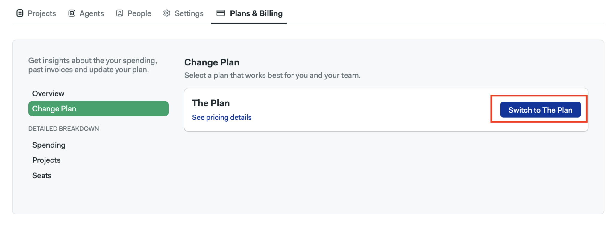
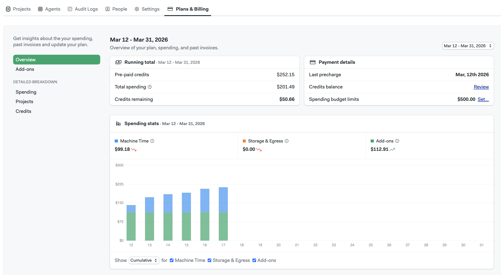
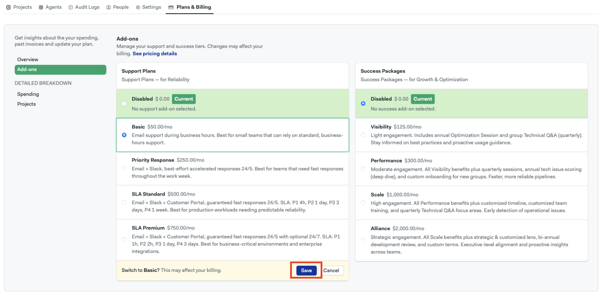
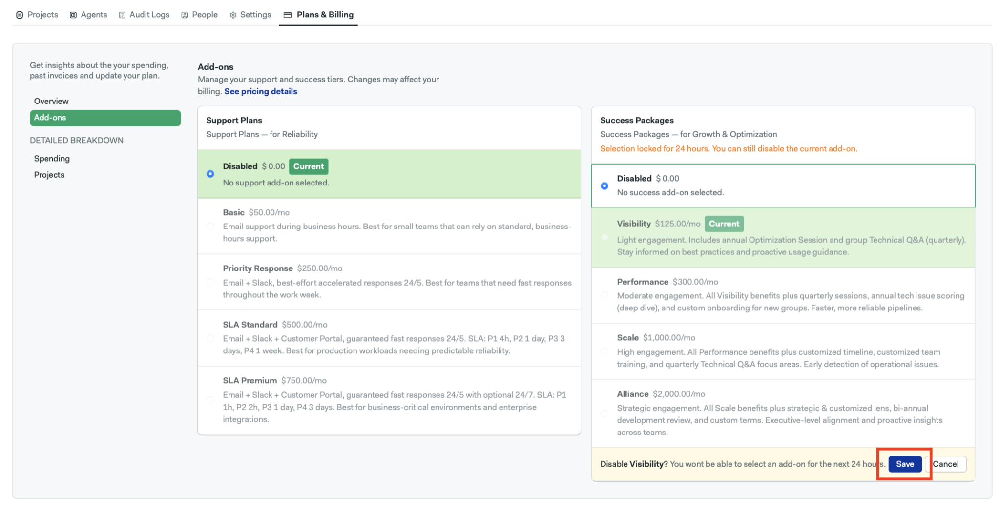

# Plans and Billing

<VideoTutorial title="How to view billing and spending" src="https://www.youtube.com/embed/hf_3tTHSRiM" />

Semaphore Cloud offers [several plans](https://semaphore.io/pricing) for your organization. This page explains how you can view your current plan and how billing is calculated.

## Overview {#overview}

Every organization on Semaphore Cloud is tied to a billing plan.

## How to switch from a legacy plan to the new plan {#switch-plan}

Semaphore’s new pricing model is designed to provide simpler, more transparent pricing based on actual usage, while separating infrastructure costs from optional support and success services.

If your organization is currently using a legacy plan, you can switch to the new plan with these steps:

1. Open your organization menu
1. Select **Plans & Billing**
1. In the left-side menu, select **Change plan**.
1. Click **Switch to The Plan**

    

1. Review the warning message and click **Confirm**.

:::Warning: 

- **This action cannot be undone.** Once you switch to the new plan, you won’t be able to return to your previous legacy plan.
- You will be **charged immediately for any spending until the time of the switch**, and the plan switch will take effect right away.
- Before switching, **verify that the machine types and OS images you currently use are [compatible with the new plan](https://docs.semaphore.io/using-semaphore/billing#rates).**

:::

## How to view current spending {#spending}

To see your spending:

<Steps>

1. Open your organization menu
1. Select **Plans & Billing**
1. The **Overview** tab shows your monthly spending

    

1. You can view detailed breakdowns in two ways

    - **Spending**: shows costs due to machine usage, storage and egress
    - **Projects**: shows the costs generated by your most active projects

</Steps>

## How Spending is Calculated

In addition to subscription cost, your monthly bill is determined by your usage of the following four groups of resources:

- **Machine Time** - the cost of using Semaphore Cloud machines (calculated by the minute)
- **Storage and Egress** - the cost of storing and downloading your build artifacts
- **Add-ons** - additional features or services offered by Semaphore Cloud (e.g. SLA Premium support, a dedicated cache server)

You can monitor your monthly spending at any time on the [Plans & Billing](#spending) page within the app. Please note that spending data may take up to 24 hours to update.

## How machine usage is billed

Semaphore charges you based on the machine type used and the amount of time spent running. The timer starts when a job enters the running state and ends once the job is finished. Jobs that take less than one minute to complete will be rounded up to a full minute for billing purposes.

:::info

"Only running time is billed" Please note that time spent in the queue state due to concurrency limits or pipeline queues is not counted towards machine time used.

:::

## Machine time rates {#rates}

Each cloud machine type has its own **price per minute**, listed in the table below:

| Generation | 2 vCPU (standard-2) | 4 vCPU (standard-4) | 
| :--------: | :-----------------: | :-----------------: | 
| F1 (Linux) |       $0.0075       |       $0.015        | 
| R1 (ARM) |        $0.003        |        $0.006        |  
| A2 (MacOS Silicon) |          /          |        $0.09        | 

With the new pricing model, **f1 machines become the primary compute option and are available at significantly reduced per-minute pricing, replacing the e1 and e2 machines**, which will no longer be available under the new plan.

You can find detailed pricing on [Semaphore's pricing page](https://semaphore.io/pricing).

## Self-hosted agents rates

:::info

For organizations under our legacy Hybrid plans, Self-hosted agents are available under a developer seats pricing model.

:::

Under the new pricing model, [Self-hosted agents](./self-hosted) are now billed based on usage rather than developer seats, similarly to Semaphore cloud machine runners, based on the amount of compute time used.

Self-hosted usage will be priced at **$0.0025 per minute.**

This change aligns pricing with actual infrastructure usage, ensuring teams pay proportionally for the compute they run while maintaining the flexibility of running pipelines on their own infrastructure.

You can find detailed pricing on [Semaphore's pricing page](https://semaphore.io/pricing).

## Support and Success plans

:::info

For organizations under our legacy plans, support and success services are bundled into machine pricing.

:::

The new pricing model separates both support and success services into clear, optional add-ons to provide:

- Greater pricing transparency
- More flexibility for teams
- Better alignment between cost and value

Infrastructure pricing now reflects compute consumption alone, while teams can choose the support level that best fits their needs.

### New Support Add-on

Teams can choose from the following support tiers:

|        Name       |         Best For        | Key Features                                                      |
| :---------------: | :---------------------: | :---------------------------------------------------------------- |
|       Basic       |       Small teams       | Email support during business hours                               |
| Priority Response |      Growing teams      | Email and Slack support with accelerated responses, 24/5 coverage |
|    SLA Standard   |   Production workloads  | Guaranteed response times, priority queue, 24/5 coverage          |
|    SLA Premium    | Enterprise environments | Faster SLAs with optional 24/7 support                            |

For teams running production workloads, SLA-based support ensures predictable response times and operational reliability.

You can find detailed pricing on [Semaphore's pricing page](https://semaphore.io/pricing).

### New Success Add-on

While support focuses on resolving issues, success plans help teams optimize performance and adoption.
These plans provide proactive guidance, optimization sessions, and technical enablement.

|     Name    |            Ideal For           | Key Benefits                                    |
| :---------: | :----------------------------: | :---------------------------------------------- |
|  Visibility |           Small teams          | Occasional expert input and updates             |
| Performance |          Active teams          | Build optimization and reliability improvements |
|    Scale    |      Growing organizations     | Continuous monitoring and training              |
|   Alliance  | Strategic enterprise customers | Executive alignment and roadmap collaboration   |

Success plans are designed to help teams:

- Improve pipeline performance
- Reduce infrastructure spend
- Adopt new capabilities faster

For larger organizations, these plans also enable closer collaboration with Semaphore’s product and engineering teams.

You can find detailed pricing on [Semaphore's pricing page](https://semaphore.io/pricing).

### Engineering Support On Demand

Some teams occasionally need deeper technical guidance, for tasks such as:

- Migrating large CI/CD environments
- Optimizing pipeline architecture
- Performance troubleshooting
- Deployment automation improvements

For these scenarios, **Solutions Engineering hours** can be purchased separately, giving teams access to expert assistance when needed.

You can find detailed pricing on [Semaphore's pricing page](https://semaphore.io/pricing).

### How to enable Add-ons {#enable-add-on}

Add-ons allow you to enable additional services for your organization and are only available under the new plan. You can switch to the new plan with [these steps](#switch-plan). 

1. Open your organization menu.
2. Select **Plans & Billing**.
3. In the left-side menu, select **Add-ons**
4. Choose a tier and click on **Save**.

:::Important: 
Enabling Add-ons may affect your billing. After clicking on save, you cannot select another add-on in the same column for 24 hours, but you can still [disable the current add-on](#disable-add-on).
:::

### How to disable Add-ons {#disable-add-on}

1. Open your organization menu.
2. Select **Plans & Billing**.
3. In the left-side menu, select **Add-ons**.
4. Tick the **Disabled** option and click **Save**. 

:::Important:
You won't be able to select another add-on in the same column for 24 hours.
:::

## See also

- [Organizations](./organizations)
- [Semaphore.io pricing page](https://semaphore.io/pricing)

