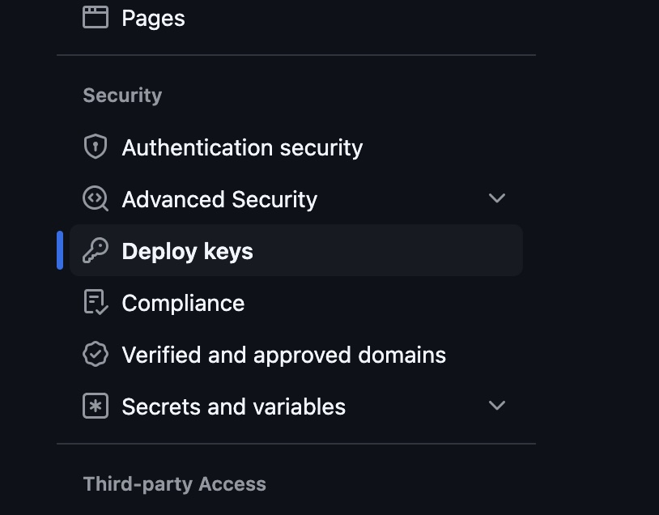
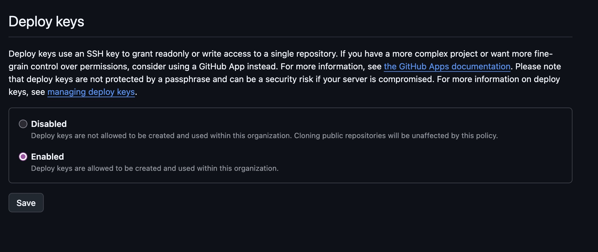
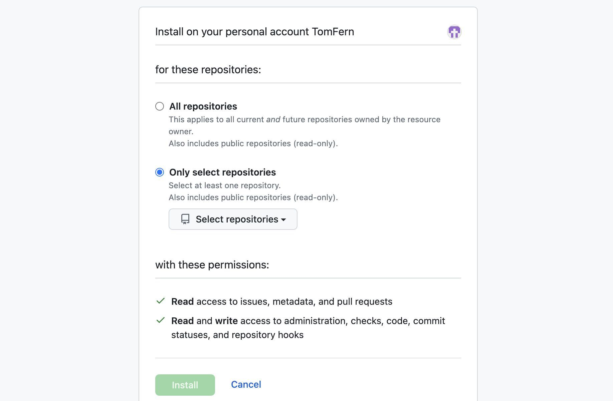
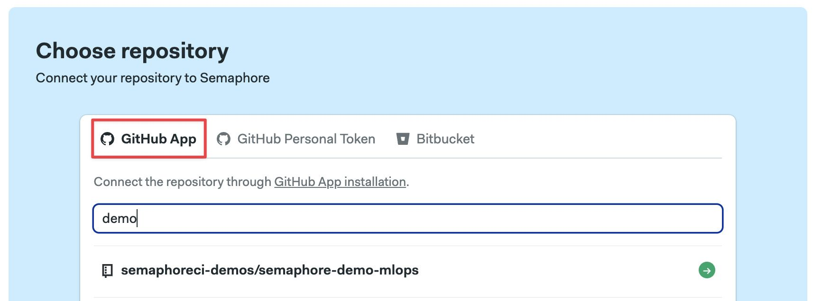
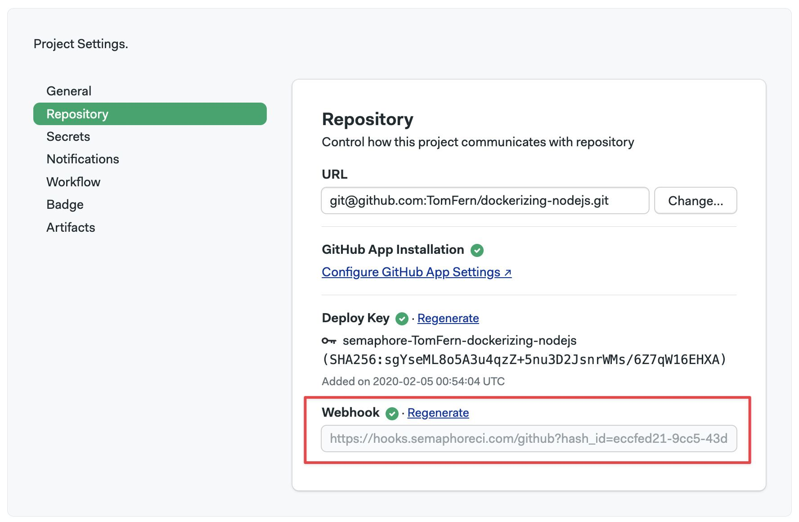

# Connect GitHub

GitHub users need to provide access to Semaphore so it can read their repositories.

## Overview

Semaphore accesses your GitHub repositories using the [Semaphore GitHub App](https://github.com/apps/semaphore-ci-cd). This method provides fine-grained control and per-repository permissions to control which code Semaphore can access.

## How to enable deploy keys {#deploy-keys}

New GitHub organizations might have deploy keys disabled by default. If this happens, Semaphore cannot connect to your GitHub organization and you won't be able to access your GitHub repositories from Semaphore.

To enable deploy keys in GitHub:

<Steps>

1. Open the Organization Settings in GitHub

2. Go to **Security**, then **Deploy Keys**

    

3. Ensure the Deploy Keys settings is **Enabled**

    

</Steps>

## How to authorize the GitHub App {#connect-ghapp}

To install the GitHub App in your organization:

<Steps>

1. Navigate to [Semaphore GitHub App](https://github.com/apps/semaphore-ci-cd)
2. Press **Install**
3. Select an organization
4. Select the repository access, you can grant access to all or some of your repositories
    

</Steps>

### Connect repositories via GitHub App {#ghapp}

To connect a repository via the GitHub App, you must:

- Have collaborator access to the repository
- Have [authorized the GitHub App](https://docs.github.com/en/apps/using-github-apps/authorizing-github-apps) in the organization that the repository belongs to
- Have granted repository read access to the GitHub App

To create a connection using [GitHub App](https://github.com/apps/semaphore-ci-cd), follow this steps:

<Steps>

1. Create a [new project](./projects#create-project)
2. Select the **GitHub App** tab
    
3. Press **Give access to more repositories**
    
4. Select **All repositories** or pick individual repositories
5. Select a repository from the list and finish the [project setup](./projects)

</Steps>

## How to transfer projects from OAuth to GitHub App {#transfer}

Projects [connected via the OAuth App](./connect-github-oauth) can be transferred to the [GitHub App](#ghapp) at any time. You need to have installed the GitHub App in your organization before the transfer can take place.

To transfer projects, follow these steps:

<Steps>

1. Open the Semaphore [project](./projects) you want to transfer
2. Go to [Project Settings](./projects#settings) and select **Repository**
3. Press the button **Switch to GitHub App**
    

</Steps>

If the project was transferred successfully, you should get a message that says **Project connection type switched to GitHub app**.


Go to Project Settings and select Repository Settings.
If your project is using a personal token to connect to the repository, you will see the following screen:

## Troubleshooting guide

If your repositories aren't showing in Semaphore or changes are not triggering new workflows, check the connection between GitHub and Semaphore.

<Steps>

1. Navigate to your [Semaphore account](https://me.semaphoreci.com/account)
2. Read the status next to GitHub
    
3. If the status is disconnected, click on **Grant public access** or **Grant private access**

</Steps>

You can check and change the permissions of your OAuth App connection in the [Semaphore OAuth page](https://github.com/settings/connections/applications/328c742132e5407abd7d).

### Verify deploy key health {#deploy-key}

Semaphore generates a [deploy key](https://docs.github.com/en/authentication/connecting-to-github-with-ssh/managing-deploy-keys) when a [project](./projects) is created. This means there is a deploy key per repository connected to Semaphore.

When a deploy key is broken or invalid, Semaphore shows the following error message:

```text
git@github.com: Permission denied (publickey).
fatal: Could not read from remote repository.
```
To verify the status of a deploy key:

<Steps>

1. Open your [project settings](./projects#settings)
2. If there isn't a green check next to **Deploy Key**, the key is invalid


</Steps>

To deploy a new key, click on **Regenerate**

:::info

A deploy key can be invalidated if:

- it was manually removed from the repository
- access via OAuth or GitHub App was revoked
- the repository's original owner no longer has access to it (only for projects added [via OAuth](./connect-github-oauth))

:::

### Verify deploy key settings on GitHub {#deploy-key-github}

GitHub recently changed the default setting for Deploy keys, which may now be set to Disabled for new organizations. When this setting is disabled, Semaphore cannot create or connect projects from GitHub repositories.

If you encounter issues connecting Semaphore to your GitHub repository (for example, projects failing to create or the connection breaking), please verify your deploy key configuration, depending on the type of GitHub account:

#### GitHub organization accounts:

1. Go to your organization’s settings page on GitHub: https://github.com/organizations/ORGANIZATION_NAME/settings/deploy_keys
1. Under **Security → Deploy keys**, check the **Default policy** setting.
1. If the default option is **Disabled**, change it to **Enabled**.

    

1. Once updated, retry creating or reconnecting your project on Semaphore.

#### GitHub Enterprise Accounts:**

For GitHub Enterprise Cloud users, deploy key policies are controlled at the enterprise level. A user with Admin permissions must enable deploy keys.

1. Log in to your GitHub Enterprise Cloud account as an admin.

1. Follow the instructions in GitHub’s documentation: [Enforcing a policy for deploy keys in your enterprise](https://docs.github.com/en/enterprise-cloud@latest/admin/enforcing-policies/enforcing-policies-for-your-enterprise/enforcing-repository-management-policies-in-your-enterprise#enforcing-a-policy-for-deploy-keys)

    - In the top-right corner of GitHub, click your profile picture.
    - Click on **Your enterprise/Your enterprises** and select your organization.
    - Click on **Policies > Member privileges**.
    - Under **Deploy keys**, review the information about changing the setting, select a policy, and save.

1. Once updated, retry creating or reconnecting your project on Semaphore.


### Verify webhook health {#webhook}

Semaphore uses a webhook to detect changes in your repository. When the webhook is broken, Semaphore can't trigger new workflows.

To verify the status of a webhook:

<Steps>

1. Open your [project settings](./projects#settings)
2. If there isn't a green check next to **Deploy Key**, the key is invalid
    

</Steps>

To fix the broken webhook, click on **Regenerate**. This should generate a new webhook and repair the connection between Semaphore and GitHub.

### Reconnecting moved or renamed projects {#reconnect}

There are several actions that can break the connection between GitHub and Semaphore. For example:

- moving the repository to a different location
- renaming the repository
- renaming the GitHub user account
- renaming the GitHub organization

When this happens, you must update the URL of the repository in Semaphore. To do this:

<Steps>

1. Open your [project settings](./projects#settings)
2. Type the new repository URL
3. Press **Change**
    

</Steps>

After changing the URL, double-check the status of the [deploy key](#deploy-key) and the [webhook](#webhook).

### File semaphore.yml is not available

You might see the following error message when trying to run workflows on Semaphore:

``` yaml
semaphore.yml ERROR:
Error: {"File '.semaphore/semaphore.yml' is not available", "Not Found"}
```

This means that Semaphore can't fetch the `.semaphore/semaphore.yml` file from the repository. There are two reasons why this might happen:

1. **The file doesn't exist on your repository**: double check to make sure that the Semaphore YAML file actually exists
2. **Repository is disconnected from Semaphore**: follow the steps [previously described](#reconnect)

### This pull request is still a work in progress {#stuck-pr}

Renaming the pipeline in Semaphore can cause GitHub pull requests to be stuck, as GitHub expects the old name to report back the status.

For instance, renaming the `semaphore.yml` pipeline file from:

```yaml
version: v1.0
name: Rails 7
```

To something like:

```yaml
version: v1.0
name: Rails 8
```

Can cause any pending pull requests on GitHub to wait forever.

To solve the issue, follow these steps:

1. Go to your GitHub repository.
2. Navigate to **Settings** > **Branches**,
3. Under **Branch Protection Rules**, find the rule for your default or protected branch and press **Edit**
4. In the **Require status checks to pass before merging** section, remove the outdated check, e.g. `ci/semaphoreci/push: old-name`) and add the new one if needed, e.g. `ci/semaphoreci/push: new-name`
5. Save the changes.

## Connect with GitHub SAML

Semaphore supports repositories hosted on GitHub with SAML single sign-on (SSO). This GitHub feature is available in the GitHub Enterprise Cloud offering.

To authorize Semaphore to access repositories hosted on GitHub SSO, you need to grant Semaphore access to your organization on GitHub.

Here is how you authorize Semaphore:

<Steps>

1. Navigate to your [GitHub Profile Settings](https://github.com/settings/profile)
2. On the left-hand side menu, click **Applications**
3. Open the **Authorized OAuth Apps** tab
4. Under "Organization access", choose your private organization and click either **Grant** or **Request Access**

</Steps>

If you click "Request Access" in step 5, the admin of the organization will receive an email showing your request.


## See also

- [Getting Started Guide](../getting-started/quickstart)
- [Using OAuth with GitHub](./connect-github-oauth)
- [How to connect with BitBucket](./connect-bitbucket)
