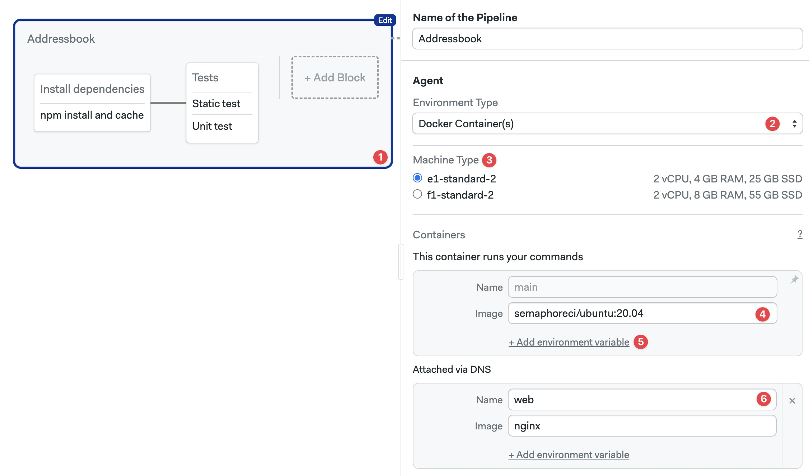
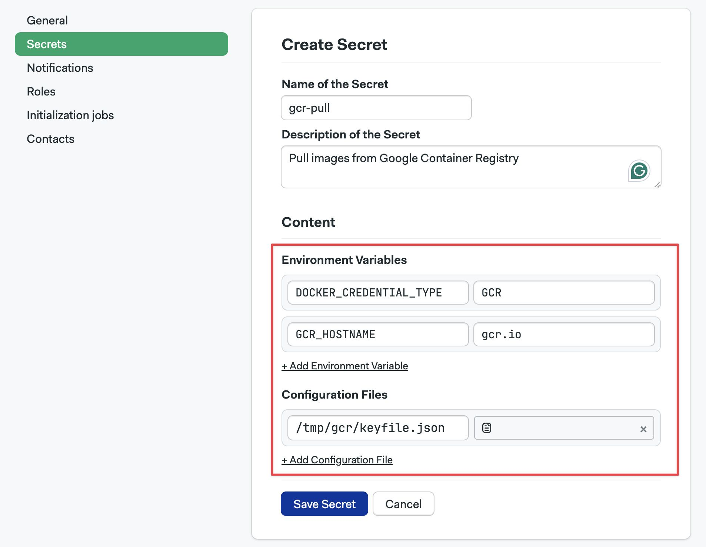

# Running Jobs in Docker Containers

Run jobs inside Docker containers orchestrated by Semaphore.

## Overview

[Jobs](./jobs) can run inside Docker containers. This allows you to define a custom-built environment with pre-installed tools and dependencies needed for your project. You can enable this setting in the [pipeline agent](./pipelines#agents) or in the [block agent override](./jobs#agent-override).

You can run multiple containers at the same time. The job runs in the first container (called `main`) and attaches the other containers to the same network. This is similar to how containers inside a Kubernetes pod communicate.

The network addresses of all containers are mapped to their names. Let's say you have two containers, "main" and "mysql", you can connect to the database from the main container with:

```shell title="container 'main'"
mysql --host=mysql --user=root
```

## How to run jobs inside Docker containers

To run the job inside a Docker container you must define at a Docker image in your agent configuration.

The following example shows how to set up two containers:

- main: where the commands of the job are executed. The container is running an Ubuntu 20.04 container. The image is pulled from the [Semaphore Container Registry](./containers/container-registry)
- web: runs an nginx container and attaches it to the same network as the main container

<Tabs groupId="editor-yaml">
<TabItem value="editor" label="Editor">

Follow these steps to configure Docker containers using the workflow editor:

<Steps>

1. Select the pipeline
2. In **Environment Types** select **Docker Container(s)**
3. Select the [machine type](../reference/machine-types)
4. Type the **Image** name for this container
5. Optionally, add environment variables
6. Optionally, add more containers

  

</Steps>

</TabItem>
<TabItem value="yaml" label="YAML">

Follow these steps to configure Docker containers using the [YAML container definition](../reference/pipeline-yaml#containers):

1. Add the `agent` and [`machine`](../reference/pipeline-yaml#machine)
2. Add a `containers` key
3. Each list item is a container. The first one must be called `main`
4. Add the `image`
5. Optionally, add `env_vars`
6. Optionally, add more containers

```yaml title=".semaphore/semaphore.yml"
version: v1.0
name: Initial Pipeline
agent:
  machine:
    type: e1-standard-2
    os_image: ubuntu2004
  # highlight-start
  containers:
    - name: main
      image: 'semaphoreci/ubuntu:20.04'
      env_vars:
        - name: FOO_1
          value: BAR_1
    - name: web
      image: nginx
  # highlight-end
blocks:
  - name: 'Block #1'
    dependencies: []
    task:
      jobs:
        - name: 'Job #1'
          commands:
            - 'curl http://web'
```

</TabItem>
</Tabs>

## Pulling Images from Private Docker Registries {#docker-private}

If the images you need for your Docker environment are not publicly available, you need to provide authentication credentials in your pipeline. This feature is only available by editing the pipeline YAML directly.

See [containers in pipeline YAML](../../reference/pipeline-yaml#containers) for more details.

### Images in Docker Hub {#docker-hub}

To pull images from a private Docker Hub registry, follow these steps:

<Steps>

1. Create a [secret](./secrets) with the following key-value pairs:

    - `DOCKER_CREDENTIAL_TYPE` = `DockerHub`
    - `DOCKERHUB_USERNAME` = `<your Docker Hub account username>`
    - `DOCKERHUB_PASSWORD` = `<your Docker Hub account password>`

2. Import the secret by name into the agent using `image_pull_secret`. The following example assumes the secret is called `dockerhub-pull`

  ```yaml title=".semaphore/semaphore.yml"
  agent:
     machine:
       type: e1-standard-2
     containers:
       - name: main
         image: <your-private-repository>/<image>
         # highlight-start
     image_pull_secrets:
       - name: dockerhub-pull
         # highlight-end
  ```

</Steps>

### Images in AWS ECR {#docker-ecr}

To pull images from a private AWS Elastic Container Registry (ECR), follow these steps:

<Steps>

1. Create a [secret](./secrets) with the following key-value pairs:

    - `DOCKER_CREDENTIAL_TYPE` = `AWS_ECR`
    - `AWS_REGION` = `<aws-ecr-region>`
    - `AWS_ACCESS_KEY_ID` = `<your-aws-access-key>`
    - `AWS_SECRET_ACCESS_KEY` = `<your-aws-secret-key>`

2. Import the secret by name into the agent using `image_pull_secret`. The following example assumes the secret is called `ecr-pull`

  ```yaml title=".semaphore/semaphore.yml"
  agent:
     machine:
       type: e1-standard-2
     containers:
       - name: main
         image: <your-private-repository>/<image>
         # highlight-start
     image_pull_secrets:
       - name: ecr-pull
         # highlight-end
  ```

</Steps>

### Images in Google GCR {#docker-gcr}

To pull images from a private Google Container Registry (GCR), follow these steps:

<Steps>

1. Create a [secret](./secrets) with the following key-value pairs:

    - `DOCKER_CREDENTIAL_TYPE` = `GCR`
    - `GCR_HOSTNAME` = `gcr.io`

2. Download the [service account keyfile](https://cloud.google.com/artifact-registry/docs/docker/authentication#json-key) that provides access to your Google Container Registry.

3. Upload the keyfile to the secret created on step 1
  
     **Important**: the file must be mounted on `/tmp/gcr/keyfile.json`

     

4. Import the secret by name into the agent using `image_pull_secret`. The following example assumes the secret is called `gcr-pull`

  ```yaml title=".semaphore/semaphore.yml"
  agent:
     machine:
       type: e1-standard-2
     containers:
       - name: main
         image: <your-private-repository>/<image>
         # highlight-start
     image_pull_secrets:
       - name: gcr-pull
         # highlight-end
  ```

</Steps>

### Images in Quay.io {#docker-quay}

To pull images from a private Quay.io registry, follow these steps:

<Steps>

1. Create a [secret](./secrets) with the following key-value pairs:

    - `DOCKER_CREDENTIAL_TYPE` = `GenericDocker`
    - `DOCKER_URL` = `quay.io`
    - `DOCKER_USERNAME` = `<your-quay-username>`
    - `DOCKER_PASSWORD` = `<your-quay-password>`

2. Import the secret by name into the agent using `image_pull_secret`. The following example assumes the secret is called `quay-pull`

  ```yaml title=".semaphore/semaphore.yml"
  agent:
     machine:
       type: e1-standard-2
     containers:
       - name: main
         image: <your-private-repository>/<image>
         # highlight-start
     image_pull_secrets:
       - name: quay-pull
         # highlight-end
  ```

</Steps>

### Images in generic registries {#docker-any}

To pull images from any arbitrary Docker registry, follow these steps:

<Steps>

1. Create a [secret](./secrets) with the following key-value pairs:

    - `DOCKER_CREDENTIAL_TYPE` = `GenericDocker`
    - `DOCKER_URL` = `<your-repository-url>`
    - `DOCKER_USERNAME` = `<your-registry-username>`
    - `DOCKER_PASSWORD` = `<your-registry-password>`

2. Import the secret by name into the agent using `image_pull_secret`. The following example assumes the secret is called `registry-pull`

  ```yaml title=".semaphore/semaphore.yml"
  agent:
     machine:
       type: e1-standard-2
     containers:
       - name: main
         image: <your-private-repository>/<image>
         # highlight-start
     image_pull_secrets:
       - name: registry-pull
         # highlight-end
  ```

</Steps>

## See also

- [How to build Docker images in Semaphore](./containers/docker)
- [How to use the Semaphore Docker Registry](./containers/container-registry)
- [Pipeline YAML reference for containers](../reference/pipeline-yaml#containers)
