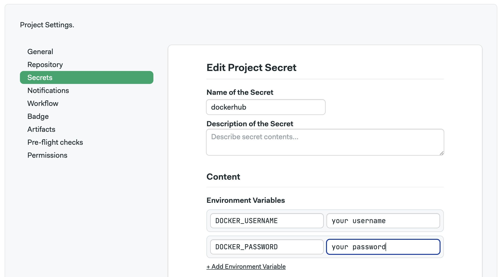

# Building Docker Images


Use Semaphore to build, test, store, and deploy Docker images to production. This page explains how to use Docker inside Semaphore.

:::tip

This page describes how to build, test, and publish Docker images using Semaphore. If you want to run [jobs](../jobs) inside Docker containers, see the [Docker environments page](../pipelines#docker-environments).

:::

## Overview

Docker comes preinstalled in all [Semaphore Machines](../../reference/machine-types). You can use the well-known Docker command line tool to build and run containers inside Semaphore.

## How to build a Docker image {#build}

You can use the `docker` command line tool inside a Semaphore [job](../jobs). In most cases, you should also run [checkout](../../reference/toolbox) to clone the repository in order to get access to the code and Dockerfile.

In the following example, an image is built. Since the job doesn't push it into a Docker registry, the image is lost as soon as the job ends. [Authenticate with a registry](#dockerhub) to save your image.

```shell title="Job commands"
checkout
docker build -t my-image .
docker images
```

### Using Dockerfiles {#dockerfile}

The following example shows a Dockerfile that builds an image containing a Go application:

```docker title="Dockerfile"
FROM golang:alpine

RUN mkdir /files
COPY hello.go /files
WORKDIR /files

RUN go build -o /files/hello hello.go
ENTRYPOINT ["/files/hello"]
```

The Dockerfile is shown above:

1. Downloads the [Go official image](https://hub.docker.com/_/golang)
2. Creates a directory called `files`
3. Copies the compiled Go binary to the new directory
4. Runs the binary inside the Docker container

To build and run the image, add the following commands to your job:

```shell title="Job commands"
checkout
docker build -t hello-app .
docker run -it hello-app
```

:::warning

Due to the introduction of [Docker Hub rate limits](https://www.docker.com/increase-rate-limits/), Semaphore automatically redirects image pulls from the Docker Hub repository to the [Semaphore Container Registry](./container-registry).

:::

### Docker layer caching {#caching}

Docker images are organized as layers, which you can leverage to speed up the build process on large images. 

In order to leverage layer caching you can modify your Docker build job as follows

<Steps>

1. Authenticate with the [Docker registry](#auth) of your choice. For example for [Docker Hub](#dockerhub):

    ```shell
    echo $DOCKER_PASSWORD | docker login --username "$DOCKER_USERNAME" --password-stdin
    ```

2. Download the base or latest image from the Docker registry

    ```shell
    docker pull "$DOCKER_USERNAME"/my-image-name:latest
    ```


3. Add the `--cache-from` argument to the build command

    ```shell
    checkout
    docker build \
        --cache-from "$DOCKER_USERNAME"/my-image-name:latest \
        -t "$DOCKER_USERNAME"/my-image-name:$SEMAPHORE_WORKFLOW_ID .
    ```

    In this example, we're using the [`SEMAPHORE_WORKFLOW_ID`](../../reference/env-vars#workflow-id) because it provides a unique ID for each build but you can use any other tagging strategy.

    See [Semaphore Environment Variables](../../reference/env-vars) for other available variables you might use in the build like `$SEMAPHORE_GIT_BRANCH`.

4. Push the latest build to the Docker registry

    ```shell
    docker tag "$DOCKER_USERNAME"/my-image-name:$SEMAPHORE_WORKFLOW_ID "$DOCKER_USERNAME"/my-image-name:latest
    docker push "$DOCKER_USERNAME"/my-image-name:latest
    ```

</Steps>

The build command should complete faster as only the layers that changed in the Dockerfile need to be rebuilt.

## How to authenticate to Docker registries {#auth}

To save the image built in the section above or access private images, you must first authenticate with a Docker registry like DockerHub, AWS Elastic Container Registry, or Google Cloud Container Registry.

### Using DockerHub {#dockerhub}

The following example shows how to authenticate with [Docker Hub](https://hub.docker.com) so we can push images:

```shell title="Job commands"
checkout
echo $DOCKER_PASSWORD | docker login --username "$DOCKER_USERNAME" --password-stdin
docker build -t hello-app .
docker tag hello-app "$DOCKER_USERNAME"/hello-app
docker push "$DOCKER_USERNAME"/hello-app
```

The example above assumes there are a [secret](../secrets) containing your DockerHub credentials using the environment variables `DOCKER_USERNAME` and `DOCKER_PASSWORD`. The password field can either contain your account password or a [Docker Access Token](https://docs.docker.com/security/for-developers/access-tokens/), the command remains the same.



You can verify that you have successfully logged by running:

```shell
$ docker login
Login Succeeded
```

### Using AWS ECR

To access your AWS Elastic Container Registry (ECR) images:

<Steps>

1. Create a [secret](../secrets) containing the variables `AWS_ACCESS_KEY_ID`, `AWS_SECRET_ACCESS_KEY`
2. Enable the secret in your job
3. Define the [environment variables](../jobs#environment-variables) `AWS_DEFAULT_REGION` and `ECR_REGISTRY`
4. Type the following commands in your [block prologue](../jobs#prologue)

    ```shell title="Prologue"
    sudo pip install awscli
    aws ecr get-login --no-include-email | bash
    ```

5. Type the following commands in your job:

    ```shell title="Job commands"
    checkout
    docker build -t example .
    docker tag example "${ECR_REGISTRY}"
    docker push "${ECR_REGISTRY}"
    ```

</Steps>

### Using Google Cloud GCR

To access your Google Cloud Container Registry (GCR) images:

<Steps>

1. Create a [secret](../secrets) with your Google Cloud access credential file (`$HOME/.config/gcloud/application_default_credentials.json`)
2. Enable the secret in your job
3. Define the [environment variables](../jobs#environment-variables) `GCR_URL` with the URL of your registry, e.g. `asia.gcr.io`, and `GCP_PROJECT_ID`
4. Type the following commands in your [block prologue](../jobs#prologue)

    ```shell title="Prologue"
    gcloud auth activate-service-account
    gcloud auth configure-docker -q
    ```

5. Type the following commands in your job:

    ```shell title="Job commands"
    checkout
    docker build -t example .
    docker tag example "${GCR_URL}/${GCP_PROJECT_ID}/example"
    docker push "${GCR_URL}/${GCP_PROJECT_ID}/example"
    ```

</Steps>

### Using other registries {#registries}

In order to pull and push images to other Docker registries such as JFrog or Quay, create a suitable [secret](../secrets) and use the following commands:

```shell
echo $DOCKER_PASSWORD | docker login --username "$DOCKER_USERNAME" --password-stdin registry.example.com
docker pull registry-owner/image-name
```

## See also

- [How to run jobs inside Docker containers](../pipelines#docker-environments)
- [How to create jobs](../jobs#job-create)
- [How to use secrets](../secrets)
- [Semaphore Docker registry reference](../../reference/env-vars#registry-variables)
