# Jobs

import Tabs from '@theme/Tabs';
import TabItem from '@theme/TabItem';
import Available from '@site/src/components/Available';
import VideoTutorial from '@site/src/components/VideoTutorial';
import Steps from '@site/src/components/Steps';

Jobs get stuff done. This page explains to create and configure jobs.

## Job lifecycle {#job-lifecycle}

Jobs run arbitrary shell commands inside a dedicated environment called an [agent](./pipelines#agents). Agents can take many forms, including ephemeral Docker containers, Kubernetes pods, or x86/ARM Virtual Machines.

When a job is scheduled, the following happens:

1. **Allocate agent**: pick a suitable agent from the pool of warm agents
2. **Initialize**: execute setup steps such as importing environment variables, loading SSH keys, mounting [secrets](./secrets), and installing the [Semaphore toolbox](#toolbox)
3. **Run commands**: execute your commands
4. **End job and save logs**: the job activity log is saved for future inspection
5. **Destroy agent**: the used agent is *discarded* along with all its contents

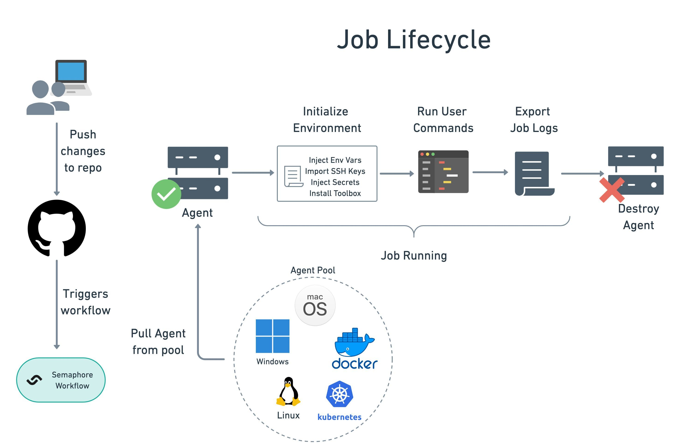

:::note

You can get non-ephemeral agents with [self-hosted agents](./self-hosted).

:::

## Jobs, blocks and pipelines {#jobs-blocks}

Semaphore uses jobs, blocks and pipelines to structure the [workflow](./workflows).

- **Job**: the minimum unit of work, a sequence of commands. Every job exists inside a block
- **Block**: contains one of more jobs. Jobs in the same block run concurrently and [share properties](#block-settings)
- **Pipeline**: a group of blocks connected by dependencies. A workflow may span multiple pipelines


## How to create a job {#job-create}

You can create a job with the visual editor or by creating a YAML file.

<Tabs groupId="editor-yaml">
<TabItem value="editor" label="Editor" default>

Open your [project](./projects) on Semaphore and press **Edit Workflow**.


<Steps>

1. Select the first block
2. Type your shell commands
3. Press **Run the workflow**, then press **Looks good, Start →**

</Steps>

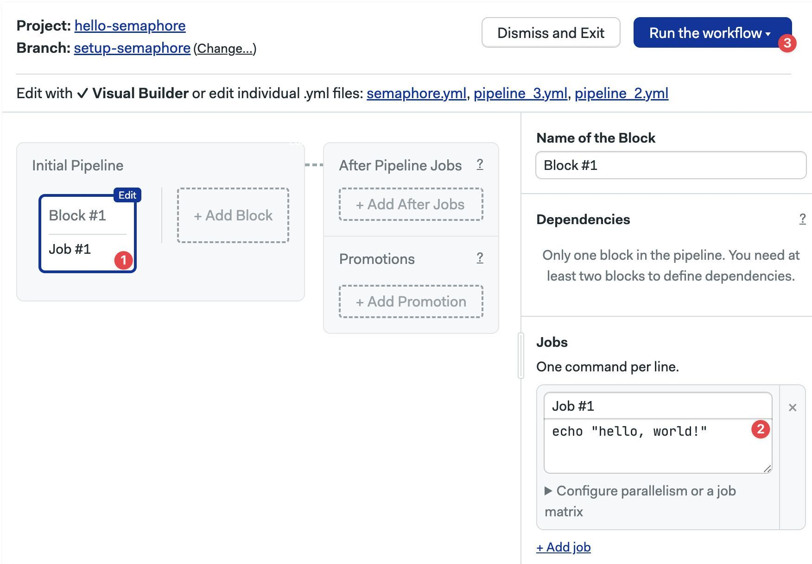
 
</TabItem>
<TabItem value="yaml" label="YAML">

<Steps>

1. Create a file called `.semaphore/semaphore.yml` at the repository's root
2. Add the pipeline `name`
3. Define an [agent](./pipelines#agents)
4. Create a `blocks` key and type the block's `name`
5. Add a `task.jobs` key. The value is a list of jobs
6. Type the job's `name`
7. Add the job's `commands`. The value is a list of shell commands (one line per list item)
8. Save the file, commit and push it to your remote repository

</Steps>

You can use the following code as a starting point:

```yaml title=".semaphore/semaphore.yml"
version: v1.0
name: Initial Pipeline
agent:
  machine:
    type: e1-standard-2
    os_image: ubuntu2004
blocks:
  - name: 'Block #1'
    dependencies: []
    task:
      jobs:
        - name: 'Job #1'
          commands:
            - echo "hello, world!"'
            - echo "add as many commands as you like"
```

</TabItem>
</Tabs>

Semaphore automatically starts the job when the file is saved. Click the running job to follow the progress and view its log.

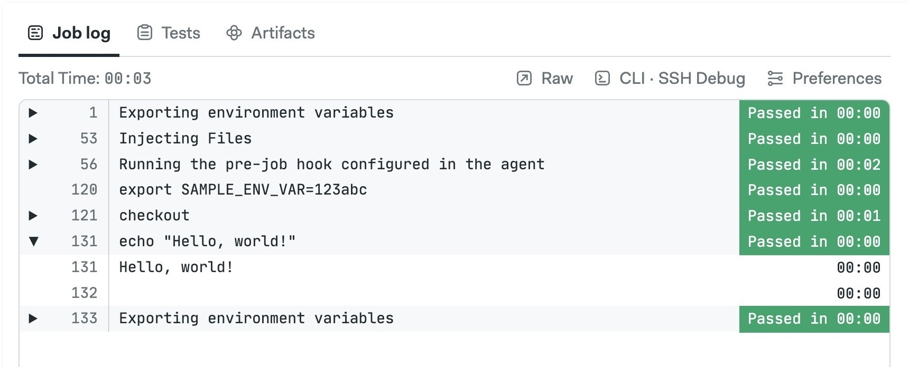

:::tip

Do not use `exit` in the job commands. Doing so terminates the terminal session and marks the job as failed. If you want force a non-exit status code use `return <int>` instead.

:::

### Run jobs in parallel {#jobs-parallel}

Jobs in the same block always run in parallel.

<Tabs groupId="editor-yaml">
<TabItem value="editor" label="Editor">

To run two jobs in parallel:

<Steps>

1. Select the block
2. Press **+ Add job**
3. Type the job name and commands

</Steps>


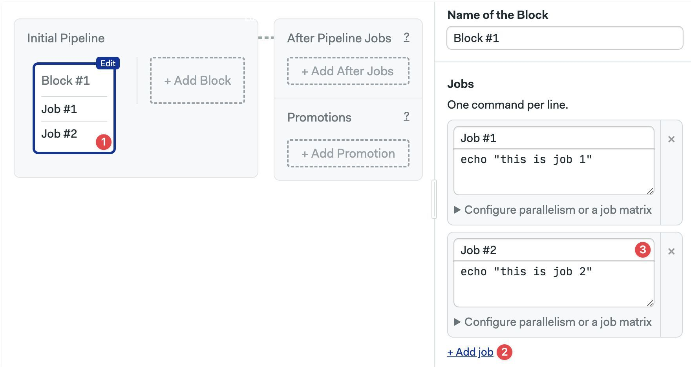

Here you can also:
- Delete a job by pressing the X sign next to it. 
- Delete the whole block along with the jobs by scrolling down and clicking on **Delete block...**

</TabItem>
<TabItem value="yaml" label="YAML">


<Steps>

1. Add a new `name` item under `jobs`
2. Add your shell commands (one per line) under `commands`
3. Save the file, commit and push it to your repository

</Steps>


```yaml title=".semaphore/semaphore.yaml"
version: v1.0
name: Initial Pipeline
agent:
  machine:
    type: e1-standard-2
    os_image: ubuntu2004
blocks:
  - name: 'Block #1'
    dependencies: []
    task:
      jobs:
        - name: 'Job #1'
          commands:
            - echo "this is job 1"
        # highlight-start
        - name: 'Job #2'
          commands:
            - echo "this is job 2"
        # highlight-end
```

</TabItem>
</Tabs>

:::note

You can't share files between jobs living in the same block.

:::

### Run jobs in sequence {#jobs-sequence}

If you want to run jobs in sequence, i.e. not in parallel, you must define them in separate blocks.

<Tabs groupId="editor-yaml">
<TabItem value="editor" label="Editor">

<Steps>

1. Click on **+Add Block**
2. Type the name of the block
3. Adjust dependencies to define execution order
4. Type the name and commands for the job

</Steps>


</TabItem>
<TabItem value="yaml" label="YAML">

<Steps>

1. Add a new job entry under `blocks`
2. Add a `dependencies`. List the names of the dependent blocks.
 
</Steps>

```yaml title=".semaphore/semaphore.yml"
version: v1.0
name: Initial Pipeline
agent:
  machine:
    type: e1-standard-2
    os_image: ubuntu2004
blocks:
  - name: 'Block #1'
    dependencies: []
    task:
      jobs:
        - name: 'Job #1'
          commands:
            - echo "this is job 1 of block 1"
  # highlight-start
  - name: 'Block #2'
    dependencies:
      - 'Block #1'
    task:
      jobs:
        - name: 'Job #1'
          commands:
            - echo "this is job 1 of block 2"
  # highlight-end
```

</TabItem>
</Tabs>

:::tip

All files are lost when the job ends. This happens because each jobs are allocated to different agents. Use [cache](#cache) or [artifact](#artifact) to preserve files and directories between jobs.

:::

### Using dependencies

You can use block dependencies to control the execution flow of the workflow. See [block dependencies](./pipelines#dependencies) to learn more.

## Semaphore toolbox {#toolbox}

The [Semaphore toolbox](../reference/toolbox) is a set of built-in command line tools to carry essential tasks in your jobs such as cloning the repository or moving data between jobs.

The most-used tools in the Semaphore toolbox are: 

- [checkout](#checkout) clones the remote Git repository
- [cache](#cache) speeds up jobs by caching downloaded files
- [artifact](#artifact) saves and moves files between jobs
- [sem-version](#sem-version) changes the active version for a language or runtime
- [sem-service](#sem-service) starts database and services for testing

### checkout {#checkout}

The [checkout](../reference/toolbox#checkout) command clones the remote Git repository and `cd`s into the repository directory so you're ready to work.

The following example shows the first commands for working with a Node.js project. We run `checkout` to get a local copy of the code. Next, we can run `npm install` because we can assume that `package.json` and `package-lock.json` exist in the current directory.

```shell
# highlight-next-line
checkout
npm install
```

Here is how the same code looks in a Semaphore job.

<Tabs groupId="editor-yaml">
<TabItem value="editor" label="Editor">

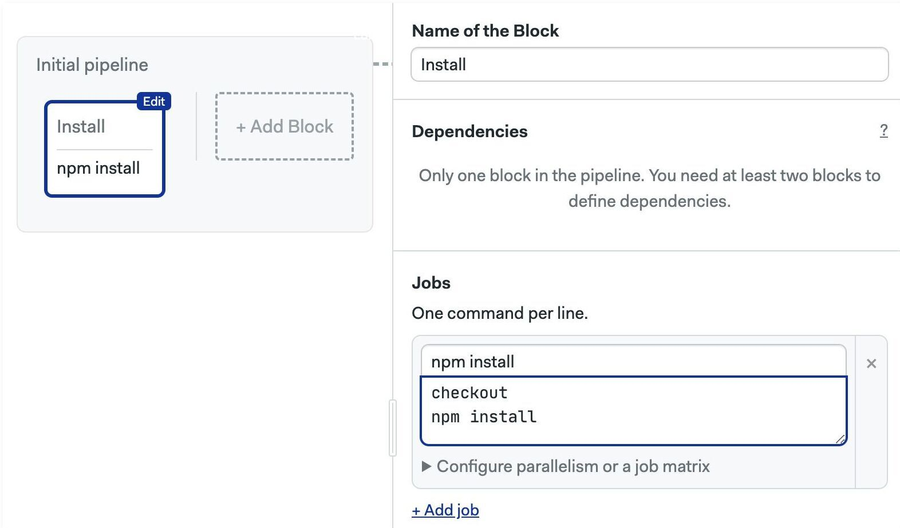

</TabItem>
<TabItem value="yaml" label="YAML">

```yaml title=".semaphore/semaphore.yml"
version: v1.0
name: Initial Pipeline
agent:
  machine:
    type: e1-standard-2
    os_image: ubuntu2004
blocks:
  - name: Install
    dependencies: []
    task:
      jobs:
        - name: npm install
          commands:
            # highlight-next-line
            - checkout
            - npm install
```

</TabItem>
</Tabs>

<details>
 <summary>How does checkout work?</summary>
 <div>
 Semaphore defines four [environment variables](#environment-variables) to control how checkout works:
 - [`SEMAPHORE_GIT_URL`](../reference/env-vars#git-url): the URL of the repository (e.g. git@github.com:mycompany/myproject.git).
 - [`SEMAPHORE_GIT_DIR`](../reference/env-vars#git-dir): the path where the repository is to be cloned (e.g. `/home/semaphore/myproject`)
 - [`SEMAPHORE_GIT_SHA`](../reference/env-vars#commit-sha): the SHA key for the HEAD used for `git reset -q --hard`
 - [`SEMAPHORE_GIT_DEPTH`](../reference/env-vars#git-depth): checkout does by default a shallow clone. This is the depth level for the shallow clone. Defaults to 50
 </div>
</details>

### cache {#cache}

:::note

Using `cache` in [self-hosted agents](./self-hosted) requires additional setup steps.

:::

The main function of the [cache](../reference/toolbox#cache) is to speed up job execution by caching downloaded files.

The `cache store` and `cache restore` commands can detect well-known dependency managers and persist files automatically. Let's say we want to speed up `npm install`, here is how to do it:

```shell
checkout
# highlight-next-line
cache restore
npm install
# highlight-next-line
cache store
```

The highlighted lines show how to use the cache:

- **cache store**: saves `node_modules` to non-ephemeral storage. It knows it's a Node project because it found `package.json` in the working folderx.
- **cache restore**: retrieves the cached copy of `node_modules` to the working directoryx.

Cache is not limited to Node.js. It works with several languages and frameworks. Alternatively, you can use cache with any kind of file or folder but in that case, you need to [supply additional arguments](../reference/toolbox#cache)


### artifact {#artifact}

:::note

Using `artifact` in [self-hosted agents](./self-hosted) requires additional setup steps.

:::

The [artifact](./artifacts) command can be used:

- as a way to move files between jobs and runs
- as persistent storage for artifacts like compiled binaries or bundles

The following example shows how to persist files between jobs. In the first job we have:

```shell
checkout
npm run build
# highlight-next-line
artifact push workflow dist
```

In the following jobs, we can access the content of the dist folder with:

```shell
artifact pull workflow dist
```

Let's do another example: this time we want to save the compiled binary `hello.exe`:

```shell
checkout
go build 
# highlight-next-line
artifact push project hello.exe
```

<details>
 <summary>Artifact namespaces</summary>
 <div>
    Semaphore uses three separate namespaces of artifacts: job, workflow, and project. The syntax is:

    ```shell
    artifact <pull|push> <job|workflow|project> </path/to/file/or/folder>
    ```

    The namespace used controls at what level the artifact is accessible:

    - **job** artifacts are only accessible to the job that created it. Useful for collecting debugging data
    - **workflow** artifacts are accessible to all jobs in all running [pipelines](./pipelines). The main use case is to pass data between jobs.
    - **project** artifacts are always accessible. They are ideal for storing final deliverables. 

    For more information, see the [Semaphore toolbox documentation](../reference/toolbox).

 </div>
</details>

### sem-version {#sem-version}

The [`sem-version`](../reference/toolbox#sem-version) is a Linux utility to change the active language or runtime.

The syntax is:

```shell
sem-version <target> <version>
```


For example, to use Node.js version v20.9.0:

```shell
sem-version node 20.9.0
node --version
checkout
npm install
npm test
```

See the [toolbox](../reference/toolbox#sem-version) to view all languages supported by this tool. 

See [languages](./languages/javascript) for language-specific guidance.

:::tip

If the language you need is not available in the pre-built images, you can still any language version with [Docker Environments](./pipelines#docker-environments).

:::

### sem-service {#sem-service}

The [`sem-service`](../reference/toolbox#sem-service) utility is used to start and stop databases and other popular services.

The syntax is:

```shell
sem-service <command> <service-name> <version>
```

For example, to start a PostgreSQL v16:

```shell
sem-service start postgres 16
checkout
npm install
npm test
```

You don't need to manually stop services at the end of the job. They are terminated automatically. See the [toolbox](../reference/toolbox#sem-service) to view all services supported by this tool. 

## Debugging jobs {#debug-jobs}

<VideoTutorial title="Debugging tools" src="https://www.youtube.com/embed/S10pilLnsQI?si=Mgs3SD3yn9VoUfvm" />

This section shows tips to detect and debug failing jobs.

### Why my job has failed? {#debug-job}

Semaphore ends the job as soon as a command ends with non-zero exit status. Once a job has failed, no new jobs will be started and the workflow is marked as failed.

Open the job log to see why it failed. The problematic command is shown in red. You can click on the commands to expand their output.


:::tip

If you want to ignore the exit status of a command append `|| true` at the end. For example:

```shell
echo "the next command might fail, that's OK, I don't care"
# highlight-next-line
command_that_might_fail || true
echo "continuing job..."
```

:::

### Interactive debug with SSH {#ssh-into-agent}

You can debug a job interactively by SSHing into the agent. This is a very  powerful feature for troubleshooting.


:::note

If this is the first time using an interactive session you need to [install and connect](../reference/semaphore-cli) the Semaphore command line tool.

:::

To open an interactive session, open the job log and:

<Steps>

1. Click on **SSH Debug**
2. Copy the command shown
3. Run the command in a terminal

</Steps>

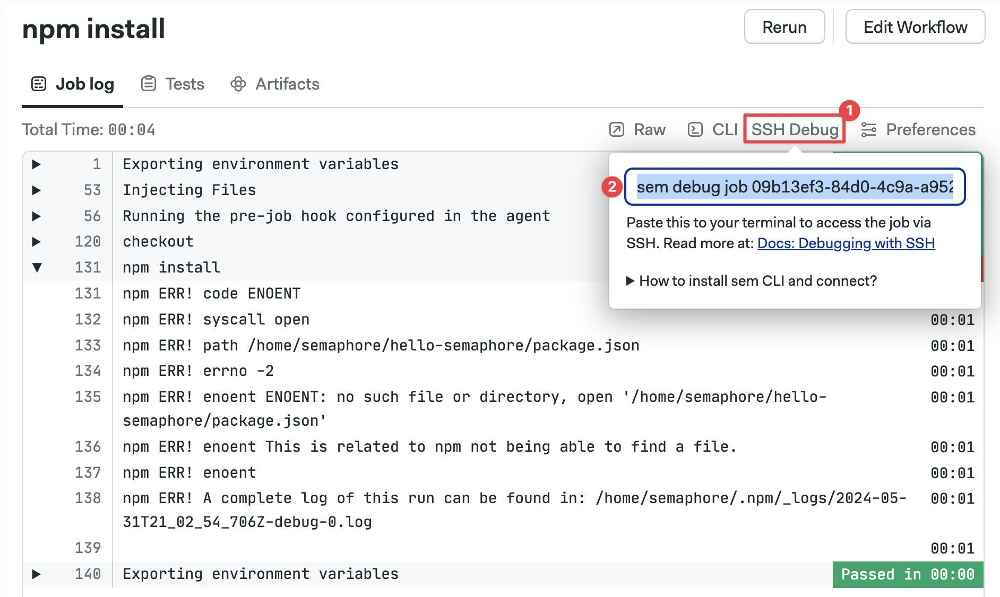

You'll be presented with a welcome message like this:

```shell
* Creating debug session for job 'd5972748-12d9-216f-a010-242683a04b27'
* Setting duration to 60 minutes
* Waiting for the debug session to boot up ...
* Waiting for ssh daemon to become ready.

Semaphore CI Debug Session.

 - Checkout your code with `checkout`
 - Run your CI commands with `source ~/commands.sh`
 - Leave the session with `exit`

Documentation: https://docs.semaphoreci.com/essentials/debugging-with-ssh-access/.

semaphore@semaphore-vm:~$
```

To run the actual job commands in the SSH session:

```shell
source ~/commands.sh
```

You can actually run anything in the agent, including commands that were not actually part of the job. Exit the session to end the job. 

By default, the duration of the SSH session is limited to one hour. To run longer debug sessions, pass the duration flag to the previous command as shown below:

```shell
sem debug job <job-id> --duration 3h
```

:::note

- Interactive sessions may be unavailable when [access policies for secrets](./secrets#secret-access-policy) is enabled.
- Setting Bash option `set -e` disables shell autocompletion and causes the SSH session to exit with error.

:::

### Inspecting running jobs {#attach-job}

You attach a terminal console to a running job. The steps are the same as [debugging a job](#ssh-into-agent). The only difference is that Semaphore presents the following command (only while the job is running):

```shell
sem attach <job-id>
```
You can explore running processes, inspect the environment variables, and take a peek at the log files to help identify problems with your jobs.

:::note

Inspecting running jobs may be unavailable when [access policies for secrets](./secrets#secret-access-policy) is enabled.

:::

### Port forwarding {#port-forwarding}

When SSH is not enough to troubleshoot an issue, you can use port forwarding to connect to services listening to ports in the agent.

A typical use case for this feature is troubleshooting end-to-end tests. Let's say a test is failing and you can't find any obvious cause from the logs alone. Port forwarding the HTTP port in the agent to your local machine can reveal how the application "looks".

To start a port-forwarding session:

```shell
sem port-forward <job-id> <local-port> <remote-port>
```

For example, to forward an application listening on port 3000 in the agent to your machine on port 6000:

```shell
sem port-forward <job-id> 6000 3000
```

You can now connect to `http://localhost:6000` to view the application running remotely in the agent.

:::note

Port-forwarding only works for Virtual Machine-based agents. It's not available in [Docker environments](./pipelines#docker-environments).

:::

## Block settings {#block-settings}

The settings you configure on the block are applied to all the contained jobs.

### Prologue {#prologue}

Commands in the *prologue* run before each job in the block. Use this to run common setup commands like downloading dependencies, setting the runtime version, or starting test services.

<Tabs groupId="editor-yaml">
<TabItem value="editor" label="Editor">

<Steps>

1. Select the block
2. Open the prologue section and add your shell commands. 

</Steps>

In the example below we use [checkout](#checkout) to clone the repository at the start of every job in the block.

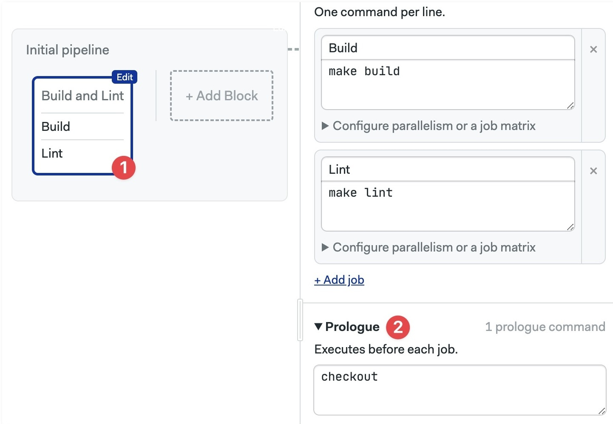

</TabItem>
<TabItem value="yaml" label="YAML">

<Steps>

1. Locate the block you wish to add the prologue to
2. Add the `prologue` under `tasks`
3. The `commands` are prepended to all jobs in the block. 

</Steps>

In the example below we use [checkout](#checkout) to clone the repository at the start of every job in the block.

```yaml title=".semaphore/semaphore.yml"
version: v1.0
name: Initial Pipeline
agent:
  machine:
    type: e1-standard-2
    os_image: ubuntu2004
blocks:
  - name: Build
    dependencies: []
    task:
      # highlight-start
      prologue:
        commands:
          - checkout
      # highlight-end
      jobs:
        - name: Build
          commands:
            - make build
        - name: Lint
          commands:
            - make lint
```

</TabItem>
</Tabs>

### Epilogue {#epilogue}

Commands in the *epilogue* are executed after each job in the job ends. There are three epilogue types:

- **Execute always**: always runs after the job ends, even if the job failed
- **If job has passed**: commands to run when the job passes (all commands exited with zero status)
- **If job has failed**: commands to run when the job failed (one command exited with non-zero status)

<Tabs groupId="editor-yaml">
<TabItem value="editor" label="Editor">

<Steps>

1. Select the block
2. Open the epilogue section (you may need to scroll down) and add your commands

</Steps>

In the example below we use [artifact](#artifact) to save build artifacts and log files.

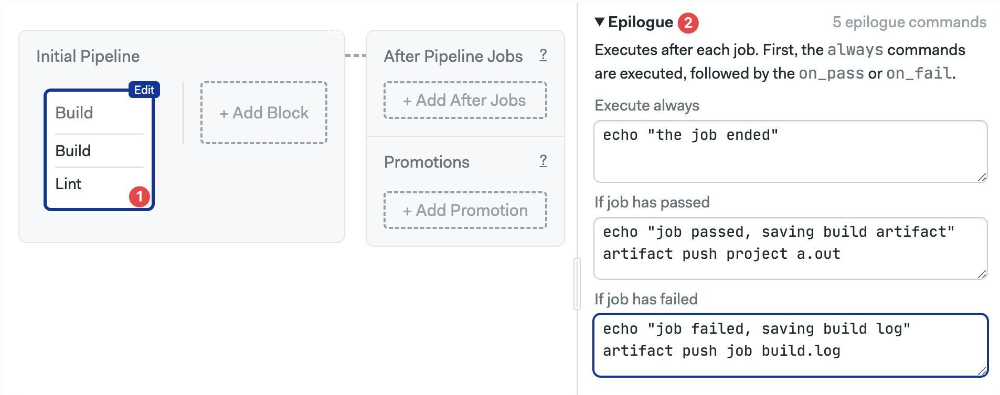

</TabItem>
<TabItem value="yaml" label="YAML">

<Steps>

1. Find the block where you wish to add the epilogue
2. Add the `epilogue` types you wish key under `tasks`

</Steps>

In the example below we use [artifact](#artifact) to save build artifacts or log files.

```yaml title=".semaphore/semaphore.yml"
version: v1.0
name: Initial Pipeline
agent:
  machine:
    type: e1-standard-2
    os_image: ubuntu2004
blocks:
  - name: Build
    dependencies: []
    task:
      # highlight-start
      epilogue:
        always:
          commands:
            - echo "the job ended"
        on_pass:
          commands:
            - 'echo "job passed, saving build artifact"'
            - artifact push project a.out
        on_fail:
          commands:
            - 'echo "job failed, saving build log"'
            - artifact push job build.log
      # highlight-end
      prologue:
        commands:
          - checkout
      jobs:
        - name: Build
          commands:
            - make build
        - name: Lint
          commands:
            - make lint
```

</TabItem>
</Tabs>


### Environment variables {#environment-variables}

<VideoTutorial title="How to use environment variables" src="https://www.youtube.com/embed/gB02RreOd7E?si=35xbE6tOoiUAYiwk" />

Environment variables are exported into the shell environment of every job in the block. You must supply the variable name and value.

<Tabs groupId="editor-yaml">
<TabItem value="editor" label="Editor">

To add an environment variable:


<Steps>

1. Select the block
2. Open the **Environment Variables** section (you may need to scroll down)
3. Set your variable name and value
4. Press **+Add env vars** if you need more variables

</Steps>

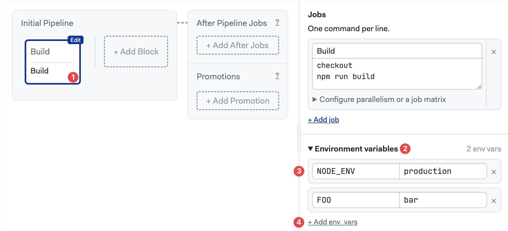

</TabItem>
<TabItem value="yaml" label="YAML">

<Steps>

1. Locate the block where you add the environment variables
2. Add `env_vars` key under `task`
3. Edit the variables `name` and `value`. You can have many variables under `env_vars`

</Steps>

```yaml title=".semaphore/semaphore.yml"
version: v1.0
name: Initial Pipeline
agent:
  machine:
    type: e1-standard-2
    os_image: ubuntu2004
blocks:
  - name: Build
    dependencies: []
    task:
      # highlight-start
      env_vars:
        - name: NODE_ENV
          value: production
        - name: FOO
          value: bar
      # highlight-end
      jobs:
        - name: Build
          commands:
            - checkout
            - npm run build
```

:::info

Numeric values need to be included in quotes.

:::

</TabItem>
</Tabs>

<details>
 <summary>Environment variables or shell exports?</summary>
 <div>

    You can define environment variables in two ways:

    - by putting them in the [environment variables](#environment-variables) section
    - by using `export` commands in the job window: `export NODE_ENV="production"`

 </div>
</details>

### Secrets {#secrets}

[Secrets](./secrets) are enabled at the block level and available to all the jobs in the block. You must create the secret *before* you can add it to a block.

To enable existing secrets in a block:

<Tabs groupId="editor-yaml">
<TabItem value="editor" label="Editor">

<Steps>

1. Select the block 
2. Open the **Secrets** section (you may need to scroll down)
3. Enable the checkbox next to the secret

</Steps>

The secret values are now available for all jobs in the block.

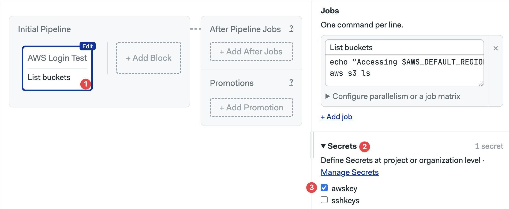

</TabItem>
<TabItem value="yaml" label="YAML">

<Steps>

1. Locate the block where you want to add the secrets
2. Add a `secrets` key under `tasks`
3. List the names of the secrets to import

</Steps>

The secret values are now available for all jobs in the block.

```yaml title=".semaphore/semaphore.yaml"
version: v1.0
name: Initial Pipeline
agent:
  machine:
    type: e1-standard-2
    os_image: ubuntu2004
blocks:
  - name: AWS Login Test
    dependencies: []
    task:
      # highlight-start
      secrets:
        - name: awskey
      # highlight-end
      jobs:
        - name: List buckets
          commands:
            - echo "Accessing $AWS_DEFAULT_REGION"
            - aws s3 ls
```

</TabItem>
</Tabs>

### Skip/run conditions {#skip-run}

You can choose to skip or run the block only under certain conditions. Skipping a block means that none of its job are executed.

Use cases for this feature include skipping a block on certain branches, or working with [monorepo projects](./monorepo).

<Tabs groupId="editor-yaml">
<TabItem value="editor" label="Editor">

<Steps>

1. Select the block
2. Open the **Skip/Run conditions** section (you may need to scroll down)
3. Select **Run this block when...** or **Skip this block when...**
4. Type the [conditions](../reference/conditions-dsl.md) to run or skip the block

</Steps>

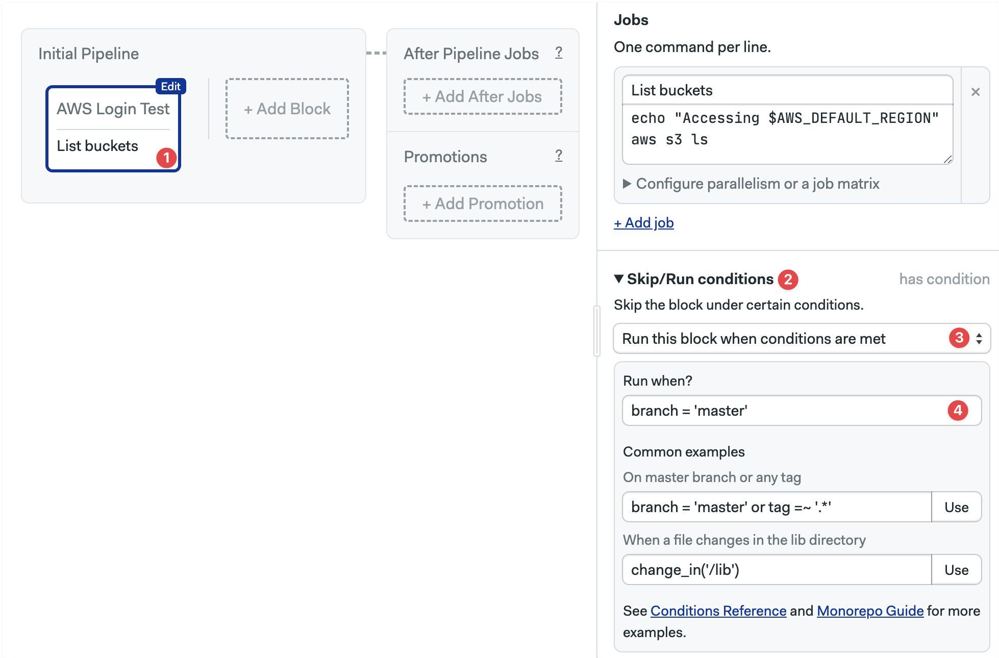

</TabItem>
<TabItem value="yaml" label="YAML (Run/When)">

<Steps>

1. Select the block where to edit the conditions
2. Under the block `name` add `run` and `when`
3. Type the [condition](../reference/conditions-dsl) that causes the block to run

</Steps>

```yaml title=".semaphore/semaphore.yml"
version: v1.0
name: Initial Pipeline
agent:
  machine:
    type: e1-standard-2
    os_image: ubuntu2004
blocks:
  - name: Build
    dependencies: []
    # highlight-start
    run:
      when: branch = 'master'
    # highlight-end
    task:
      jobs:
        - name: Build
          commands:
            - checkout
            - npm run build
```

</TabItem>
<TabItem value="yaml2" label="YAML (Skip/When)">

<Steps>

1. Select the block where to edit the conditions
2. Under the block `name`, add `skip` and `when` keys
3. Type the [condition](../reference/conditions-dsl) that causes the block to be skipped

</Steps>

```yaml title=".semaphore/semaphore.yml"
version: v1.0
name: Initial Pipeline
agent:
  machine:
    type: e1-standard-2
    os_image: ubuntu2004
blocks:
  - name: Build
    dependencies: []
    # highlight-start
    skip:
      when: branch = 'master'
    # highlight-end
    task:
      jobs:
        - name: Build
          commands:
            - checkout
            - npm run build
```

</TabItem>
</Tabs>


### Agent {#agent-override}

Here you can override the pipeline-level [agent](./pipelines#agents) for a specific job. You can select VMs running Linux, macOS, or Windows (self-hosted only) in both X86 and ARM architectures. This setting also allows you to run the job in [self-hosted agents](./self-hosted) or in [Docker environments](./pipelines#docker-environments).

<Tabs groupId="editor-yaml">
<TabItem value="editor" label="Editor">


<Steps>

1. Select the block
2. Open the **Agent** section (you may need to scroll down)
3. Select the **Environment Type**
4. Select the **OS Image**
5. Select the **Machine Type**

</Steps>


</TabItem>
<TabItem value="yaml" label="YAML">

<Steps>

1. Select the block where you want to override the agent.
2. Add an `agent` key under the `task`
3. Set the `machine` and `os_image`

</Steps>

```yaml title=".semaphore/semaphore.yaml"
version: v1.0
name: Initial Pipeline
agent:
  machine:
    type: e1-standard-2
    os_image: ubuntu2004
blocks:
  - name: Build
    dependencies: []
    # highlight-start
    task:
      agent:
        machine:
          type: a2-standard-4
          os_image: macos-xcode16
    # highlight-end
      jobs:
        - name: Build
          commands:
            - checkout
            - npm run build
```

</TabItem>
</Tabs>

## Job parallelism {#job-parallelism}

Job parallelism expands a job into multiple parallel jobs. You can use this feature to run a test suite faster by spreading the load among multiple agents.

To take full advantage of job parallelism you need to partition your test suite. Semaphore does not partition tests automatically, but it enables 3rd party test runners like [Knapsack](https://github.com/KnapsackPro/knapsack) or [Semaphore Test Booster](https://github.com/renderedtext/test-boosters) (Ruby) to even the load with a partition strategy that you can configure.

When coupled your own partitioning strategy, test parallelism allows you to speed up large tests suite by horizontally scaling the tests.

When job parallelism is enabled two new environment variables are available in the job environment:

- [`SEMAPHORE_JOB_COUNT`](../reference/env-vars#job-count): the total number of jobs running on the parallelism set
- [`SEMAPHORE_JOB_INDEX`](../reference/env-vars#job-index): a value between 1 and `$SEMAPHORE_JOB_COUNT` representing the current job instance of the parallelism set

<Tabs groupId="editor-yaml">
<TabItem value="editor" label="Editor">

To use job parallelism, follow these steps:

<Steps>

1. Open the workflow editor
2. Select or create a job
3. Open the section under the job **Configure parallelism or a job matrix**
4. Select **Multiple instances**
5. Drag the slider to select the number of jobs to run in the parallelism set
6. Type the commands, you can use the variable counter as environment variables
7. Press **Run the workflow**, then **Start**

</Steps>

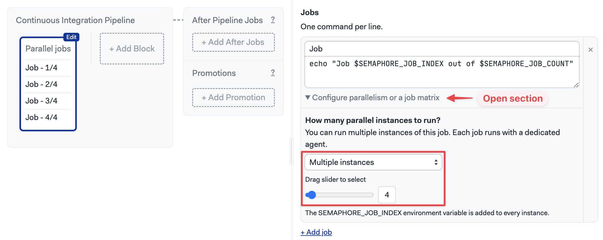

</TabItem>
<TabItem value="yaml" label="YAML">

To enable job parallelism, follow these steps:

<Steps>

1. Open the pipeline YAML
2. Locate or create the job
3. Type the commands
4. Add a `parallelism` key with the desired job parallelism value
5. Save the file and push it to the repository

</Steps>

The following example creates four jobs, each printing a different line in the log:

- "Job 1 out of 4"
- "Job 2 out of 4"
- "Job 3 out of 4"
- "Job 4 out of 4"

```yaml title="Enabling job parallelism"
version: v1.0
name: Continuous Integration Pipeline
agent:
  machine:
    type: e1-standard-2
    os_image: ubuntu2004
blocks:
  - name: Parallel jobs
    dependencies: []
    task:
      jobs:
        - name: Job
          commands:
            - echo "Job $SEMAPHORE_JOB_INDEX out of $SEMAPHORE_JOB_COUNT"
          # highlight-next-line
          parallelism: 4
```

</TabItem>
</Tabs>


:::note

It's not possible to use job parallelism at the same time as [job matrices](#matrix).

:::

## Job matrix {#matrix}

A job matrix is a more advanced form of [job parallelism](#job-parallelism) where you can define multiple variables with different values and run all the possible permutations.

For example, let's say we want to test our application using three Node.js versions using npm and yarn

- Node.js versions: v22.5.1, v21.7.3, and v20.15.1
- Package managers: npm, and yarn

We have a total of 6 possible test jobs when we take into account all permutations. Usually, we would need to manually create these jobs, but with job matrix we can specify the variables and values and let Semaphore expand one job into all the possible permutations.

<Tabs groupId="editor-yaml">
<TabItem value="editor" label="Editor">

To create a job matrix, follow these steps:

<Steps>

1. Open the workflow editor
2. Select or create the job
3. Open the section under the job **Configure parallelism or a job matrix**
4. Select **Multiple instances based on a matrix**
5. Type the variable names
6. Type the possible values of the variable separated by commands
7. Add more variables as needed
8. Type the commands. The variables are available as environment variables
9. Press **Run the workflow**, then **Start**

</Steps>

Semaphore automatically expands all possible permutations and adds the variables part of the job name


</TabItem>
<TabItem value="yaml" label="YAML">

To use a job matrix, follow these steps:

<Steps>

1. Open the pipeline YAML
2. Locate or create the job
3. Add a `matrix` key
4. Inside the matrix element add `env_var` and the name of the variable
5. Add `values` and a list of values for the variable
6. Type the job commands, you can use the variable names as environment variables
7. Save the file and push it to the repository

</Steps>

The following example runs a 2 x 3 matrix with variables `NODE_VER` and `PKG_MNGR`. Semaphore expands the job into 6 parametererized jobs:

```yaml
version: v1.0
name: Continuous Integration Pipeline
agent:
  machine:
    type: e1-standard-2
    os_image: ubuntu2004
blocks:
  - name: Job matrix
    dependencies: []
    task:
      jobs:
        - name: Job
          commands:
            - nvm install $NODE_VER
            - node -v
            - 'echo "Package manager: $PKG_MNGR"'
            - $PKG_MNGR --version
            - $PKG_MNGR test
          # highlight-start
          matrix:
            - env_var: PKG_MNGR
              values:
                - npm
                - yarn
            - env_var: NODE_VER
              values:
                - 22.5.1
                - 21.7.3
                - 20.15.1
          # highlight-end
```
</TabItem>
</Tabs>

:::info

Using job matrices causes Semaphore to run an [initialization job](./pipelines#init-job) before your jobs are executed.

:::

## Job priority {#priority}

Every job in Semaphore has an internal priority value from 0 to 100. Job prioritization determines which jobs will get a machine assigned first when all agents are in use.

The priority of a job matters when there are more jobs than available agents. Because paid plans do not enforce limits on the number of available agents, the job priority value is only useful in two situations:

- For projects on organizations on free and open source plans. These plans enforce concurrency limits
- For projects running on a limited number of [self-hosted agents](./self-hosted)

### Default priorities {#default-priority}

The priorities are assigned automatically according to the table below, but they [can be configured](#priority-assign) on a per-job or per-pipeline basis.

| Job type                                                 | Branch        | Default priority |
|----------------------------------------------------------|---------------|------------------|
| [Promotion pipeline](./pipelines#connecting-pipelines)   | master        | 65               |
| Promotion pipeline                                       | non-master    | 55               |
| Promotion pipeline                                       | tags          | 55               |
| Promotion pipeline                                       | pull requests | 55               |
| Initial pipeline                                         | master        | 60               |
| Initial pipeline                                         | non-master    | 50               |
| Initial pipeline                                         | tags          | 50               |
| Initial pipeline                                         | pull requests | 50               |
| [After pipeline](./pipelines#after-pipeline-job)         | any           | 45               |
| [Tasks](./tasks)                                         | any           | 40               |

### Assigning priorities {#priority-assign}

To assign a different priority to a specific job, follow these steps:

<Steps>

1. Open the pipeline YAML
2. Locate the jobs
3. Create a `priority` key
4. Define a `value` and a [condition](../reference/conditions-dsl)
5. Save the file and push it to the repository

</Steps>

The following example shows how to assign a higher priority to specific jobs when the branch is master:

```yaml title="Assigning priorities to specific jobs"
version: v1.0
name: Job priorities
agent:
  machine:
    type: e1-standard-2
    os_image: ubuntu2004

blocks:
  - name: Tests
    task:
      jobs:
      - name: Unit tests
        # highlight-start
        priority:
        - value: 70
          when: "branch = 'master'"
        - value: 45
          when: true
        # highlight-end
        commands:
          - make unit-test
      - name: Integration tests
        # highlight-start
        priority:
        - value: 58
          when: "branch = 'master'"
        - value: 42
          when: true
        # highlight-end
        commands:
          - make integration-test
```

To change the priority to all jobs in a pipeline, follow these steps:

<Steps>

1. Open the pipeline YAML
2. Locate the jobs
3. Add a `global_job_config` key at the root of the YAM
4. Create a `priority` key
5. Define a `value` and a [condition](../reference/conditions-dsl)
6. Save the file and push it to the repository

</Steps>

The following example does the same as the one above, but using a global config:

```yaml
version: "v1.0"
name: An example of using global_job_config
agent:
  machine:
    type: e1-standard-2
    os_image: ubuntu2004

# highlight-start
global_job_config:
  priority:
  - value: 70
    when: "branch = 'master'"
  - value: 45
    when: true
# highlight-end

blocks:
  - name: Tests
    task:
      jobs:
      - name: Unit tests
        commands:
          - make unit-test
      - name: Integration tests
        commands:
          - make integration-test
```

See the [pipeline YAML reference](../reference/pipeline-yaml) for more details.

## Job and block limits {#limits}

Semaphore enforces a few limits to prevent misconfigured jobs and runaway processes from consuming too many resources.

This section describes the limits that Semaphore applies to jobs and blocks. See [pipelines limits](./pipelines#limits) to see limits that for pipelines.

### Job duration {#job-duration}

Jobs have a *1 hour limit*. Jobs exceeding this limit are terminated.

You can change the limit up to a maximum value of *24 hours*.

To change the maximum duration for a single job:

<Steps>

1. Open the pipeline YAML
2. Locate the job
3. Add and `execution_time_limit` element
4. Add `hours` or `minutes`, set the new value
5. Save the file and push it to the repository

</Steps>

```shell title="Changing max duration for a single job"
version: v1.0
name: Pipeline using execution_time_limit
agent:
  machine:
    type: e1-standard-2
    os_image: ubuntu2004
blocks:
  - name: Job limited to 3 hours
    # highlight-start
    execution_time_limit:
      hours: 3
    # highlight-end
    commands:
      - checkout
      - npm install
      - npm test
```

:::note

See [pipeline global time limit](./pipelines#max-job-duration) to change the maximum duration for all jobs in a pipeline.

:::

### Max blocks per pipeline {#max-blocks}

A pipeline can have up to *100 blocks*. This limit is not configurable.

If you have a use case in which this limit is too constraining, please contact us at support@semaphoreci.com and we will try to work out a solution.

### Max jobs per block {#max-jobs}

A block can have up to *50 jobs*. This limit is not configurable.

If you have a use case in which this limit is too constraining, please contact us at support@semaphoreci.com and we will try to work out a solution.


### Max job log size {#max-log-size}

Job logs have a limit of 16 megabytes, which is roughly 100,000 lines. This limit is not configurable.

The following log message indicates that the job has exceeded the limit:

```text
Content of the log is bigger than 16MB. Log is trimmed.
```

You can workaround this limitation by setting the following [environment variable](#environment-variables), which makes Semaphore upload the log file as an [artifact](./artifacts) when the limit is exceeded.

```text
SEMAPHORE_AGENT_UPLOAD_JOB_LOGS=when-trimmed
```

## See also

- [Pipeline YAML reference](../reference/pipeline-yaml)
- [Semaphore toolbox reference](../reference/toolbox)
- [Plan job and block execution with pipelines](./pipelines)
