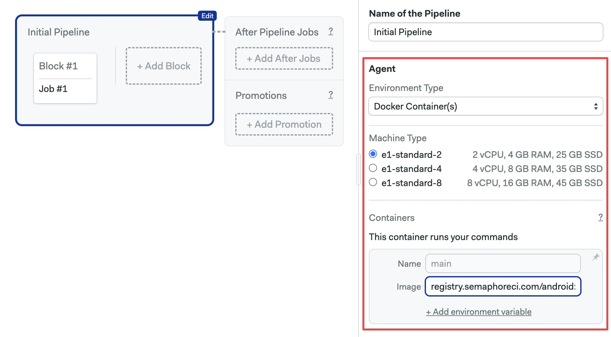

# Android

import Tabs from '@theme/Tabs';
import TabItem from '@theme/TabItem';
import Available from '@site/src/components/Available';
import VideoTutorial from '@site/src/components/VideoTutorial';
import Steps from '@site/src/components/Steps';

This guide will help build Android projects on Semaphore.

## Overview

Semaphore provides a set of Docker images tailored for Android developers. These pre-built images ship with the Android SDK and other common build tools for Android projects.

These images can be used both for Android and React Native projects. Semaphore also supports using Android emulators inside CI jobs.

## How to use Android containers {#containers}

Use [Docker Environments](../pipelines#docker-environments) to run jobs inside pre-built Android images.

<Tabs groupId="editor-yaml">
<TabItem value="editor" label="Editor">

To use an Android container in your pipeline, follow these steps:

<Steps>

1. Open the pipeline
2. Select "Docker Containers" in **Environment Type**
3. Choose a machine
4. Type the name of the **Image**. Use one of the available [Android SDK images](#sdks)

    

5. Configure your [jobs](../jobs)
6. Press **Run the workflow**

</Steps>

</TabItem>
<TabItem value="yaml" label="YAML">

To configure your Android container using YAML, follow these steps:

<Steps>

1. Open the pipeline file
2. Type the agent definition: select a machine `type` and `os_image`
3. Add a `containers` list

    ```yaml title="Android containers"
    version: v1.0
    name: Initial Pipeline
    agent:
      machine:
        type: e1-standard-2
        os_image: ubuntu2004
        # highlight-start
      containers:
        - name: main
          image: 'registry.semaphoreci.com/android:34'
        # highlight-end
    blocks:
      - name: 'Block #1'
        dependencies: []
        task:
          jobs:
            - name: 'Job #1'
              commands:
                - checkout
    ```

4. The first item `name: main` and in `image` select one of the available [Android SDK images](#sdks)
5. Save the file and push it to the repository

</Steps>

</TabItem>
</Tabs>

### Example for React Native {#react-native}

This section shows how to configure a pipeline to build and test a React Native project using Android containers.

<Tabs groupId="editor-yaml">
<TabItem value="editor" label="Editor">

<Steps>

1. Use an [Android container](#containers). You need one of the image variants that ship with Node.js, e.g. `android:34-node`
2. Create a Build/Install block with the following commands

    ```shell
    checkout
    cache restore
    npm install
    cache store
    ```

3. Create a second test block with the following prologue. This starts the Android emulator

    ```shell
    checkout
    sdkmanager "platform-tools" "platforms;android-34" "emulator"
    sdkmanager "system-images;android-34;default;armeabi-v7a"
    echo no | avdmanager create avd -n Nexus_S_API_34 -k "system-images;android-34;default;armeabi-v7a" --device "Nexus S"
    ```

4. Type the following commands in the test job

    ```shell
    cache restore
    npm test
    ```

    

5. Optionally, add more test jobs as needed
6. Press **Run the workflow**

</Steps>

</TabItem>
<TabItem value="yaml" label="YAML">

1. Open the pipeline file
2. Configure the [Android container](#containers)
3. Create a Build/Install block to install dependencies
4. Add a second block to run your tests
5. Save your file and push it to the repository

```yaml
version: v1.0
name: React Native example
agent:
  machine:
    type: e1-standard-2
    os_image: ubuntu2004
    # highlight-start
  # Use an image with Node.js for React Native  
  containers:
    - name: main
      image: 'registry.semaphoreci.com/android:29-node'
    # highlight-end
blocks:
  # Install block
  - name: Install
    task:
      jobs:
        - name: npm install
          commands:
            - checkout
            - cache restore
            - npm install
            - cache store
  # Test block
  - name: Test
    task:
    # highlight-start
      # Prologue starts emulator
      prologue:
        commands:
          - checkout
          - sdkmanager "platform-tools" "platforms;android-34" "emulator"
          - sdkmanager "system-images;android-34;default;armeabi-v7a"
          - echo no | avdmanager create avd -n Nexus_S_API_34 -k "system-images;android-34;default;armeabi-v7a" --device "Nexus S"
    # highlight-end
      # Test jobs
      jobs:
        - name: Run tests
          commands:
            - cache restore
            - npm test
```

</TabItem>
</Tabs>

## Building custom images {#custom-images}

You can find the pre-build Android images in the [Semaphore Container Registry](../containers/container-registry).

The image definition and Dockerfiles for these images can be found in the repository [semaphoreci/docker-images](https://github.com/semaphoreci/docker-images). Clone this repository to build your own image variants.

There are Docker images for each recent version of Android. There are also variants with Node.js preinstalled for React Native development:

- `android:<version>`: basic image with development utilities
- `android:<version>-node`: basic image extended with Node.js
- `android:<version>-flutter`: basic image extended with Flutter toolchain

## Android SDK images {#sdks}

These are the pre-built Android images available:

- `android:34`
- `android:34-node`
- `android:34-flutter`
- `android:33`
- `android:33-node`
- `android:33-flutter`
- `android:31`
- `android:31-node`
- `android:31-flutter`
- `android:30`
- `android:30-node`
- `android:30-flutter`
- `android:29`
- `android:29-node`
- `android:29-flutter`
- `android:28`
- `android:28-node`
- `android:28-flutter`
- `android:27`
- `android:27-node`
- `android:27-flutter`
- `android:26`
- `android:26-node`
- `android:26-flutter`
- `android:25`
- `android:25-node`
- `android:25-flutter`
- `android:24`
- `android:24-node`
- `android:23`
- `android:23-node`

## Pre-installed software {#software}

- ARM simulator (libqt5widgets5)
- Google Cloud SDK
- apt
- apt-transport-https
- build-essential
- bzip2
- ca-certificates
- curl
- docker
- docker-compose
- git
- gnupg
- gradle
- gzip
- jq
- lftp
- locales
- lsb-release
- maven
- mercurial
- net-tools
- netcat
- openssh-client
- parallel
- ruby 2.6.1
- software-properties-common
- sudo
- tar
- tree
- unzip
- vim
- wget
- xvfb
- zip
