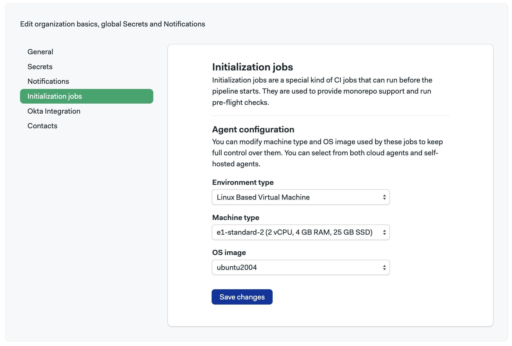
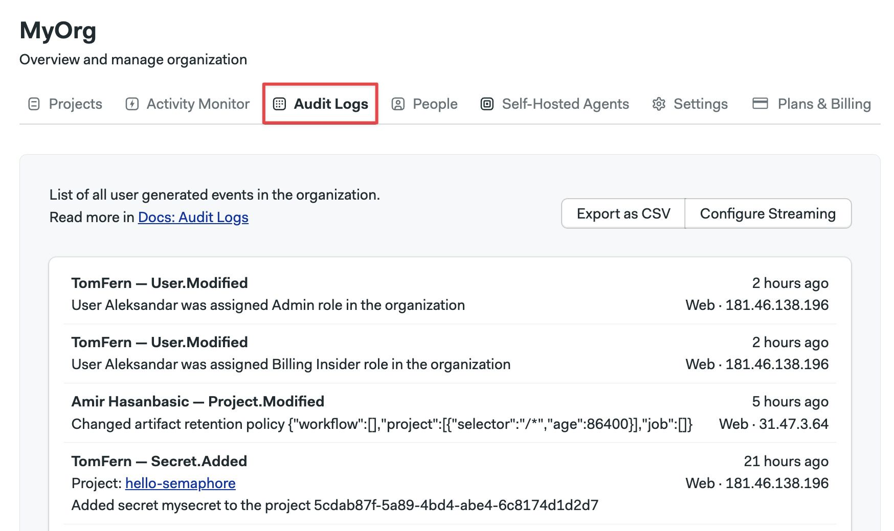
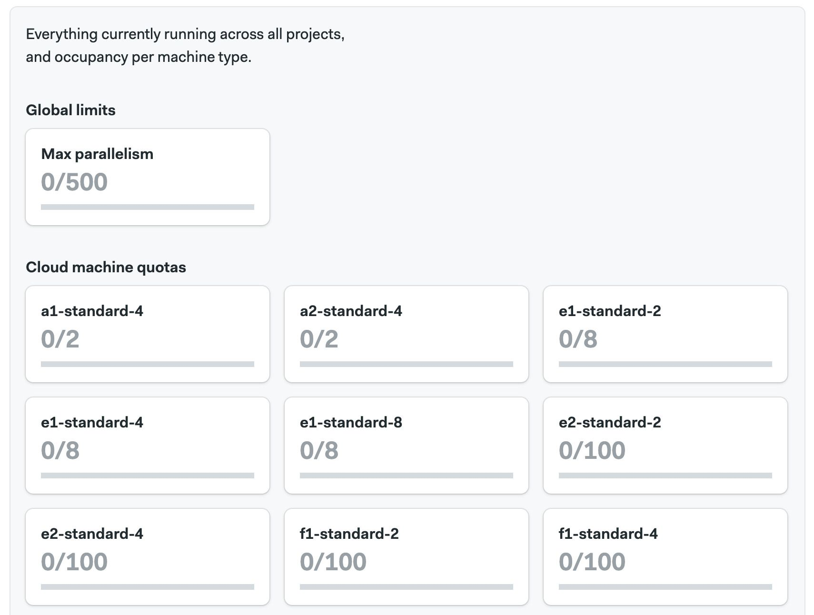

# Organizations

Organizations are the administrative unit for Semaphore. This page explains how to set up [notifications](./notifications), manage users, and what settings are available.

## Overview {#overview}

In order to access any non-public resources on Semaphore you must be invited to the organization your team or company has created. 

If you are trying out Semaphore for the first time, we suggest the [Quickstart](../getting-started/quickstart), where we show how to create your first organization.

Organizations have:

- zero or more [projects](./projects)
- a billing plan
- one or more owners
- users and groups with [role-based permissions](./rbac)
- a dedicated URL, for example, `https://my-org.semaphoreci.com` 

## How to change organizations {#org-selection}

Switch the active organization to change its settings or view its projects.

<Tabs groupId="ui-cli">
<TabItem value="ui" label="UI">

To view or create other organizations, open the organization menu in the top right corner and select **Change Organization**.


</TabItem>
<TabItem value="cli" label="CLI">

You must install and connect the [Semaphore command line](../reference/semaphore-cli) to access your organizations

<Steps>

1. Run `sem context` to show the organizations connected to the tool. The active organization has an asterisk (*) next to it
    ```shell title="View connected organizations"
    $ sem context
        myorg1_semaphoreci_com
        myorg2_semaphoreci_com
        # highlight-next-line
      * myorg3_semaphoreci_com
    ```
2. Change organization with `sem context <organization-url>`
    ```shell title="Change active organization"
    $ sem context myorg1_semaphoreci_com
    switched to context "myorg1_semaphoreci_com"
    ```

</Steps>

</TabItem>
</Tabs>


## Organization settings {#org-settings}

To access your organization settings, open the organization menu and click on **Settings**.


### General settings {#general-settings}

Your organization main settings.  Here, you can change its name, its URL, and control how [workflows](./workflows) run. 


:::info

The *URL of your organization* is the URL that leads to the Home page in your Semaphore organization. 

The default value is the name of your organization in lowercase and kebab-case, e.g. `<your-organization-url>.semaphoreci.com`. You can change the first part of the URL in the general settings page.

:::

### Notifications {#slack-notifications}

You can set up Slack and other webhook-based notifications to get your team notified whenever there [project](./projects) finishes running.

To learn more, see the [notification documentation](./notifications.md)

### Initialization agent {#init-agent}

Some types of pipelines require [initialization job](./pipelines#init-job) to evaluate and compile them before the workload begins.

Semaphore tries to pick the best type of agent automatically, but you can change it for the whole organization. This is particularly useful when you are using [self-hosted agents](./self-hosted).

To change the initialization job agent for all your [projects](./projects) in your organization, follow these steps:

<Steps>

1. Select **Initialization job** from the settings menu
2. Select the **Environment type**
3. Select the **Machine type**
4. Select the **OS image**
5. Press **Save**

  

</Steps>

To change the initialization agent for a single project, see [project pre-flight checks](./projects#preflight).

:::info

If you experience errors during initialization, see the [initialization job logs](./pipelines#init-logs) to help troubleshoot the issue.

:::

### Okta integration {#okta-integration}

<Available plans={['Enterprise']} />

Integration with Okta allows you to automate user management within your Semaphore organization, as well as to use Okta apps for Single Sign On.

For more information, see the [Okta integration page](./okta.md)

### Contacts {#contacts}

Manage your contact information.

In this section, you can add contact details in case the Semaphore Support Team needs to reach you. Add your name, phone number and email in three categories:

- **Finance**: used any billing-related messaging related to your organization
- **Main**: used as the primary point of communication
- **Security**: used to discuss any issues related to security in your organization

## Audit logs {#audit-log}

<VideoTutorial title="How to view audit logs" src="https://www.youtube.com/embed/o5yXSvjcz7s"/>

<Available plans={['Enterprise']} />

To support compliance, accountability, and security, Semaphore provides logs of audited events. Audit Log events are events that affect your organization, projects, users, or any other resources in Semaphore. Events contain information about when who and what was the performed activity.

You can find audit logs in your organization settings under Audit Logs.


The audit logs shows all the [audited events](../reference/audit-events) in reverse chronological order. Latest events are shown first.



### How to export audit logs {#audit-export}

<Available plans={['Enterprise']} />

Audit logs can be exported in two ways:

- CSV file
- Streaming to an S3-compatible bucket

To export the logs as CSV, press the **Export as CSV** button.


To configure streaming to an S3-compatible bucket, press the **Configure Streaming** button and:

<Steps>

1. Select between AWS and Google Cloud
2. Type the region (AWS only)
3. Type the bucket name
4. Type the access token

    - **AWS**: provide the Access Key ID and Access Key Secret for the IAM account
    - **Google Cloud**: provide the [HMAC Key](https://cloud.google.com/storage/docs/authentication/managing-hmackeys#command-line) for a service account

    The service account credentials provided must have write and read access to the bucket

5. Press **Looks Good**

  

</Steps>

:::info

Audit logs are streamed to the bucket once per day.

Large audit logs may cause errors when exporting to CSV. In this case, consider setting up an S3-compatible bucket instead of using CSV as the export medium.

:::

## Organization queues {#queue}

You can use assign pipelines to organization queues to control the order in which pipelines are executed. See [named queues](./pipelines#named-queues) for more information.

## Activity monitor {#activity-monitor}

The activity monitor show the [agent](./pipelines#agents) utilization and the currently running pipelines.

To view the activity monitor, open your organization menu and select **Activity Monitor**.


In the activity monitor, you can see the machine quota utilization for your organization. Here, you can have an overview on how Semaphore Cloud machines and [self-hosted agents](./self-hosted) are being used.



In the lower part of the activity monitor you can find the currently running workflows for all the [projects](./projects) in your organization. Use this to know what [jobs](./jobs) are running, and see which ones are waiting in the queue to debug usage issues.


## Transfer ownership {#manage-ownership}

Before you can transfer of an organization, the following conditions need to happen:

- The new owner is a member of the organization
- The new owner must have logged in Semaphore at least once
- Only the current owner can transfer ownership

To promote a new owner to the organization:

<Steps>

1. Go to the organization **People** tab
2. Press the **Change Role** button
3. Select **Owner**

</Steps>

It might take several minutes for the update to be completed.

:::note

Updating the ownership of an organization doesn't automatically transfer the project ownership. For more information, see [How to transfer project ownership](./projects#general).

:::

### How to remove an owner {#remove-owner}

If you need to demote or remove an owner from the organization, any user with the Owner permission level needs to send an email to support@semaphore.io from the primary email address associated with their GitHub or Bitbucket account used to log into Semaphore.

## How to delete an organization {#deleting-an-organization}

:::danger

Deleted organizations cannot be restored. There is no undo for this operation.

:::


Before you can delete an organization, you must [remove all it projects](./projects#general). Only the [Owner](./rbac#org-owner) of an organization can delete it.

In order to delete an organization, follow these steps:

1. Open the Organization Settings menu
2. Press on **Settings** 
3. Press on **Delete Organization...** at the bottom of the page
4. Type "delete" to confirm
5. Press the **Delete Organization** button


## See also

- [How to configure Okta integration](./okta)
- [How to configure notifications](./notifications)
- [How to configure projects](./projects)
