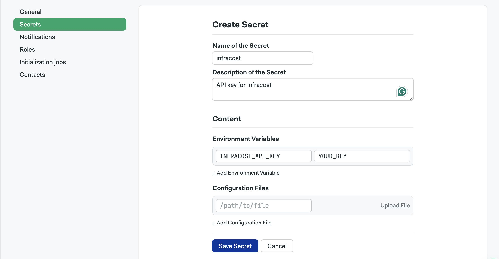
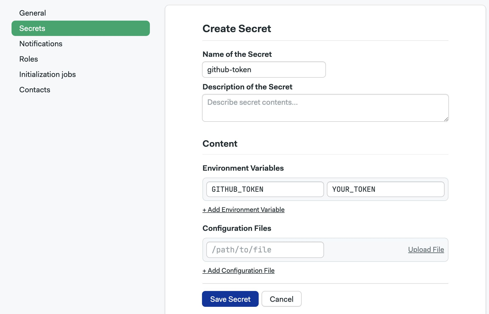

# Infracost

The Infracost CLI tool parses Terraform files and estimates costs for your infrastructure.

## Overview

This guide will show you how to:

- Run the Infracost CLI in Semaphore
- Comment Git commits with cost deltas
- Comment pull requests with cost deltas
- Fail the CI pipeline if costs exceed a custom-defined policy

## Prerequisites

For this guide, you will need the following:

- [A working Semaphore project](../projects) with a CI pipeline
- At least one [Terraform](https://developer.hashicorp.com/terraform) file in your project
- An [Infracost](https://www.infracost.io/) API key. You must sign up with a free account to obtain it
- A GitHub, Bitbucket, or GitLab API key with permission to write comments in the repository

## Adding a baseline to the repository

In order to estimate deviations from the expected cost, you must store a baseline file in your repository. The following command will generate `baseline.json` based on all the Terraform files found in your project folder:

```shell
infracost breakdown --path . --format json --out-file baseline.json
```

Now you can push `baseline.json` into your repository.

## Storing the API keys in secrets

Follow the [Infracost getting started guide](https://www.infracost.io/docs/) to install the CLI tool on your machine and obtain an API key. Create a [secret](../secrets) in Semaphore to store it:



Create a token for your Git provider:

- **GitHub**: [create a token](https://github.com/settings/tokens) with write permissions on your repository
- **BitBucket**: [create an app password](https://support.atlassian.com/bitbucket-cloud/docs/app-passwords/) with write permissions
- **GitLab**: [create an access token](https://docs.gitlab.com/user/profile/personal_access_tokens/) with `write_repository` permissions

Store the access token in Semaphore:



## Adding cost estimates to commits

When Infracost runs in your CI/CD workflow, it can post comments in commits and pull requests with the estimated cost difference from the baseline or between branches.

### Estimates on GitHub

Before you can calculate cost differences in commits or peer reviews, you need to establish a baseline. If you have any usage-based resources such as serverless functions, you need to first create an [usage file](https://www.infracost.io/docs/features/usage_based_resources/).

```shell
infracost breakdown --sync-usage-file --usage-file usage.yml --path .
```

Now, edit `usage.yml` to add your usage estimates for the moth.

Next, you're ready to create a baseline file. Skip `--usage-file` if you're not using any usage-based cloud resources:

```shell
infracost breakdown --path . --format json --usage-file usage.yml --out-file baseline.json
```

After checking in all the new files into the repository, edit the pipeline to run the cost analysis. Use the following commands in your CI job to post a comment on GitHub with the cost delta between the current commit and the baseline:

```shell
curl -fsSL https://raw.githubusercontent.com/infracost/infracost/master/scripts/install.sh | sh
checkout
infracost diff --path . --format json --compare-to baseline.json --out-file /tmp/infracost-diff-commit.json
infracost comment github --path=/tmp/infracost-diff-commit.json --repo=$SEMAPHORE_GIT_REPO_SLUG --commit=$SEMAPHORE_GIT_SHA --github-token=$GITHUB_TOKEN --behavior=update
```

### Commenting on BitBucket

Use the following command in a job to comment on BitBucket the difference in cost between the current commit and the baseline:

```shell
curl -fsSL https://raw.githubusercontent.com/infracost/infracost/master/scripts/install.sh | sh
checkout
infracost diff --path . --format json --compare-to baseline.json --out-file /tmp/infracost-diff-commit.json
infracost comment bitbucket --path=/tmp/infracost-diff-commit.json --repo=$SEMAPHORE_GIT_REPO_SLUG --commit=$SEMAPHORE_GIT_SHA --bitbucket-token=$BITBUCKET_TOKEN --behavior=update
```

### Commenting on GitLab

Use the following command in a job to comment on GitLab the difference in cost between the current commit and the baseline:

```shell
curl -fsSL https://raw.githubusercontent.com/infracost/infracost/master/scripts/install.sh | sh
checkout
infracost diff --path . --format json --compare-to baseline.json --out-file /tmp/infracost-diff-commit.json
infracost comment gitlab --path=/tmp/infracost-diff-commit.json --repo=$SEMAPHORE_GIT_REPO_SLUG --commit=$SEMAPHORE_GIT_SHA --gitlab-token=$GITLAB_TOKEN --behavior=update
```

## Adding cost estimate to pull requests

A separate job can also be created to post comment on pull requests. This allows the reviewer to quickly assess the cost changes between branches.

### Estimates on GitHub

The following example calculates the cost change between the master and the branch that triggered the workflow in GitHub:

```shell
curl -fsSL https://raw.githubusercontent.com/infracost/infracost/master/scripts/install.sh | sh
checkout
git checkout master
infracost breakdown --path . --format json --out-file /tmp/infracost-master.json
git checkout FETCH_HEAD
infracost diff --path . --format json --compare-to /tmp/infracost-master.json --out-file /tmp/infracost-diff-master.json
infracost comment github --path=/tmp/infracost-diff-master.json --repo=$SEMAPHORE_GIT_REPO_SLUG --pull-request=$SEMAPHORE_GIT_PR_NUMBER --github-token=$GITHUB_TOKEN --behavior=update
```

### Estimates on BitBucket

The following example calculates the cost change between the master and the branch that triggered the workflow in BitBucket:

```shell
curl -fsSL https://raw.githubusercontent.com/infracost/infracost/master/scripts/install.sh | sh
checkout
git checkout master
infracost breakdown --path . --format json --out-file /tmp/infracost-master.json
git checkout FETCH_HEAD
infracost diff --path . --format json --compare-to /tmp/infracost-master.json --out-file /tmp/infracost-diff-master.json
infracost comment bitbucket --path=/tmp/infracost-diff-master.json --repo=$SEMAPHORE_GIT_REPO_SLUG --pull-request=$SEMAPHORE_GIT_PR_NUMBER --bitbucket-token=$BITBUCKET_TOKEN --behavior=update
```

### Estimates on GitLab

The following example calculates the cost change between the master and the branch that triggered the workflow in GitLab:

```shell
curl -fsSL https://raw.githubusercontent.com/infracost/infracost/master/scripts/install.sh | sh
checkout
git checkout master
infracost breakdown --path . --format json --out-file /tmp/infracost-master.json
git checkout FETCH_HEAD
infracost diff --path . --format json --compare-to /tmp/infracost-master.json --out-file /tmp/infracost-diff-master.json
infracost comment gitlab --path=/tmp/infracost-diff-master.json --repo=$SEMAPHORE_GIT_REPO_SLUG --pull-request=$SEMAPHORE_GIT_PR_NUMBER --gitlab-token=$GITLAB_TOKEN --behavior=update
```

## Enforcing policies

Infracost can be used to enforce cost policies with continuous integration. When a policy is used, the Infracost CLI will return a non-zero exit status, stopping the pipeline and preventing a deployment that would run over the budget.

First, we must create a policy file and push it into the repository. To learn about the policy syntax, read the [cost policies docs](https://www.infracost.io/docs/features/cost_policies/) on Infracost.

The following example sets a maximum budget of USD 1000 per month:

```rego
# policy.rego

package infracost

deny[out] {

    # define a variable
  maxMonthlyCost = 1000.0

  msg := sprintf(
    "Total monthly cost must be less than $%.2f (actual cost is $%.2f)",
    [maxMonthlyCost, to_number(input.totalMonthlyCost)],
  )

    out := {
      "msg": msg,
      "failed": to_number(input.totalMonthlyCost) >= maxMonthlyCost
    }
}
```

To evaluate the policy file, you must add the `--policy-path POLICY_FILENAME` option to any of the comment commands. For example:

```shell
# calculate difference between commit and baseline
infracost diff --path . --format json --compare-to baseline.json --out-file /tmp/infracost-diff-commit.json

# enforce policy
infracost comment github --path=/tmp/infracost-diff-commit.json --repo=$SEMAPHORE_GIT_REPO_SLUG --commit=$SEMAPHORE_GIT_SHA --github-token=$GITHUB_API_KEY --behavior=update
```

## Tips for using Infracost

- You can use [monorepo conditions](../monorepo) like `change_in('/**/*.tf')` or `change_in('/**/*.tfvars')` to run Infracost only when Terraform files change
- You can create a [config file](https://www.infracost.io/docs/features/config_file/) manage [monorepo workflows](../monorepo) provide utilization forecast for per-usage services such as AWS lambda
- You can add a [badge](https://www.infracost.io/docs/infracost_cloud/readme_badge/) to your repository with the estimated monthly cost
