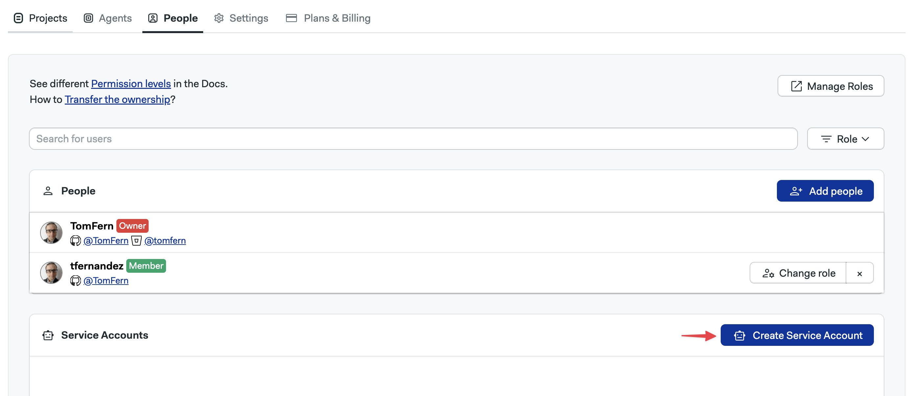
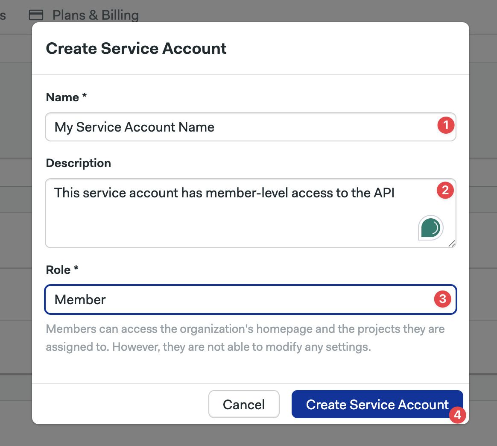
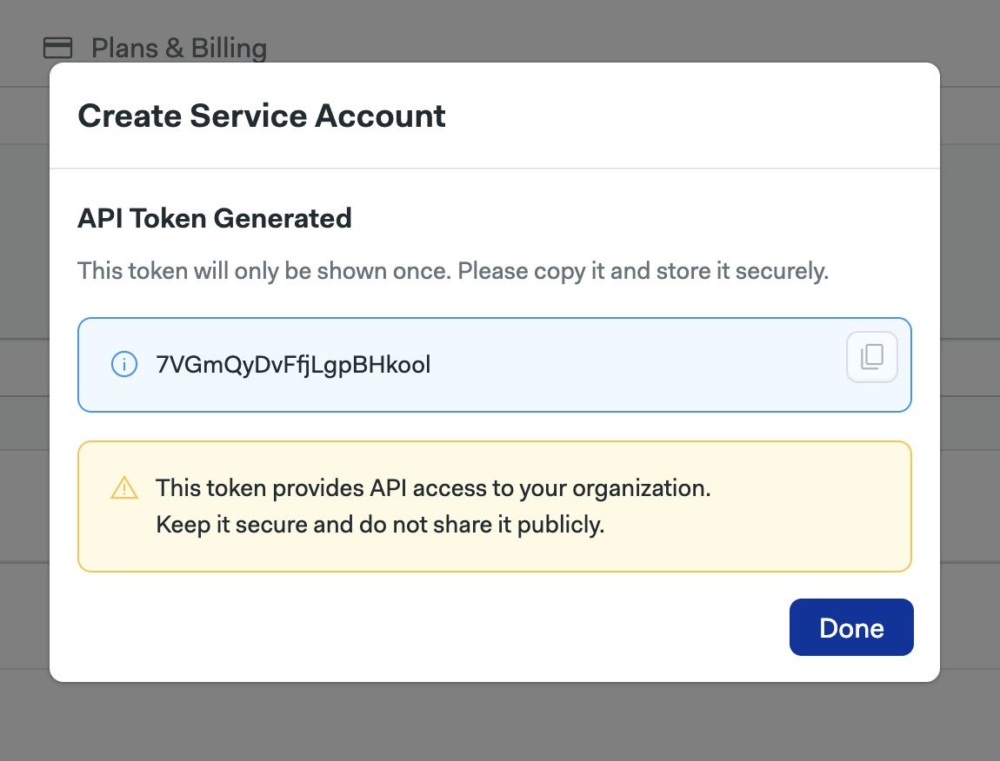
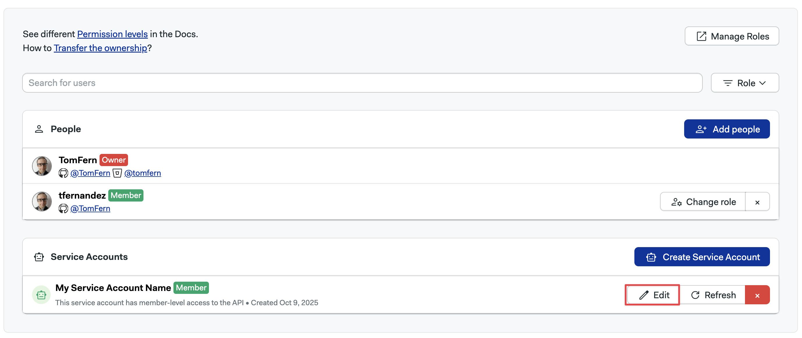
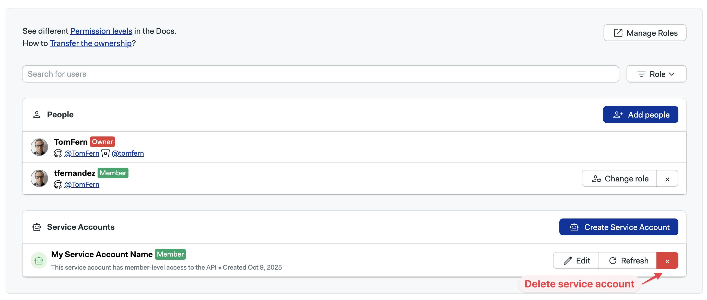

# Service Accounts

A service account allows you to programmatically access the API.

## Overview

Service accounts are special users that can only be used to consume the [Semaphore API](../reference/api). Service accounts cannot be used to log in to the Semaphore UI.

Service accounts share the same [role-based authentication control model](./rbac) used for regular Semaphore users.

## How to create a service account {#create}

To create a service account, follow these steps:

<Steps>

1. Open the [Organization Menu](./user-management#people) on the top-right corner
2. Select **People**
3. Press **Create Service Account**

    

4. Define the service account name (1), an optional description (2), and assign a role (3). Press **Create Service Account** (4) when ready

    

5. Take note of the API token, *as it can only be viewed once*. Press **Done** when ready

    

</Steps>

## How to use a service account {#use}

Service accounts' tokens are used in the same way as regular user tokens. The service account token must be supplied in every call to the [Semaphore API](../reference/api).

For example, to [retrieve logs](../reference/api#get-job-logs) for a job, you can use the service account token in the following way:

```shell

API_TOKEN=<YOUR_SERVICE_ACCOUNT_TOKEN_HERE>
curl -H "Authorization: Token ${API_TOKEN}" "https://<your-org-name>.semaphoreci.com/api/v1alpha/logs/11493d45-6088-44ef-acef-ab12bf778505"
```

## How to edit service account {#edit}

To edit a service account's details, follow these steps:

<Steps>

1. Open the [Organization Menu](./user-management#people) on the top-right corner
2. Select **People**
3. Press the **Edit** button next to the service account you want to edit

    

4. You can change the service account name, description, and role

5. Press **Save changes** when done

</Steps>

## How to reset a service account token {#reset}

Once viewed, the token of a service account cannot be retrieved again. If you lost the token connected to a service account, your only option is to regenerate a new token.

:::warning

Resetting the token will revoke access to any applications that are currently using the service account.

:::

To reset a service account token, follow these steps.

<Steps>

1. Open the [Organization Menu](./user-management#people) on the top-right corner
2. Select **People**
3. Press the **Refresh** button next to the service account you want to reset

    

4. Press **Regenerate Token**

5. Copy the new token and save it in a safe place

</Steps>

## How to delete a service account {#delete}

:::warning

Deleting a service account will revoke access to any applications that are currently using it.

:::

To delete a service account, follow these steps.

<Steps>

1. Open the [Organization Menu](./user-management#people) on the top-right corner
2. Select **People**
3. Press the red **X** (cross) button next to the service account you want to delete

    

4. Press **Delete Service Account**

</Steps>

## See also

- [Semaphore API reference](../reference/api)
- [Role-Based Access Controls](./rbac)
- [How to manage Semaphore users](./user-management#people)
