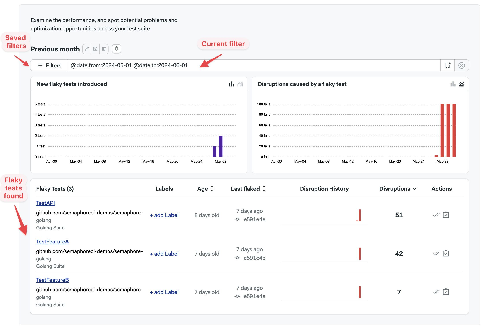
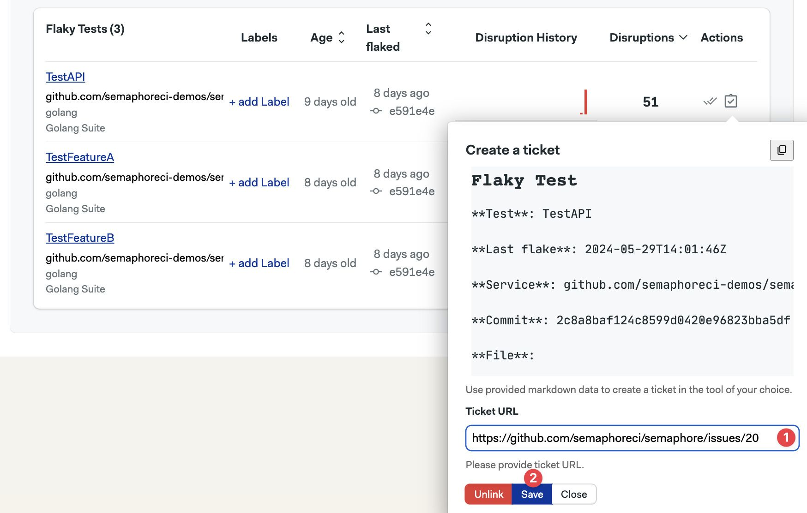
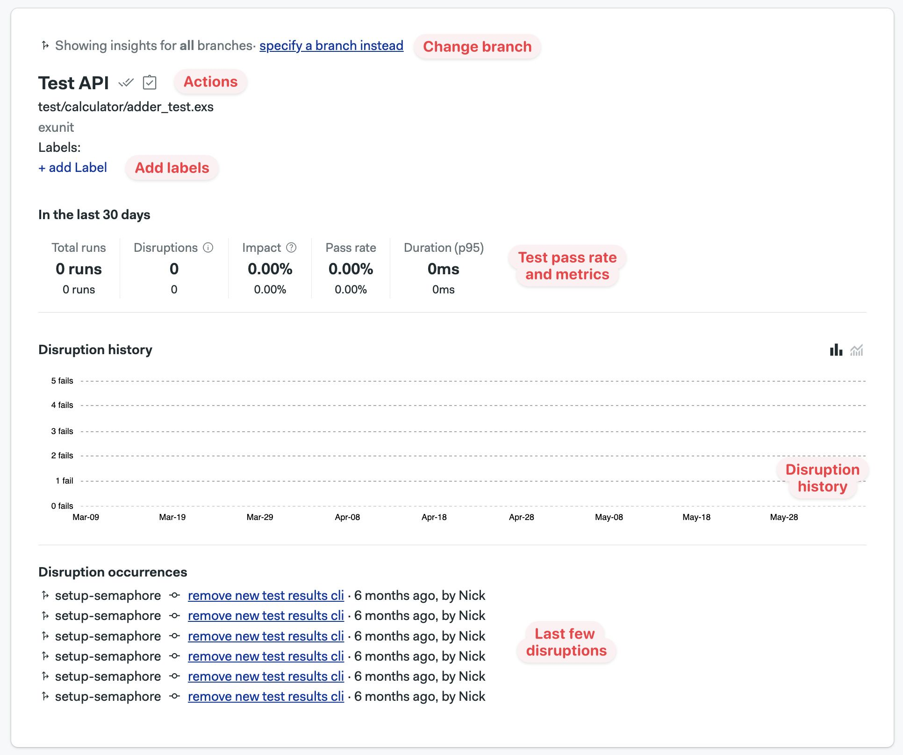

# Flaky Tests


<VideoTutorial title="How to use flaky test detector" src="https://www.youtube.com/embed/sNdxdugrETw?si=ZNAEBLob-CZOEEqi" />

The flaky test dashboard shows unreliable tests in your [projects](../projects). This page explains how they work and how to interpret the flaky test dashboard.

## Overview {#overview}

The flaky test tab helps you find flaky tests in your suite. Flaky tests are tests that fail seemingly random without any obvious cause. Identify flaky tests to improve the reliability of your pipeline.

<details>
<summary>What is the definition of flaky tests?</summary>
<div>

A test is considered flaky when one of these conditions happen:

- The test produces different results for the same Git commit
- A passing test that begins to behave unreliably once merged into a branch

</div>
</details>



## How to set up flaky detection {#setup}

Flaky test detection is automatically enabled once [test reports](./test-reports) are configured. No additional steps are needed to set up flaky tests.

:::note 

It may take a few pipeline runs before flaky tests begin to appear in the flaky test tab

:::

## How to view flaky tests {#view}

Open your [project](../projects) on Semaphore and go to the **Flaky tests** tab.


The dashboard shows:

- A. Create notification button (bell icon)
- B. Edit filters buttons
- C. Saved filters
- D. The current filter
- E. New flaky tests found in the filtered view
- F. Flaky test disruptions by date in the filtered view
- G. The list of flaky tests


## Charts {#charts}

The **New Flaky Tests** show new flaky tests detected in the [selected period](#filters).

The **Disruptions Caused by a Flaky Test** shows how many times a flaky test failed disrupting your test suite in the selected period.


You can switch between daily occurrences and cumulative views on both charts.

## Filtering the view {#filters}

You can define, edit, and save filters to view the flaky test data in different ways.

### How to create a filter {#create-filters}

To create a filter, type the [filter key](#filter-keys) in the filter box and press Enter/Return. The view will reload with the new data.

Once you have filter key you like, you can save it by:

<Steps>

1. Pressing the Create new filter button
2. Typing your filter name
3. Pressing **Save**

  

</Steps>


### Filter keys {#filter-keys}

You can combine multiple filter keys to create a filter that suits your needs. The available filter keys are:

| Filter key        | Filter Name         | Filter Type         |
| :--------------:  | :-----------------: | :-----------------: | 
| @git.branch       | Git branch          | [text](#text)                |
| @git.commit_sha   | Git commit sha      | [text](#text)                |
| @test.name        | Test name           | [text](#text)                |
| @test.group       | Group that the test is assigned to | [text](#text) |
| @test.file        | Test file           | [text](#text)                |
| @test.class.name  | Name of the test class | [text](#text)             |
| @test.suite       | Name of the test suite | [text](#text)             |
| @test.runner      | Name of the test runner | [text](#text)            |
| @metric.age       | Time passed (days) since first flake | [numeric](#numeric) |
| @metric.pass_rate | Pass rate of a test | [numeric](#numeric)             |
| @metric.disruptions | Number of disruptions of a test | [numeric](#numeric) |
| @label            | Assigned label of the test | [text](#text)           |
| @is.resolved      | Filter by resolved or unresolved tests | [boolean](#boolean) |
| @is.scheduled     | Filter by scheduled or unscheduled tests | [boolean](#boolean) |
| @date.from        | Starting date range   | [text](#text)             | 
| @date.to          | End of filtering range | [text](#text)        | 

### Text filter keys {#text}

Text filters allow you to specify values using alphanumeric characters. Wildcards (`*` or `%`) can be used to match patterns.

Examples include:

- Test name: `@test.name:"TestAPI"`
- Git branch: `@git.branch:main`
- Test runner: `@test.runner:"golang"`
- [labels](#labels): `@label:"new"`

The `@date.from` and `@date.to` are special cases of text keys. This keys accept:

- Values in ISO date format: `YYYY-MM-DD`
- Values from now: `now-30d` or `now-10d`

### Numeric filter keys {#numeric}

Numeric keys allow you to filter based on numerical values. 

Numeric keys accept:

- Greater than (`>`)
- Less than (`<`)
- Equal to (`=`)
- Not equal to (`!=`)
- Greater than or equal to (`>=`)
- Less than or equal to (`<=`)

Examples include:

- Test age: `@metric.age:<10` shows tests less than 10 days old
- Disruptions: `@metric.disruptions:>30` show tests with more than 30 disruptions
- Pass rate: `@metric.pass_rate:>20` shows tests with greater than 20% pass rate

### Boolean filter keys {#boolean}

Boolean keys accept `true` or `false`. 

Examples of binary filter keys are:

- Tests not [marked as resolved](#actions): `@is.resolved:false`
- Test without [associated tickets](#actions): `@is.scheduled:false`

## Taking actions on tests {#actions}

The lower part of the flaky test dashboard shows the tests detected. 


You can take the following actions on these:

- Add labels to a flaky test
- Mark test as [resolved](#resolved)
- Link test with a [ticket](#ticket)

### Adding labels {#labels}

To add labels to a flaky test:

<Steps>

1. Press the **+Add label** button
2. Type the label
3. Press **OK**

</Steps>

To add more labels, repeat the same steps. You can have up to three labels per test.


You can now use the `@label` [key](#filters) to filter tickets by label. In addition, clicking on the label shows a filtered view with all the tests linked to the same label.

### Marking tests as resolved {#resolved}

Test marked as resolved test won't be shown by default. Can be filtered in back again with the `@is.resolved: true` [filter key](#boolean). You can also unmark the test to show it again in the default view

### Link test to a ticket {#ticket}

Pressing the **Open ticket** action button lets you link the test to an issue. Linked tickets can be filtered with the `@is.scheduled:true` [filter key](#boolean).

To use this feature, create a ticket in your tool of choice, e.g. GitHub and:

<Steps>

1. Copy and paste the ticket URL
2. Press **Save**

</Steps>

The ticket window shows details on Markdown you can use to create your ticket.



You can also unlink a test from the issue from this window.

## Detailed view {#details}

Clicking on a flaky test opens the detailed view for that test.

You can take the same [actions](#actions) in this windows. You can add labels, mark as resolved, and link to a ticket.

You also ll find aggregated data detailing the impact of the selected flaky test, such as the P95 runtime, total number of runs, and the pass rate of the test. In addition, you can see the last flaky disruptions in the for the test.



## Notifications {#notifications}

You can send webhook-based notifications when new flaky test is detected.

Notifications can be enabled from the main Flaky Test dashboard:

<Steps>

1. Press the bell icon
2. Enter the webhook url, only HTTPs is allowed
3. Optionally, type the branch names for which you want to receive notifications. Leave blank to enable all branches
4. Press **Activate**
5. Press **Save**

  

</Steps>

:::note

You can use basic regular expressions in the branches field. For example, you can use patterns like `release-*` or `.*.`. If you wish to specify multiple branches, you can separate them using a comma.

The branches field has a limit of 100 characters.

:::

### Notification payload

When notifications are enabled, Semaphore sends an HTTPs POST request with `Content-Type: application/json` and the schema shown below. The endpoint show return a 2XX response status code. 

If the endpoint doesn't respond with a 2XX code, Semaphore attempts to resend the request four additional times using an exponential backoff strategy.

The notification sends a JSON payloads like the example shown below:

```json
{
  "id": "a01e9b47-7e3c-4165-9007-8a3c1652b31a",
  "project_id": "4627d711-4aa2-xe1e-bc5c-e0f4491b8735",
  "test_id": "3177e680-46ac-4c39-b9fa-02c4ba71b644",
  "branch_name": "main",
  "test_name": "Test 1",
  "test_group": "Elixir.Calculator.Test",
  "test_file": "calculator_test.exs",
  "test_suite": "suite1",
  "created_at": "2025-03-22T18:24:34.479219+01:00",
  "updated_at": "2025-03-22T18:24:34.479219+01:00"
}
```

<details>
<summary>Notification schema</summary>
<div>

The complete schema for the notification is shown below:

```yaml
type: object
properties:
  id:
    type: string
    format: uuid
    example: "a01e9b47-7e3c-4165-9007-8a3c1652b31a"
  project_id:
    type: string
    format: uuid
    example: "4627d711-4aa2-xe1e-bc5c-e0f4491b8735"
  test_id:
    type: string
    format: uuid
    example: "3177e680-46ac-4c39-b9fa-02c4ba71b644"
  branch_name:
    type: string
    example: "main"
  test_name:
    type: string
    example: "Test 1"
  test_group:
    type: string
    example: "Elixir.Calculator.Test"
  test_file:
    type: string
    example: "calculator_test.exs"
  test_suite:
    type: string
    example: "suite1"
  created_at:
    type: string
    format: date-time
    example: "2025-03-22T18:24:34.479219+01:00"
  updated_at:
    type: string
    format: date-time
    example: "2025-03-22T18:24:34.479219+01:00"
required:
  - id
  - project_id
  - test_id
  - branch_name
  - test_name
  - test_group
  - test_file
  - test_suite
  - created_at
  - updated_at
```

</div>
</details>

## See also

- [How to configure test reports](./test-reports)
- [How to set up Slack notifications](../organizations#slack-notifications)
