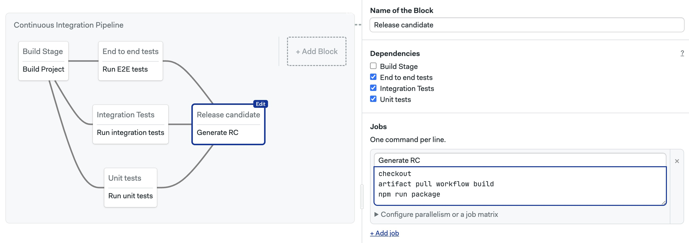

# Workflows

A *workflow* is a series of steps to build, test, release, or deploy your application. This page explains workflows, how they are triggered, and their settings.

:::tip

If this is your first time using Semaphore, check out [Quickstart](../getting-started/quickstart).

:::

## Overview

In the context of Continuous Integration and Delivery (CI/CD) a workflow implements automation to manage the development cycle from code to deployment.

Workflows in Semaphore consist of one or more [pipelines](./pipelines). A pipeline defines the sequence of tasks to achieve goals like build, release, or deploy to production.


Before you can run a workflow in Semaphore you need:

- A Semaphore account
- A repository on GitHub or BitBucket
- A Semaphore project linked to the repository
- One or more pipelines

The [project page](./projects#view-projects) shows all the recent workflows for the project.


## Visual workflow editor {#workflow-editor}

<VideoTutorial title="How to use the workflow builder" src="https://www.youtube.com/embed/dg2jDQmYJ_4" />

You can define most aspects of your workflows using the visual editor.

To access the editor, open one of your projects on and press **Edit Workflow**. All your changes are stored as YAML pipeline definitions on your Git repository. You can make changes using the visual editor, or edit the YAML directly by clicking on the pipeline YAML file.


See the [jobs page](./jobs) to learn how to define jobs and blocks.

## Workflow History Retention {#workflow-retention}

Semaphore retains workflow history and artifacts for up to **400 days**. Any workflows and [artifacts](./artifacts) older than this limit are automatically deleted and won't be available in the UI or via the [public API](../reference/api).

## Modeling Complex Workflows {#modeling-complex-workflows}

This section provides guides to model complex, non-linear CI/CD processes.

### Fan-out Fan-In {#fan-out-fan-in}

<VideoTutorial title="Fan Out - Fan In" src="https://www.youtube.com/embed/HKv-jMkC7T0" />

The Fan-Out Fan-In workflow provides consistency and maximum parallelization. It can be split into 3 stages:

1. **Build stage**: you build your project once
2. **Fan-Out stage**: all your tests fan out from the build stage and run in parallel
3. **Fan-In stage**: once tested, the workflow fans in to a release or deploy stage


<Tabs groupId="editor-yaml">
<TabItem value="editor" label="Editor" default>

<Steps>

1. Create your build [job](./jobs). Depending on the nature of your project, you can save the built artifact to the [artifact store](./artifacts) or push it to a [Docker registry](./containers/docker)

      

2. Add your test jobs. Set dependencies so all your tests depend on the build job created on Step 1

      

3. Add the release/deploy job. Use dependencies so the new job depends on all your tests. This will make the release/job run only if all tests have passed

      

</Steps>

</TabItem>
<TabItem value="yaml" label="YAML">

You can create a Fan-Out Fan-In workflow by setting the dependencies in your blocks. The Fan-Out stage is achieved by defining `dependencies`. For example:

```yaml
blocks:
  - name: "Build"
    dependencies: []
    ...

  - name: "Unit tests"
    dependencies: ["Build"]
    ...

  - name: "Integration tests"
    dependencies: ["Build"]
    ...

  - name: "E2E tests"
    dependencies: ["Build"]
    ...

  - name: "Release candidate"
    dependencies: ["Integration tests", "Unit tests", "E2E tests"]
    ...
```

Find below a complex example of a Fan-Out, Fan-In for a Node-based workflow:

```yaml
version: v1.0
name: Continuous Integration Pipeline
agent:
  machine:
    type: f1-standard-2
    os_image: ubuntu2204
blocks:
  - name: Build Stage
    dependencies: []
    task:
      jobs:
        - name: Build Project
          commands:
            - 'checkout'
            - 'npm run build'
            - 'artifact push workflow build/'
  - name: End to end tests
    dependencies:
      - Build Stage
    task:
      jobs:
        - name: Run E2E tests
          commands:
            - 'checkout'
            - 'artifact pull workflow build/'
            - 'npm run test:e2e'
  - name: Integration Tests
    dependencies:
      - Build Stage
    task:
      jobs:
        - name: Run integration tests
          commands:
            - 'checkout'
            - 'artifact pull workflow build/'
            - 'npm run test:integration'
  - name: Unit tests
    dependencies:
      - Build Stage
    task:
      jobs:
        - name: Run unit tests
          commands:
            - 'checkout'
            - 'artifact pull workflow build/'
            - 'npm run test:unit'
  - name: Release candidate
    dependencies:
      - End to end tests
      - Integration Tests
      - Unit tests
    task:
      jobs:
        - name: Generate RC
          commands:
            - 'checkout'
            - 'artifact pull workflow build/'
            - 'npm run package'
```

</TabItem>
</Tabs>

## Workflow triggers

The following events or actions trigger workflows by default:

- Pushing commits into any branch
- Pushing Git tags
- Changing any pipelines
- Manually re-running workflows
- Running pipelines using [Tasks](./tasks)

Additionally, you can configure workflows to be triggered by:

- Pull requests (not available on BitBucket projects)
- Pull request on forked repositories

The reason for the trigger can be determined at runtime by examining the Semaphore environment variables in the job. See the [environment variable reference page](../reference/env-vars#semaphore) for more details.

### How pull requests are handled {#pr}

Semaphore starts a workflow for every push to a pull request originating from a forked repository. For security reasons, secrets are disabled in jobs triggered in this way. You can [create an allow list](#project-triggers) with the secrets you want to expose in the project settings.

:::note

Instead of pushing the HEAD commit to the pull request, Semaphore uses the MERGE commit between the source and the upstream branch. You can find the SHA of the HEAD commit of the Pull Request in the [`SEMAPHORE_GIT_PR_SHA`](../reference/env-vars#pr-sha) environment variable.

:::

### How to customize triggers {#project-triggers}

Triggers are configured in the [project settings](./projects#general). To change what actions can trigger a workflow, follow these steps:

<Steps>

1. Open your project on Semaphore
2. Go to the **Settings** tab

    

3. In the **General** section scroll down to **What to build**
4. Change the settings and press **Save**

</Steps>

Selecting **Do not run on any events** disables all triggers, effectively pausing the project. You can, however, still run workflows manually or with [tasks](./tasks).


Selecting **Run on** allows you to configure what triggers are enabled for the project.

- The **Branches** option allows you to run workflows on all branches or configure an allow list with branch names. Regular expressions are supported

- The **Tags** options work the same but for Git tags


:::note

**Whitelisted only** only affects branches and tags created *after* enabling this setting. Branches and tags that existed before the setting is enabled are not affected and are always built.

:::

- Enabling **Pull requests** option allows Semaphore to run workflows on pull requests originating in the same repository
- The **Forked pull request** works the same for pull requests originating from forked pull requests. [To prevent security leaks](#pr), you can configure a list of allowed secrets and GitHub/BitBucket/GitLab usernames that can trigger workflows in this way
  


### Approving PRs with `/sem-approve` {#sem-approve}

Blocked pull requests can be manually approved by adding a comment containing `/sem-approve` string in the PR conversation. Anyone who can run a forked pull request can also approve one.

Approving forked pull requests is limited to new comments only and does not work with comment edits. Due to security concerns, `/sem-approve` will work only once. Subsequent pushes to the forked pull request must be approved again.

## How to skip commits {#skip}

If you don't want to start a workflow, type one of the following strings in the commit message.

- `[ci skip]`
- `[skip ci]`

For example, this push does not trigger a Semaphore pipeline execution, it is completely ignored:

```shell title="Skipping a commit"
git add -A
git commit -m "[skip ci] Initial commit"
git push origin main
```

:::note notes

- Skip doesn't work when [pushing tags](./promotions#tagged)
- Be careful when squashing commits as they can contain skip messages

:::
