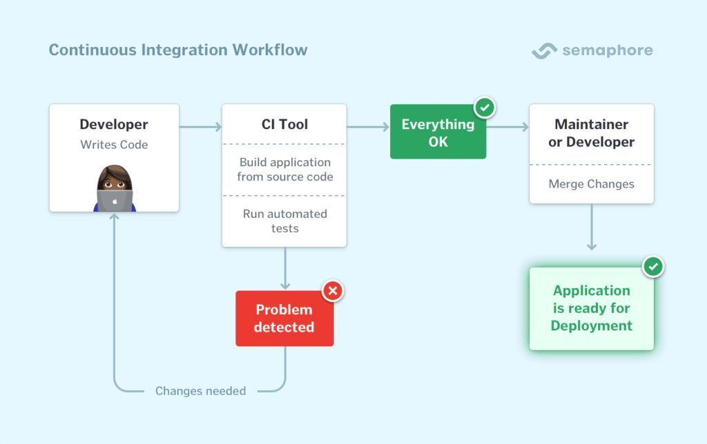
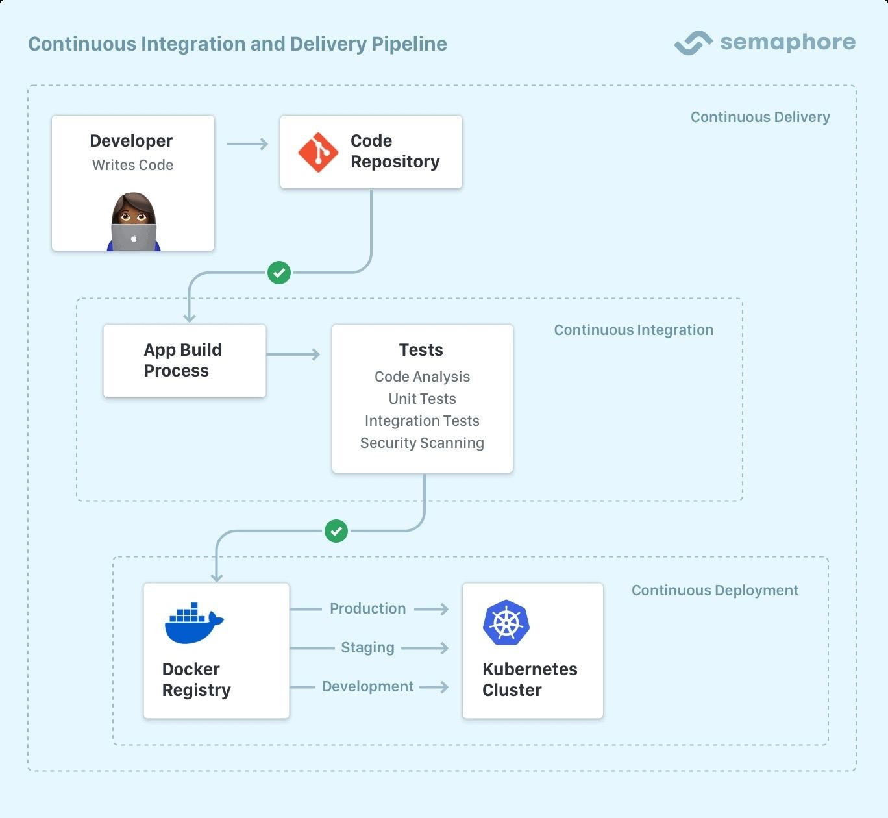

# About Semaphore

Semaphore is [Continuous Integration and Delivery](https://semaphore.io/continuous-integration) (CI) platform that's fast, easy to use, and incredibly scalable.

## Semaphore editions {#editions}

Semaphore comes in three editions:

- **[Semaphore Cloud](/getting-started/about-semaphore)**: is a cloud-based, fully-managed CI-as-a-Service platform. Meant for individuals and companies that don't wish to maintain a CI/CD system. Head to [semaphore.io](https://semaphore.io) to access Semaphore Cloud
- **[Semaphore CE](/CE/getting-started/install)**: is the free and open-source Community Edition of Semaphore. Meant for anyone that wishes to host and manage their own CI/CD architecture.
- **[Semaphore EE](/EE/getting-started/install)**: fully-featured Semaphore Enterprise Edition that can run behind a firewall using your infrastructure

In addition, you can install a **[Develpment Build](/CE/getting-started/install-local)**. This is a Semaphore CE build optimized to run in your laptop or desktop. Intended for development and testing.

See the [feature comparison](./features) to decide which edition of Semaphore is best for you.

## What is CI/CD?

Continuous Integration (CI) is an automated process of regularly merging code changes, running tests, and providing rapid feedback to developers.

CI enables developers to frequently merge code changes, automatically test them, and detect integration issues early, leading to faster development cycles and higher-quality software.

Continuous Delivery and Continuous Deployment extend this process by providing a package you can release and deploy to the world. The whole thing is automated and can be set up to not need human intervention. No more stressing over deployment or releases!

## Where to go next?

- Read the [quickstart](./quickstart) to learn the basics
- Head to [installation guide](./install) if you want to self-host your Semaphore server

<!-- new api: [API documentation](../openapi-spec/semaphore-public-api.info.mdx) --->
