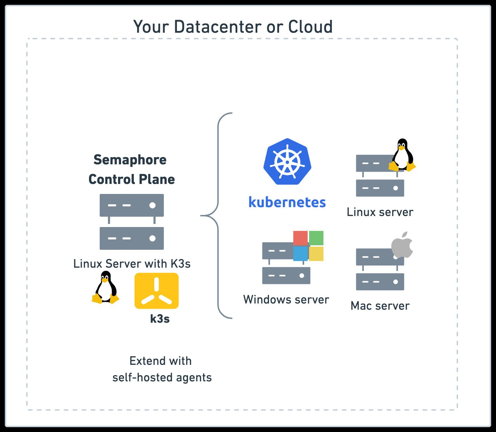

# About Semaphore

Semaphore is [Continuous Integration and Delivery](https://semaphore.io/continuous-integration) (CI) platform that's fast, easy to use, and incredibly scalable.

## Semaphore editions {#editions}

Semaphore comes in three editions:

- **[Semaphore Cloud](/getting-started/about-semaphore)**: is a cloud-based, fully-managed CI-as-a-Service platform. Meant for individuals and companies that don't wish to maintain a CI/CD system. Head to [semaphore.io](https://semaphore.io) to access Semaphore Cloud
- **[Semaphore CE](/CE/getting-started/install)**: is the free and open-source Community Edition of Semaphore. Meant for anyone that wishes to host and manage their own CI/CD architecture.
- **[Semaphore EE](/EE/getting-started/install)**: fully-featured Semaphore Enterprise Edition that can run behind a firewall using your infrastructure

See the [feature comparison](./features) to decide which edition of Semaphore is best for you.

## Architecture Overview

A Semaphore Community Edition instance consists of two components:

- **Control plane**: the control plane orchestrates jobs, serves the web application and public API, handles logging, manages permissions, and connects with your repositories.
- [**Agents**](../using-semaphore/self-hosted): the only purpose of an agent is to run jobs. The default Semaphore installation includes one agent that runs on the same cluster as the control plane but you can add more to expand capacity and build on multiple architectures.

## Where to go next?

- Read the [quickstart](./quickstart) to learn the basics
- Head to [installation guide](./install) if you want to self-host your Semaphore server

<!-- new api: [API documentation](../openapi-spec/semaphore-public-api.info.mdx) --->
