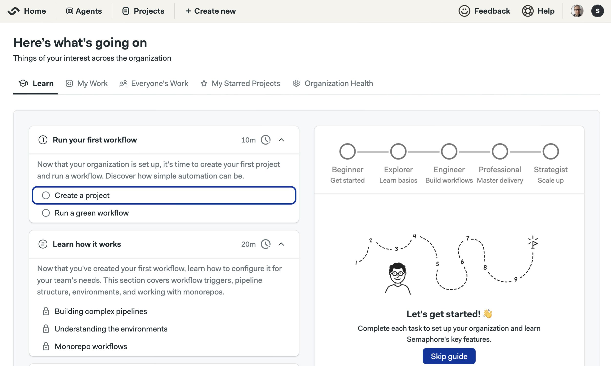

# Single Linux Machine

import { DynamicValueInput, DynamicValueText } from '@site/src/components/DynamicValue';

This page explains how to install Semaphore Community Edition on a single Linux Server.

## Overview

If this is your first time using Semaphore we suggest trying out [Semaphore Cloud](/getting-started/quickstart) to see if the platform fits your needs. You can create a free trial account without a credit card and use every feature.

The self-hosted installation is recommended for users and teams that are already familiar with Semaphore.

## Prerequisites

- A domain
- A Linux machine running Ubuntu. Preferably Ubuntu 24.04 LTS
  - Minimum memory: **16GB RAM**
  - Minimum compute: **8 CPUs**
- A public IP address. 
- External access requires ports SSH (22), HTTP (80) and HTTPS (443) open
- SSH access to the machine
- Sudo or root permissions in the machine

:::note

Ensure that your VMs are running with hardware-supported virtualization mode enabled. Without this feature Semaphore might not run at all, even if when the minimum hardware requirements are met.

:::

## Step 1 - Define the domain {#domain}

We highly recommend installing Semaphore on a subdomain. Installing Semaphore on your base domain might **interfere with other services** running on the same domain.

If your base domain is `example.com`, you should define a subdomain such as `ci.example.com` for your Semaphore installation.

## Step 2 - Prepare the machine {#env}


<Tabs groupId="platform">
  <TabItem value="ubuntu" label="Ubuntu">
  Markdown explaining option 1
  </TabItem>
  <TabItem value="gcp" label="Google Cloud Compute">
  Markdown explaining option 1
  </TabItem>
  <TabItem value="aws" label="AWS EC2 Virtual Machine">
  Markdown explaining option 1
  </TabItem>
</Tabs>

<Steps>

1. Open a terminal into your Linux machine, e.g. using SSH

    ```shell title="Connect to your machine"
    ssh <user>@<hostname>
    ```

2. Create a user to run Semaphore and give them sudo powers

    ```shell title="remote shell - create semaphore user with sudo"
    sudo adduser semaphore
    sudo usermod -aG sudo semaphore
    ```

3. Create a folder to store the configuration files

    ```shell title="Remote shell: Create install folder"
    mkdir semaphore-install
    cd semaphore-install
    ```

4. Create a file with the following environment variables. Change the values as needed

    ```shell title="Remote shell: create semaphore-config file"
    echo export DOMAIN="ci.example.com" > semaphore-config
    echo export IP_ADDRESS="public-IP-address" >> semaphore-config
    ```

5. Install certbot:

    ```shell title="remote shell: install certbot"
    sudo apt-get update
    sudo apt-get -y install certbot
    ```

</Steps>

## Step 3 - Create TLS certificates {#certs}

You must create a wildcard TLS certificate for your Semaphore subdomain, e.g. `ci.example.com`. Note that this certificate **expires three months after generation**.

Once expired, you must run this step again and then re-run [Helm upgrade](#install)

<Steps>

1. Run certbot to create a TLS certificate

    ```shell title="remote shell - create certificates with certbot"
    source semaphore-config
    mkdir -p certs
    certbot certonly --manual --preferred-challenges=dns \
        -d "*.${DOMAIN}" \
        --register-unsafely-without-email \
        --work-dir certs \
        --config-dir certs \
        --logs-dir certs
    ```

2. You are prompted to create a DNS TXT record to verify ownership of the domain

    ```text title="remote shell - certbot challenge message"
    Please deploy a DNS TXT record under the name:

    _acme-challenge.ci.example.com.

    with the following value:

    EL545Zty7vUUvIHQRSkwxXTWsirldw91enasgB5uOHs
    ```

3. Create the DNS TXT record before continuing the certificate generation. Once done, you should get a message like this:

    ```shell title="remote shell - certificate generated message"
    Successfully received certificate.
    Certificate is saved at: certs/live/ci.example.com/fullchain.pem
    Key is saved at:         certs/live/ci.example.com/privkey.pem
    This certificate expires on 2025-02-27.
    These files will be updated when the certificate renews.
    ```

4. Check the existence of the certificate files on the following paths. You will require both files during the Semaphore installation.

    - **Full chain certificate**: `./certs/live/$DOMAIN/fullchain.pem`
    - **Private key certificate**: `./certs/live/$DOMAIN/privkey.pem`

5. You may delete the DNS TXT record from your domain at this point. It's no longer needed.

</Steps>

:::tip

You can verify the creation of the TXT record in the [Google Dig Tool](https://toolbox.googleapps.com/apps/dig/#TXT/). Type the challenge DNS TXT record and check if its value corresponds to the correct value.

:::

## Step 4 - Install K3s and CRDs {#k3s}

In this step, we install and configure [K3s](https://k3s.io/) to run Semaphore.

<Steps>

1. Still inside the remote shell in your Linux machine, install Helm with:

    ```shell title="remote shell - install Helm"
    curl -fsSL -o get_helm.sh https://raw.githubusercontent.com/helm/helm/main/scripts/get-helm-3
    chmod 700 get_helm.sh
    sudo ./get_helm.sh
    ```

2. Install K3s

    ```shell title="remote shell - install k3s"
    curl -sfL https://get.k3s.io | sudo K3S_KUBECONFIG_MODE="644" sh -
    ```

3. Add `KUBECONFIG` to your shell environment

    ```shell title="remote shell - set KUBECONFIG in your bashrc"
    echo export KUBECONFIG=/etc/rancher/k3s/k3s.yaml >> ~/.bashrc
    source ~/.bashrc
    ```

4. Install [Emissary Ingress Controller](https://www.getambassador.io/docs/latest/topics/install/yaml-install/)

    ```shell title="remote shell - install Emissary CRD"
    kubectl apply -f https://app.getambassador.io/yaml/emissary/3.9.1/emissary-crds.yaml
    kubectl wait --timeout=90s --for=condition=available deployment emissary-apiext -n emissary-system
    ```

</Steps>


## Step 5 - Install Semaphore {#install}


:::note

This step installs the **Community Edition**. If you want to install the Enterprise Edition, see the [Enterprise Installation page](/EE/getting-started/install-single-machine).

:::

<Steps>

1. Sanity check your environment before installing Semaphore. These commands should return valid values

    ```shell title="remote shell - check if ready to install"
    source semaphore-config
    echo "DOMAIN=${DOMAIN}"
    echo "IP_ADDRESS=${IP_ADDRESS}"
    ls certs/live/${DOMAIN}/fullchain.pem certs/live/${DOMAIN}/privkey.pem
    ```


2. Install Semaphore with Helm

    ```shell title="remote shell - install Semaphore"
    helm upgrade --install semaphore oci://ghcr.io/semaphoreio/semaphore \
      --debug \
      --version v1.5.0 \
      --timeout 30m \
      --set global.domain.ip=${IP_ADDRESS} \
      --set global.domain.name=${DOMAIN} \
      --set ingress.enabled=true \
      --set ingress.ssl.enabled=true \
      --set ingress.className=traefik \
      --set ingress.ssl.type=custom \
      --set ingress.ssl.crt=$(cat certs/live/${DOMAIN}/fullchain.pem | base64 -w 0) \
      --set ingress.ssl.key=$(cat certs/live/${DOMAIN}/privkey.pem | base64 -w 0)
    ```

3. The installation usually takes between 10-30 minutes. Once done you should see this message


    ```text title="remote shell - installation complete message"
    =============================================================================================
    Congratulations, Semaphore has been installed successfully!

    To start using the app, go to https://id.semaphore.example.com/login

    You can fetch credentials for the login by running this command:

    echo "Email: $(kubectl get secret semaphore-authentication -n default -o jsonpath='{.data.ROOT_USER_EMAIL}' | base64 -d)"; echo "Password: $(kubectl get secret semaphore-authentication -n default -o jsonpath='{.data.ROOT_USER_PASSWORD}' | base64 -d)"; echo "API Token: $(kubectl get secret semaphore-authentication -n default -o jsonpath='{.data.ROOT_USER_TOKEN}' | base64 -d)"

    =============================================================================================
    ```


4. Execute the shown command to retrieve the login credentials.

    ```shell title="remote shell - get login credentials"
    $ echo "Email: $(kubectl get secret semaphore-authentication -n default -o jsonpath='{.data.ROOT_USER_EMAIL}' | base64 -d)"; echo "Password: $(kubectl get secret semaphore-authentication -n default -o jsonpath='{.data.ROOT_USER_PASSWORD}' | base64 -d)"; echo "API Token: $(kubectl get secret semaphore-authentication -n default -o jsonpath='{.data.ROOT_USER_TOKEN}' | base64 -d)"

    Email: root@example.com
    Password: AhGg_2v6uHuy7hqvNmeLw0O4RqI=
    API Token: nQjnaPKQvW6TqXtpTNSx
    ```


5. On your browser, open the subdomain where Semaphore was installed, e.g. `ci.example.com/login`

6. Fill in the username and password. You might be prompted to set a new password

    

7. Follow the onboarding guide to complete the setup and build your first project

    

</Steps>

TODO: update image for onboarding


