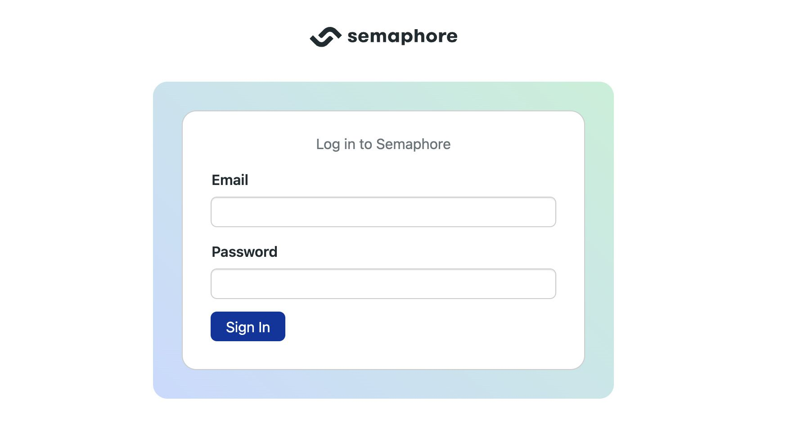
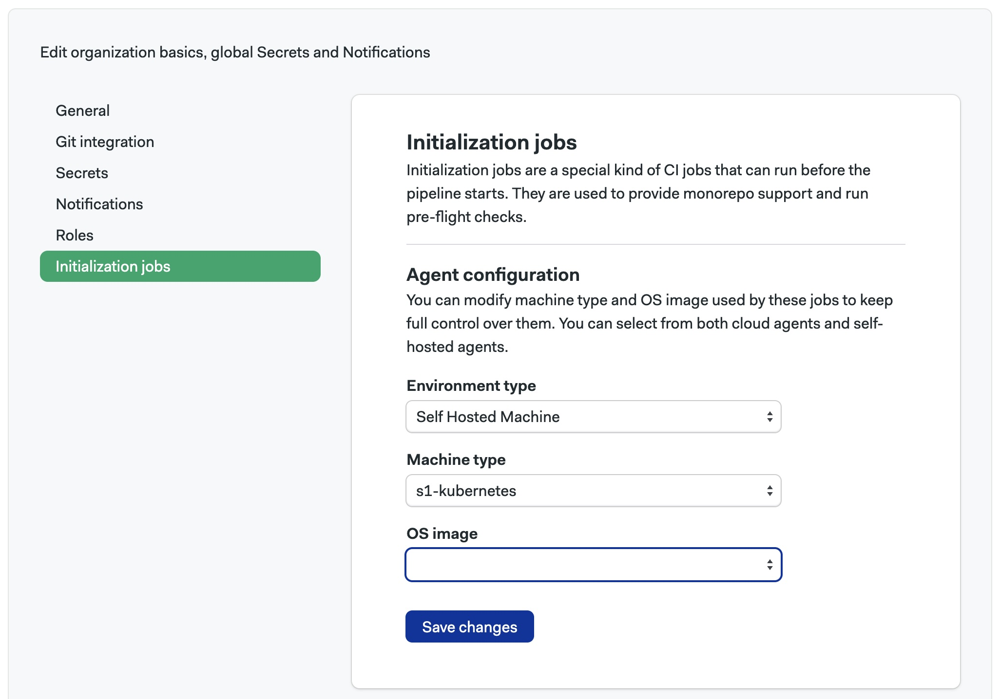
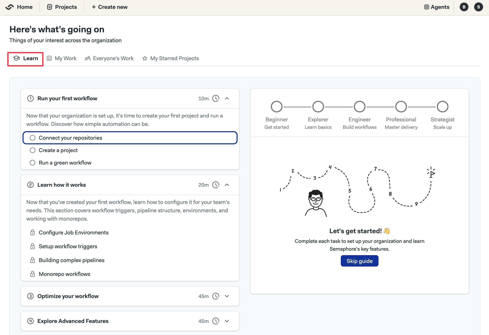

# Single Linux Machine

This page explains how to install the Semaphore Community Edition control plane on a single Linux Server.

## Overview

If this is your first time using Semaphore, we suggest trying out [Semaphore Cloud](/getting-started/quickstart) to see if the platform fits your needs. You can create a free trial account without a credit card and use every feature.

The self-hosted installation is recommended for users and teams that are already familiar with Semaphore.

## Prerequisites

- A domain
- A Linux machine running Ubuntu. Preferably Ubuntu 24.04 LTS
  - Minimum memory: **16GB RAM**
  - Minimum compute: **8 CPUs**
- A public IP address. 
- External access requires ports SSH (22), HTTP (80), and HTTPS (443) to be open
- SSH access to the machine
- Sudo or root access in the machine

:::note

Ensure that your VMs are running with hardware-supported virtualization mode enabled. Without this feature, Semaphore might not run at all, even when the minimum hardware requirements are met.

:::

## Step 1 - Define the domain {#domain}

We highly recommend installing Semaphore on a subdomain. Installing Semaphore on your base domain might **interfere with other services** running on the same domain.

If your base domain is `example.com`, you should define a subdomain such as `ci.example.com` for your Semaphore installation.

## Step 2 - Prepare the machine {#env}


<Tabs groupId="platform">
  <TabItem value="ubuntu" label="Ubuntu">

<Steps>

1. Open a terminal on your Linux machine, e.g., using SSH

    ```shell title="Connect to your machine"
    ssh <user>@<hostname>
    ```

2. Create a user to run Semaphore and give them sudo powers

    ```shell title="Remote shell:  create semaphore user with sudo"
    sudo adduser semaphore
    sudo usermod -aG sudo semaphore
    su - semaphore
    ```

3. Create a folder to store the config files

    ```shell title="Remote shell: Create install folder"
    mkdir semaphore-install
    cd semaphore-install
    ```

4. Create a file with the following environment variables

      - `DOMAIN`: subdomain + domain for your installation
      - `IP_ADDRESS`: public IP address of the machine
      - `ROOT_EMAIL`: email for the owner/administrator of the Semaphore server
      - `ROOT_NAME`: Name for the owner/administrator of the Semaphore server

      <br/>

    ```shell title="Remote shell: create semaphore-config file (example)"
    echo export DOMAIN="ci.example.com" > semaphore-config
    echo export IP_ADDRESS="1.2.3.4" >> semaphore-config
    echo export ROOT_EMAIL="admin@example.com" >> semaphore-config
    echo export ROOT_NAME=\"Semaphore admin\" >> semaphore-config
    ```

5. Install certbot

    ```shell title="remote shell: install certbot"
    sudo apt-get update
    sudo apt-get -y install certbot
    ```


</Steps>

  </TabItem>
  <TabItem value="gcp" label="Google Cloud Compute">

<Steps>

1. Install [Google Cloud SDK](https://cloud.google.com/sdk)

2. Log in to your Google Cloud

    ```shell title="Login to GCP"
    gcloud auth login
    ```

3. Create a [Google Cloud Project](https://cloud.google.com/resource-manager/docs/creating-managing-projects) for your Semaphore server. Take note of the **Google Project ID**

4. Initialize a config file for your Semaphore and GCP project

      - `DOMAIN`: subdomain + domain for your installation
      - `ROOT_EMAIL`: email for the owner/administrator of the Semaphore server
      - `ROOT_NAME`: Name for the owner/administrator of the Semaphore server

      <br/>

    ```shell title="Remote shell: create semaphore-config file (example)"
    echo export DOMAIN="your-subdomain-and-domain" > semaphore-config
    echo export ROOT_EMAIL="administrator-email" >> semaphore-config
    echo export ROOT_NAME=\"administrator-name\" >> semaphore-config
    echo export GOOGLE_CLOUD_PROJECT_ID="your-project-id" >> semaphore-config
    echo export GOOGLE_INSTANCE_NAME="name-for-your-VM" >> semaphore-config
    echo export GOOGLE_CLOUD_ZONE="gcp-region" >> semaphore-config
    echo export SSH_KEY_PUBLIC="path-to-your-public-ssh-key" >> semaphore-config
    echo export SSH_KEY_PRIVATE="path-to-your-private-ssh-key" >> semaphore-config
    ```


      <details>
      <summary>Show me an example config</summary>
      <div>

        ```shell title="Create a config file for Google project"
        echo export DOMAIN="ci.example.com" > semaphore-config
        echo export ROOT_EMAIL="admin@example.com" >> semaphore-config
        echo export ROOT_NAME=\"Semaphore Admin\" >> semaphore-config
        echo export GOOGLE_CLOUD_PROJECT_ID="my-semaphore-323342" >> semaphore-config
        echo export GOOGLE_INSTANCE_NAME="semaphore-control-machine" >> semaphore-config
        echo export GOOGLE_CLOUD_ZONE="us-central1-a" >> semaphore-config
        echo export SSH_KEY_PUBLIC="$HOME/.ssh/id_rsa.pub" >> semaphore-config
        echo export SSH_KEY_PRIVATE="$HOME/.ssh/id_rsa" >> semaphore-config
        ```

      </div>
      </details>

5. Switch to the Semaphore project on GCP

    ```shell title="Switch to your Semaphore project"
    source semaphore-config
    gcloud config set project "${GOOGLE_CLOUD_PROJECT_ID}"
    ```

6. Create a Virtual Machine. The following command creates the minimum recommended VM to run Semaphore


    ```shell title="Create a VM"
    gcloud compute instances create ${GOOGLE_INSTANCE_NAME} \
        --zone=${GOOGLE_CLOUD_ZONE} \
        --project=${GOOGLE_CLOUD_PROJECT_ID} \
        --network-interface=network-tier=PREMIUM,stack-type=IPV4_ONLY,subnet=default \
        --scopes=https://www.googleapis.com/auth/devstorage.read_only,https://www.googleapis.com/auth/logging.write,https://www.googleapis.com/auth/monitoring.write,https://www.googleapis.com/auth/service.management.readonly,https://www.googleapis.com/auth/servicecontrol,https://www.googleapis.com/auth/trace.append \
        --tags=http-server,https-server \
        --machine-type=e2-standard-8 \
        --image-family=ubuntu-2404-lts-amd64 \
        --image-project=ubuntu-os-cloud \
        --boot-disk-size=64GB \
        --metadata "ssh-keys=$(whoami):$(cat $SSH_KEY_PUBLIC)"
    ```

7. Get the public IP of your new server


    ```shell title="Get public IP of VM"
    export IP_ADDRESS=$(gcloud compute instances describe ${GOOGLE_INSTANCE_NAME} --zone ${GOOGLE_CLOUD_ZONE} --format='text(networkInterfaces.[].accessConfigs.[].natIP)' | awk -F': ' '{print $2}')
    ```


8. Add the IP address to your Google config file

    ```shell
    echo export IP_ADDRESS=${IP_ADDRESS} >> semaphore-config
    ```

9. Open ports HTTP (80) and HTTPS (443)

    ```shell title="Open firewall ports"
    gcloud compute firewall-rules create allow-http \
      --allow=tcp:80 \
      --direction=INGRESS \
      --source-ranges=0.0.0.0/0 \
      --target-tags=semaphore-allow-access


    gcloud compute firewall-rules create allow-https \
      --allow=tcp:443 \
      --direction=INGRESS \
      --source-ranges=0.0.0.0/0 \
      --target-tags=semaphore-allow-access

    gcloud compute instances add-tags ${GOOGLE_INSTANCE_NAME} --zone ${GOOGLE_CLOUD_ZONE} --tags semaphore-allow-access
    ```


10. Copy the config file to your new VM

    ```shell title="Copy semaphore-config to VM"
    gcloud compute scp --zone=${GOOGLE_CLOUD_ZONE}  --project=${GOOGLE_CLOUD_PROJECT_ID} --ssh-key-file "${SSH_KEY_PRIVATE}" semaphore-config ${GOOGLE_INSTANCE_NAME}:/tmp/
      ```

11. SSH into your VM

    ```shell title="SSH into the VM"
    gcloud compute ssh --zone=${GOOGLE_CLOUD_ZONE} --project=${GOOGLE_CLOUD_PROJECT_ID} --ssh-key-file ~/.ssh/id_ed25519 ${GOOGLE_INSTANCE_NAME}
    ```

12. Create a semaphore user with sudo powers

    ```shell title="Remote shell:  create semaphore user with sudo"
    sudo adduser semaphore
    sudo usermod -aG sudo semaphore
    su - semaphore
    ```

13. Create an install directory and move the config file

    ```shell title="Remote shell: Create install folder"
    mkdir semaphore-install
    cd semaphore-install
    sudo mv /tmp/semaphore-config .
    sudo chown semaphore:semaphore semaphore-config
    ```

</Steps>


  </TabItem>
  <TabItem value="aws" label="AWS EC2 Virtual Machine">

<Steps>

1. Install the [AWS CLI](https://aws.amazon.com/cli)

2. Initialize your AWS CLI configuration

    ```shell
    aws configure
    ```

3. Create a config file to store Semaphore and AWS settings

      - `DOMAIN`: subdomain + domain for your installation
      - `ROOT_EMAIL`: email for the owner/administrator of the Semaphore server
      - `ROOT_NAME`: Name for the owner/administrator of the Semaphore server
      - `AWS_SSH_KEY`: a name for the SSH key file to connect to the EC2 VM
      - `AWS_SECURITY_GROUP`: name for the AWS security group for the EC2 VM

      <br/>

    ```shell title="Create config file for Semaphore and AWS"
    echo export DOMAIN="your-subdomain-and-domain" > semaphore-config
    echo export ROOT_EMAIL="administrator-email" >> semaphore-config
    echo export ROOT_NAME=\"Administrator Name\" >> semaphore-config
    echo export AWS_SSH_KEY="your-ssh-key-name" >> semaphore-config
    echo export AWS_SECURITY_GROUP="your-security-group-name" >> semaphore-config
    ```


      <details>
      <summary>Show me an example config</summary>
      <div>

        ```shell title="Create a config file for Google project"
        echo export DOMAIN="ci.example.com" > semaphore-config
        echo export ROOT_EMAIL="admin@example.com" >> semaphore-config
        echo export ROOT_NAME=\"Semaphore admin\" >> semaphore-config
        echo export AWS_SSH_KEY="ssh-keys-semaphore" >> semaphore-config
        echo export AWS_SECURITY_GROUP="security-group-semaphore" >> semaphore-config
        ```

      </div>
      </details>

4. Create a security group to control access to your EC2 machine

    ```shell title="Create security group"
    source semaphore-config
    export SECURITY_GROUP_ID=$(aws ec2 create-security-group \
      --group-name ${AWS_SECURITY_GROUP} \
      --description "Security group for Semaphore instance" \
      --output text \
      --query 'GroupId')
    echo export SECURITY_GROUP_ID=${SECURITY_GROUP_ID} >> semaphore-config
    ```


5. Open ports SSH (22), HTTP (80), and HTTPS (443)


    ```shell title="Open firewall ports"
    aws ec2 authorize-security-group-ingress --group-id $SECURITY_GROUP_ID --protocol tcp --port 22 --cidr 0.0.0.0/0

    aws ec2 authorize-security-group-ingress --group-id $SECURITY_GROUP_ID --protocol tcp --port 80 --cidr 0.0.0.0/0

    aws ec2 authorize-security-group-ingress --group-id $SECURITY_GROUP_ID --protocol tcp --port 443 --cidr 0.0.0.0/0
    ```

6. Create SSH keys to access the VM

    ```shell title="Create SSH keypair"
    aws ec2 create-key-pair --key-name $AWS_SSH_KEY --query 'KeyMaterial' --output text > ${AWS_SSH_KEY}.pem

    chmod 600 ${AWS_SSH_KEY}.pem
    ```

7. Assign a subnet for the VM. Check the available subnets

    ```shell title="Find availale subnets"
    aws ec2 describe-subnets
    ```

8. Create a subnet for the VM, adjust the values as needed

    ```shell title="Create a subnet for the VM"
    aws ec2 create-subnet \
      --vpc-id "my-SubnetId" \
      --cidr-block "my-CidrBlock" \
      --availability-zone "my-AvailabilityZoneId"
    ```

9. Add the `SUBNET_ID` to the config file

    ```shell title="Add subnet id to the config file"
    echo export SUBNET_ID="my-new-SubnetId" >> semaphore-config
    ```

10. Create the EC2 VM. This command creates the minimum recommended instance to run Semaphore

    ```shell title="Create EC2 VM"
    export INSTANCE_ID=$(aws ec2 run-instances \
      --image-id resolve:ssm:/aws/service/canonical/ubuntu/server/24.04/stable/current/amd64/hvm/ebs-gp3/ami-id \
      --instance-type t2.2xlarge \
      --security-group-ids $SECURITY_GROUP_ID \
      --key-name $AWS_SSH_KEY \
      --subnet-id $SUBNET_ID \
      --count 1 \
      --associate-public-ip-address \
      --output text \
      --query 'Instances[0].InstanceId')
    ```

11. Add the `INSTANCE_ID` to the config file

    ```shell title="Add INSTANCE_ID to the config file"
    echo export INSTANCE_ID=$INSTANCE_ID >> semaphore-config
    ```

12. Retrieve the IP address assigned to the new VM


    ```shell title="Get IP Address of new VM"
    export IP_ADDRESS=$(aws ec2 describe-instances --instance-ids $INSTANCE_ID \
      --query 'Reservations[0].Instances[0].PublicIpAddress' \
      --output text)

    echo export IP_ADDRESS=${IP_ADDRESS} >> semaphore-config
    ```

13. Copy the config file to the VM

    ```shell title="Copy config file with scp"
    scp -i ${AWS_SSH_KEY}.pem semaphore-config ubuntu@{IP_ADDRESS}:/tmp
    ```

14. SSH into the machine

    ```shell title="Connect with your EC2 instance"
    ssh -i ${AWS_SSH_KEY}.pem ubuntu@${IP_ADDRESS}
    ```

15. Create semaphore user in the VM

    ```shell title="Remote shell:  create semaphore user with sudo"
    sudo adduser semaphore
    sudo usermod -aG sudo semaphore
    su - semaphore
    ```

16. Create an install directory and move the config file

    ```shell title="Remote shell: Create install folder"
    mkdir semaphore-install
    cd semaphore-install
    sudo mv /tmp/semaphore-config .
    sudo chown semaphore:semaphore semaphore-config
    ```

</Steps>

  </TabItem>
</Tabs>


## Step 3 - Create DNS A Records {#dns}

Configure your DNS by creating two A records that point to the server IP address.

<Steps>

1. Go to your domain provider's DNS settings
2. Create A record for your subdomain

      - Type: A
      - Name: your subdomain + domain (e.g. `ci.example.com`)
      - Value: the public IP address of your Linux machine

3. Create a wildcard record

      - Type: A
      - Name: your subdomain + domain (e.g. `*.ci.example.com`)
      - Value: the public IP address of your Linux machine

4. Wait for DNS propagation (typically a few minutes)

    You can verify the creation of the A record in the [Online Dig Tool](https://toolbox.googleapps.com/apps/dig/#A/) for:

      - `ci.example.com`
      - `id.ci.example.com`

</Steps>

## Step 4 - Create TLS certificates {#certs}

You must create a wildcard TLS certificate for your Semaphore subdomain, e.g., `ci.example.com`. Note that this certificate **expires three months after generation**.

Certificates **are not auto-renewed**. Once expired, you must execute this step again to generate new certificates and then re-run [Helm upgrade](#install) with the same argument.

<Steps>

1. Still logged in your VM, install certbot in the Linux server

    ```shell title="Remote shell: install certbot"
    sudo apt-get update
    sudo apt-get -y install certbot
    ```

2. Run certbot to create a TLS certificate

    ```shell title="Remote shell:  create certificates with certbot"
    source semaphore-config
    mkdir -p certs
    certbot certonly --manual --preferred-challenges=dns \
        -d "*.${DOMAIN}" \
        --register-unsafely-without-email \
        --work-dir certs \
        --config-dir certs \
        --logs-dir certs
    ```

3. You are prompted to create a DNS TXT record to verify ownership of the domain

    ```text title="Remote shell:  certbot challenge message"
    Please deploy a DNS TXT record under the name:

    _acme-challenge.ci.example.com.

    with the following value:

    EL545Zty7vUUvIHQRSkwxXTWsirldw91enasgB5uOHs
    ```

4. Go to your domain's console and create the DNS TXT record required by certbot. Wait for the record to be propagated

    :::tip

    You can verify the creation of the TXT record in the [Google Dig Tool](https://toolbox.googleapps.com/apps/dig/#TXT/). Type the challenge DNS TXT record and check if its value corresponds to the correct value.

    :::

5. Continue the certbot process. You should see a message like this


    ```shell title="Remote shell:  certificate generated message"
    Successfully received the certificate.
    Certificate is saved at: certs/live/ci.example.com/fullchain.pem
    Key is saved at:         certs/live/ci.example.com/privkey.pem
    This certificate expires on 2025-02-27.
    These files will be updated when the certificate renews.
    ```

6. Check the existence of the certificate files on the following paths. You will require both files during the Semaphore installation.

    - **Full chain certificate**: `./certs/live/$DOMAIN/fullchain.pem`
    - **Private key certificate**: `./certs/live/$DOMAIN/privkey.pem`

7. You may delete the DNS TXT record from your domain at this point. It's no longer needed.

</Steps>


## Step 5 - Install K3s and CRDs {#k3s}

In this step, we install and configure [K3s](https://k3s.io/) to run Semaphore.

<Steps>

1. Still inside the remote shell in your Linux machine, install Helm with:

    ```shell title="Remote shell:  install Helm"
    curl -fsSL -o get_helm.sh https://raw.githubusercontent.com/helm/helm/main/scripts/get-helm-3
    chmod 700 get_helm.sh
    sudo ./get_helm.sh
    ```

2. Install K3s

    ```shell title="Remote shell:  install k3s"
    curl -sfL https://get.k3s.io | sudo K3S_KUBECONFIG_MODE="644" sh -
    ```

3. Add `KUBECONFIG` to your shell environment

    ```shell title="Remote shell:  set KUBECONFIG in your bashrc"
    echo export KUBECONFIG=/etc/rancher/k3s/k3s.yaml >> ~/.bashrc
    source ~/.bashrc
    ```

4. Optionally, install [k9s](https://k9scli.io/) to manage and observe your K3s system

    ```shell
    wget https://github.com/derailed/k9s/releases/latest/download/k9s_linux_amd64.deb && sudo apt install ./k9s_linux_amd64.deb && rm k9s_linux_amd64.deb
    ```

5. Install [Emissary Ingress Controller](https://www.getambassador.io/docs/latest/topics/install/yaml-install/)

    ```shell title="Remote shell:  install Emissary CRD"
    kubectl apply -f https://app.getambassador.io/yaml/emissary/3.9.1/emissary-crds.yaml
    kubectl wait --timeout=90s --for=condition=available deployment emissary-apiext -n emissary-system
    ```

</Steps>


## Step 6 - Install Semaphore {#install}


:::note

This step installs the **Community Edition**. If you want to install the Enterprise Edition, see the [Enterprise Installation page](/EE/getting-started/install-single-machine).

:::

<Steps>

1. Sanity check your environment before installing Semaphore. These commands should return valid values

    ```shell title="Remote shell:  check if ready to install"
    source semaphore-config
    echo "DOMAIN=${DOMAIN}"
    echo "IP_ADDRESS=${IP_ADDRESS}"
    ls certs/live/${DOMAIN}/fullchain.pem certs/live/${DOMAIN}/privkey.pem
    ```


2. Install Semaphore with Helm. The installation usually takes between 10 and 30 minutes

    ```shell title="Remote shell:  install Semaphore"
    helm upgrade --install semaphore "oci://ghcr.io/semaphoreio/semaphore" \
      --debug \
      --version v1.5.0 \
      --timeout 30m \
      --set global.domain.ip="${IP_ADDRESS}" \
      --set global.domain.name="${DOMAIN}" \
      --set global.rootUser.email="${ROOT_EMAIL}" \
      --set global.rootUser.name="${ROOT_NAME}" \
      --set ingress.enabled=true \
      --set ingress.ssl.enabled=true \
      --set ingress.className=traefik \
      --set ingress.ssl.type=custom \
      --set ingress.ssl.crt="$(base64 -w 0 < certs/live/${DOMAIN}/fullchain.pem)" \
      --set ingress.ssl.key="$(base64 -w 0 < certs/live/${DOMAIN}/privkey.pem)"
    ```

3. Once installed, you should see this message


    ```text title="Remote shell:  installation complete message"
    =============================================================================================
    Congratulations, Semaphore has been installed successfully!

    To start using the app, go to: https://id.ci.tomfern.com/login

    You can fetch credentials for the login by running this command:

    echo "Email: $(kubectl get secret semaphore-authentication -n default -o jsonpath='{.data.ROOT_USER_EMAIL}' | base64 -d)"; echo "Password: $(kubectl get secret semaphore-authentication -n default -o jsonpath='{.data.ROOT_USER_PASSWORD}' | base64 -d)"; echo "API Token: $(kubectl get secret semaphore-authentication -n default -o jsonpath='{.data.ROOT_USER_TOKEN}' | base64 -d)"
    =============================================================================================
    ```


4. Execute the shown command to retrieve the login credentials.

    ```shell title="Remote shell:  get login credentials"
    echo "Email: $(kubectl get secret semaphore-authentication -n default -o jsonpath='{.data.ROOT_USER_EMAIL}' | base64 -d)"; echo "Password: $(kubectl get secret semaphore-authentication -n default -o jsonpath='{.data.ROOT_USER_PASSWORD}' | base64 -d)"; echo "API Token: $(kubectl get secret semaphore-authentication -n default -o jsonpath='{.data.ROOT_USER_TOKEN}' | base64 -d)"

    Email: root@example.com
    Password: AhGg_2v6uHuy7hqvNmeLw0O4RqI=
    API Token: nQjnaPKQvW6TqXtpTNSx
    ```

5. **Backup** your `semaphore-config` and certificate files in a safe place. It is required to [upgrade Semaphore](./upgrade-semaphore) and [renew expired certificates](./upgrade-semaphore#renew)

6. On your browser, open the subdomain where Semaphore was installed **prefixed** with `id`, e.g., `id.ci.example.com`

7. Fill in the username and password. You might be prompted to set a new password

    

8. Open the server menu and select **Settings**

    

9. Select **Initialization jobs**

    

10. Select the **Environment Type** to `Self-hosted Machine`

11. Select **Machine Type** to `s1-kubernetes`. Leave **OS Image** empty and press **Save changes**

    :::note

    You should press **Save changes** even if the options were already selected.

    :::

12. Return to the Semaphore initial page. On the **Learn** tab, you'll find the onboarding guide. Follow it to complete the setup and build your first project

    

</Steps>


## See also

- [Quickstart](./quickstart)
- [Migration guide](./migration-overview)
- [How to upgrade Semaphore](./upgrade-semaphore)
- [How to uninstall Semaphore](./uninstall-semaphore)


