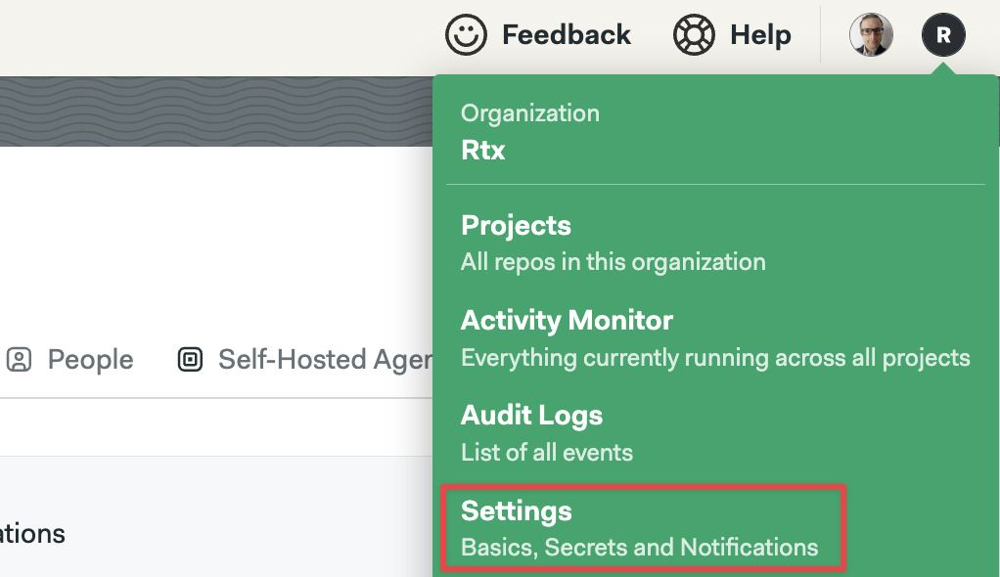
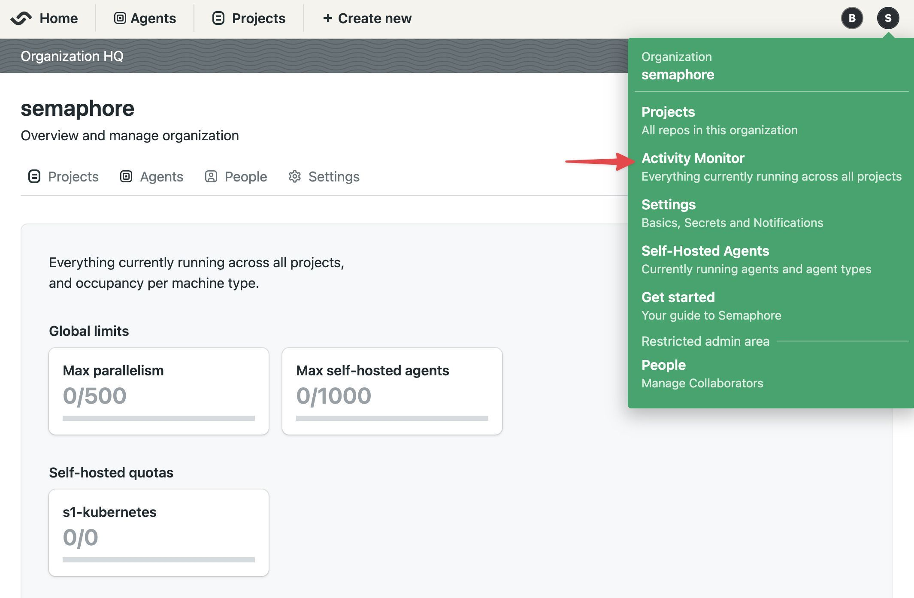

# Managing Semaphore

This page explains how to set up [notifications](./notifications) and what settings are available in your Semaphore instance. 

On Semaphore Community Edition, we use the terms server, instance, and organization interchangeably.

## Overview {#overview}

In order to access any non-public resources on Semaphore you must be invited to the Semaphore instance.

If you are trying out Semaphore for the first time, we suggest the [Quickstart](../getting-started/quickstart), where we show how to get started quickly.

A Semaphore instance has:

- zero or more [projects](./projects)
- one or more owners
- users [role-based permissions](./rbac)
- a dedicated URL, for example, `https://semaphore.example.com`

## Instance settings {#org-settings}

To access your settings, open the server menu and click on **Settings**.

### General settings {#general-settings}

This page shows the main settings for your instance. Here, you can change its name, and control how [workflows](./workflows) run.

:::info

The *URL of your server* is the URL that leads to the Home page in your Semaphore instance. For example `semaphore.example.com`

:::

### Notifications {#slack-notifications}

You can set up Slack and other webhook-based notifications to get your team notified whenever there [project](./projects) finishes running.

To learn more, see the [notification documentation](./notifications.md)

### Initialization agent {#init-agent}

Some types of pipelines require [initialization job](./pipelines#init-job) to evaluate and compile the them before the workload beings.

Semaphore tries to pick the best type of agent automatically but you change it for the whole server. This is particularly useful when you are using [self-hosted agents](./self-hosted).

To change the initialization job agent for all your [projects](./projects) in your Semaphore instance, follow these steps:

<Steps>

1. Select **Initialization job** from the settings menu
2. Select the **Environment type**
3. Select the **Machine type**
4. Select the **OS image** (if available)
5. Press **Save**

  

</Steps>

:::info

If you experience errors during initialization, see the [initialization job logs](./pipelines#init-logs) to help troubleshoot the issue.

:::

## Project queues {#queue}

You can use queues to control the order in which pipelines are executed in your instance. See [named queues](./pipelines#named-queues) for more information.

## Activity monitor {#activity-monitor}

The activity monitor show the [agent](./pipelines#agents) utilization and the currently running pipelines.

To view the activity monitor, open your server menu and select **Activity Monitor**.

In the activity monitor, you can see the machine quota utilization for your instance. Here, you can have an overview on how Semaphore Cloud machines and [self-hosted agents](./self-hosted) are being used.

In the lower part of the activity monitor you can find the currently running workflows for all the [projects](./projects) in your instance. Use this to know what [jobs](./jobs) are running, and see which ones are waiting in the queue to debug usage issues.

## See also

- [How to configure notifications](./notifications)
- [How to configure projects](./projects)
