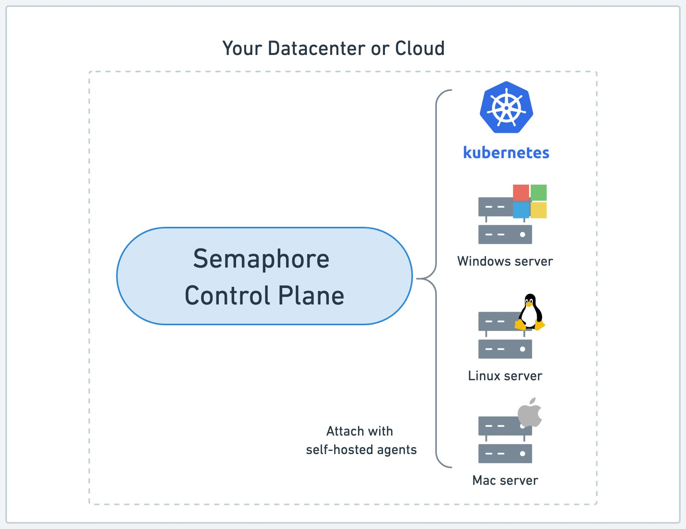
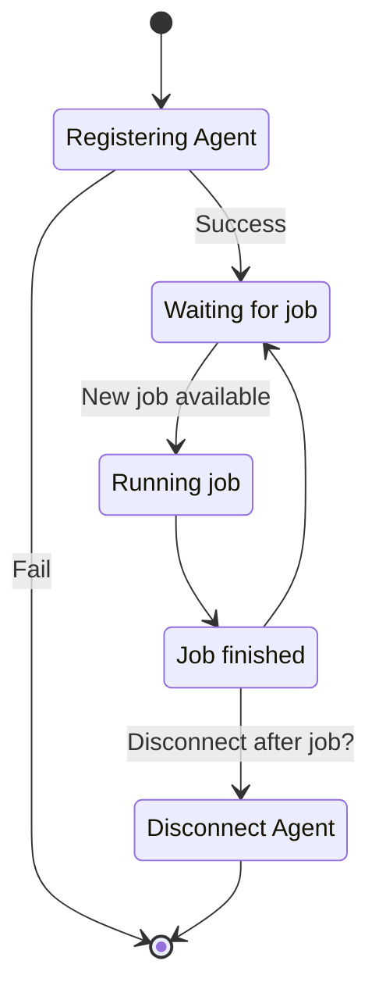
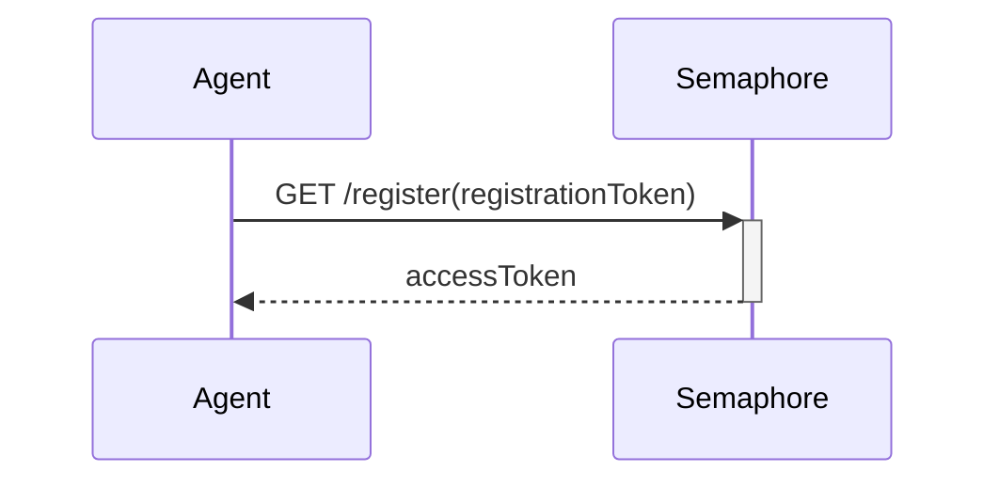
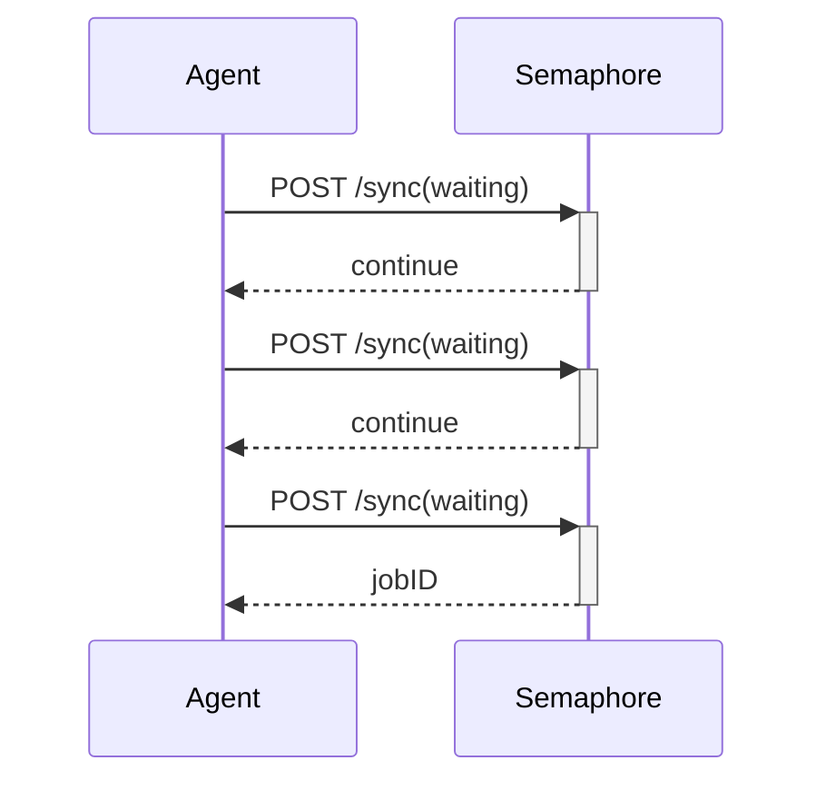
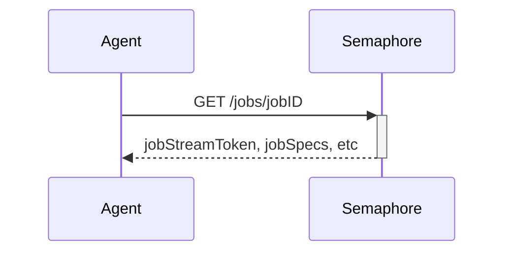
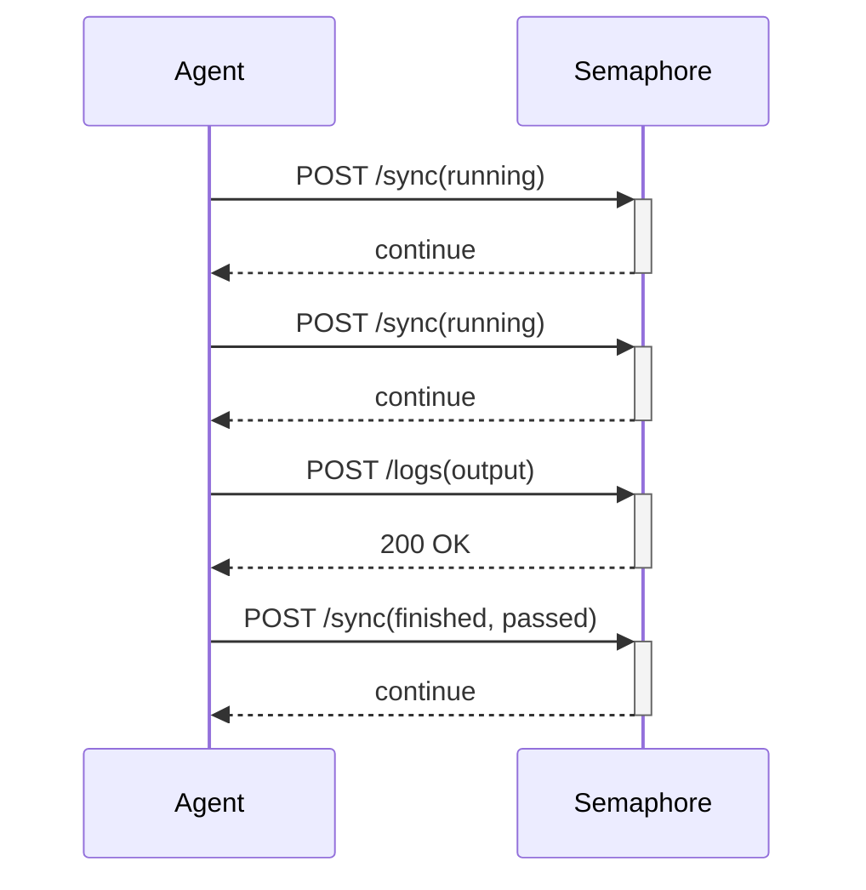
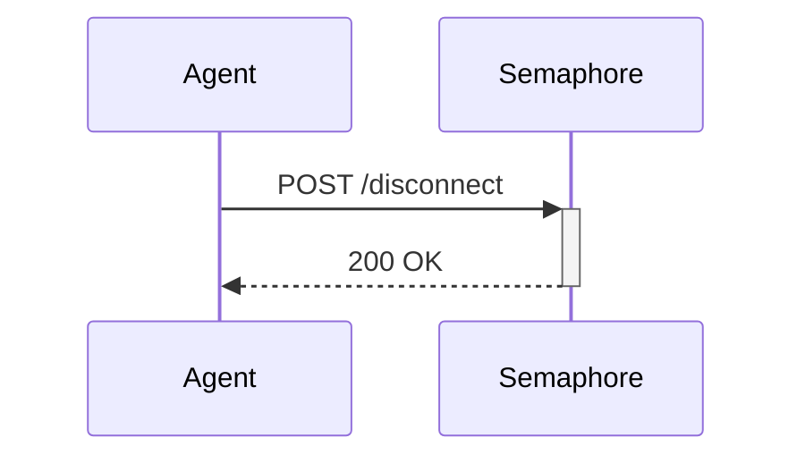
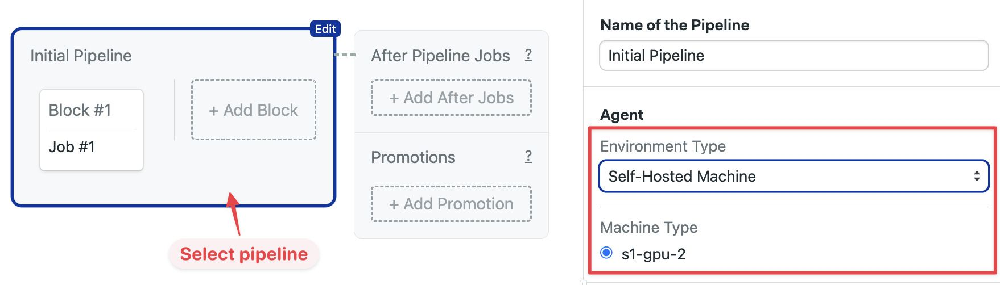

# Self-hosted Agents


You need self-hosted agents to run jobs in Semaphore. This page explains what self-hosted agents are and how to install them on several platforms.

## Overview {#overview}

An [agent](./pipelines#agents) is a physical or virtual machine you own that can be dedicated to running Semaphore [jobs](./jobs). You can mix and match your own agents with the [machines provided by Semaphore](../reference/machine-types).

Self-hosted agents allow you to run [workflows](./workflows) on machines that are not currently available as part of Semaphore Cloud plans, such as GPU-enabled machines for machine learning workloads.



## Self-hosted agents limitations {#limtations}

Jobs running on self-hosted agents have the following limitations:

- [SSH debugging](#debug) works in [a different way](#debug)
- On Kubernetes agents, only [Docker based environments](./pipelines#docker-environments) are supported
- The CI environment may persist between jobs on certain configurations
- [Initialization jobs](#init-requirements) run on Linux agents only and require extra software in the job environment

## Agent lifecycle {#lifecycle}

The agent attempts on startup to register with the Semaphore Control Plane by sending a registration request. Once registered, it waits for jobs. Repeated failure to register the agent causes it to shutdown.

The agent enters into a running state when a new job is available. Depending on its configuration, once the job is done the agent may disconnect and shutdown, or go back to the waiting state until a new job is available.



## Agent communication {#communication}

Self-hosted agents use one-way communication to connect with Semaphore. Requests are always initiated by the agent and secured using HTTPS TLS 1.3. This means you don't need to inbound open ports in your firewall to use Semaphore in Hybrid mode.

### Registration request {#registration}

When the agent boots up it sends a register request using a registration token. If the registration succeeds, the agent receives an access token to be used in all future communications and enters the *waiting for job* state.



:::note

A registration failure prevents the agent from connecting to the Semaphore Control Plane. Unregistered agents cannot run any jobs.

:::

### Sync request {#sync}

Waiting agents periodically send sync requests to the control plane with its state information. Semaphore responds with a continue message unless there is a job in the queue to be executed, in which case Semaphore sends the jobID.



### Get job request {#get-job}

When the agent receives a new jobID it enters the *starting job* state and sends a request to the `/jobs` endpoint. Semaphore responds with the job specs and an job log stream token.



Semaphore responds with a token used to stream the job output and the job specs, including commands, environment variables, files, prologues, epilogues, containers, among other details.

### Job output request {#logs}

Agents running a job periodically send sync requests along with the output of the active job. Once the job is done, the agent sends the remainder of the logs and a sync request with the job result (passed or failed).



### Disconnect request {#disconnect}

[Depending on its configuration](./self-hosted-configure#disconnect), the agent can either disconnect and shutdown after the job is finished, or go back to the *waiting for job* state.



## Supported toolbox features {#toolbox}

Not all of the [Semaphore toolbox](../reference/toolbox) commands are available on self-hosted agents. In some cases, you need additional setup steps to use these features.

| Feature                                     | Available | Notes                                           |
|---------------------------------------------|-----------|-------------------------------------------------|
| Using the [cache](../reference/toolbox#cache)                                   | Optional | Using [S3](./cache#aws), [GCP](./cache#gcp), or [SFTP](./cache#sftp) as a storage backend |
| [Artifact](./artifacts) storage                                                 | Yes |                                           |
| [Test results](./tests/test-reports) | Yes |                                           |
| Checking code with [checkout](../reference/toolbox#checkout)                    | Yes |                                           |
| Starting [debug jobs](./jobs#debug-jobs)                                        | No  | See the [self-hosted debug jobs](#debug)  |

## How to run jobs in self-hosted agents {#run-agent}

Once you have [installed](./self-hosted-install) and [configured](./self-hosted-configure) the self-hosted agent, you can use it in your jobs by selecting the new agent type in your pipeline.

<Tabs groupId="editor-yaml">
<TabItem value="editor" label="Editor">

To run jobs on a self-hosted agent, follow these steps:

<Steps>

1. Open your Semaphore [project](./projects) and press **Edit Workflow**
2. Select the pipeline
3. Under **Environment Type** select **Self-hosted machine**
4. Select the machine from the selection list

  

</Steps>

You can also change the agent for a single job using the [agent override option](./jobs#agent-override).

</TabItem>
<TabItem value="yaml" label="YAML">

To run jobs on a self-hosted agent, follow these steps:

<Steps>

1. Edit the [pipeline YAML](./pipelines)
2. In `agent.machine.type` add the agent type
3. Leave `os_image` as an empty string
4. Push the new YAML file to your repository

</Steps>

```yaml title="Semaphore pipeline"
version: v1.0
name: Initial Pipeline
agent:
  machine:
    type: s1-gpu-2
    os_image: ''
blocks:
  - name: 'Block #1'
    task:
      jobs:
        - name: 'Job #1'
          commands:
            - checkout
```

You can also change the agent for a single job using the [agent override option](./jobs#agent-override).

</TabItem>
</Tabs>

### Job sessions {#sessions}

The self-hosted agent executes the job commands in two different ways depending on the platform where it is running:

- On Linux and macOS, a new PTY session is created at the beginning of every job. All commands run in that single session
- On Windows, PYT sessions are not used. Instead, each command is executed in a new PowerShell process with `powershell -NonInteractive -NoProfile`

See [self-hosted configuration](./self-hosted-configure#isolation) to learn how to run jobs in isolation.

### Initialization agents {#init-agent}

If you want to run [initialization jobs](./pipelines#init-job) on self-hosted agents, you must change the default initialization agent. See [init agent](./organizations#init-agent) to learn how to change this setting.

Machines running initialization jobs must provide additional software. See [initialization job requirements](#init-requirements).

### Initialization job requirements {#init-requirements}

Initialization jobs are supported on **Linux** agents only, on the x86_64 and arm64 architectures. Self-hosted macOS and Windows agents cannot run initialization jobs.

The initialization job clones the repository with Git, compiles the pipeline with [spc](../reference/toolbox#spc), and uploads the compiled pipeline and the initialization log as artifacts.

#### Where the requirements apply {#init-requirements-where}

On agents that run jobs directly on the machine, the software listed below must be installed on that machine.

On agents that run jobs in containers, it must be present in the job environment instead:

- For [Docker environments](./pipelines#docker-environments), in the container image
- For Kubernetes agents, in the image set by the agent's `kubernetes-default-image` option. The initialization job specifies no container of its own, so a Kubernetes agent uses that default image, and the job fails with `no containers specified in Semaphore YAML, and no default container is provided` when the option is not set

In both container cases the toolbox is provisioned at job time, so the install-ordering rules in [Erlang and the PATH](#init-erlang-path) don't apply. The image only has to contain a supported Erlang.

#### Required software {#init-required-software}

| Software | Notes |
|----------|-------|
| Git | Any reasonably recent version. Git 2.25 or newer additionally enables an optimized blobless, sparse checkout, which is gated on an organization feature and is otherwise a standard shallow clone |
| Erlang/OTP | Must be major version 24, 25, 26, or 27. Both `erl` and `escript` must be resolvable — see [Erlang and the PATH](#init-erlang-path) |
| Bash | Job commands run in a login shell |
| OpenSSH client | Clones the repository and fetches additional commits when evaluating [`change_in`](../reference/conditions-dsl#change-in) |
| CA certificates | Uploads the compiled pipeline and the initialization log |
| A standard userland | Coreutils plus `sed`, `grep`, `tar`, and `curl`, as shipped by any normal distribution image |
| `which` | Used by spc to locate the condition evaluator. Provided by `debianutils` on Debian and Ubuntu, and easy to miss on a minimal image |
| `sudo` | Used while installing the agent and toolbox. Not needed at job time |
| `dig` | Only when `SEMAPHORE_GIT_CLONE_SLOW_RETRY` is enabled, which adds a GitHub-specific alternative-endpoint fallback to `checkout`. Provided by `dnsutils` on Debian and Ubuntu |

Docker, Elixir, and Git LFS are not required to run initialization jobs. Install them only if your regular jobs need them.

#### Erlang and the PATH {#init-erlang-path}

Installing a supported Erlang is not sufficient on its own. Both `erl` and `escript` must be resolvable in two different contexts, and they are not the same shell:

- **At agent install time, in a non-login shell.** The agent installer runs the toolbox installer as `sudo -u <agent-user> -H bash …`, which sources no profile file and uses sudo's `secure_path`. A version manager that activates Erlang from a profile file **is not visible here**. Install Erlang system-wide, or add its `bin` directory to the sudoers `secure_path`
- **At job time, in a login shell.** Here a version manager does work, as long as it activates Erlang from `~/.bash_profile`

Check both contexts, as the user the agent runs as:

```shell title="Check Erlang in both contexts"
$ sudo -u <agent-user> -H bash -c 'command -v erl'
/usr/bin/erl
$ sudo -u <agent-user> -H bash -lc 'command -v escript'
/usr/bin/escript
```

A non-login check such as `ssh <machine> 'command -v escript'` reports a false negative for anything a version manager activates, which is why the second form uses `bash -lc`.

:::warning

Activation must be in `~/.bash_profile` specifically. Bash reads only the first of `~/.bash_profile`, `~/.bash_login`, and `~/.profile` for login shells, and installing the agent **creates** `~/.bash_profile`. On a distribution that ships only `~/.profile` and `~/.bashrc` — Ubuntu, for example — `~/.profile` stops being read from that point on, and so does `~/.bashrc`, which Ubuntu's `~/.profile` is what loads.

Activation placed in `~/.bashrc` or `~/.profile`, which is what asdf and mise instruct by default, therefore works before the agent is installed and stops working afterwards.

:::

:::warning

Install Erlang before you install the agent. The toolbox selects a condition evaluator matching the Erlang version present at installation time, and the installer does not fail the installation when no matching binary exists — you get an agent that reports a successful install but has no condition evaluator.

If you install or change Erlang afterwards, re-extract the toolbox tarball and then run `~/.toolbox/install-toolbox`, or re-run the agent installer. Re-running `~/.toolbox/install-toolbox` on its own is not enough: it *moves* the matching `when_otp_<major>` binary out of `~/.toolbox`, so a second run can find nothing to install and will not report the failure. Expect an error line for `spc`, which is moved the same way — that one is harmless.

:::

#### Install and verify {#init-verify}

On Ubuntu 22.04 and 24.04:

```shell title="Initialization job requirements on Ubuntu"
apt-get update && apt-get install -y --no-install-recommends \
  git openssh-client ca-certificates curl tar sudo debianutils erlang-nox
update-ca-certificates
```

Run the checks below as the user the agent runs as, in a login shell.

```shell title="Check the Erlang version"
$ sudo -u <agent-user> -H bash -lc "erl -eval 'erlang:display(erlang:system_info(otp_release)), halt().' -noshell"
"27"
```

If the reported version falls outside 24 to 27, install a supported release from the [Erlang downloads page](https://www.erlang.org/downloads).

```shell title="Check the initialization job toolchain"
$ sudo -u <agent-user> -H bash -lc 'for b in git erl escript when spc artifact retry; do printf "%-10s %s\n" "$b" "$(command -v "$b" || echo MISSING)"; done'
git        /usr/bin/git
erl        /usr/bin/erl
escript    /usr/bin/escript
when       /usr/local/bin/when
spc        /usr/local/bin/spc
artifact   /usr/local/bin/artifact
retry      /usr/local/bin/retry
```

Every line must show a path. `MISSING` next to `when` means the Erlang version is unsupported, or Erlang was installed after the agent — see [Erlang and the PATH](#init-erlang-path).

Finally, confirm the condition evaluator runs:

```shell title="Check the condition evaluator"
$ sudo -u <agent-user> -H bash -lc 'echo "[]" > /tmp/in.json && when list-inputs --input /tmp/in.json --output /tmp/out.json && cat /tmp/out.json'
[]
```

:::info

If pipelines fail during initialization, see the [initialization job logs](./pipelines#init-logs) to troubleshoot the issue.

:::

## How to debug jobs on self-hosted {#debug}

Before you can [debug jobs](./jobs#debug-jobs) you must enable self-hosted debugging on to the [project settings](./projects#general).

Debug jobs work in a different way on self-hosted agents. Instead of connecting directly to the job via SSH as in cloud debug jobs, Semaphore starts the debug job and displays the name of the agent that is running the job. You must connect to the host running the agent and debug the job manually.

Keep in mind that:

- You should log in with the same user the agent is running under. For example, if you're using [agent-aws-stack](https://github.com/renderedtext/agent-aws-stack), the user is `semaphore`
- The agent does not automatically load environment variables for the job. To load the variables, you must source the files located at `/tmp/.env-*`

## See also

- [How to install self-hosted agents](./self-hosted-install)
- [How to configure self-hosted agents](./self-hosted-configure)
- [How to run an autoscaling fleet of agents in AWS](./self-hosted-aws)
- [Self-hosted agents configuration reference](../reference/self-hosted-config)
