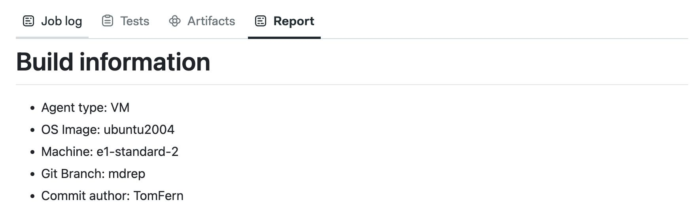
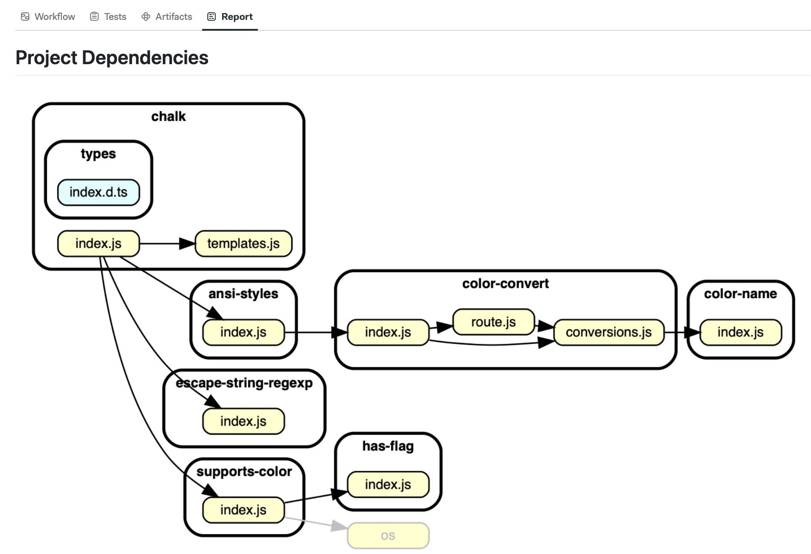
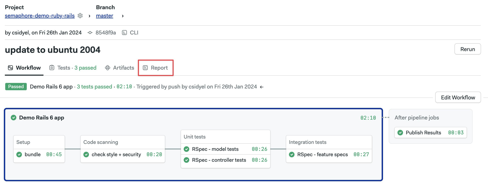
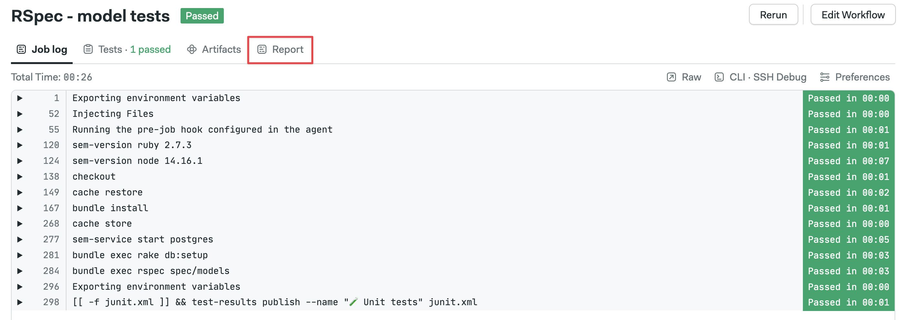
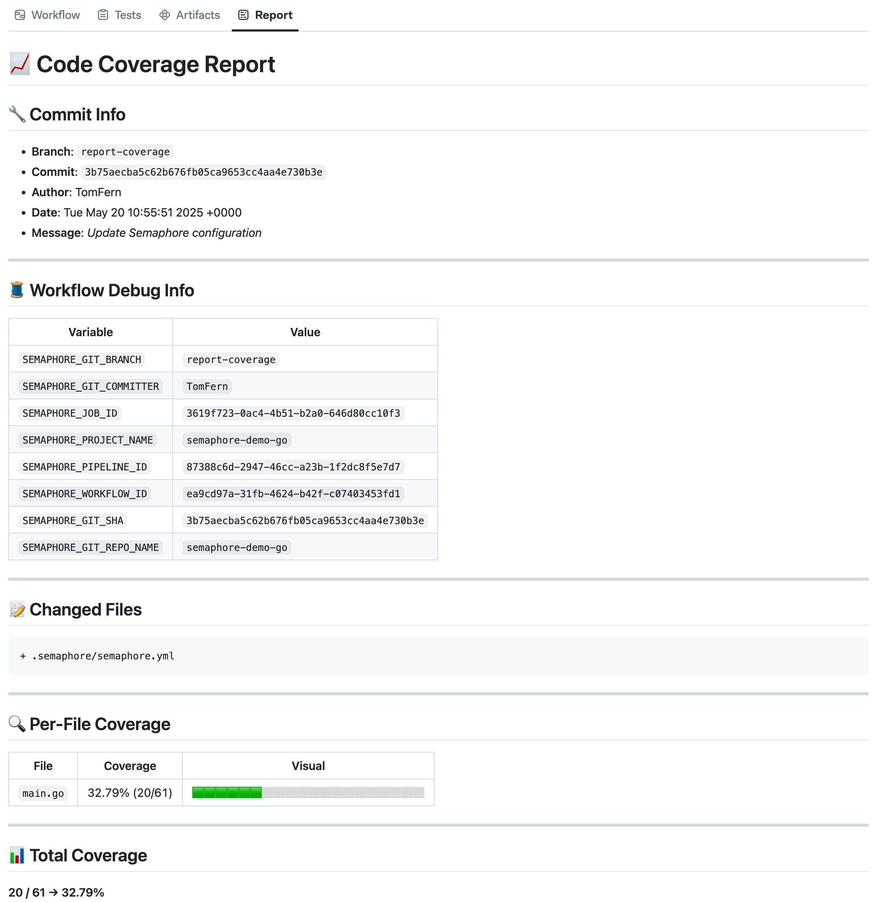

# Markdown Reports

import Tabs from '@theme/Tabs';
import TabItem from '@theme/TabItem';
import Available from '@site/src/components/Available';
import VideoTutorial from '@site/src/components/VideoTutorial';
import Steps from '@site/src/components/Steps';

Create rich custom reports and view them right next to your workflows and jobs.

## Overview {#overview}

The new Reports tab makes it easy to add clear, custom markdown reports right inside your job and workflow pages. You can include charts, summaries, and extra details without leaving Semaphore, so sharing build results and pipeline information is simpler.

Markdown Reports feature:

- **Fully rendered Markdown**: view Markdown files directly in the workflow or job pages, which are fully formatted for easy reading.
- **Mermaid.js support**: create live charts and diagrams to show your pipeline steps with [Mermaid.js](https://mermaid.js.org/)
- **Quick report generation** : use the [test-results](../../reference/toolbox#test-results) CLI to make basic job reports in seconds
- **Fully customizable**: include test results, deployment notes, or any other information you need to organize and explain your CI/CD process

For example, you can use them to show information about your build.



You can even use images in your reports. The following PNG image has been generated with [dependency cruiser](https://github.com/sverweij/dependency-cruiser).



See the [examples](#examples) to learn how we generated these reports.

## How to create reports {#create}

To use this feature, you must create an [artifact](../artifacts) on the following path: `.semaphore/REPORT.md`. The file must be formatted using Markdown.

You can create a [Job](../jobs) report with:

```shell
artifact push job -d .semaphore/REPORT.md your-custom-report-file.md
```

To create a [Workflow](../workflows) report, use:

```shell
artifact push workflow -d .semaphore/REPORT.md your-custom-report-file.md
```

Notice the use of the [--destination (-d) argument](../../reference/toolbox#artifact) to upload the report file into the expected path.

## How to view reports {#view}

To view workflow reports, open the workflow and select the **Report** tab.



To view a job report, open the workflow, then go to the job you're interested in and select the **Report** tab.




:::info

If the reports tab is empty, check the following:

- That you are uploading the report to the correct artifact namespace, i.e., `artifact push workflow` vs `artifact push job`
- That you are using the `--destination` or `-d` argument to upload the report with the name `.semaphore/REPORT.md`

There are no project-level reports. Only workflows and jobs show the report tab.

:::

## Examples {#examples}

This section contains examples of how to dynamically generate reports in your pipelines. You may use these as a starting point for your reporting needs. You can produce complex reports by concatenating these examples into a single Markdown file.

### Static reports {#static}

If you have a Markdown file you want to show as-is on the reports tabs, simply upload it as an artifact with:

```shell
checkout
artifact push workflow -d .semaphore/REPORT.md README.md
```

### Environment variables {#env-vars}

You can use environment variables in your source Markdown file, for example:

```markdown title="build-info-template.md"
# Build information

- Agent type: ${SEMAPHORE_AGENT_MACHINE_ENVIRONMENT_TYPE}
- OS Image: ${SEMAPHORE_AGENT_MACHINE_OS_IMAGE}
- Machine: ${SEMAPHORE_AGENT_MACHINE_TYPE}
- Git Branch: ${SEMAPHORE_GIT_BRANCH}
- Commit author: ${SEMAPHORE_GIT_COMMIT_AUTHOR}
```

To expand the values of the variables during job execution, you may use `envsubst` in your job command. The following example exposes valuable information about the job found in [Semaphore environment variables](../../reference/env-vars):

```shell
checkout
envsubst < build-info-template.md > build-info.md
artifact push job -d .semaphore/REPORT.md build-info.md
```

The report tab should show a report similar to this:


### Adding images {#images}

Local images in Markdown Reports do not work. For example, using `` only shows a broken image.

To use images in your report, you have two options:

- **Remote storage**: upload the image to a remote server, such as Google Bucket, and using the full URL

    You can use the following commands to upload `image.png` to a Google Cloud and show it remotely on your report. You must ensure the bucket permissions allow public access for this to work.

    ```shell
    gsutil cp image.png gs://my-unique-bucket-name/
    echo "# My image" > image.md
    echo "
    artifact push job -d .semaphore/REPORT.md image.md 
    ```

- **Base64 encoded images**: Markdown supports embedding images as base64 encoded strings. This is less efficient, but it does not rely on external services to work

    You can use the following commands to encode `image.png` inside the Markdown report:

    ```shell
    echo "# My image " > image.md
    echo '')' >> image.md
    artifact push job -d .semaphore/REPORT.md image.md 
    ```

### Coverage report for Go {#coverage}

The following example shows how to implement code coverage for Go projects:

```shell
go install github.com/jandelgado/gcov2lcov@latest
go install github.com/securego/gosec/v2/cmd/gosec@v2.19.0
go install golang.org/x/lint/golint@latest
go test -coverprofile=c.out ./...
gcov2lcov -infile=c.out -outfile=coverage.lcov
scripts/lcov-to-md
artifact push workflow -d .semaphore/REPORT.md COVERAGE.md
```

In the example, we use `lcov-to-md` to convert the Go coverage report to Markdown. These are the contents of the script:

```shell title="lcov-to-md"
#!/bin/bash

LCOV_FILE="coverage.lcov"
OUTPUT_FILE="COVERAGE.md"

# Git info
BRANCH=${SEMAPHORE_GIT_BRANCH:-$(git rev-parse --abbrev-ref HEAD)}
COMMIT=$(git rev-parse HEAD)
AUTHOR=$(git log -1 --pretty=format:'%an')
DATE=$(git log -1 --pretty=format:'%ad')
MESSAGE=$(git log -1 --pretty=format:'%s')
CHANGED_FILES=$(git diff-tree --no-commit-id --name-only -r HEAD)

# Temp file for sorting
TMP_FILE=$(mktemp)

OVERALL_TOTAL=0
OVERALL_COVERED=0
CURRENT_FILE=""
FILE_TOTAL=0
FILE_COVERED=0

while IFS= read -r line; do
  case "$line" in
    SF:*)
      CURRENT_FILE=$(basename "${line#SF:}")
      FILE_TOTAL=0
      FILE_COVERED=0
      ;;
    DA:*)
      count=$(echo "$line" | cut -d',' -f2)
      FILE_TOTAL=$((FILE_TOTAL + 1))
      OVERALL_TOTAL=$((OVERALL_TOTAL + 1))
      if [ "$count" -gt 0 ]; then
        FILE_COVERED=$((FILE_COVERED + 1))
        OVERALL_COVERED=$((OVERALL_COVERED + 1))
      fi
      ;;
    end_of_record)
      if [ -n "$CURRENT_FILE" ]; then
        if [ "$FILE_TOTAL" -gt 0 ]; then
          percent=$(awk "BEGIN { printf \"%.2f\", ($FILE_COVERED/$FILE_TOTAL)*100 }")
        else
          percent="0.00"
        fi
        printf "%07.2f|%s|%d|%d\n" "$percent" "$CURRENT_FILE" "$FILE_COVERED" "$FILE_TOTAL" >> "$TMP_FILE"
      fi
      ;;
  esac
done < "$LCOV_FILE"

if [ "$OVERALL_TOTAL" -gt 0 ]; then
  OVERALL_COVERAGE=$(awk "BEGIN { printf \"%.2f\", ($OVERALL_COVERED/$OVERALL_TOTAL)*100 }")
else
  OVERALL_COVERAGE="0.00"
fi

# Write markdown report
{
  echo "# 📈 Code Coverage Report"
  echo
  echo "## 🔧 Commit Info"
  echo "- **Branch**: \`$BRANCH\`"
  echo "- **Commit**: \`$COMMIT\`"
  echo "- **Author**: $AUTHOR"
  echo "- **Date**: $DATE"
  echo "- **Message**: _${MESSAGE}_"
  echo
  echo "---"
  echo
  echo "## 🧵 Workflow Debug Info"
  echo
  echo "| Variable | Value |"
  echo "|----------|-------|"
  for var in SEMAPHORE_GIT_BRANCH SEMAPHORE_GIT_COMMITTER SEMAPHORE_JOB_ID SEMAPHORE_PROJECT_NAME SEMAPHORE_PIPELINE_ID SEMAPHORE_WORKFLOW_ID SEMAPHORE_GIT_SHA SEMAPHORE_GIT_REPO_NAME; do
    val="${!var}"
    echo "| \`$var\` | \`$val\` |"
  done
  echo
  echo "---"
  echo
  echo "## 📝 Changed Files"
  echo
  echo '```diff'
  for file in $CHANGED_FILES; do echo "+ $file"; done
  echo '```'
  echo
  echo "---"
  echo
  echo "## 🔍 Per-File Coverage"
  echo
  echo "| File | Coverage | Visual |"
  echo "|------|----------|--------|"

  sort "$TMP_FILE" | while IFS='|' read -r padded file covered total; do
    percent=$(echo "$padded" | sed 's/^0*//')
    bar_len=20
    filled=$(awk "BEGIN { printf \"%d\", ($percent/100)*$bar_len }")
    empty=$((bar_len - filled))
    filled_bar=$(yes '🟩' | head -n "$filled" | tr -d '\n')
    empty_bar=$(yes '⬜' | head -n "$empty" | tr -d '\n')
    echo "| \`$file\` | $percent% ($covered/$total) | $filled_bar$empty_bar |"
  done

  echo
  echo "---"
  echo
  echo "## 📊 Total Coverage"
  echo "**$OVERALL_COVERED / $OVERALL_TOTAL → $OVERALL_COVERAGE%**"
} > "$OUTPUT_FILE"

rm -f "$TMP_FILE"

echo "✅ Report saved to $OUTPUT_FILE"
```

The end result if a coverage report that looks like this:



## See also

- [Test reports](./test-reports)
- [Test results CLI](../../reference/toolbox#test-results)


