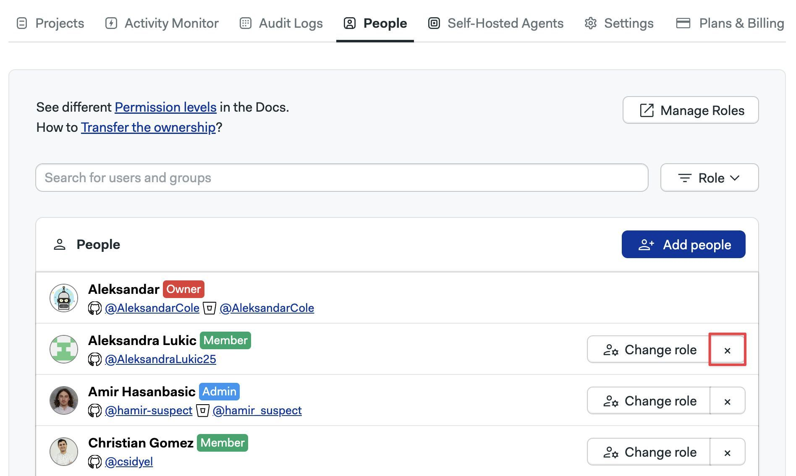

# Managing User Accounts

Semaphore users a [Role Based Access Control](./rbac) model to manage permissions at the organization and project level.

## Manage your user profile {#profile}

You can manage your Semaphore user profile details such as email address, username, and access token.

### How to change your username {#profile-username}

To change your Semaphore username, follow these steps:

<Steps>

1. Open your user menu on the top-right corner
2. Select **Profile settings**

    

3. Under **Screen name**, type your new name

    

4. Press **Save changes**

</Steps>

### How to change your email address {#profile-email}

:::warning

Changing your user profile email address can revoke access to integrations such as GitHub and BitBucket. You may need to reconnect your repositories after changing your email address.

:::

To change your Semaphore email address, follow these steps:

<Steps>

1. Open your user menu on the top-right corner
2. Select **Profile settings**

    

3. Under **Email Address**, type your email address

    

4. Press **Update email**

5. Confirm the change

</Steps>

### How to reset your personal API token {#profile-token}

:::warning

Changing your access token will revoke access to the [Semaphore API](../reference/api) and access via the [Semaphore CLI](../reference/semaphore-cli). Only reset your token if you have lost access to it or suspect someone else has been using it on your behalf.

:::

To reset your Semaphore API token, follow these steps:

<Steps>

1. Open your user menu on the top-right corner
2. Select **Profile settings**

    

3. Under **API Tokek** press **Reset API Token**

    

4. Confirm the change, copy the new to token and save it on a safe place

</Steps>

## Managing users {#people}

Semaphore users a [Role Based Access Control](./rbac) model to manage permissions at the instance level.

To manage users in your Semaphore instance, open the server menu and select **People**. This tab shows users and groups in your instance along with their roles and groups.

### How to create users {#add-people}

To create new accounts, go to the people option in the server menu and follow these steps:

<Steps>

1. Press **Add people**

      

2. Type the email of the persons you wish to invite
3. Optionally, set a username. If not provided, the username is inferred from the email
4. When you are done adding users, press **Create Accounts**

      

5. Take note of the temporary passwords for each account

      

6. When the new user first logs in with the temporary password, they will be prompted to create a new one. After that, they can start using Semaphore normally.

</Steps>

### How to change a user role {#role-change}

To change user roles, go to the people option in the server menu and follow these steps:

<Steps>

1. Press the **Edit** button next to the user you want to change

      

2. Select the new role

      

</Steps>

### How to reset a user password {#reset-password}

To reset a user password, go to the people option in the server menu and follow these steps:

<Steps>

1. Press the **Edit** button next to the user you want to change

      

2. Press the **Reset password** button

      

3. Press **Reset password**

4. A new temporary password will be generated

5. When the user logs in with the temporary password they will be prompted to create a new password

</Steps>

### How to remove users {#remove-users}

Users can only be removed from the instance when they don't own any projects. You must [transfer the ownership](./projects#owner-change) of all the user's projects before they can be removed from Semaphore.

To remove a user, go to the people option in the server menu and follow these steps:

<Steps>

1. Transfer any [project ownership](./projects#owner-change) the user may have to another individual. The user must not own any projects
2. Press the **X** button next to the username of the user you want to remove

  

</Steps>

Upon removal, access to all projects in Semaphore are revoked.

:::note

Only an Admins and Owners can remove users from the Semaphore instance.

:::

### How to view permissions for roles {#org-roles}

Semaphore provides pre-defined roles. These permissions cannot be changed. You can see what actions each role can perform by following these steps:

<Steps>

1. Open the server **Settings** menu
2. Select **Roles**

      

3. In the **Organization Roles** section, press the eye button next to the role you want to examine

</Steps>

The actions with enabled checkbox are allowed for that role.

