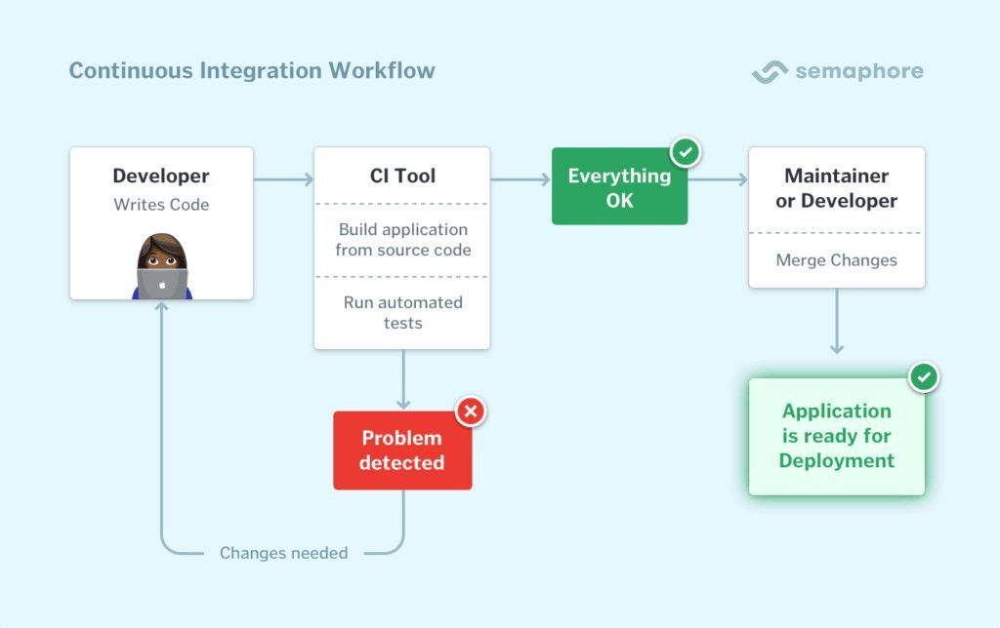
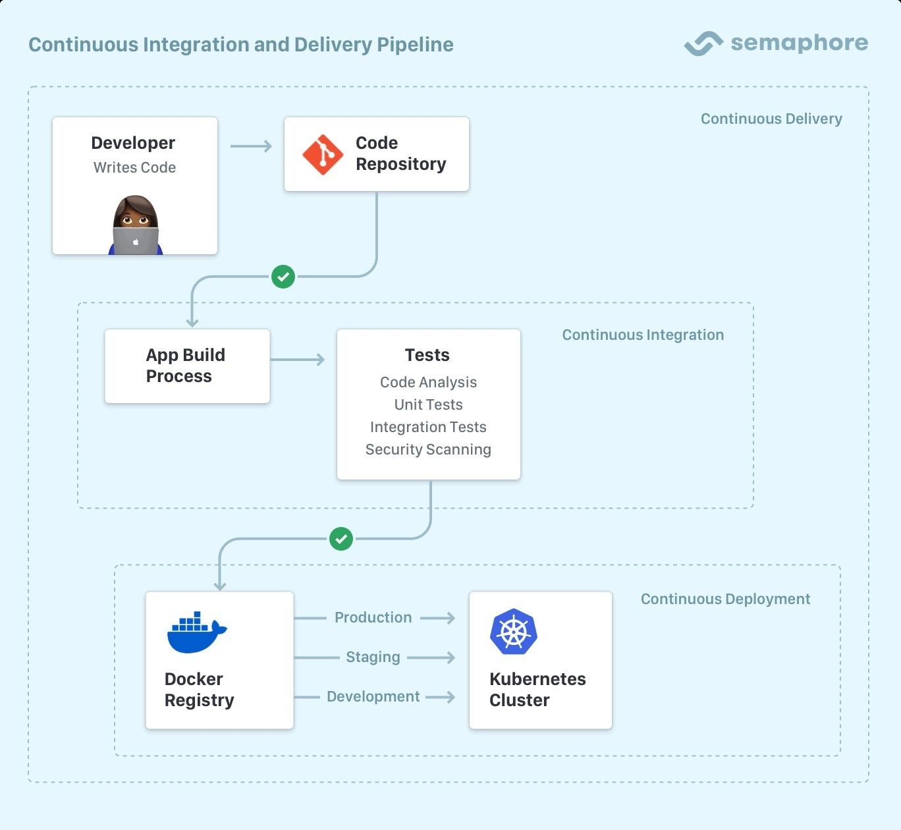

# About Semaphore

Semaphore is [Continuous Integration and Delivery](https://semaphore.io/continuous-integration) (CI) platform that's fast, easy to use, and incredibly scalable. 

## Semaphore editions {#editions}

Semaphore comes in two editions:

- **[Semaphore Cloud](/getting-started/about-semaphore)**: is a cloud-based, fully-managed CI-as-a-Service platform. Meant for individuals and companies that don't wish to maintain a CI/CD system. Head to [semaphore.io](https://semaphore.io) to access Semaphore Cloud
- **[Semaphore CE](/CE/getting-started/install)**: is the free and open-source Community Edition of Semaphore. Meant for anyone that wishes to host and manage their own CI/CD architecture.
- [Semaphore EE](/EE/getting-started/install)): commercial, fully-featured Semaphore instance. Meant for companies who wishes to host and manage their own CI/CD architecture.

See the [feature comparison](./features) to decide which edition of Semaphore is best for you.

## What is CI/CD?

Continuous Integration (CI) is an automated process of regularly merging code changes, running tests, and providing rapid feedback to developers.

CI enables developers to frequently merge code changes, automatically test them, and detect integration issues early, leading to faster development cycles and higher-quality software.

Continuous Delivery and Continuous Deployment extend this process by providing a package you can release and deploy to the world. The whole thing is automated and can be set up to not need human intervention. No more stressing over deployment or releases!

## Where to go next?

If you want to test Semaphore before installation, give [Semaphore Cloud](/getting-started/about-semaphore) a try for free. It has all the features and it does not require a credit card to sign up.

To learn how to install, see the [Enterprise Edition installation guide](./install). Then, we recommend reading the [Guided Tour](./guided-tour) to get your bearings.

You can find the complete Semaphore handbook in the [Using Semaphore](../using-semaphore/jobs) section.

And if you want to dive deep into Semaphore's inner workings check out the [Reference pages](../reference/semaphore-cli) and the [Semaphore API reference](../reference/api).

<!-- new api: [API documentation](../openapi-spec/semaphore-public-api.info.mdx) --->

