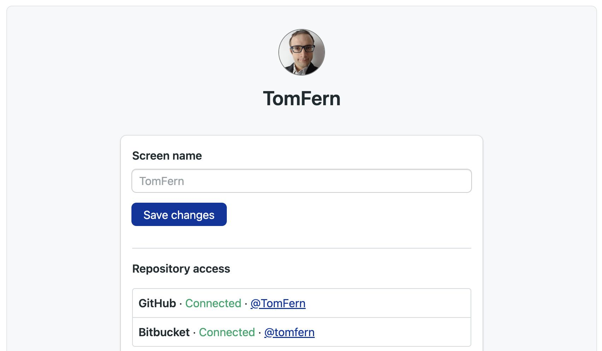

# Experiments Sandbox (dev build)

## Steps


```js

```

<Steps>


1. Import the component into your MDX file:

   ```js
   
   ```
2. Step 2

    - subpoint
    - subpoint
    - subpoint

    <details>
    <summary>Show me</summary>
    <div>

    Surprise!

    </div>
    </details>

3. Another step

    ```yaml
    key: value
    ```
4. Image

    

5. Finish

</Steps>
