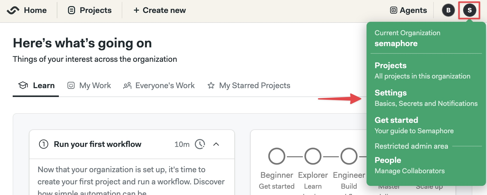
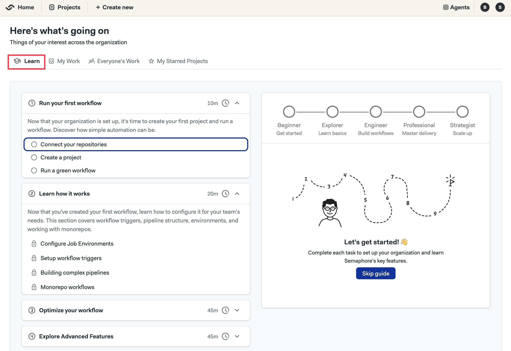

# Kubernetes Cluster

This page explains how to install the Semaphore Enterprise Edition control plane on Kubernetes cluster.

## Overview

If this is your first time using Semaphore, we suggest trying out [Semaphore Cloud](/getting-started/quickstart) to see if the platform fits your needs. You can create a free trial account without a credit card and use every feature.

The self-hosted installation is recommended for users and teams that are already familiar with Semaphore.

## Prerequisites

- A [license](./license)
- A domain
- A Google Cloud or AWS account

## Step 1 - Obtain a License {#license}

The Enterprise Edition of Semaphore requires a license to operate. Depending on your company size, you may qualify for a free license.

To obtain a license and learn more, see the [how to obtain a license page](./license).

## Step 2 - Define the domain {#domain}

We highly recommend installing Semaphore on a subdomain. Installing Semaphore on your base domain might **interfere with other services** running on the same domain.

If your base domain is `example.com`, you should define a subdomain such as `ci.example.com` for your Semaphore installation.

## Step 3 - Prepare the environment {#env}

<Tabs groupId="platform">
  <TabItem value="gke" label="Google Kubernetes Engine">

This section creates [Google Cloud Kubernetes Engine (GKE)](https://cloud.google.com/kubernetes-engine) and prepares it for Semaphore Enterprise Edition.

<Steps>

1. Install the following tools:

    - [Google Cloud SDK](https://cloud.google.com/sdk)
    - [kubectl](https://kubernetes.io/docs/tasks/tools/install-kubectl/)
    - [Helm](https://helm.sh/docs/intro/install/)

2. Log in to your Google Cloud

    ```shell title="Login to GCP"
    gcloud auth login
    ```

3. Create a [Google Cloud Project](https://cloud.google.com/resource-manager/docs/creating-managing-projects) for your Semaphore server. Take note of the **Google Project ID**

4. Initialize a config file for your Semaphore and GCP project

      - `DOMAIN`: subdomain + domain for your installation
      - `LICENSE_FILE`: license file name
      - `ROOT_EMAIL`: email for the owner/administrator of the Semaphore server
      - `ROOT_NAME`: Name for the owner/administrator of the Semaphore server

      <br/>

    ```shell title="create semaphore-config file (example)"
    echo export DOMAIN="your-subdomain-and-domain" > semaphore-config
    echo export LICENSE_FILE="license-file-name.txt" >> semaphore-config
    echo export ROOT_EMAIL="administrator-email" >> semaphore-config
    echo export ROOT_NAME=\"administrator-name\" >> semaphore-config
    echo export GOOGLE_CLOUD_PROJECT_ID="you-gcp-project-id" >> semaphore-config
    echo export GOOGLE_STATIC_IP_NAME="the-name-for-the-cluster-ingress-IP"  semaphore-config
    echo export GOOGLE_CERTIFICATE_NAME="a-name-for-the-tls-certificate" >> semaphore-config
    echo export GOOGLE_CLOUD_ZONE="the-zone-for-your-cluster" >> semaphore-config
    echo export GOOGLE_CLOUD_CLUSTER_NAME="your-cluster-name" >>  semaphore-config
    ```

      <details>
      <summary>Show me an example config</summary>
      <div>

        ```shell title="Create a config file for Google project"
        echo export DOMAIN="ci.example.com" > semaphore-config
        echo export LICENSE_FILE="license-851b7f23-7408-4e75-8591-25b90d1c7dac.txt" >> semaphore-config
        echo export ROOT_EMAIL="admin@example.com" >> semaphore-config
        echo export ROOT_NAME=\"Semaphore Admin\" >> semaphore-config
        echo export GOOGLE_CLOUD_PROJECT_ID="my-semaphore-443021" >> semaphore-config
        echo export GOOGLE_CERTIFICATE_NAME="my-semaphore-certificates" >> semaphore-config
        echo export GOOGLE_STATIC_IP_NAME="my-semahore-ip" >> semaphore-config
        echo export GOOGLE_CLOUD_ZONE=us-central1-a >> semaphore-config
        echo export GOOGLE_CLOUD_CLUSTER_NAME="my-semaphore-gke" >> semaphore-config
        ```

      </div>
      </details>

5. Switch to the Semaphore project on GCP

    ```shell title="Switch to your Semaphore project"
    source semaphore-config
    gcloud config set project "${GOOGLE_CLOUD_PROJECT_ID}"
    ```

6. Reserve a public IP address for the Kubernetes ingress

    ```shell title="Reserve IP"
    gcloud compute addresses create "${GOOGLE_STATIC_IP_NAME}" \
        --project "${GOOGLE_CLOUD_PROJECT_ID}" \
        --global
    ```

7. Retrieve the assigned IP

    ```shell title="Retrieve reserved IP"
    export IP_ADDRESS=$(gcloud compute addresses describe "${GOOGLE_STATIC_IP_NAME}" \
        --project "${GOOGLE_CLOUD_PROJECT_ID}" \
        --global \
        --format='get(address)')
    echo export IP_ADDRESS=$IP_ADDRESS >> semaphore-config
    ```

8. Go to your domain provider's DNS settings
9. Create root domain A record

      - Type: A
      - Name: "your-subdomain" (e.g. `ci.example.com`)
      - Value: the IP address of the Kubernetes ingress

10. Create a wildcard record

      - Type: A
      - Name: "*.your-subdomain" (e.g. `*.ci.example.com`)
      - Value: the IP address of the Kubernetes ingress


11. Wait for DNS propagation (typically a few minutes)

    You can verify the creation of the A record in the [Online Dig Tool](https://toolbox.googleapps.com/apps/dig/#A/) for:

      - `ci.example.com`
      - `*.ci.example.com`

12. Install certbot

    ```shell title="install certbot"
    sudo apt-get update
    sudo apt-get -y install certbot
    ```

13. Run certbot to create a TLS certificate

    ```shell title=" create certificates with certbot"
    source semaphore-config
    mkdir -p certs
    sudo certbot certonly --manual --preferred-challenges=dns \
        -d "*.${DOMAIN}" \
        --register-unsafely-without-email \
        --work-dir certs \
        --config-dir certs \
        --logs-dir certs
    ```

14. You are prompted to create a DNS TXT record to verify ownership of the domain

    ```text title=" certbot challenge message"
    Please deploy a DNS TXT record under the name:

    _acme-challenge.ci.example.com.

    with the following value:

    EL545Zty7vUUvIHQRSkwxXTWsirldw91enasgB5uOHs
    ```

15. Go to your domain's console and create the DNS TXT record required by certbot. Wait for the record to be propagated

    :::tip

    You can verify the creation of the TXT record in the [Google Dig Tool](https://toolbox.googleapps.com/apps/dig/#TXT/). Type the challenge DNS TXT record and check if its value corresponds to the correct value.

    :::

16. Continue the certbot process. You should see a message like this


    ```shell title=" certificate generated message"
    Successfully received the certificate.
    Certificate is saved at: certs/live/ci.example.com/fullchain.pem
    Key is saved at:         certs/live/ci.example.com/privkey.pem
    This certificate expires on 2025-02-27.
    These files will be updated when the certificate renews.
    ```

17. Check the existence of the certificate files on the following paths. You will require both files during the Semaphore installation.

    - **Full chain certificate**: `./certs/live/$DOMAIN/fullchain.pem`
    - **Private key certificate**: `./certs/live/$DOMAIN/privkey.pem`

18. You may delete the DNS TXT record from your domain at this point. It's no longer needed.

19. Correct the permissions of the certificate files

    ```shell title="Change ownership of certificates"
    sudo chown -R $USER certs
    ```

20. Install the TLS certificates

    ```shell title="Install certificates"
    gcloud compute ssl-certificates create "${GOOGLE_CERTIFICATE_NAME}" \
    --certificate="certs/live/${DOMAIN}/fullchain.pem" \
    --private-key="certs/live/${DOMAIN}/privkey.pem" \
    --project="${GOOGLE_CLOUD_PROJECT_ID}"
    ```

</Steps>


  </TabItem>
  <TabItem value="AWS" label="AWS Elastic Kubernetes Service">

<Steps>

1. Install the following tools:

    - [Google Cloud SDK](https://cloud.google.com/sdk)
    - [kubectl](https://kubernetes.io/docs/tasks/tools/install-kubectl/)
    - [Helm](https://helm.sh/docs/intro/install/)
    - [Terraform](https://developer.hashicorp.com/terraform/install)

2. Add your subdomain + domain to [Route53 DNS](https://aws.amazon.com/route53/). Take note of the **hosted Zone ID** for your domain within Route 53 (e.g. `Z05666441V6R4KFL4MJAA`)

3. Clone the Semaphore repository to your machine

    ```shell title="Clone repository"
    git clone https://github.com/semaphoreio/semaphore.git
    ```

4. Navigate to the EKS Terraform folder

    ```shell title="Go to the EKS folder"
    cd semaphore/ephemeral_environment/terraform/eks
    ```

5. Initialize your AWS CLI configuration

    ```shell title="Login to AWS"
    aws configure
    ```

6. Initialize a config file for your Semaphore and AWS project

      - `DOMAIN`: subdomain + domain for your installation
      - `LICENSE_FILE`: license file name
      - `ROOT_EMAIL`: email for the owner/administrator of the Semaphore server
      - `ROOT_NAME`: Name for the owner/administrator of the Semaphore server

      <br/>

    ```shell title="create semaphore-config file (example)"
    echo export DOMAIN="your-subdomain-and-domain" > semaphore-config
    echo export LICENSE_FILE="license-file-name.txt" >> semaphore-config
    echo export ROOT_EMAIL="administrator-email" >> semaphore-config
    echo export ROOT_NAME=\"administrator-name\" >> semaphore-config
    echo export AWS_REGION="your-aws-region" >> semaphore-config
    echo export ZONE_ID="your-route53-zone-id" >> semaphore-config
    ```

      <details>
      <summary>Show me an example config</summary>
      <div>

        ```shell title="Create a config file for Google project"
        echo export DOMAIN="ci.example.com" > semaphore-config
        echo export LICENSE_FILE="license-851b7f23-7408-4e75-8591-25b90d1c7dac.txt" >> semaphore-config
        echo export ROOT_EMAIL="admin@example.com" >> semaphore-config
        echo export ROOT_NAME=\"Semaphore Admin\" >> semaphore-config
        echo export AWS_REGION="us-east-1a" >> semaphore-config
        echo export ZONE_ID="Z05666441V6R4KFL4MJAA" >> semaphore-config
        ```

      </div>
      </details>
</Steps>

  </TabItem>
</Tabs>

## Step 3 - Create the cluster

<Tabs groupId="platform">
  <TabItem value="gke" label="Google Kubernetes Engine">

<Steps>

1. install the GKE plugin for the Google Cloud SDK

    ```shell title="Install plugins"
    gcloud components install gke-gcloud-auth-plugin
    ```

2. Enable the Kubernetes API for your project

    ```shell title="Enable Kubernetes API"
    gcloud services enable container.googleapis.com --project ${GOOGLE_CLOUD_PROJECT_ID}
    ```

3. Create the cluster. You may adjust the commands if you want to create more nodes or use more powerful machines. The command might take several minutes to complete

    ```shell title="Create GKE instance"
    gcloud container clusters create "${GOOGLE_CLOUD_CLUSTER_NAME}" \
        --project "${GOOGLE_CLOUD_PROJECT_ID}" \
        --zone "${GOOGLE_CLOUD_ZONE}" \
        --num-nodes 1 \
        --machine-type e2-custom-8-16384 \
        --network "default" \
        --subnetwork "default" \
        --enable-ip-alias \
        --cluster-version latest \
        --no-enable-master-authorized-networks
    ```

4. Once done, ensure you can access the cluster

    ```shell title="Test cluster accesss"
    kubectl get nodes
    ```


5. Install [Emissary Ingress Controller](https://www.getambassador.io/docs/latest/topics/install/yaml-install/)

    ```shell title="Install CRDs"
    kubectl apply -f https://app.getambassador.io/yaml/emissary/3.9.1/emissary-crds.yaml
    kubectl wait --timeout=90s --for=condition=available deployment emissary-apiext -n emissary-system
    ```


</Steps>

  </TabItem>
  <TabItem value="AWS" label="AWS Elastic Kubernetes Service">

<Steps>

1. Create the EKS cluster using Terraform

    ```shell title="Create kuberntes cluster in AWS"
    source semaphore-config
    TF_VAR_aws_region=$AWS_REGION TF_VAR_route53_zone_id=$ZONE_ID TF_VAR_domain=$DOMAIN terraform apply
    ```

2. Check the Terraform output for the name of the cluster and save it in an environment variable

    ```shell title="Save the name of the cluster to the config file"
    echo export EKS_CLUSTER_NAME="<the-name-of-your-cluster>" >> semaphore-config
    ```

3. Once done, retrieve the TLS certificate ARN

    ```shell title="Retrieve TLS certificates"
    echo export CERT_NAME=$(terraform output ssl_cert_name) >> semaphore-config
    ```

4. Connect to the newly created cluster

    ```shell title="Connect to new Cluster"
    aws eks update-kubeconfig --name "${EKS_CLUSTER_NAME}" --region "${AWS_REGION}"
    ```

5. Install [Emissary Ingress Controller](https://www.getambassador.io/docs/latest/topics/install/yaml-install/)

    ```shell title="Install CRDs"
    kubectl apply -f https://app.getambassador.io/yaml/emissary/3.9.1/emissary-crds.yaml
    kubectl wait --timeout=90s --for=condition=available deployment emissary-apiext -n emissary-system
    ```

</Steps>

  </TabItem>
</Tabs>

## Step 4 - Install Semaphore {#semaphore}

:::note

This Helm command installs the Enterprise Edition. If you want to install the Enterprise Edition, refer see the [Community Installation page](/CE/getting-started/install-kubernetes).

:::

<Tabs groupId="platform">
  <TabItem value="gke" label="Google Kubernetes Engine">

<Steps>

1. Sanity check that the environment is ready for the installation. The commands should not fail and return valid values

    ```shell title="Sanity check"
    source semaphore-config
    echo "DOMAIN=${DOMAIN}"
    echo "IP_ADDRESS=${IP_ADDRESS}"
    echo "GOOGLE_CERTIFICATE_NAME=${GOOGLE_CERTIFICATE_NAME}"
    echo "GOOGLE_STATIC_IP_NAME=${GOOGLE_STATIC_IP_NAME}"
    ls certs/live/${DOMAIN}/privkey.pem certs/live/${DOMAIN}/fullchain.pem
    ```

2. Optionally, install [k9s](https://k9scli.io/) to manage and observe your K3s system

    ```shell title="Install k9s"
    wget https://github.com/derailed/k9s/releases/latest/download/k9s_linux_amd64.deb && sudo apt install ./k9s_linux_amd64.deb && rm k9s_linux_amd64.deb
    ```

3. Install Semaphore with Helm. The process can take between 10 to 30 minutes

    ```shell title="Install Semaphore"
    helm upgrade --install semaphore "oci://ghcr.io/semaphoreio/semaphore" \
      --debug \
      --version v1.5.0 \
      --timeout 40m \
      --set global.edition=ee \
      --set global.license="$(cat ${LICENSE_FILE})"\
      --set global.domain.ip="${IP_ADDRESS}" \
      --set global.domain.name="${DOMAIN}" \
      --set global.rootUser.email="${ROOT_EMAIL}" \
      --set global.rootUser.name="${ROOT_NAME}" \
      --set ingress.staticIpName="${GOOGLE_STATIC_IP_NAME}" \
      --set ingress.enabled=true \
      --set ingress.ssl.enabled=true \
      --set ingress.ssl.certName="${GOOGLE_CERTIFICATE_NAME}" \
      --set ingress.ssl.type="google"
    ```

</Steps>

  </TabItem>
  <TabItem value="AWS" label="AWS Elastic Kubernetes Service">

<Steps>

1. Sanity check that the environment is ready for the installation. The commands should not fail and return valid values

    ```shell title="Sanity check environment"
    source semaphore-config
    echo "DOMAIN=${DOMAIN}"
    echo "CERT_NAME=${CERT_NAME}"
    ```

2. Optionally, install [k9s](https://k9scli.io/) to manage and observe your K3s system

    ```shell title="Install k9s"
    wget https://github.com/derailed/k9s/releases/latest/download/k9s_linux_amd64.deb && sudo apt install ./k9s_linux_amd64.deb && rm k9s_linux_amd64.deb
    ```

3. Install Semaphore with Helm. The process can take between 10 to 30 minutes

    ```shell title="Install Semaphore"
    helm upgrade --install semaphore oci://ghcr.io/semaphoreio/semaphore \
      --debug \
      --version v1.5.0 \
      --timeout 40m \
      --set global.edition=ee \
      --set global.license="$(cat ${LICENSE_FILE})"\
      --set global.domain.name="${DOMAIN}" \
      --set ingress.ssl.certName="${CERT_NAME}" \
      --set global.rootUser.email="${ROOT_EMAIL}" \
      --set global.rootUser.name="${ROOT_NAME}" \
      --set ingress.className=alb \
      --set ssl.type=alb
    ```

</Steps>
  </TabItem>
</Tabs>

## Step 5 - First Login

<Steps>

1. Once Semaphore is installed, you should see this message

    ```text
    =============================================================================================
    Congratulations, Semaphore has been installed successfully!

    To start using the app, go to: https://id.ci.tomfern.com/login

    You can fetch credentials for the login running this command:

    echo "Email: $(kubectl get secret semaphore-authentication -n default -o jsonpath='{.data.ROOT_USER_EMAIL}' | base64 -d)"; echo "Password: $(kubectl get secret semaphore-authentication -n default -o jsonpath='{.data.ROOT_USER_PASSWORD}' | base64 -d)"; echo "API Token: $(kubectl get secret semaphore-authentication -n default -o jsonpath='{.data.ROOT_USER_TOKEN}' | base64 -d)"
    =============================================================================================
    =============================================================================================
    ```

2. Execute the shown command to retrieve the login credentials

    ```shell title="get login credentials"
    echo "Email: $(kubectl get secret semaphore-authentication -n default -o jsonpath='{.data.ROOT_USER_EMAIL}' | base64 -d)"; echo "Password: $(kubectl get secret semaphore-authentication -n default -o jsonpath='{.data.ROOT_USER_PASSWORD}' | base64 -d)"; echo "API Token: $(kubectl get secret semaphore-authentication -n default -o jsonpath='{.data.ROOT_USER_TOKEN}' | base64 -d)"

    Email: root@example.com
    Password: AhGg_2v6uHuy7hqvNmeLw0O4RqI=
    API Token: nQjnaPKQvW6TqXtpTNSx
    ```

3. **Backup** your `semaphore-config` in a safe place. It is required to [upgrade Semaphore](./upgrade-semaphore) and [renew expired certificates](./upgrade-semaphore#renew)

4. On your browser, open the subdomain where Semaphore was installed **prefixed** with `id`, e.g., `id.ci.example.com`

5. Fill in the username and password. You might be prompted to set a new password

    

6. Open the server menu and select **Settings**

    

7. Select **Initialization jobs**

    

8. Select the **Environment Type** to `Self-hosted Machine`

9. Select **Machine Type** to `s1-kubernetes` and press **Save changes**

    :::note

    You should press **Save changes** even if the options were already selected.

    :::

10. Return to the Semaphore initial page. On the **Learn** tab, you'll find the onboarding guide. Follow it to complete the setup and build your first project

    

</Steps>


## See also

- [Quickstart](./quickstart)
- [Migration guide](./migration-overview)
- [How to upgrade Semaphore](./upgrade-semaphore)
- [How to uninstall Semaphore](./uninstall-semaphore)


