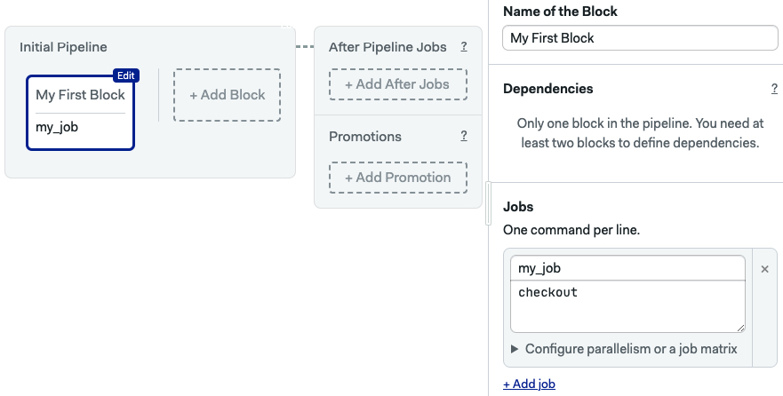
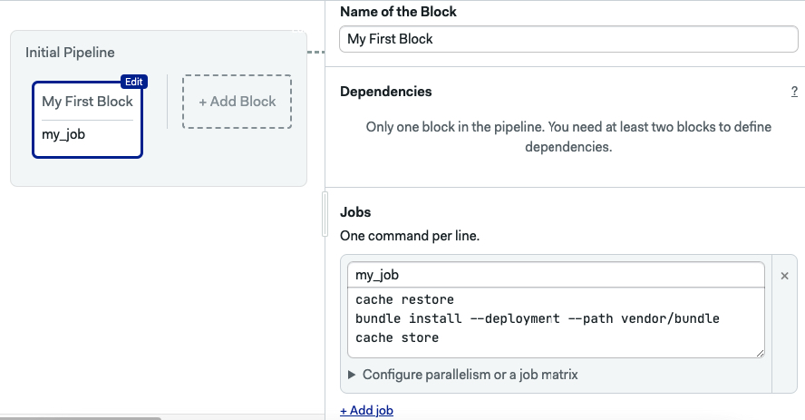
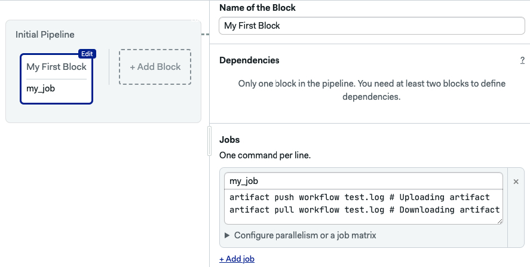

# CircleCI


This page explains the core concepts and feature mapping you need to migrate from CircleCI to Semaphore.

## Overview

CircleCI uses a YAML-based syntax to define pipelines and actions. With Semaphore, in addition to this method, you can also use the [visual workflow editor](../../using-semaphore/workflows#workflow-editor) to easily configure and preview pipelines.

This self-hosted edition of Semaphore is meant to be installed and managed by you. To access the cloud version, see [Semaphore Cloud](/getting-started/about-semaphore).

## CircleCI vs Semaphore

This section describes how to implement common CircleCI functionalities on Semaphore.

### Checkout

Checkout clones the repository in the CI environment.

<Tabs groupId="migration">
<TabItem value="circle" label="CircleCI">

CircleCI uses the Checkout action in every step and job that requires a copy of the repository.

```yaml
jobs:
  my_job:
    docker:
      - image: cimg/base:current
    # highlight-start
    steps:
      - checkout
    # highlight-end
```

</TabItem>
<TabItem value="semaphore" label="Semaphore YAML">

To clone the repository on Semaphore, execute [`checkout`](../../reference/toolbox#checkout).

```yaml
jobs:
  - name: my_job
    commands:
      # highlight-next-line
      - checkout
```

In addition, by using [`prologue`](../../reference/pipeline-yaml#prologue-in-task) and [`global_job_config`](../../reference/pipeline-yaml#global-job-config) you can declare the `checkout` for all jobs.

```yaml
# highlight-start
global_job_config:
  prologue:
# highlight-end
    commands:
      - checkout
```

</TabItem>
<TabItem value="ui" label="Semaphore Editor">



</TabItem>
</Tabs>

### Language versions

Both CircleCI and Semaphore allow you to use specific language versions.

<Tabs groupId="migration">
<TabItem value="circle" label="CircleCI">

CircleCI uses a language-specific setup orb.

The following example sets the Ruby version to `3.3.4`

```yaml
version: 2.1
orbs:
  ruby: circleci/ruby@x.y
jobs:
  my_job:
    docker:
      - image: cimg/base:current
    steps:
      # highlight-start
      - ruby/install:
          version: '3.3.4'
      # highlight-end
```

</TabItem>
<TabItem value="semaphore" label="Semaphore">

Semaphore provides the [Docker environments](../../using-semaphore/pipelines#docker-environments) to run your jobs in environments with all your build tools. You can connect multiple Docker images to provide database services for your end-to-end or smoke tests.

</TabItem>
</Tabs>

### Caching

Both CircleCI and Semaphore support manual file caching.

<Tabs groupId="migration">
<TabItem value="circle" label="CircleCI">

CircleCI has a cache action to cache files. The following example caches Gems in a Ruby project:

```yaml
# highlight-start
- restore_cache:
    name: Restore Ruby Cache
    key: gems-v1{{ checksum "Gemfile.lock" }}
# highlight-end
- run: bundle install --deployment --path vendor/bundle
# highlight-start
- save_cache:
    name: Save Ruby Gems
    key: gems-v1{{ checksum "Gemfile.lock" }}          
    paths:
      - vendor
# highlight-end
```

</TabItem>
<TabItem value="semaphore" label="Semaphore YAML">

Semaphore uses the [cache](../../reference/toolbox#cache) command to cache dependencies and files.

The following commands, when added to a job downloads, cache, and install Gems in a Ruby project:

```yaml
- name: Cache gems
  commands:
    # highlight-next-line
    - cache restore 
    - bundle install --deployment --path vendor/bundle
    # highlight-next-line
    - cache store 
```

See [caching](../../using-semaphore/cache) for more details.

</TabItem>
<TabItem value="ui" label="Semaphore Editor">



</TabItem>
</Tabs>

### Database and services

Both CircleCI and Semaphore support starting databases and services via Docker containers.

<Tabs groupId="migration">
<TabItem value="circle" label="CircleCI">

CircleCI uses service containers. The following example starts service containers for both Postgres and Redis.

```yaml
jobs:
  my_job:
    docker:
      - image: cimg/base:current
        environment:
          REDIS_URL: redis://redis:6379
      # highlight-next-line
      - image: cimg/postgres:16.0
        environment:
          POSTGRES_USER: postgres
          POSTGRES_PASSWORD: postgres
      # highlight-next-line
      - image: cimg/redis:5.0
```

</TabItem>
<TabItem value="semaphore" label="Semaphore">

Semaphore provides the [Docker environments](../../using-semaphore/pipelines#docker-environments) to run your jobs in environments with all your build tools. You can connect multiple Docker images to provide database services for your end-to-end or smoke tests.

</TabItem>
</Tabs>

### Artifacts

Both CircleCI and Semaphore support persistent Artifacts storage.

<Tabs groupId="migration">
<TabItem value="circle" label="CircleCI">

CircleCI uses the actions `store_artifacts` to upload and the API to download artifacts.

The following example uploads and downloads `test.log`

```yaml
# highlight-start
- store_artifacts:
    path: /tmp/test.log
# highlight-end
# Downloading artifacts
# highlight-next-line
- run: curl -H "Circle-Token: <circle-token>" https://circleci.com/api/v1.1/project/:vcs-type/:username/:project/latest/artifacts
```

</TabItem>
<TabItem value="semaphore" label="Semaphore YAML">

Semaphore uses the [artifact](../../reference/toolbox#artifact) command to download and upload files to the artifact store.

The following command stores `test.log` from any job:

```yaml
jobs:
  - name: my_job
    commands:
      # highlight-next-line
      - artifact push workflow test.log
```

To retrieve the file from any other job, use:

```yaml
jobs:
  - name: my_job
    commands:
      # highlight-next-line
      - artifact pull workflow test.log
```

See [artifacts](../../using-semaphore/artifacts) for more details.

</TabItem>
<TabItem value="ui" label="Semaphore Editor">



</TabItem>
</Tabs>

### Secrets

Secrets inject sensitive data and credentials into the workflow securely.

<Tabs groupId="migration">
<TabItem value="circle" label="CircleCI">

CircleCI uses contexts instead of secrets. You must create the context and its value through the UI.
Then, you can use the `context` keyword to include it in your jobs.

```yaml
workflows:
  my_workflow:
    jobs:
      - my_job:
          # highlight-start
          context:
            - awskey
          # highlight-end
```

</TabItem>
<TabItem value="semaphore" label="Semaphore YAML">

On Semaphore, we create the [secret](../../using-semaphore/secrets) at the server (instance) or project level and activate it on a block.

The secret's contents are automatically injected as environment variables in all jobs in that block.

```yaml
blocks:
  - name: Test
    task:
    # highlight-start
      secrets:
        - name: awskey
    # highlight-end
```

Additionally, it's possible to connect secrets to all jobs in the pipeline by using [`global_job_config`](../../reference/pipeline-yaml#global-job-config).

```yaml
global_job_config:
  # highlight-start
  secrets:
    - name: awskey
  # highlight-end
```

</TabItem>
<TabItem value="ui" label="Semaphore Editor">

On Semaphore, we create the [secret](../../using-semaphore/secrets) at the server (instance) or project level and activate it on a block.

The secret's contents are automatically injected as environment variables in all jobs in that block.


</TabItem>
</Tabs>

### Complete example

The following comparison shows how to build and test a Ruby on Rails project on CircleCI and Semaphore.

<Tabs groupId="migration">
<TabItem value="circle" label="CircleCI">

On CircleCI, we need several actions to start services, manage Gems, and run the build and test commands.

```yaml
version: 2.1

jobs:
  scan_ruby:
    docker:
      - image: cimg/ruby:3.3.5
    steps:
      - checkout
      - restore_cache:
          name: Restore Ruby Cache
          key: gems-v1{{ checksum "Gemfile.lock" }}
      - run:
          name: Set up Ruby
          command: |
            echo "Using Ruby version from .ruby-version"
            bundle config set --local path 'vendor/bundle'
            bundle install --jobs=4 --retry=3
      - save_cache:
          name: Save Ruby Gems
          key: gems-v1{{ checksum "Gemfile.lock" }}
          paths:
            - vendor
      - run:
          name: Scan for common Rails security vulnerabilities using static analysis
          command: bin/brakeman --no-pager

  scan_js:
    docker:
      - image: cimg/ruby:3.3.5-node
    steps:
      - checkout
      - restore_cache:
          name: Restore Ruby Cache
          key: gems-v1{{ checksum "Gemfile.lock" }}
      - run:
          name: Set up Ruby
          command: |
            echo "Using Ruby version from .ruby-version"
            bundle config set --local path 'vendor/bundle'
            bundle install --jobs=4 --retry=3
      - save_cache:
          name: Save Ruby Gems
          key: gems-v1{{ checksum "Gemfile.lock" }}
          paths:
            - vendor
      - run:
          name: Scan for security vulnerabilities in JavaScript dependencies
          command: bin/importmap audit

  lint:
    docker:
      - image: cimg/ruby:3.3.5
    steps:
      - checkout
      - restore_cache:
          name: Restore Ruby Cache
          key: gems-v1{{ checksum "Gemfile.lock" }}
      - run:
          name: Set up Ruby
          command: |
            echo "Using Ruby version from .ruby-version"
            bundle config set --local path 'vendor/bundle'
            bundle install --jobs=4 --retry=3
      - save_cache:
          name: Save Ruby Gems
          key: gems-v1{{ checksum "Gemfile.lock" }}
          paths:
            - vendor
      - run:
          name: Lint code for consistent style
          command: bin/rubocop -f github

  test:
    docker:
      - image: cimg/ruby:3.3.5
      - image: cimg/postgres:16.4.0
        environment:
          POSTGRES_USER: postgres
      - image: cimg/redis:6.2.6
    steps:
      - run:
          name: Install packages
          command: sudo apt-get update && sudo apt-get install --no-install-recommends -y curl libjemalloc2 libvips sqlite3
      - checkout
      - restore_cache:
          name: Restore Ruby Cache
          key: gems-v1{{ checksum "Gemfile.lock" }}
      - run:
          name: Set up Ruby
          command: |
            echo "Using Ruby version from .ruby-version"
            bundle config set --local path 'vendor/bundle'
            bundle install --jobs=4 --retry=3
      - save_cache:
          name: Save Ruby Gems
          key: gems-v1{{ checksum "Gemfile.lock" }}
          paths:
            - vendor
      - run:
          name: Run Rake
          environment:
            RAILS_ENV: test
          command: |
            cp .sample.env .env
            bundle exec rake db:setup
            bundle exec rake
      - run:
          name: Run tests
          environment:
            RAILS_ENV: test
          command: bin/rails db:test:prepare test test:system

workflows:
  version: 2
  main:
    jobs:
      - scan_ruby
      - scan_js
      - lint
      - test
```

</TabItem>
<TabItem value="semaphore" label="Semaphore YAML">

The following example runs the same CI procedure. You can optimize for speed by splitting the tests into different jobs.

```yaml
version: v1.0
name: CI Pipeline
agent:
  machine:
    type: s1-kubernetes
    os_image: ''
  containers:
    - name: main
      image: 'semaphoreci/ubuntu:20.04'
global_job_config:
  prologue:
    commands:
      - checkout
      - cache restore
      - bundle install --jobs 4 --retry 3
      - cache store
blocks:
  - name: Scan Ruby
    task:
      jobs:
        - name: Run Brakeman
          commands:
            - bin/brakeman --no-pager
    dependencies: []
  - name: Scan JS
    task:
      jobs:
        - name: Run JavaScript Security Audit
          commands:
            - bin/importmap audit
    dependencies: []
  - name: Lint
    task:
      jobs:
        - name: Run RuboCop
          commands:
            - bundle exec rubocop -f github
    dependencies: []
  - name: Run Tests
    task:
      jobs:
        - name: Install Dependencies and Run Tests
          commands:
            - sudo apt-get update
            - sudo apt-get install --no-install-recommends -y curl libjemalloc2 libvips sqlite3
            - cp .sample.env .env
            - 'bundle exec rake db:setup'
            - bundle exec rake
            - 'bin/rails db:test:prepare test test:system'
    dependencies: []
```

</TabItem>
</Tabs>

## See also

- [Migration guide for CircleCI](./circle)
- [Migration guide for Jenkins](./jenkins)
- [Migration guide for Travis CI](./travis)
- [Migration guide for BitBucket Pipelines](./bitbucket)
