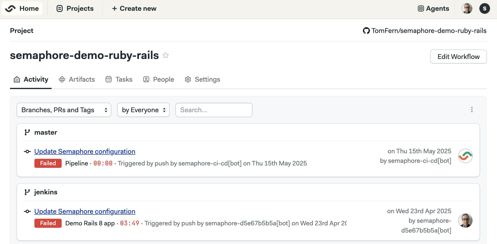
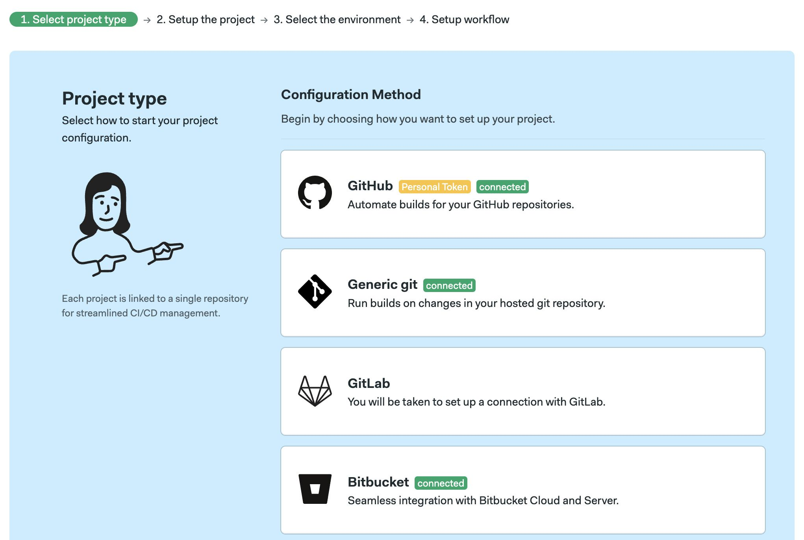
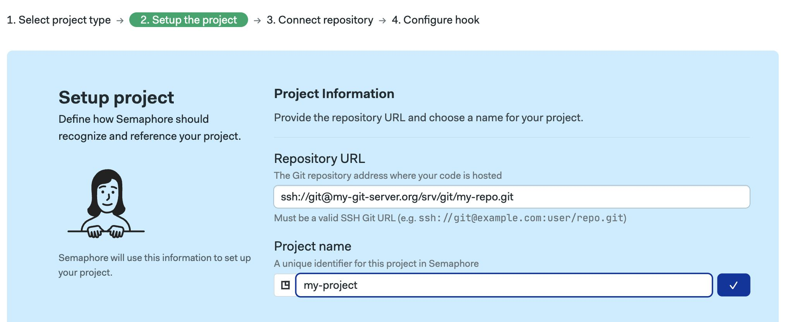
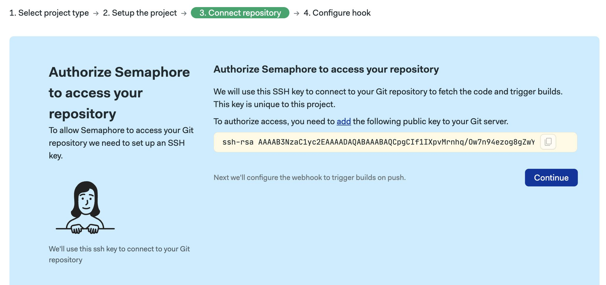
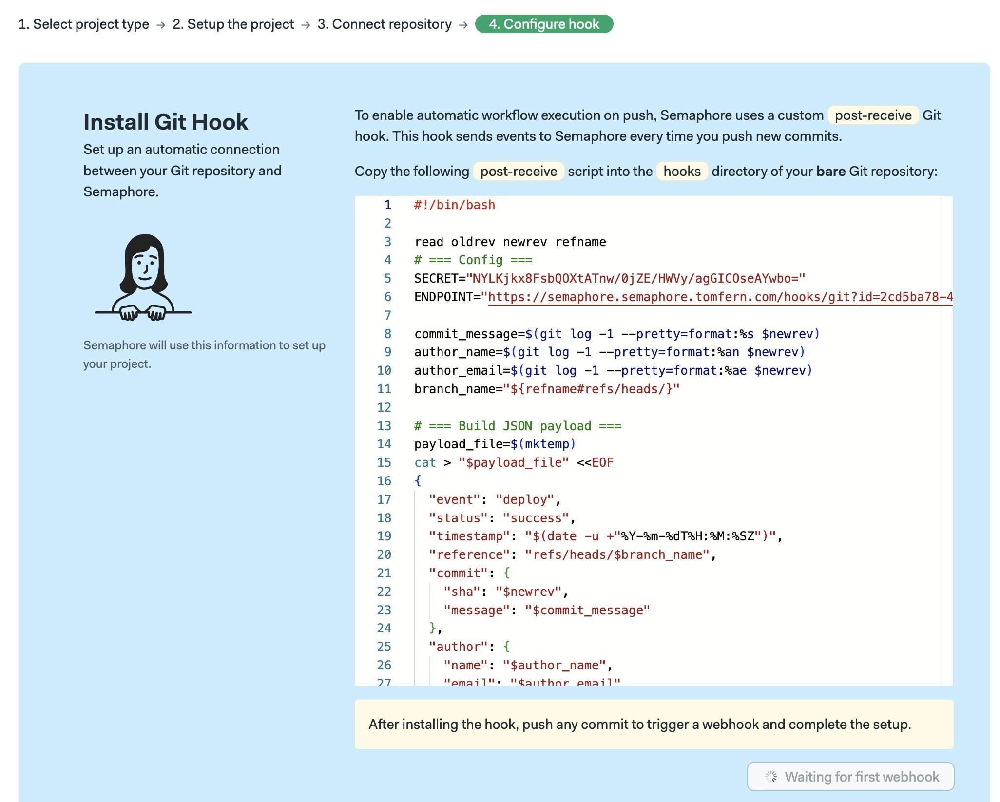
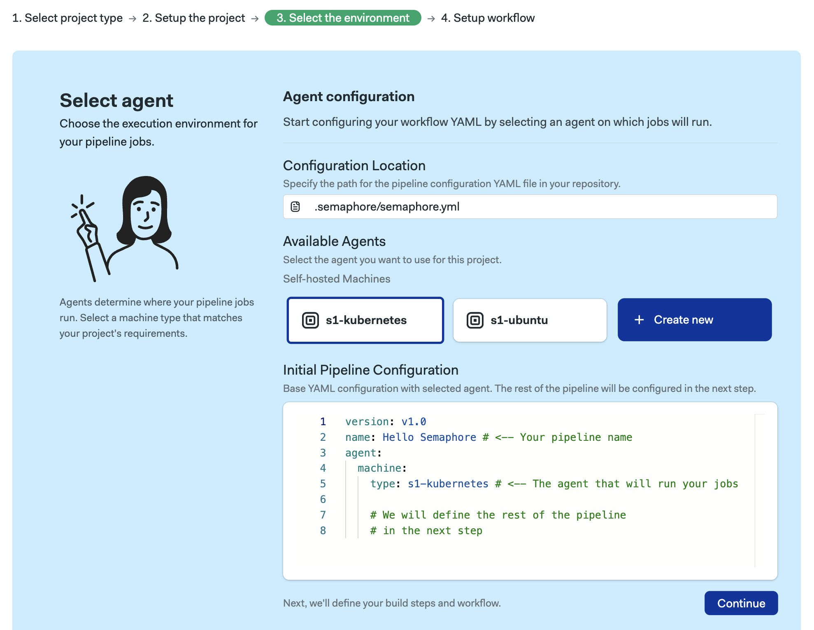
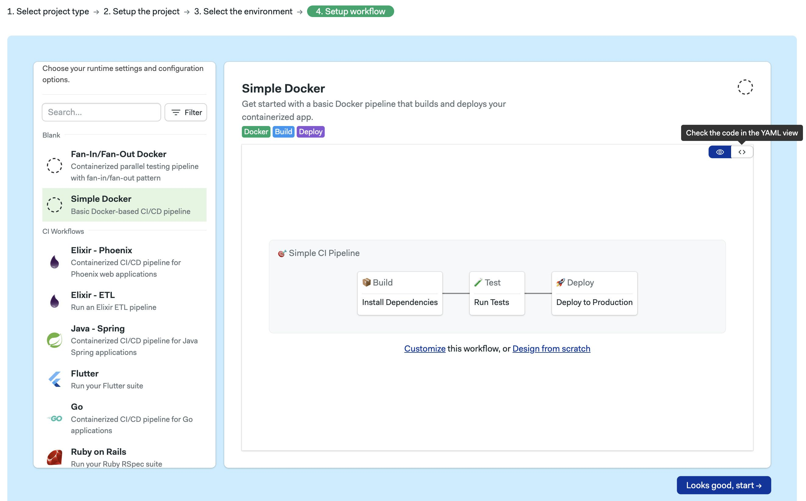
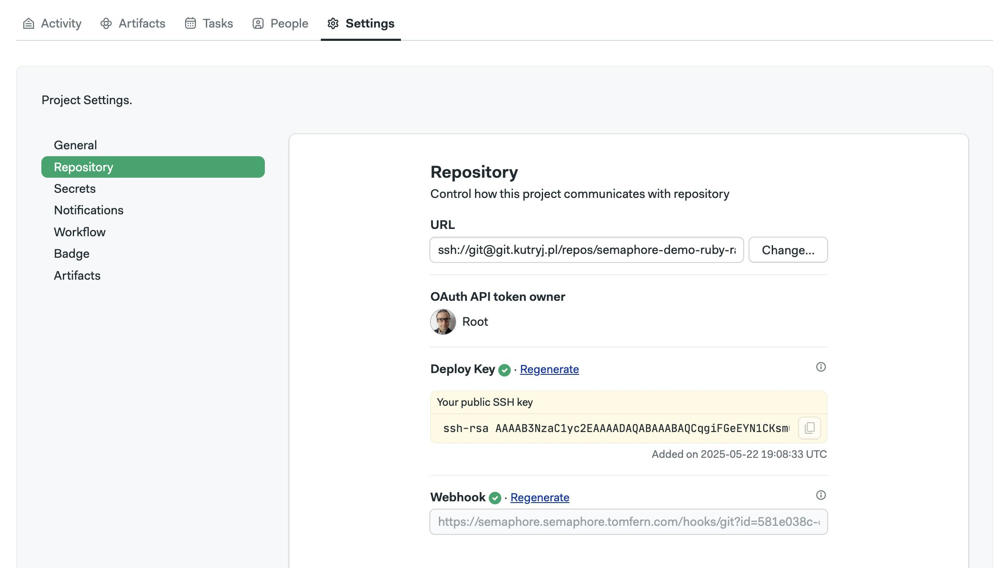
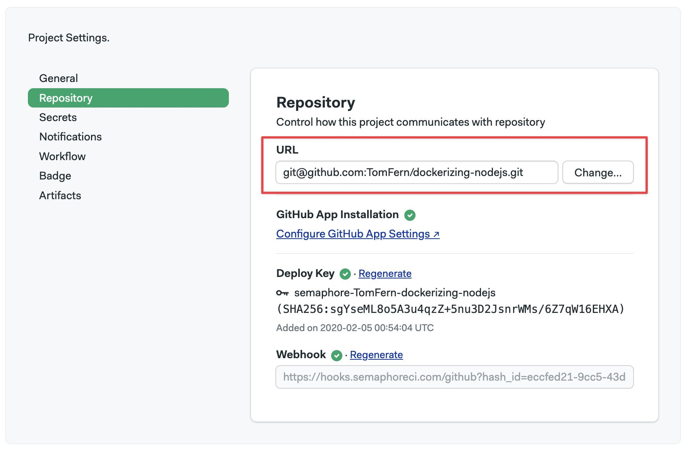

# Connect Any Git Server

import Tabs from '@theme/Tabs';
import TabItem from '@theme/TabItem';
import Available from '@site/src/components/Available';
import VideoTutorial from '@site/src/components/VideoTutorial';
import Steps from '@site/src/components/Steps';

This page explains how to add a project hosted on a private Git server. 

## Overview

Semaphore can work with repositories hosted on any privately-run [Git server](https://git-scm.com/book/en/v2/Git-on-the-Server-Getting-Git-on-a-Server) via SSH.

Before you start, ensure you have SSH access to the machine running the Git service. Then, take note of the following parameters:

- public IP or domain name of your Git server, e.g. `my-git-server.org`)
- user running the Git service, e.g. `git`
- home directory for the user running the git service, e.g. `/home/git`
- directory containing the repositories, e.g. `/srv/git`

## How to create a bare repository {#bare}

This section provides a guide on creating a new repository to practice to anyone new to the world of private Git servers. You can skip this section if you're familiar with managing Git servers.

To create a new repository:

<Steps>

1. Connect to the server running the Git service, e.g. `ssh git@example.com`

2. Change to the directory where the repositories are hosted, e.g. `cd /srv/git`

3. Create a new bare repository, e.g. `git init --bare my-repo.git`

4. On a different terminal, clone the remote repository to your local machine, e.g. `git clone ssh://git@my-git-server.org/srv/git/my-repo.git`

5. Once cloned, ensure the repository has at least one commit (so it is not empty), e.g. 

    ```shell
    cd my-repo
    echo "# This is a test" > README.md
    git add README.md
    git commit -m initial commit
    git push origin main
    ```

</Steps>

## How to create a project {#create}

To connect with this method, press the **Create new** button.



<Steps>

1. Select the **Generic Git**

    <details>
    <summary>Show me</summary>
    <div>
    
    </div>
    </details>

2. Type the SSH URL used to clone the repository, e.g. `ssh://git@my-git-server.org/srv/git/my-repo.git`

3. Optionally, change the name of the project

    <details>
    <summary>Show me</summary>
    <div>
    
    </div>
    </details>

4. Copy the public SSH key shown on screen


    <details>
    <summary>Show me</summary>
    <div>
    
    </div>
    </details>

5. SSH into the Git server add the SSH key copied in the previous step to `$HOME/.ssh/authorized_keys` (relative to the user that runs the Git service) and press **Continue**

6. Back in Semaphore, press the **Generate Script** button

    <details>
    <summary>Show me</summary>
    <div>
    
    </div>
    </details>

7. In the Git server, go into the directory containing the bare repository (e.g. `/srv/git/my-repo.git`)

8. Create the [post-receive](https://git-scm.com/docs/githooks#post-receive) script in the `hooks` directory, pay attention to:

    - Filename: `post-receive`
    - Contents: the script copied in Step 6
    - Owner: check that the script is owned by the same user running the Git service, e.g. `chown git:git post-receive`
    - Permission to execute: `chmod a+x post-receive`
    - Prerequisite packages: [curl](https://curl.se/)

9. Semaphore will wait for the post-receive hook to be executed. To do that, commit and push a new/modified file into the repository. 

10. Back in Semaphore, once the Git hook is executed, press **Configure workflow**

11. Select the default [agent](./pipelines#agents) for this project and press **Continue**

    <details>
    <summary>Show me</summary>
    <div>
    
    </div>
    </details>

12. Select a starter workflow. You may also **Customize** or **Design from scratch**


    <details>
    <summary>Show me</summary>
    <div>
    
    </div>
    </details>

</Steps>

## Troubleshooting guide

If your repositories aren't showing in Semaphore or changes are not triggering new workflows, check the connection between Semaphore and your Git server.

### Verify deploy key and webhook {#deploy-key}

<Steps>

1. Open your project

2. Go to the **Settings**, then **Repository**

    

3. Check the status of **Deploy Key** and **Webhook**. Press **Regenerate** if any of parameters are marked with error:

    - If regenerating a deployment key, you must update the `$HOME/.ssh/authorized_keys` (see Step 4 of [How to create a project](#create))
    - If regenerating the webhook, update the `endpoint` value in the `post-receive` hook (see Step 8 of [How to create a project](#create))


</Steps>

### Reconnecting moved or renamed projects {#reconnect}

There are several actions that can break the connection between the Git server and Semaphore. For example:

- moving the repository to a different location
- renaming the repository

When this happens, you must update the URL of the repository in Semaphore. To do this:

<Steps>

1. Open your [project settings](./projects#settings)
2. Type the new repository URL
3. Press **Change**
    

</Steps>

After changing the URL, double-check the status of the [deploy key](#deploy-key) and webhook.

### File semaphore.yml is not available

You might see the following error message when trying to run workflows on Semaphore:

``` yaml
semaphore.yml ERROR:
Error: {"File '.semaphore/semaphore.yml' is not available", "Not Found"}
```

This means that Semaphore can't fetch the `.semaphore/semaphore.yml` file from the repository. There are two reasons why this might happen:

1. **The file doesn't exist on your repository**: double check to make sure that the Semaphore YAML file actually exists
2. **Repository is disconnected from Semaphore**: follow the steps [previously described](#reconnect)

## See also

- [Getting Started Guide](../getting-started/guided-tour)
- [How to connect with GitHub App](./connect-github)
- [How to connect with BitBucket](./connect-bitbucket)
- [How to connect with GitLab](./connect-gitlab)

