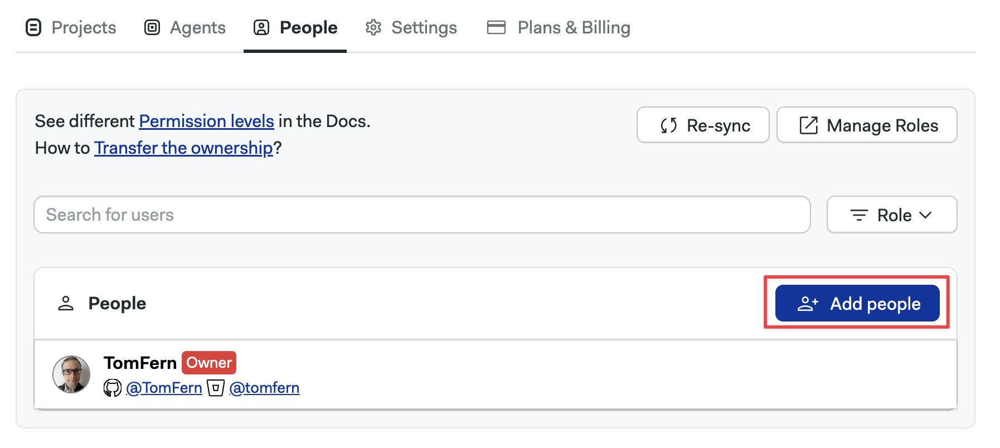
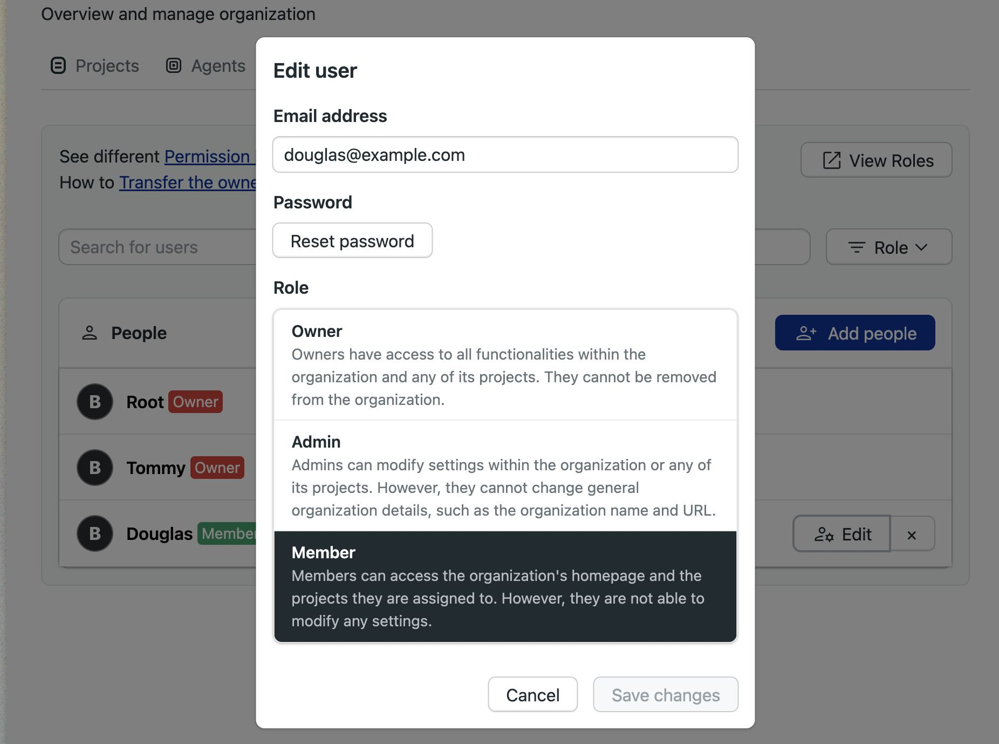
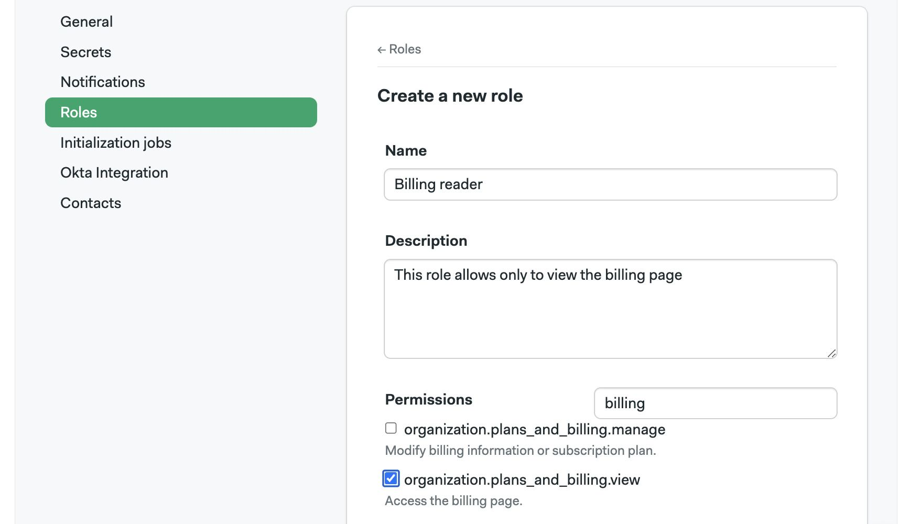
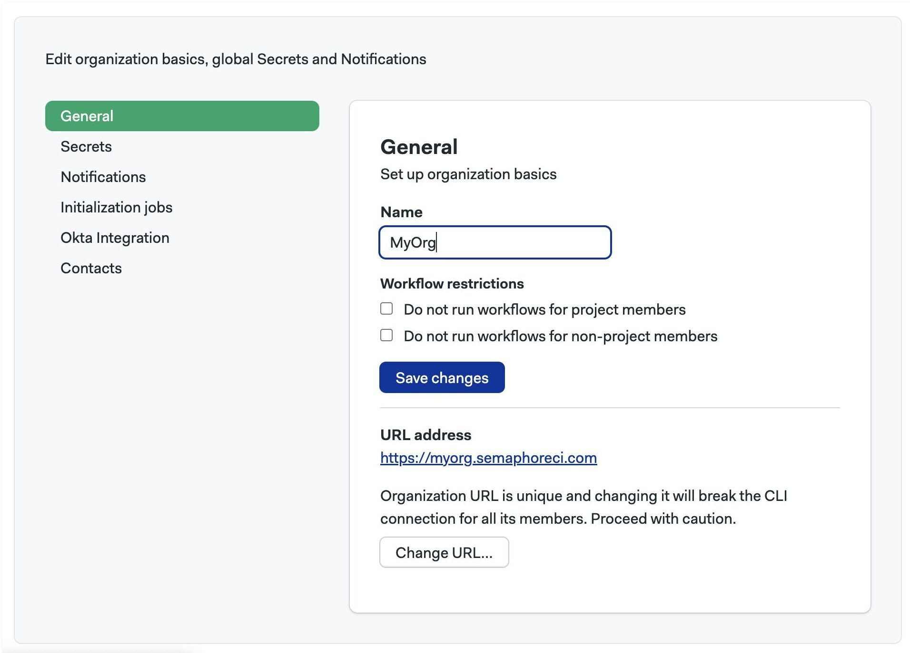

# Managing Semaphore

This page explains how to set up [notifications](./notifications), manage users, and what settings are available in your Semaphore instance. On Semaphore Enterprise Edition, we use the terms server, instance, and organization interchangeably.

## Overview {#overview}

In order to access any non-public resources on Semaphore you must be invited to the Semaphore instance.

If you are trying out Semaphore for the first time, we suggest the [Quickstart](../getting-started/quickstart), where we show how to get started quickly.

A Semaphore instance has:

- zero or more [projects](./projects)
- one or more owners
- users [role-based permissions](./rbac)
- a dedicated URL, for example, `https://semaphore.example.com`

## Managing users {#people}

Semaphore users a [Role Based Access Control](./rbac) model to manage permissions at the server and project level.

To manage users in your server, open the server menu and select **People**. This tab shows users and groups in your server along with their roles and groups.

### How to create users {#add-people}

To create new accounts, go to the people option in the server menu and follow these steps:

<Steps>

1. Press **Add people**

    

2. Type the email of the persons you wish to invite
3. Optionally, set a username. If not provided, the username is inferred from the email
4. When you are done adding users, press **Create Accounts**

    

5. Take note of the temporary passwords for each account

    

6. When the new user first logs in with the temporary password, they will be prompted to create a new one. After that, they can start using Semaphore normally.

</Steps>

### How to remove users {#remove-users}

Users can only be removed from the server when they don't own any projects. You must [transfer the ownership](./projects#owner-change) of all the user's projects before they can be removed from the server.

To remove a user, go to the people option in the server menu and follow these steps:

<Steps>

1. Transfer any [project ownership](./projects#owner-change) the user may have to another individual. The user must not own any projects
2. Press the **X** button next to the username of the user you want to remove

  

</Steps>
   
Upon removal, access to all projects in the server are revoked.

:::note

Only an Admins, Owner, or dedicated [custom roles](./rbac#custom-roles) can remove users from the server.

:::

### How to change a user role {#role-change}

To change user roles, go to the people option in the server menu and follow these steps:

<Steps>

1. Press the **Edit** button next to the user you want to change

    

2. Select the new role

    

</Steps>

### How to reset a user password {#reset-password}

To reset a user password, go to the people option in the server menu and follow these steps:

<Steps>

1. Press the **Edit** button next to the user you want to change

    

2. Press the **Reset password** button

    

3. Press **Reset password**

4. A new temporary password will be generated

5. When the user logs in with the temporary password they will be prompted to create a new password

</Steps>

### How to create groups {#add-groups}

User groups streamline user management by allowing bulk actions. After creating a group, you can:

- Add members to the group
- Assign a role to the group

All members of the group automatically inherit the permissions associated with the assigned role.

As an example, let's say you want to give the Audit team access to the [Audit logs](#audit-log) in your server. To achieve that you can:

1. Create a [custom role](#custom) with view permissions on the Billing page
2. Create an "Auditors" group
3. Assign the new custom role to the group
4. Add everyone in the Auditor team to the group
5. As the team changes, you can add or delete persons from the group

To create a group, open the server menu and select **People**. 

<Steps>

1. Press on **Create group**
2. Type in the group name and description
3. Type the names of the persons to add to the group
4. Press **Save changes** to create the group

  

</Steps>

The new group has the [member](./rbac#org-member) role by default. You can change it by pressing the **Modify Role** button and selecting a different role.

You can also define [custom server roles](#custom) if none of the pre-defined roles suit your needs.

### How to add members groups {#change-groups}

To add or remove users in a group, press the **Modify group** button next to it.

- Press the **X** button to remove the user from the group
- Type the name of the persons you want to add to the group
- Press **Save changes** to finish editing the group

### How to view pre-defined roles {#org-roles}

Semaphore provides pre-defined roles for the server. You can see what actions each role can perform by following these steps:

<Steps>

1. Open the server **Settings** menu
2. Select **Roles**
    
3. In the **Organization Roles** section, press the eye button next to the role you want to examine

</Steps>

The actions with enabled checkbox are allowed for that role.

### How to create custom roles {#custom}

Create custom roles to give your users the precise permissions they need. 

<Steps>

1. Open the serve **Settings** menu
2. Select **Roles**
3. On the **Organization Roles** section, press **New Role**
4. Give a name a description to the new role
5. Enable the permissions allowed to the role. You can use the search box to narrow down options
6. Press **Save changes**

  

</Steps>

Semaphore users a [Role Based Access Control](./rbac) model to manage permissions at the instance level.

To manage users in your Semaphore instance, open the server menu and select **People**. This tab shows users and groups in your instance along with their roles and groups.

### How to view permissions for roles {#org-roles}

Semaphore provides pre-defined roles. These permissions cannot be changed (but new roles can be added, see. You can see what actions each role can perform by following these steps:

<Steps>

1. Open the server **Settings** menu
2. Select **Roles**
    
3. In the **Organization Roles** section, press the eye button next to the role you want to examine

</Steps>

The actions with enabled checkbox are allowed for that role.

## Instance settings {#org-settings}

To access your settings, open the server menu and click on **Settings**.

### General settings {#general-settings}

This page shows the main settings for your instance. Here, you can change its name, and control how [workflows](./workflows) run.

:::info

The *URL of your server* is the URL that leads to the Home page in your Semaphore instance. For example `semaphore.example.com`

:::

### Notifications {#slack-notifications}

You can set up Slack and other webhook-based notifications to get your team notified whenever there [project](./projects) finishes running.

To learn more, see the [notification documentation](./notifications.md)

### Initialization agent {#init-agent}

Some types of pipelines require [initialization job](./pipelines#init-job) to evaluate and compile the them before the workload beings.

Semaphore tries to pick the best type of agent automatically but you change it for the whole server. This is particularly useful when you are using [self-hosted agents](./self-hosted).

To change the initialization job agent for all your [projects](./projects) in your Semaphore instance, follow these steps:

<Steps>

1. Select **Initialization job** from the settings menu
2. Select the **Environment type**
3. Select the **Machine type**
4. Select the **OS image** (if available)
5. Press **Save**

  

</Steps>

:::info

If you experience errors during initialization, see the [initialization job logs](./pipelines#init-logs) to help troubleshoot the issue.

:::

### Okta integration {#okta-integration}

Integration with Okta allows you to automate user management within your Semaphore server, as well as to use Okta apps for Single Sign On.

For more information, see the [Okta integration page](./okta.md)

## Audit logs {#audit-log}

<VideoTutorial title="How to view audit logs" src="https://www.youtube.com/embed/o5yXSvjcz7s"/>

To support compliance, accountability, and security, Semaphore provides logs of audited events. Audit Log events are events that affect your server, projects, users, or any other resources in Semaphore. Events contain information about when who and what was the performed activity.

You can find audit logs in your server settings under **Audit Logs**.

The audit logs shows all the [audited events](../reference/audit-events) in reverse chronological order. Latest events are shown first.

### How to export audit logs {#audit-export}

Audit logs can be exported in two ways:

- CSV file
- Streaming to an S3-compatible bucket

To export the logs as CSV, press the **Export as CSV** button.

To configure streaming to an S3-compatible bucket, press the **Configure Streaming** button and:

<Steps>

1. Select between AWS and Google Cloud
2. Type the region (AWS only)
3. Type the bucket name
4. Type the access token

    - **AWS**: provide the Access Key ID and Access Key Secret for the IAM account
    - **Google Cloud**: provide the [HMAC Key](https://cloud.google.com/storage/docs/authentication/managing-hmackeys#command-line) for a service account

    The service account credentials provided must have write and read access to the bucket

5. Press **Looks Good**

  

</Steps>

:::info

Audit logs are streamed to the bucket once per day.

:::

## Project queues {#queue}

You can use queues to control the order in which pipelines are executed in your instance. See [named queues](./pipelines#named-queues) for more information.

## Activity monitor {#activity-monitor}

The activity monitor show the [agent](./pipelines#agents) utilization and the currently running pipelines.

To view the activity monitor, open your server menu and select **Activity Monitor**.

In the activity monitor, you can see the machine quota utilization for your instance. Here, you can have an overview on how Semaphore Cloud machines and [self-hosted agents](./self-hosted) are being used.

In the lower part of the activity monitor you can find the currently running workflows for all the [projects](./projects) in your instance. Use this to know what [jobs](./jobs) are running, and see which ones are waiting in the queue to debug usage issues.

## See also

- [How to configure notifications](./notifications)
- [How to configure projects](./projects)
