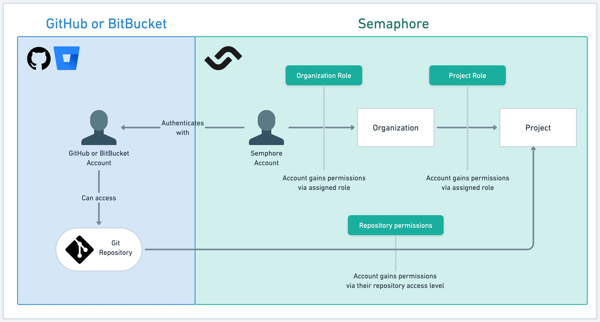

# Role Based Access Control

import Tabs from '@theme/Tabs';
import TabItem from '@theme/TabItem';
import Available from '@site/src/components/Available';
import VideoTutorial from '@site/src/components/VideoTutorial';
import Steps from '@site/src/components/Steps';

<VideoTutorial title="How to use Role Based Access Control" src="https://www.youtube.com/embed/YQ3LP5_UmpA?si=9GXkhLkPwT9lMpYJ" />

Manage user permissions in your server and projects with Role Based Access Control (RBAC). This page gives an overview of RBAC, how to assign roles to users and groups, and how to create custom roles. This page uses the terms organization, server, and instance interchangeably.

## Overview

Semaphore uses an RBAC model to determine what actions users can take in server and projects.

An server [Admin](#org-admin) or [Owner](#org-owner) must invite users via before they can access the Semaphore server or any of the projects.

### Role scopes {#scopes}

Semaphore manages roles on two levels:

- [Server](#org): these roles allow users to perform various server actions. Users need to be added to the server before they can access projects.
- [Project](#project): these roles give access to a [project](./projects) within the server. Users need to have access to the repository connected to the project.

Roles can be gained in three ways:

- **Direct**: you can directly assign up to one server role and one project role to the user
- **Group**: you can grant roles to [groups](#org-groups). Group members gain the role assigned to the group
- **Repository**: users may gain project permissions based on their roles in the related repository (only on GitHub)

### Permissions are additive {#additive}

Permissions are additive. Users gaining permissions through multiple ways obtain the combined total of all permissions.

For example, let's say Pam has the [admin](#org-admin) role in the server. This gives her unfettered access to all the projects in the server. If Kevin gives her the [reader](#project-reader) role in one project, she is still effectively admin in that project. In other words, roles never subtract permissions.

## Server roles {#org}

Server roles control what actions the users may perform in Semaphore. Users need to be added to the server before they can be granted a role. Only users who are part of the server can log in to Semaphore.

The only exception is when a user is added via the [Okta integration](./okta).

### Member {#org-member}

Server members can access the server's homepage and the projects they are assigned to. They can't modify any settings.

This is the default role assigned when a user is added to the server.

Among other actions, members can:

- View the server's activity
- View and manage dashboards
- View and manage [notifications](./notifications)
- Create [projects](./projects)
- View and manage [secrets](./secrets)
- View and manage [self-hosted agents](./self-hosted)

For the full list of member permissions, see [server roles](./organizations#org-roles).

### Admin {#org-admin}

Admins can modify settings within the server or any of its projects. They do not have access to billing information, and they cannot change general server details, such as the server URL.

Only Admins and Owners can invite users to the Semaphore server.

In addition to the [member permissions](#org-member), admins can:

- View and manage server settings
- View and manage the [Okta integration](./okta)
- Invite users to the server
- Remove people from the server
- View and manage billing plans
- View and manage [pre-flight checks](./org-preflight)
- View and manage [usage policy for secrets](./secrets#secret-access-policy)

For the full list of admin permissions, see [server roles](./organizations#org-roles).

### Owner {#org-owner}

The owner of the server is the person that created it. An server can have multiple owners.  Owners have access to all functionalities within the server and any of its projects. Only Admins and Owners can invite users to the server.

For the full list of owner permissions, see [server roles](./organizations#org-roles).

To remove an owner, see [how to remove an owner](https://docs.semaphoreci.com/using-semaphore/organizations#remove-owner).

### Server groups {#org-groups}

Your server can have any number of groups. A group can have exactly one role directly assigned.

Groups can be added to the project and assigned exactly to [project-level role](#project). This grants every member of the group access to the project and grants them all the permissions inherited from the roles.

## Project roles {#project}

Project roles control what actions the users may perform on the project. Project roles are assigned per project.

To grant a user access to a given project they need to:

- Be part of the Semaphore server
- Have access to the repository related to the project
- Be granted access to the Semaphore project

The role given when a user is added to the project depends on their repository-level role. The following table shows how repository permissions map to project roles.

| GitHub repo role | BitBucket repo role | Semaphore project role | 
|--|--|--|
|Pull|Read|[Reader](#project-reader)|
|Push|Write|[Contributor](#project-contributor)|
|Admin|Admin|[Contributor](#project-contributor)|

### Reader {#project-reader}

Readers can access the project page, and view workflows, their results, and job logs. They cannot make any modifications to the project.

Readers have:

- Read-only access to [artifacts](./artifacts)
- Read-only access to [deployment targets (environment)](./promotions#deployment-targets)
- Read-only access to [test reports](./tests/test-reports) and [flaky tests](./tests/flaky-tests)
- Read-only access to [tasks](./tasks)
- View project notifications
- View project [pre-flight checks](./projects#preflight)

For the full list of reader permissions, see [project roles](./projects#project-roles).

### Contributor {#project-contributor}

Contributors can view, rerun, change workflows, and SSH into jobs. Can promote and view insights, and run schedulers.

In addition to the [reader permissions](#project-reader), contributors can:

- Delete the project
- Change project settings
- Manage project [pre-flight checks](./projects#preflight)
- Manage [test reports](./tests/test-reports) and [flaky tests](./tests/flaky-tests)
- Manage [tasks](./tasks)

For the full list of contributor permissions, see [project roles](./projects#project-roles).

### Admin {#project-admin}

Admins have the authority to modify any setting within the projects, including the ability to add new individuals or remove them.

## Custom roles {#custom-roles}

In addition to the pre-defined roles provided by Semaphore, you can create your own custom roles. Custom roles let you follow the principle of least privilege when managing using permissions.

To manage custom roles, see the following pages:

- [How to manage server custom roles](./organizations#custom)
- [How to manage project custom roles](./projects#custom-roles)

## See also

- [How to manage server users](./organizations#people)
- [How to manage project access](./projects#people)
- [Okta integration](./okta)
