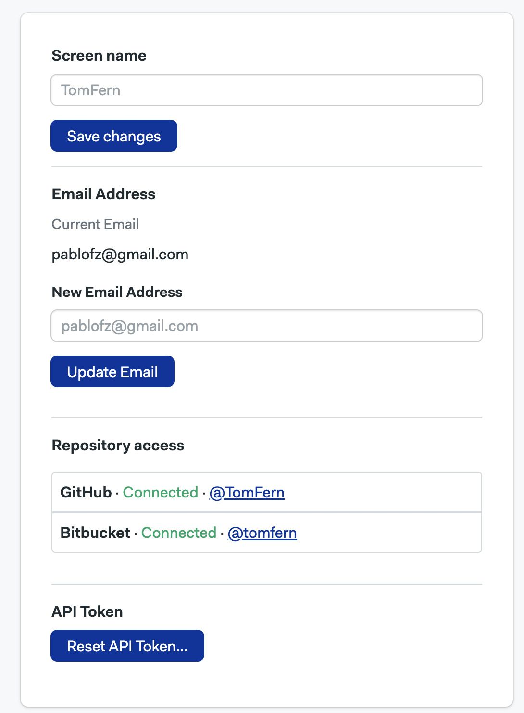
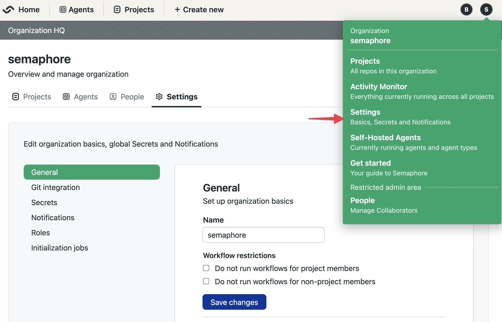

# Managing User Accounts

Semaphore users a [Role Based Access Control](./rbac) model to manage permissions at the organization and project level.

## Manage your user profile {#profile}

You can manage your Semaphore user profile details such as email address, username, and access token.

### How to change your username {#profile-username}

To change your Semaphore username, follow these steps:

<Steps>

1. Open your user menu on the top-right corner
2. Select **Profile settings**

    

3. Under **Screen name**, type your new name

    

4. Press **Save changes**

</Steps>

### How to change your email address {#profile-email}

:::warning

Changing your user profile email address can revoke access to integrations such as GitHub and BitBucket. You may need to reconnect your repositories after changing your email address.

:::

To change your Semaphore email address, follow these steps:

<Steps>

1. Open your user menu on the top-right corner
2. Select **Profile settings**

    

3. Under **Email Address**, type your email address

    

4. Press **Update email**

5. Confirm the change

</Steps>

### How to reset your personal API token {#profile-token}

:::warning

Changing your access token will revoke access to the [Semaphore API](../reference/api) and access via the [Semaphore CLI](../reference/semaphore-cli). Only reset your token if you have lost access to it or suspect someone else has been using it on your behalf.

:::

To reset your Semaphore API token, follow these steps:

<Steps>

1. Open your user menu on the top-right corner
2. Select **Profile settings**

    

3. Under **API Tokek** press **Reset API Token**

    

4. Confirm the change, copy the new to token and save it on a safe place

</Steps>

## Managing Semaphore users {#people}

To manage users in your organization, open the organization menu and select **People**. This tab shows users and groups in your organization along with their roles and groups.

### How to invite users {#add-people}

To invite a user to your organization, press the **Add people** button:

<Steps>

1. Select one of the available tabs

    - Type the user's handle, e.g. `TomFern`, or select the user from the list. Usernames are case-sensitive and all characters are considered. Ensure the handle is entered accurately to avoid errors.
    - If you don't see the user in the list. Ensure they have repository access in **GitHub** or **BitBucket** for at least one project in your organization

      

2. Press **Add selected**
3. Optionally, set their [role](#roles-people)

</Steps>

:::info

If you see an error with the message "error finding USERNAME: 401", it's likely that the your Semaphore account, as the inviter, is no longer linked to GitHub or BitBucket.

To fix the issue, reconnect your account by granting access again via [GitHub](./connect-github-oauth#connect-oauth) or [Bitbucket](./connect-bitbucket#grant-bb). This should restore your ability to send invitations.

:::

### How to remove users {#remove-users}

Users can only be removed from the organization when they don't own any projects. You must [transfer the ownership](./projects#owner-change) of all the user's projects before they can be removed from the organization.

To remove a user, go to the people option in the organization menu and follow these steps:

<Steps>

1. Transfer any [project ownership](./projects#owner-change) the user may have to another individual. The user must not own any projects
2. Press the **X** button next to the username of the user you want to remove

    

</Steps>
   
Upon removal, access to all projects in the organization are revoked.

:::note

Only an Admins, Owner, or dedicated [custom roles](./rbac#custom-roles) can remove users from the organization.

:::

### How to change user roles {#roles-people}

To change the role of a user, press the **Change Role** button next to the person.

See [organization roles](./rbac#org) to learn what roles are available.

### How to create groups {#add-groups}

<Available plans={['Enterprise']}/>

User groups streamline user management by allowing bulk actions. After creating a group, you can:

- Add members to the group
- Assign a role to the group

All members of the group automatically inherit the permissions associated with the assigned role.

As an example, let's say you want to give the Finance team access to the [Audit logs featur](./organizations#audit-log) in your organization. To achieve that you can:

1. Create a [custom role](#custom) with view permissions on the Billing page
2. Create a Auditors group
3. Assign the new custom role to the group
4. Add everyone in the Auditor team to the group
5. As the team changes, you can add or delete persons from the group

To create a group, open the organization menu and select **People**. 

<Steps>

1. Press on **Create group**
2. Type in the group name and description
3. Type the names of the persons to add to the group
4. Press **Save changes** to create the group

    

</Steps>

The new group has the [member](./rbac#org-member) role by default. You can change it by pressing the **Modify Role** button and selecting a different role.

You can also define [custom organization roles](#custom) if none of the pre-defined roles suit your needs.

### How to change group roles {#group-role}

To change the role of a group, press the **Change Role** button next to the group.

### How to add members groups {#change-groups}

To add or remove users in a group, press the **Modify group** button next to it.

- Press the **X** button to remove the user from the group
- Type the name of the persons you want to add to the group
- Press **Save changes** to finish editing the group

### How to view pre-defined roles {#org-roles}

Semaphore provides pre-defined roles for organizations. You can see what actions each role can perform by following these steps:

## Managing users {#people}

Semaphore users a [Role Based Access Control](./rbac) model to manage permissions at the server and project level.

To manage users in your server, open the server menu and select **People**. This tab shows users and groups in your server along with their roles and groups.

### How to create users {#add-people}

To create new accounts, go to the people option in the server menu and follow these steps:

<Steps>

1. Press **Add people**

      

2. Type the email of the persons you wish to invite
3. Optionally, set a username. If not provided, the username is inferred from the email
4. When you are done adding users, press **Create Accounts**

      

5. Take note of the temporary passwords for each account

      

6. When the new user first logs in with the temporary password, they will be prompted to create a new one. After that, they can start using Semaphore normally.

</Steps>

### How to remove users {#remove-users}

Users can only be removed from the server when they don't own any projects. You must [transfer the ownership](./projects#owner-change) of all the user's projects before they can be removed from the server.

To remove a user, go to the people option in the server menu and follow these steps:

<Steps>

1. Transfer any [project ownership](./projects#owner-change) the user may have to another individual. The user must not own any projects
2. Press the **X** button next to the username of the user you want to remove

    

</Steps>
   
Upon removal, access to all projects in the server are revoked.

:::note

Only an Admins, Owner, or dedicated [custom roles](./rbac#custom-roles) can remove users from the server.

:::

### How to change a user role {#role-change}

To change user roles, go to the people option in the server menu and follow these steps:

<Steps>

1. Press the **Edit** button next to the user you want to change

      

2. Select the new role

      

</Steps>

### How to reset a user password {#reset-password}

To reset a user password, go to the people option in the server menu and follow these steps:

<Steps>

1. Press the **Edit** button next to the user you want to change

      

2. Press the **Reset password** button

      

3. Press **Reset password**

4. A new temporary password will be generated

5. When the user logs in with the temporary password they will be prompted to create a new password

</Steps>

### How to create groups {#add-groups}

User groups streamline user management by allowing bulk actions. After creating a group, you can:

- Add members to the group
- Assign a role to the group

All members of the group automatically inherit the permissions associated with the assigned role.

As an example, let's say you want to give the Audit team access to the [Audit logs](./organizations#audit-log) in your server. To achieve that you can:

1. Create a [custom role](#custom) with view permissions on the Billing page
2. Create an "Auditors" group
3. Assign the new custom role to the group
4. Add everyone in the Auditor team to the group
5. As the team changes, you can add or delete persons from the group

To create a group, open the server menu and select **People**. 

<Steps>

1. Press on **Create group**
2. Type in the group name and description
3. Type the names of the persons to add to the group
4. Press **Save changes** to create the group

    

</Steps>

The new group has the [member](./rbac#org-member) role by default. You can change it by pressing the **Modify Role** button and selecting a different role.

You can also define [custom server roles](#custom) if none of the pre-defined roles suit your needs.

### How to add members groups {#change-groups}

To add or remove users in a group, press the **Modify group** button next to it.

- Press the **X** button to remove the user from the group
- Type the name of the persons you want to add to the group
- Press **Save changes** to finish editing the group

### How to view pre-defined roles {#org-roles}

Semaphore provides pre-defined roles for the server. You can see what actions each role can perform by following these steps:

<Steps>

1. Open the server **Settings** menu
2. Select **Roles**

      

3. In the **Organization Roles** section, press the eye button next to the role you want to examine

</Steps>

The actions with enabled checkbox are allowed for that role.

### How to create custom roles {#custom}

Create custom roles to give your users the precise permissions they need. 

<Steps>

1. Open the serve **Settings** menu
2. Select **Roles**
3. On the **Organization Roles** section, press **New Role**
4. Give a name a description to the new role
5. Enable the permissions allowed to the role. You can use the search box to narrow down options
6. Press **Save changes**

    

</Steps>

Semaphore users a [Role Based Access Control](./rbac) model to manage permissions at the instance level.

To manage users in your Semaphore instance, open the server menu and select **People**. This tab shows users and groups in your instance along with their roles and groups.

### How to view permissions for roles {#org-roles}

Semaphore provides pre-defined roles. These permissions cannot be changed (but new roles can be added, see. You can see what actions each role can perform by following these steps:

<Steps>

1. Open the server **Settings** menu
2. Select **Roles**

      

3. In the **Organization Roles** section, press the eye button next to the role you want to examine

</Steps>

The actions with enabled checkbox are allowed for that role.

