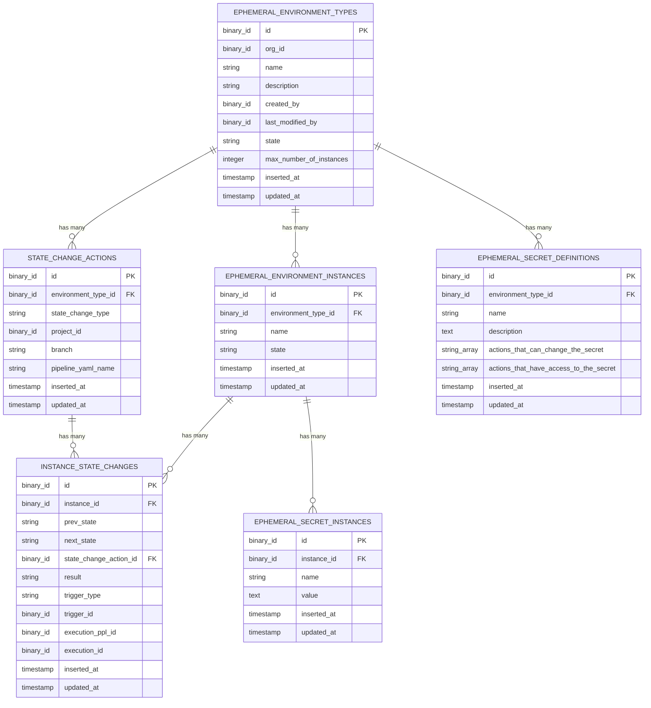

# EphemeralEnvironments

**TODO: Add description**

## Database schem

```mermaid
erDiagram
    EPHEMERAL_ENVIRONMENT_TYPES {
        binary_id id PK
        binary_id org_id
        string name
        string description
        binary_id created_by
        binary_id last_modified_by
        string state
        integer max_number_of_instances
        timestamp inserted_at
        timestamp updated_at
    }

    STATE_CHANGE_ACTIONS {
        binary_id id PK
        binary_id environment_type_id FK
        string state_change_type
        binary_id project_id
        string branch
        string pipeline_yaml_name
        timestamp inserted_at
        timestamp updated_at
    }

    EPHEMERAL_ENVIRONMENT_INSTANCES {
        binary_id id PK
        binary_id environment_type_id FK
        string name
        string state
        timestamp inserted_at
        timestamp updated_at
    }

    INSTANCE_STATE_CHANGES {
        binary_id id PK
        binary_id instance_id FK
        string prev_state
        string next_state
        binary_id state_change_action_id FK
        string result
        string trigger_type
        binary_id trigger_id
        binary_id execution_ppl_id
        binary_id execution_id
        timestamp inserted_at
        timestamp updated_at
    }

    EPHEMERAL_SECRET_DEFINITIONS {
        binary_id id PK
        binary_id environment_type_id FK
        string name
        text description
        string_array actions_that_can_change_the_secret
        string_array actions_that_have_access_to_the_secret
        timestamp inserted_at
        timestamp updated_at
    }

    EPHEMERAL_SECRET_INSTANCES {
        binary_id id PK
        binary_id instance_id FK
        string name
        text value
        timestamp inserted_at
        timestamp updated_at
    }

    %% Relationships
    EPHEMERAL_ENVIRONMENT_TYPES ||--o{ STATE_CHANGE_ACTIONS : "has many"
    EPHEMERAL_ENVIRONMENT_TYPES ||--o{ EPHEMERAL_ENVIRONMENT_INSTANCES : "has many"
    EPHEMERAL_ENVIRONMENT_TYPES ||--o{ EPHEMERAL_SECRET_DEFINITIONS : "has many"
    
    EPHEMERAL_ENVIRONMENT_INSTANCES ||--o{ INSTANCE_STATE_CHANGES : "has many"
    EPHEMERAL_ENVIRONMENT_INSTANCES ||--o{ EPHEMERAL_SECRET_INSTANCES : "has many"
    
    STATE_CHANGE_ACTIONS ||--o{ INSTANCE_STATE_CHANGES : "has many"
```
