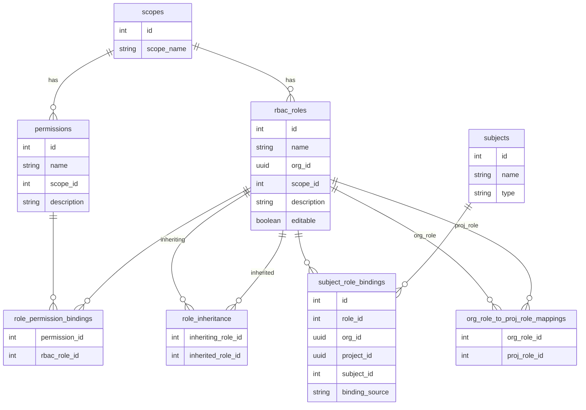
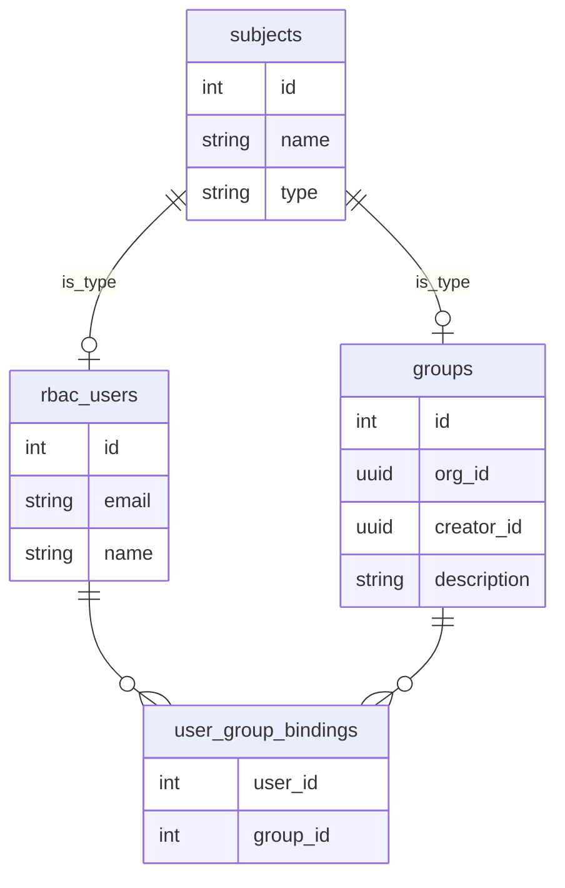
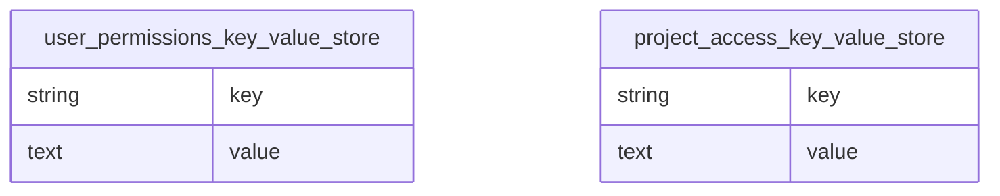
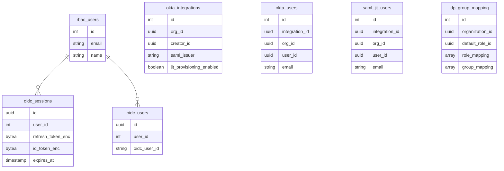
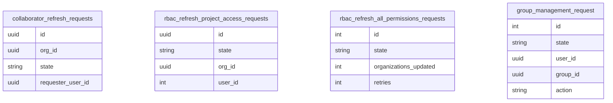
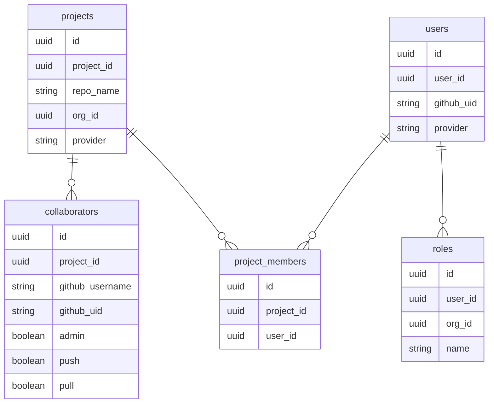

# RBAC Service

Role-Based Access Control (RBAC) service for Semaphore CI/CD platform.

## Database Schema

Important note! Even though there is a dedicated RBAC microservice (this one), for legacy reasons it uses the Guard database. Therefore, if you need to make changes to the DB schema, you need to go to the Guard project and add an Ecto migration there. Then, copy that same migration here to RBAC for testing purposes.

### Core RBAC System

The center of the RBAC system is the subject role bindings table, which assigns a role to a given subject (either a user or a group), and that role has a list of permissions attached to it.

There are two resources to which roles can be assigned: you can have a role within the organization, or you can have a role within the project. If you want to assign a role within the organization, that role has to be of the "organization scope", and if you want to assign a role within the project, then the role you are assigning must be of the "project scope".

### Subject System (Users & Groups)

### Additional Complexity

Role Inheritance

One role can inherit another role and all of its permissions. Every time we want to calculate the permissions you have, we have to check the roles you are assigned, but also all the roles they inherit. This is a redundant feature. We're not really using in our production setup (except some Insider roles). Even though this is tested and works, we've never really found a use for it. When you're trying to create a new role within the custom roles UI, there is no way for you to set up role inheritance.

Organization Role to Project Role Mappings

Another table is organization role to project role mappings. This is something we are using regularly. You can say that some organizational role, like "Owner", carries automatic "Admin" access to all of the projects within the organization. In this case, organization role "Owner" maps to project role "Admin", and this also has to be taken into consideration when we are checking if user has access to a project: Even though they might not have a role directly within the project, they maybe have an organization role which maps to project role.

Groups

The subject in subject role bindings can be a user, but it can also be a group. When we are actually trying to see which permissions a user has, we have to track all of the roles assigned directly. We also have to check if the user is part of a group, and then if they are, we also need to check all of the roles that the group has.
We have tested groups thoroughly, but I'm not sure if any customers are using them.

### Key-Value Stores & Audit

User Permission Key Value Store

All of this complexity makes actually figuring out which permissions a user has within an organization (or project) a bit more time consuming. Query which calculates all of the permisions for a given user/organization/project is written in the `Rbac.ComputePermissions` module of this service. Depending on the size of the organization, number of users and projects they have, it can take from >1s, to 6,7s to calculate these permission.

That's why we had a need for `user_permissions_key_value_store` and `project_access_key_value_store`. Instead of calculating all of the permissions for every "GET" query, there is one table which stores all of the permissions user has within the org and/or project, and another with list of projects user has access to within the organization.

These key value stores are recalculated anytime somebody is assigned a new role, anytime somebody's role is being removed, when you are joining a group, when you are being removed from a group, or when the role definition changes (which can happen with custom roles).

Performance Issues

As mentioned above, recalculation permissions usually takes around a second, but for some organizations that have a lot of projects, it can take five or six seconds. In some extreme cases, it can take around 10+ seconds, and this is where a problem occurs because we are hitting gRPC request timeout. You get bad UX experience when you want to change a role and you get a spinner for, let's say, 10 seconds, and it just times out. One major improvement we can do is to make role assignment and role retraction asynchronous, like many other operations in RBAC already are.

### Identity Provider Integration

### Background Job Tables

### Legacy Tables

These tables are leftover from the old auth system. We still use collaborators table when we want to sych GitHub repo access with the Semaphore project roles.

## Provisioning SCIM/SAML JIT Users

### SCIM Provisioning

When we receive a SCIM request, we first validate that the signature is correct. Once validated, we create an `okta_user` entity in the database (note: this is an outdated name that predates our support for multiple identity providers), or update an existing `okta_user` if one already exists. The user is placed in a pending state.

A SCIM provisioner async worker then processes these pending `okta_user` entities. Based on the payload of the SCIM request (which is stored as part of the `okta_user` database entity), the worker performs one of three actions:
- Creates a new user and adds them to the organization
- Updates an existing user
- Deactivates a user and removes them from the organization

### SAML JIT Provisioning

When we receive a SAML request, we check if an `okta_user` (SCIM user) already exists for that user. If no SCIM user exists, we return a 404 error, unless the organization has SAML JIT (Just-In-Time) provisioning enabled.

If SAML JIT provisioning is enabled and this is the user's first SAML request, we create a `saml_jit_user` entity. The SAML JIT provisioner picks this up immediately and creates a proper Semaphore user.

### Known Limitation

The SAML JIT provisioning implementation has a limitation that should be addressed. Even though the structure of the `saml_jit_user` entity is designed to work with async workers, those workers were never implemented. The current implementation processes SAML JIT users synchronously during the request. If there is no available database connection at the time of the SAML request, the request will fail, and the SAML JIT user will not be processed again. This differs from the SCIM provisioning flow, which properly handles retries through the async worker pattern.

## Adding New Permissions/Changing Roles

### Adding New Permissions

When you want to add a new permission, there is a `permissions.yaml` file in the assets folder. You can add new permissions there, and on the next deployment, they will be added to the database.

### Changing Roles

Adding new permissions to existing roles (or changing roles at all) takes a few more steps. There is a `roles.yaml` file where all existing roles are listed, together with the permissions they have. These definitions apply to any newly created role. When a new organization is created, RBAC receives an AMQP message and creates all the roles for that new organization. These new roles will follow the role definitions from `roles.yaml`, but when you make changes to `roles.yaml`, existing roles won't be affected.

If you want to change the existing roles, you have to:

1. Change the contents of the `role_permission_binding` table
2. Recalculate all of the permissions in `user_permission_key_value_store`

The second step can be (in theory) done just by executing the `recalculate_entire_cache` function within the `user_permissions` module, but if there is a lot of data, which is the case for our production environment, it will time out and fail.

For that reason, we added a new worker called `refresh_all_permissions.ex`. By executing `Rbac.Repo.RbacRefreshAllPermissionsRequest.create_new_request()`, a new request will be inserted into the database, and the worker usually takes several hours to update all of the permissions in the cache for every single organization.
