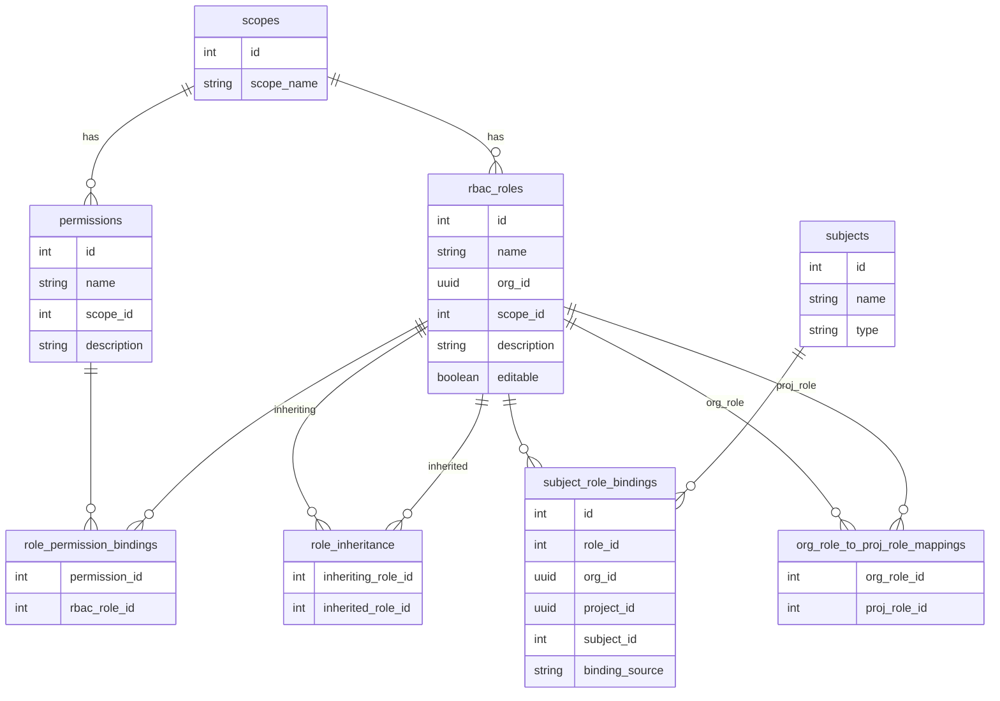
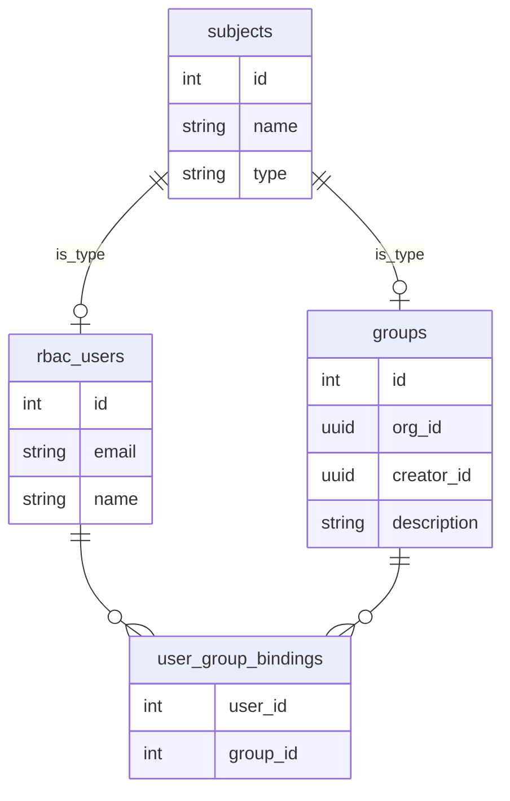
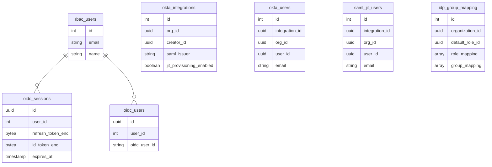
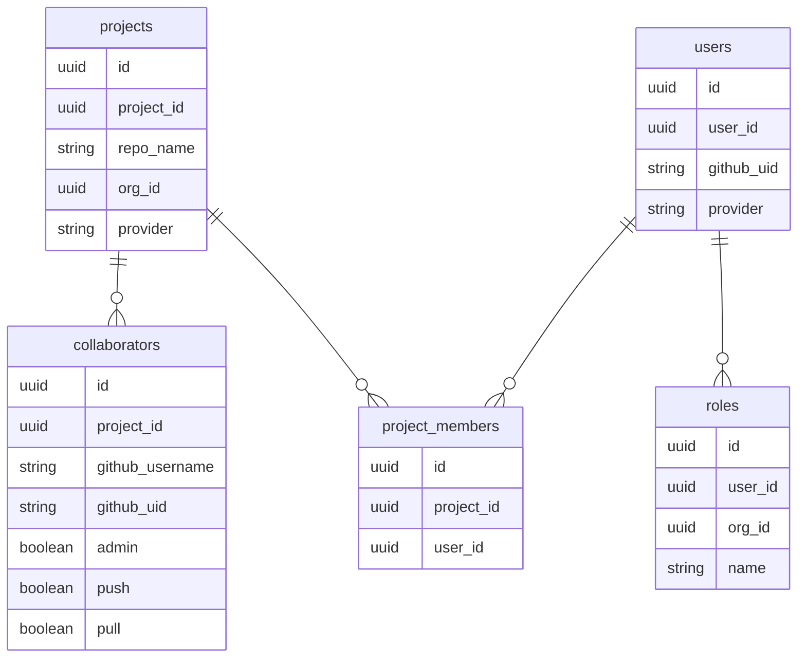
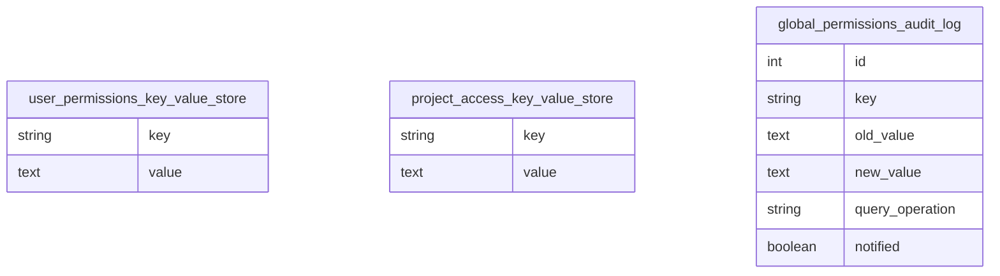
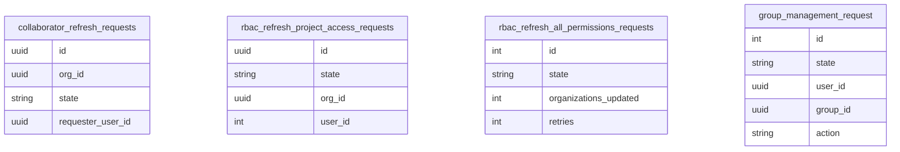

# RBAC Service

Role-Based Access Control (RBAC) service for Semaphore CI/CD platform.

## Database Schema

### Core RBAC System

### Subject System (Users & Groups)

### Identity Provider Integration

### Legacy Tables

### Key-Value Stores & Audit

### Background Job Tables

## Schema Notes

### RBAC Architecture
- **Scopes** categorize permissions (org-level, project-level)
- **Permissions** are individual access rights within scopes
- **Roles** bundle multiple permissions together
- **Role Inheritance** allows roles to inherit permissions from other roles
- **Org-to-Project Mappings** automatically map organization roles to project roles

### Subject System (Polymorphic Design)
- **Subjects** is a base table for both users and groups
- **rbac_users** inherits from subjects (1:1 relationship)
- **groups** inherits from subjects (1:1 relationship)
- **subject_role_bindings** assigns roles to any subject with source tracking

### Binding Sources
The `subject_role_bindings.binding_source` enum tracks where role assignments originate:
- `github` - From GitHub collaborator permissions
- `bitbucket` - From Bitbucket collaborator permissions
- `gitlab` - From GitLab collaborator permissions
- `manually_assigned` - Manually assigned by admin
- `okta` - From Okta/SCIM integration
- `inherited_from_org_role` - Inherited from organization role
- `saml_jit` - From SAML just-in-time provisioning

### Repository Access Mapping
- Maps legacy repository permissions (admin/push/pull) to RBAC roles
- One mapping per organization
- References three different roles for each access level

### Identity Providers
- **OIDC**: OpenID Connect sessions and user mappings
- **Okta**: SAML/SCIM integration with JIT provisioning support
- **SAML JIT**: Just-in-time user provisioning via SAML

### Audit System
- Database trigger on `user_permissions_key_value_store` automatically logs changes
- Tracks old/new values for permission changes
- Notified flag for tracking alert status
