# RBAC Service

Role-Based Access Control (RBAC) service for Semaphore CI/CD platform.

## Database Schema

### Core RBAC System

The center of the RBAC system is the subject role bindings table, which assigns a role to a given subject (either a user or a group), and that role has a list of permissions attached to it.

There are two resources to which roles can be assigned: you can have a role within the organization, or you can have a role within the project. If you want to assign a role within the organization, that role has to be of the "organization scope", and if you want to assign a role within the project, then the role you are assigning must be of the "project scope".

### Subject System (Users & Groups)

### Additional Complexity

Role Inheritance

One role can inherit another role and all of its permissions. Every time we want to calculate the permissions you have, we have to check the roles you are assigned, but also all the roles they inherit. This is a redundant feature. We're not really using in our production setup (except some Insider roles). Even though this is tested and works, we've never really found a use for it. When you're trying to create a new role within the custom roles UI, there is no way for you to set up role inheritance.

Organization Role to Project Role Mappings

Another table is organization role to project role mappings, which also makes this a bit more complex. This is something we are using regularly. You can say that some organizational role, like "Owner", carries automatic "Admin" access to all of the projects within the organization. In this case, organization role "Owner" maps to project role "Admin", and this also has to be taken into consideration when we are checking if user has access to a project: Even though they might not have a role directly within the project, they maybe have an organization role which maps to project role.

Groups

The subject in subject role bindings can be a user, but it can also be a group. When we are actually trying to see which permissions a user has, we have to track all of the roles assigned directly. We also have to check if the user is part of a group, and then if they are, we also need to check all of the roles that the group has.
We have tested groups thoroughly, but I'm not sure if any customers are using them.

### Key-Value Stores & Audit

User Permission Key Value Store

All of this complexity makes actually figuring out which permissions a user has within an organization (or project) a bit more complex. It's not as simple as just tracking the subject role bindings table. It takes quite a few joins, and some recursive joins. Query which calculates all of the permisions for a given user/organization/project is written in the `Rbac.ComputePermissions` module of rhis service. Depending on the size of the organization, number of user and projects they have, it can take from >1s, to 6,7s to calculate these permission.

That's why we had a need for `user_permissions_key_value_store` and `project_access_key_value_store`. Instead of calculating all of the permissions for every "GET" query, there is one table which stores all of the permissions user has within the org and/or project, and another with list of projects user has access to within the organization.

These key value stores are recalculated anytime somebody is assigned a new role, anytime somebody's role is being removed, when you are joining a group, when you are being removed from a group, or when the role definition changes (which can happen with custom roles).

Performance Issues

As mentioned above, recalculation permissions usually takes around a second, but for some organizations that have a lot of projects, it can take five or six seconds. In some extreme cases, it can take around 10+ seconds, and this is where a problem occurs because we are hitting gRPC request timeout. You get bad UX experience when you want to change a role and you get a spinner for, let's say, 10 seconds, and it just times out. One major improvement we can do is to make role assignment and role retraction asynchronous, like many other operations in RBAC already are.

### Identity Provider Integration

### Background Job Tables

```mermaid
erDiagram
    collaborator_refresh_requests {
        uuid id
        uuid org_id
        string state
        uuid requester_user_id
    }

    rbac_refresh_project_access_requests {
        uuid id
        string state
        uuid org_id
        int user_id
    }

    rbac_refresh_all_permissions_requests {
        int id
        string state
        int organizations_updated
        int retries
    }

    group_management_request {
        int id
        string state
        uuid user_id
        uuid group_id
        string action
    }
```

### Legacy Tables

These tables are leftover from the old auth system. We still use collaborators table when we want to sych GitHub repo access with the Semaphore project roles.

