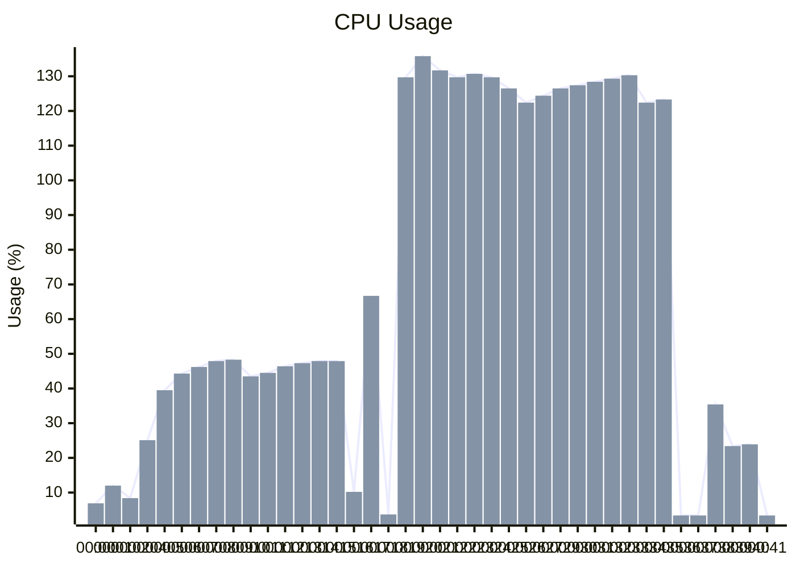
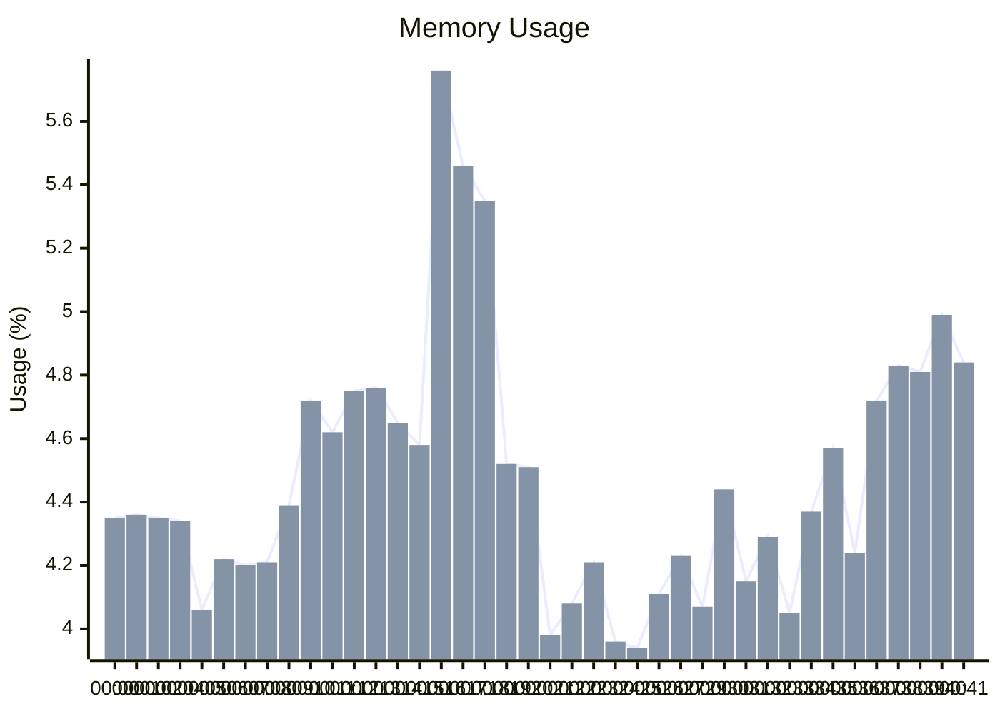
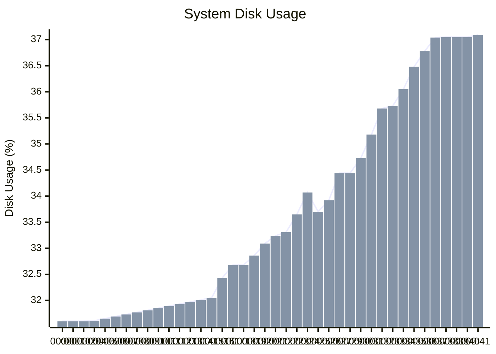
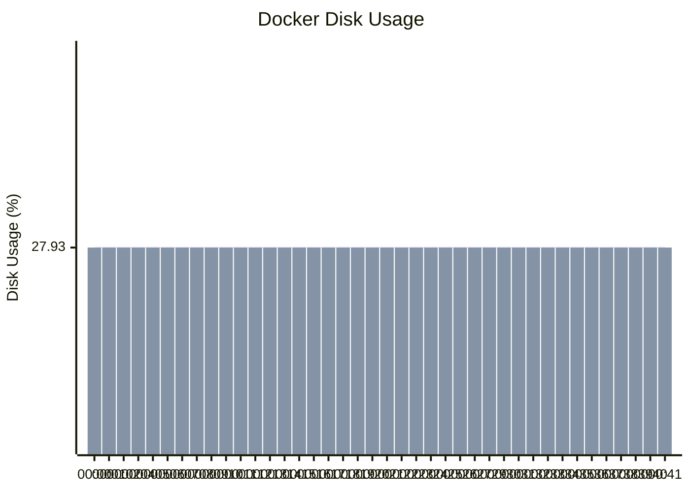

## 🎯 System Metrics Summary

**Total datapoints:** `40`  
**🕒 Time Range:** `Tue Sep 23 08:57:29 UTC 2025` → `Tue Sep 23 08:58:10 UTC 2025`  

- **🔥 CPU:** `min: 3.40%`, `max: 135.80%`  
- **🧠 Memory:** `min: 3.94%`, `max: 5.76%`  
- **💽 System Disk:** `min: 31.60%`, `max: 37.09%`  
- **🐳 Docker Disk:** `min: 27.93%`, `max: 27.93%`

---

