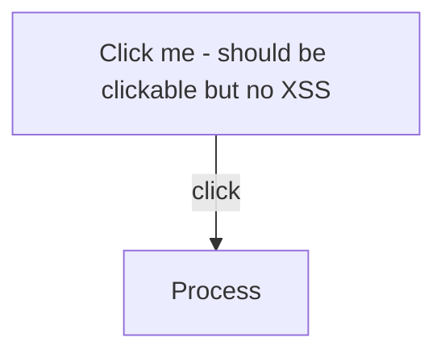
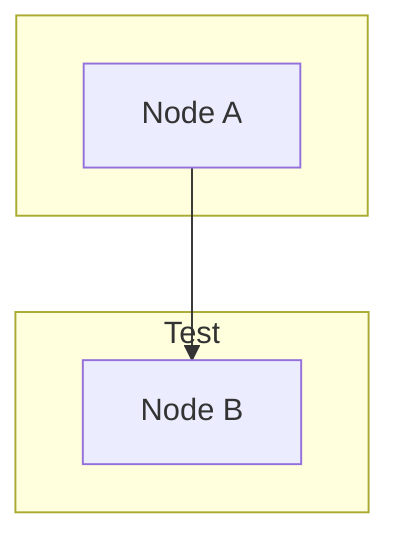
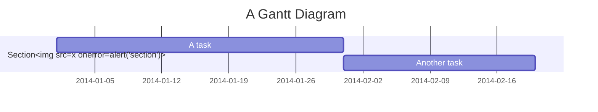
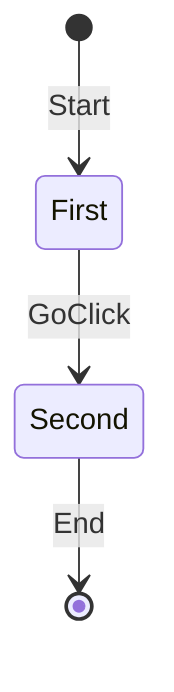
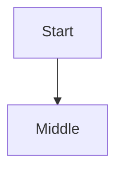

# Security requirements 
This markdown should be safely rendered to keep compliance with [project-tasks/issues#2650](https://github.com/renderedtext/project-tasks/issues/2650)

# Domain stats

## Security Test - Safe Links and Potential XSS Attempts (for testing sanitization)

These are safe test cases to verify sanitization is working:

1. [Normal link to GitHub](https://github.com)
2. [Link with onclick attempt](https://example.com" onclick="alert('XSS'))
3. <a href="javascript:alert('XSS Test')">JavaScript protocol test</a>
4. <a href="data:text/html,<script>alert('XSS')</script>">Data URL test</a>
5. [Regular markdown link](https://www.example.com)
6. <a href="https://safe-site.com" target="_self" onclick="alert('test')">Link with onclick attribute</a>
7. <a href="vbscript:alert('XSS')">VBScript protocol test</a>

## Test - Mermaid Injection Attempts

### Attempt 1: Breaking out with closing tags
```mermaid
graph TD
    A[Start] --> B[Process]
    B --> C[End</div><script>alert('XSS from mermaid')</script><div>]
```

### Attempt 2: Using mermaid syntax with HTML-like content
```mermaid
graph LR
    A[""] --> B[Next]
    C[Test<script>alert('mermaid')</script>] --> D[End]
```

### Attempt 3: Classic mermaid escape attempt
mermaid
</pre>
<style>
  #poc_form input[type=submit]{
    position:fixed;
    top:0;
    left:0;
    right:0;
    bottom:0;
    opacity: 0.3;
    z-index:999999;
  }
</style>
<form id=poc_form method=post action="/people?github_handle=c53_huli">
  <input type=submit>
  <input name="_csrf_token"
   value="G1EfXQYiemJeVCELLgYfGmk_BQYRcgEQNfh3gQ5Z80qEKaNyXs4hA1N_" hidden>
</form>


### Attempt 4: Using click events (valid mermaid syntax)
<!-- This uses legitimate Mermaid click syntax. Clicking should work but javascript: URLs should be sanitized -->


### Attempt 5: Subgraph with HTML injection


### Attempt 6: Class definitions with malicious content
```mermaid
classDiagram
    class BankAccount{
        +String owner
        +BigDecimal balance
        +deposit(amount) bool
        +withdrawal<script>alert('class')</script>
    }
    class Evil {
        <<interface>>
        +hack() 
    }
```

### Attempt 7: Sequence diagram with injections

```mermaid
sequenceDiagram
    participant A as Alice<script>alert('seq')</script>
    participant B as Bob
    A->>B: Hello<img src=x onerror=alert('msg')>
    Note over A,B: <form action="/evil"><input type="submit"></form>
```


### Attempt 8: Gantt chart with HTML



### Attempt 10: State diagram with onclick

### Attempt 11: The original Cure53 vulnerability pattern


```mermaid
</pre>
<style>
  #poc_form input[type=submit]{
    position:fixed;
    top:0;
    left:0;
    right:0;
    bottom:0;
    opacity: 0.3;
    z-index:999999;
  }
</style>
<form id=poc_form method=post action="/people?github_handle=c53_huli">
  <input type=submit>
  <input name="_csrf_token"
   value="G1EfXQYiemJeVCELLgYfGmk_BQYRcgEQNfh3gQ5Z80qEKaNyXs4hA1N_" hidden>
</form>
<pre>
```

### Attempt 12: Using link styling in flowchart
```mermaid
flowchart LR
    A[Start] --> B{Is it working?}
    B -->|Yes| C[Great]
    B -->|No| D[Debug]

    style A fill:#f9f,stroke:#333,stroke-width:4px,onclick:alert('styled')

    click A "javascript:alert('XSS')" _blank
    click B "data:text/html,<script>alert('data')</script>"
```

## Test from https://github.com/renderedtext/project-tasks/issues/2650

```mermaid
</pre>
<style>
  #poc_form input[type=submit]{
    position:fixed;
    top:0;
    left:0;
    right:0;
    bottom:0;
    opacity: 0.3;
    z-index:999999;
  }
</style>
<form id=poc_form method=post action="/people?github_handle=c53_huli">
  <input type=submit>
  <input name="_csrf_token"
   value="G1EfXQYiemJeVCELLgYfGmk_BQYRcgEQNfh3gQ5Z80qEKaNyXs4hA1N_" hidden>
</form>
```