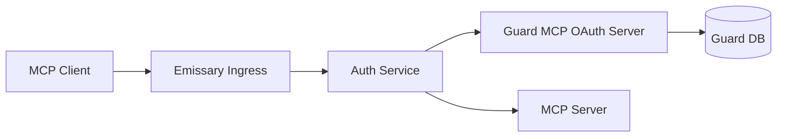
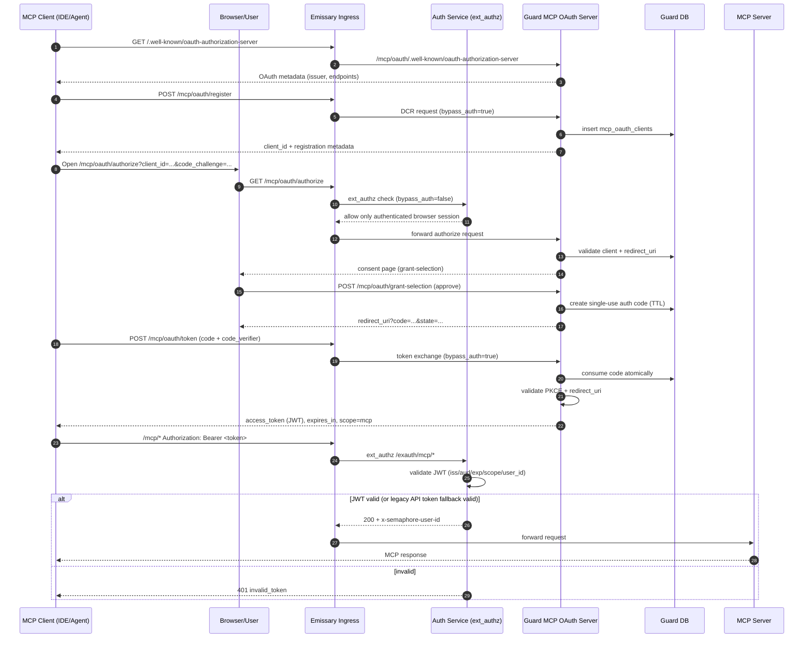

# MCP OAuth Guide

This document describes how MCP OAuth works end to end for `mcp.<domain>`.

## Components

- MCP client (IDE/agent)
- Browser/user session for consent
- Emissary ingress
- Auth service (`ext_authz` for authn/authz)
- Guard MCP OAuth server (`/mcp/oauth/*`)
- Guard DB (OAuth clients and auth codes)
- MCP server protected resource (`/mcp/*`)

## High-level Architecture

## OAuth Flow (Sequence)

## Endpoint Access Model

| Endpoint | Public (`bypass_auth=true`) | Notes |
| --- | --- | --- |
| `/.well-known/oauth-authorization-server` | yes | OAuth authorization server metadata |
| `/.well-known/openid-configuration` | yes | OIDC discovery compatibility |
| `/.well-known/oauth-protected-resource` | yes | Protected resource metadata |
| `/mcp/oauth/register` | yes | Dynamic client registration |
| `/mcp/oauth/token` | yes | Code exchange with PKCE |
| `/mcp/oauth/jwks` | yes | JWK set for compatibility |
| `/mcp/oauth/authorize` | no | Requires authenticated browser session |
| `/mcp/oauth/grant-selection` | no | Consent submission with browser session |
| `/mcp/*` | no | Protected MCP API traffic; validated by Auth |

## Token Model

Guard issues access tokens as JWTs using `MCP_OAUTH_JWT_KEYS`.

- Required claims include issuer, audience, expiration, and `scope=mcp`
- User identity is propagated via `semaphore_user_id`
- Auth validates signature and claims before forwarding to MCP server
- Auth preserves backward compatibility by falling back to legacy API token validation when JWT validation fails

## Security Guarantees

- Authorization code flow requires PKCE (`S256`)
- Authorization codes are single-use and consumed atomically
- Redirect URI must match a registered URI for the client
- Consent endpoints require a logged-in browser session
- Unauthorized protected-resource requests return `401` with OAuth-style error details
- Missing token responses include `WWW-Authenticate` with `resource_metadata`

## Deployment Preconditions

- Ingress for `mcp.<base-domain>` routes OAuth endpoints to Guard and `/mcp/*` to `mcp_server`
- Guard and Auth share the same `MCP_OAUTH_JWT_KEYS` values
- Guard DB migrations for OAuth clients/auth codes are applied
- Auth, Guard, ingress mappings, and `mcp_server` are released together

## Troubleshooting Checklist

- Discovery fails: verify `/.well-known/*` mappings route to Guard and are public
- Register/token fails: check JSON parsing and CSRF exclusions for OAuth protocol endpoints
- Authorize loops to login: verify auth cookies/session on `mcp.<domain>` and `bypass_auth=false` routing
- Token rejected on `/mcp/*`: inspect JWT `iss`, `aud`, `exp`, `scope`, `semaphore_user_id`, and key parity between Guard/Auth
- Intermittent code exchange failures: confirm auth code TTL and single-use consumption behavior
