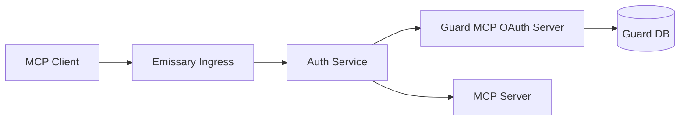
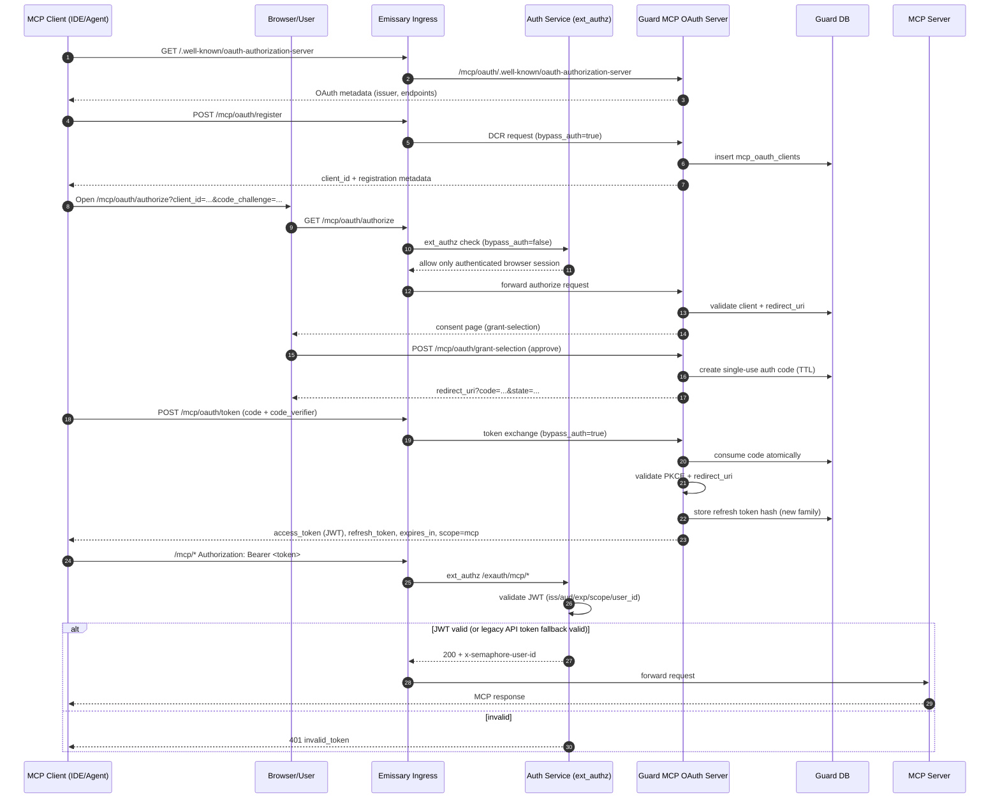
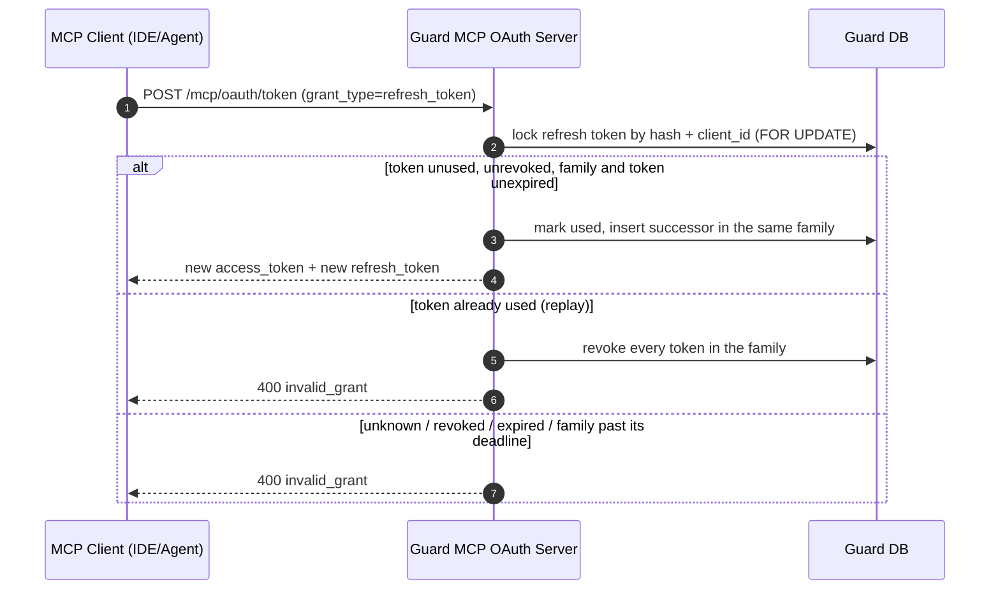

# MCP OAuth Guide

This document describes how MCP OAuth works end to end for `mcp.<domain>`.

## Components

- MCP client (IDE/agent)
- Browser/user session for consent
- Emissary ingress
- Auth service (`ext_authz` for authn/authz)
- Guard MCP OAuth server (`/mcp/oauth/*`)
- Guard DB (OAuth clients, auth codes and refresh tokens)
- MCP server protected resource (`/mcp/*`)

## High-level Architecture

```mermaid
flowchart LR
    C[MCP Client] --> I[Emissary Ingress]
    I --> A[Auth Service]
    A --> G[Guard MCP OAuth Server]
    G --> D[(Guard DB)]
    A --> M[MCP Server]
```

## OAuth Flow (Sequence)

```mermaid
sequenceDiagram
    autonumber
    participant Client as MCP Client (IDE/Agent)
    participant Browser as Browser/User
    participant Ingress as Emissary Ingress
    participant Auth as Auth Service (ext_authz)
    participant Guard as Guard MCP OAuth Server
    participant DB as Guard DB
    participant MCP as MCP Server

    Client->>Ingress: GET /.well-known/oauth-authorization-server
    Ingress->>Guard: /mcp/oauth/.well-known/oauth-authorization-server
    Guard-->>Client: OAuth metadata (issuer, endpoints)

    Client->>Ingress: POST /mcp/oauth/register
    Ingress->>Guard: DCR request (bypass_auth=true)
    Guard->>DB: insert mcp_oauth_clients
    Guard-->>Client: client_id + registration metadata

    Client->>Browser: Open /mcp/oauth/authorize?client_id=...&code_challenge=...
    Browser->>Ingress: GET /mcp/oauth/authorize
    Ingress->>Auth: ext_authz check (bypass_auth=false)
    Auth-->>Ingress: allow only authenticated browser session
    Ingress->>Guard: forward authorize request
    Guard->>DB: validate client + redirect_uri
    Guard-->>Browser: consent page (grant-selection)

    Browser->>Guard: POST /mcp/oauth/grant-selection (approve)
    Guard->>DB: create single-use auth code (TTL)
    Guard-->>Browser: redirect_uri?code=...&state=...

    Client->>Ingress: POST /mcp/oauth/token (code + code_verifier)
    Ingress->>Guard: token exchange (bypass_auth=true)
    Guard->>DB: consume code atomically
    Guard->>Guard: validate PKCE + redirect_uri
    Guard->>DB: store refresh token hash (new family)
    Guard-->>Client: access_token (JWT), refresh_token, expires_in, scope=mcp

    Client->>Ingress: /mcp/* Authorization: Bearer <token>
    Ingress->>Auth: ext_authz /exauth/mcp/*
    Auth->>Auth: validate JWT (iss/aud/exp/scope/user_id)
    alt JWT valid (or legacy API token fallback valid)
        Auth-->>Ingress: 200 + x-semaphore-user-id
        Ingress->>MCP: forward request
        MCP-->>Client: MCP response
    else invalid
        Auth-->>Client: 401 invalid_token
    end
```

## Token Refresh (Sequence)

When the access token expires the client renews it without a browser round
trip. There is no user interaction, so a long-running client stays signed in
until the refresh token itself expires.

```mermaid
sequenceDiagram
    autonumber
    participant Client as MCP Client (IDE/Agent)
    participant Guard as Guard MCP OAuth Server
    participant DB as Guard DB

    Client->>Guard: POST /mcp/oauth/token (grant_type=refresh_token)
    Guard->>DB: lock refresh token by hash + client_id (FOR UPDATE)
    alt token unused, unrevoked, family and token unexpired
        Guard->>DB: mark used, insert successor in the same family
        Guard-->>Client: new access_token + new refresh_token
    else token already used (replay)
        Guard->>DB: revoke every token in the family
        Guard-->>Client: 400 invalid_grant
    else unknown / revoked / expired / family past its deadline
        Guard-->>Client: 400 invalid_grant
    end
```

## Endpoint Access Model

| Endpoint | Public (`bypass_auth=true`) | Notes |
| --- | --- | --- |
| `/.well-known/oauth-authorization-server` | yes | OAuth authorization server metadata |
| `/.well-known/openid-configuration` | yes | OIDC discovery compatibility |
| `/.well-known/oauth-protected-resource` | yes | Protected resource metadata |
| `/mcp/oauth/register` | yes | Dynamic client registration |
| `/mcp/oauth/token` | yes | Code exchange with PKCE, and refresh token grant |
| `/mcp/oauth/jwks` | yes | JWK set for compatibility |
| `/mcp/oauth/authorize` | no | Requires authenticated browser session |
| `/mcp/oauth/grant-selection` | no | Consent submission with browser session |
| `/mcp/*` | no | Protected MCP API traffic; validated by Auth |

## Token Model

Guard issues access tokens as JWTs using `MCP_OAUTH_JWT_KEYS`.

- Required claims include issuer, audience, expiration, and `scope=mcp`
- User identity is propagated via `semaphore_user_id`
- Auth validates signature and claims before forwarding to MCP server
- Auth preserves backward compatibility by falling back to legacy API token validation when JWT validation fails
- Access token TTL: `MCP_OAUTH_ACCESS_TOKEN_TTL_SECONDS` (default 24h)

Guard also issues an opaque refresh token with every access token, so an expired
access token never forces the user back through the browser flow.

- Refresh tokens are stored as sha256 hashes and bound to the issuing `client_id`
- Refresh token TTL: `MCP_OAUTH_REFRESH_TOKEN_TTL_SECONDS` (default 30 days), sliding — it restarts on every rotation
- Token family lifetime: `MCP_OAUTH_REFRESH_TOKEN_MAX_LIFETIME_SECONDS` (default 90 days), absolute — rotation does not extend it
- Expired auth codes and refresh tokens are swept by `Guard.McpOAuth.AuthCodeCleaner`

## Security Guarantees

- Authorization code flow requires PKCE (`S256`)
- Authorization codes are single-use and consumed atomically
- Refresh tokens are single-use and rotated on every refresh, as OAuth 2.1 requires for public clients
- Replaying a used refresh token revokes every token in its family, so a leaked token cannot outlive its detection
- A token family also has an absolute deadline that rotation cannot extend, so a stolen family that only the thief refreshes still ages out
- Redirect URI must match a registered URI for the client
- Consent endpoints require a logged-in browser session
- Unauthorized protected-resource requests return `401` with OAuth-style error details
- Missing token responses include `WWW-Authenticate` with `resource_metadata`

## Deployment Preconditions

- Ingress for `mcp.<base-domain>` routes OAuth endpoints to Guard and `/mcp/*` to `mcp_server`
- Guard and Auth share the same `MCP_OAUTH_JWT_KEYS` values
- Guard DB migrations for OAuth clients/auth codes/refresh tokens are applied
- Auth, Guard, ingress mappings, and `mcp_server` are released together

## Troubleshooting Checklist

- Discovery fails: verify `/.well-known/*` mappings route to Guard and are public
- Register/token fails: check JSON parsing and CSRF exclusions for OAuth protocol endpoints
- Authorize loops to login: verify auth cookies/session on `mcp.<domain>` and `bypass_auth=false` routing
- Token rejected on `/mcp/*`: inspect JWT `iss`, `aud`, `exp`, `scope`, `semaphore_user_id`, and key parity between Guard/Auth
- Intermittent code exchange failures: confirm auth code TTL and single-use consumption behavior
- Client re-prompts for browser login every day: confirm the client received and stored `refresh_token`, and check guard logs for `Refresh token replay detected` (a client that keeps a stale copy of a rotated token revokes its own family)
