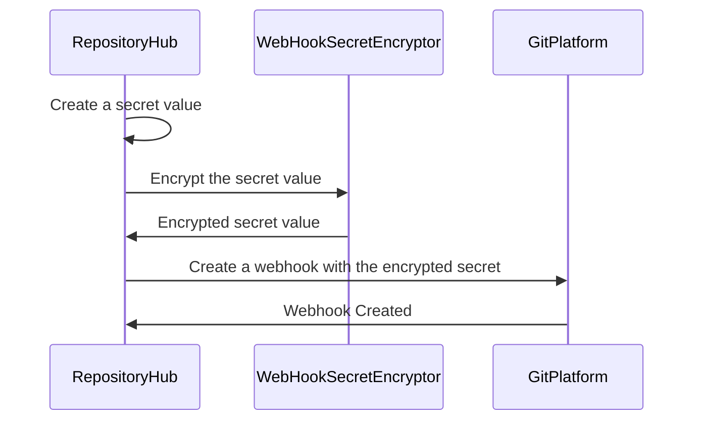

# Webhooks

Webhooks are a way to receive real-time notifications from the server when a specific event occurs. In semaphore webhooks are used to notify the platform about changes in the repository. The platform uses this information to trigger the build process.

## Security

For proper security, the webhook should be protected with a secret key. The secret key is used to sign the payload sent by the server. The platform uses the secret key to verify the payload.

## Webhook creation diagram

